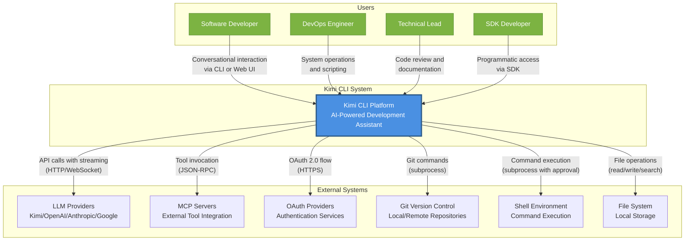

# Kimi CLI - System Context Overview

## 1. Project Introduction

### 1.1 Project Overview

**Kimi CLI** is an AI-powered development assistant platform that bridges natural language interaction with software development workflows. The system provides developers with an intelligent interface for executing development tasks through conversational AI, supporting both command-line and web-based interactions.

**Core Value Proposition:**
- **Unified Development Interface**: Single conversational interface for file operations, code searches, and command execution
- **Context Preservation**: Persistent sessions maintain conversation history and working context across interactions
- **Provider Flexibility**: Multi-provider architecture supports Kimi, OpenAI, Anthropic, and Google GenAI backends
- **Dual Interface Options**: CLI for terminal-focused workflows and web UI for visual interaction
- **Extensible Architecture**: MCP integration and custom tool framework enable workflow customization

### 1.2 Technical Characteristics

**Architecture Pattern**: Layered architecture with clean domain separation
- Three interface layers (Web, CLI, SDK) built on unified business domains
- Provider-agnostic LLM integration through abstraction layer
- Event-driven session management with JSONL-based persistence
- Real-time bidirectional communication via WebSocket/JSON-RPC

**Technology Stack**:
- **Backend**: Python with async/await patterns, FastAPI for web services
- **Frontend**: React with TypeScript, real-time streaming UI
- **Protocols**: JSON-RPC for events, MCP for external tool integration
- **Storage**: File-based persistence (JSONL, TOML/JSON configuration)

## 2. Target Users

### 2.1 Software Developer

**Profile**: Professional developers requiring AI assistance for coding, debugging, and workflow automation

**Primary Needs**:
- Safe command execution with approval workflows
- Intelligent file operations (read, write, search) across codebase
- Multi-session management with preserved context
- IDE and tool integration capabilities

**Usage Scenarios**:
- Exploring unfamiliar codebases through natural language queries
- Generating boilerplate code and documentation
- Debugging issues with AI-guided analysis
- Refactoring code with automated suggestions

### 2.2 DevOps Engineer

**Profile**: Infrastructure engineers managing systems, scripts, and configurations

**Primary Needs**:
- System command execution and scripting assistance
- Remote server operations via SSH integration
- Configuration file management and validation
- System output monitoring and analysis

**Usage Scenarios**:
- Writing and debugging deployment scripts
- Analyzing system logs and metrics
- Managing infrastructure-as-code configurations
- Automating operational workflows

### 2.3 Technical Lead

**Profile**: Senior engineers overseeing code quality, architecture, and team workflows

**Primary Needs**:
- Code documentation generation
- Codebase structure analysis
- Pull request creation and review assistance
- Team workflow integration

**Usage Scenarios**:
- Conducting architecture reviews
- Generating technical documentation
- Analyzing code quality and patterns
- Coordinating team development practices

### 2.4 SDK Developer

**Profile**: Developers building applications on the Kimi CLI platform

**Primary Needs**:
- Programmatic access to platform capabilities
- Custom agent creation and configuration
- Tool extension development
- Application integration patterns

**Usage Scenarios**:
- Building custom AI-powered development tools
- Integrating Kimi CLI into existing applications
- Creating domain-specific agents
- Extending platform capabilities with custom tools

## 3. System Boundaries

### 3.1 System Scope

Kimi CLI encompasses the complete AI-powered code assistant platform, including client applications, session management infrastructure, LLM integration layer, and developer SDK.

### 3.2 Included Components

**Core Application Layers**:
- CLI application with interactive terminal UI (`src/kimi_cli/`)
- Web application with React frontend (`web/`)
- Public SDK for programmatic access (`sdks/kimi-sdk/`)

**Business Domain Components**:
- Session management and persistence (wire protocol, session state)
- LLM provider abstraction layer (`packages/kosong/`)
- Agent system with customizable behaviors
- Tool implementations (file, shell, web, multi-agent)
- Configuration management (TOML/JSON)

**Infrastructure Components**:
- OAuth authentication flow
- MCP client integration for external tools
- System utilities and async helpers (`packages/kaos/`)
- JSON-RPC event protocol

### 3.3 Excluded Components

**External Dependencies**:
- LLM model training and fine-tuning infrastructure
- Cloud hosting and deployment infrastructure
- Authentication provider backends (relies on external OAuth)
- Database systems (uses file-based storage)

**Out of Scope**:
- IDE extensions (though integrations possible via MCP)
- Remote server management (SSH support is client-side only)
- Continuous integration/deployment pipelines
- Team collaboration features (chat, shared sessions)

## 4. External System Interactions

### 4.1 LLM Providers (Kimi/OpenAI/Anthropic/Google)

**Purpose**: External AI/ML services providing language model capabilities for text understanding, code generation, and structured outputs

**Interaction Pattern**:
- HTTP API calls with streaming support
- Provider-specific authentication (API keys, OAuth tokens)
- Real-time response streaming for conversational experience
- Tool call protocol for function invocation

**Dependencies**:
- Provider availability and API rate limits
- Model capabilities and context window sizes
- Authentication credential validity

### 4.2 Model Context Protocol (MCP) Servers

**Purpose**: External tool servers following MCP standard, providing additional capabilities like specialized file system access, database queries, or custom integrations

**Interaction Pattern**:
- JSON-RPC protocol over stdio or network transports
- Tool discovery and capability negotiation
- Asynchronous tool invocation with result streaming

**Dependencies**:
- MCP server availability and compatibility
- Protocol version alignment
- Tool-specific authentication requirements

### 4.3 OAuth Authentication Providers

**Purpose**: Identity providers enabling secure login and API key management for LLM services

**Interaction Pattern**:
- OAuth 2.0 authorization code flow
- Token exchange and refresh mechanisms
- Secure credential storage in local configuration

**Dependencies**:
- Provider availability and redirect URI configuration
- Token expiration and refresh policies
- Network connectivity for authentication flows

### 4.4 Git Version Control

**Purpose**: Local and remote Git repositories for version control operations, diff viewing, and change tracking

**Interaction Pattern**:
- Local git command execution via subprocess
- File system access for repository inspection
- Diff generation and change analysis

**Dependencies**:
- Git installation and configuration
- Repository accessibility and permissions
- Working directory state

### 4.5 Shell/Command Execution Environment

**Purpose**: Host operating system shell for executing arbitrary commands with user approval workflows

**Interaction Pattern**:
- Subprocess spawning with async I/O
- User approval workflow for command execution
- Output capture and streaming to conversation

**Dependencies**:
- Shell availability (bash, zsh, cmd, powershell)
- System permissions and security policies
- Command availability in PATH

### 4.6 File System

**Purpose**: Local file system for reading, writing, searching, and managing project files and configuration

**Interaction Pattern**:
- Direct file I/O operations with path validation
- Directory traversal and pattern matching
- Atomic write operations with backup

**Dependencies**:
- File system permissions
- Disk space availability
- Path accessibility and validation

## 5. System Context Diagram

### 5.1 C4 System Context View

### 5.2 Key Interaction Flows

**Conversational Development Flow**:
1. User initiates conversation via CLI or Web UI
2. Kimi CLI processes natural language input through selected LLM provider
3. AI generates responses with potential tool calls (file operations, shell commands)
4. User approves tool executions through approval workflow
5. Tool results are fed back to AI for continued reasoning
6. Complete conversation turn is persisted to session history

**Multi-Provider Flexibility**:
- Users select preferred LLM provider (Kimi, OpenAI, Anthropic, Google)
- Provider abstraction layer handles provider-specific formatting
- Authentication managed through OAuth or API keys
- Seamless provider switching without conversation loss

**External Tool Integration**:
- MCP servers discovered and connected at startup
- Tools exposed to AI through standardized schema
- Tool invocations routed through MCP protocol
- Results integrated into conversation context

### 5.3 Architecture Decisions

**Decision: File-Based Session Persistence**
- **Rationale**: Simplicity, portability, and human-readable format
- **Trade-off**: Limited query capabilities vs. database complexity
- **Impact**: Easy backup, version control, and debugging

**Decision: Provider-Agnostic Abstraction**
- **Rationale**: Avoid vendor lock-in, support multiple AI backends
- **Trade-off**: Abstraction overhead vs. provider-specific optimizations
- **Impact**: Users can choose providers based on cost, performance, or features

**Decision: Dual Interface (CLI + Web)**
- **Rationale**: Support different user preferences and workflows
- **Trade-off**: Maintenance overhead vs. user experience flexibility
- **Impact**: Broader user adoption, workflow integration options

**Decision: Tool Approval Workflow**
- **Rationale**: Security and user control over system modifications
- **Trade-off**: Interaction friction vs. safety guarantees
- **Impact**: Safe AI operations, user trust, compliance with security policies

## 6. Technical Architecture Overview

### 6.1 Architecture Pattern

Kimi CLI follows a **layered architecture** with clean separation of concerns:

**Interface Layer**: Three distinct interfaces (Web, CLI, SDK) providing different interaction modalities while sharing core business logic

**Business Domain Layer**: Modular domains with clear boundaries:
- Conversation Management: Session lifecycle and history
- LLM Provider Integration: Multi-provider abstraction
- Agent System: AI behavior and reasoning
- Tool Execution: Extensible tool framework
- Configuration Management: Centralized settings

**Infrastructure Layer**: Cross-cutting concerns including authentication, wire protocol, and MCP integration

### 6.2 Key Design Patterns

**Provider Abstraction Pattern**: Unified interface for multiple LLM providers, enabling runtime provider selection and seamless switching

**Event Sourcing Pattern**: JSONL-based event log for session persistence, enabling replay, forking, and audit trails

**Tool Framework Pattern**: Extensible tool system with JSON Schema definitions, enabling AI to discover and invoke capabilities

**Approval Workflow Pattern**: User-in-the-loop pattern for sensitive operations, balancing automation with safety

### 6.3 Technology Stack

**Backend Technologies**:
- Python 3.11+ with async/await for concurrent operations
- FastAPI for RESTful APIs and WebSocket endpoints
- Pydantic for data validation and serialization
- HTTPX for async HTTP client operations

**Frontend Technologies**:
- React 18 with TypeScript for type safety
- TanStack Query for server state management
- Radix UI for accessible component primitives
- Tailwind CSS for styling

**Communication Protocols**:
- WebSocket for real-time bidirectional communication
- JSON-RPC for event protocol and MCP integration
- HTTP/REST for configuration and session management APIs

**Storage and Configuration**:
- JSONL for event logs and conversation history
- TOML/JSON for configuration files
- File-based storage for simplicity and portability

### 6.4 Scalability and Performance Considerations

**Session Isolation**: Each session runs in isolated context, preventing interference and enabling parallel operations

**Streaming Architecture**: Real-time response streaming minimizes perceived latency and enables progressive rendering

**Virtualized UI**: Message list virtualization handles large conversation histories efficiently

**Async Operations**: Non-blocking I/O throughout the stack maximizes throughput and responsiveness

---

**Document Metadata**:
- Generation Time: 2026-03-01 11:30:41 CST
- Architecture Level: C4 System Context
- Confidence Score: 9.2/10
- Based on: Domain module analysis and system context research