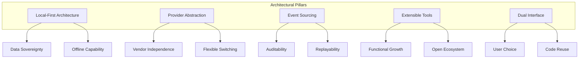
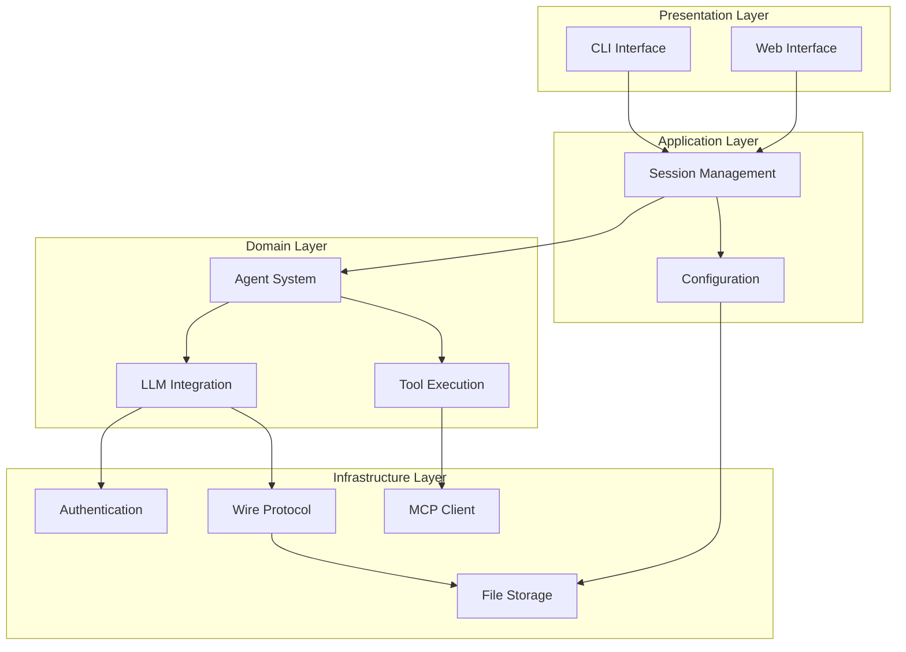
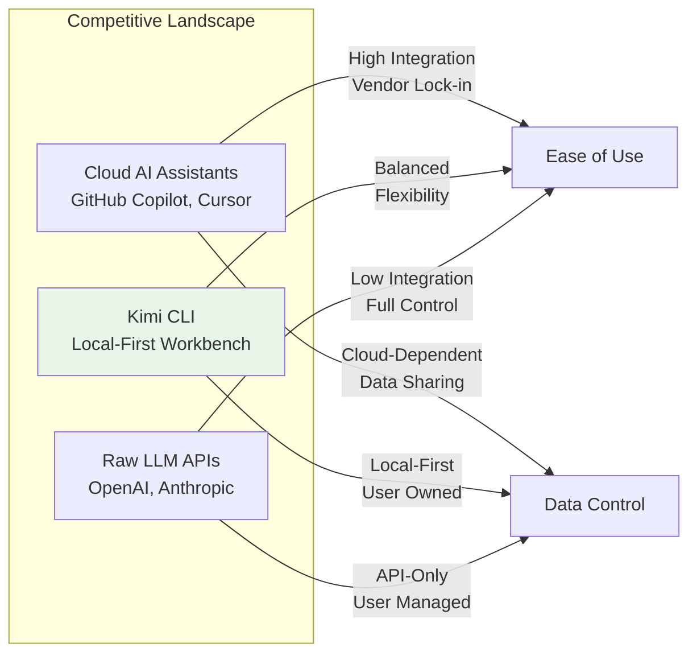
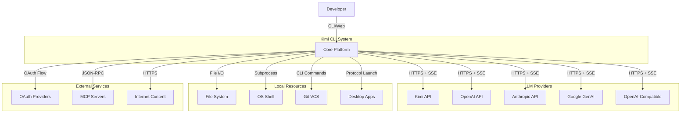
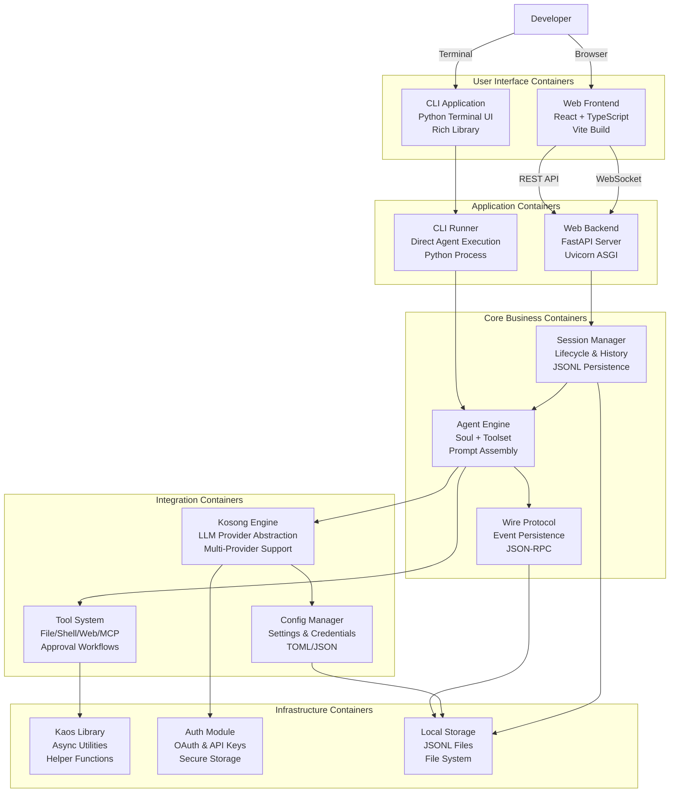
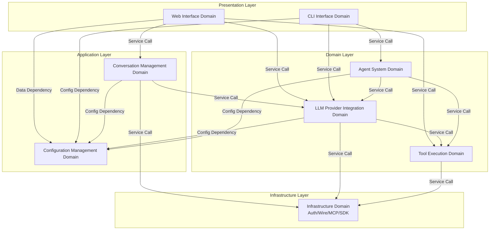
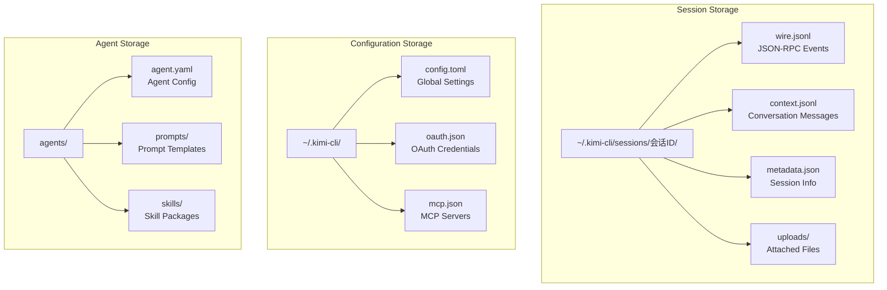
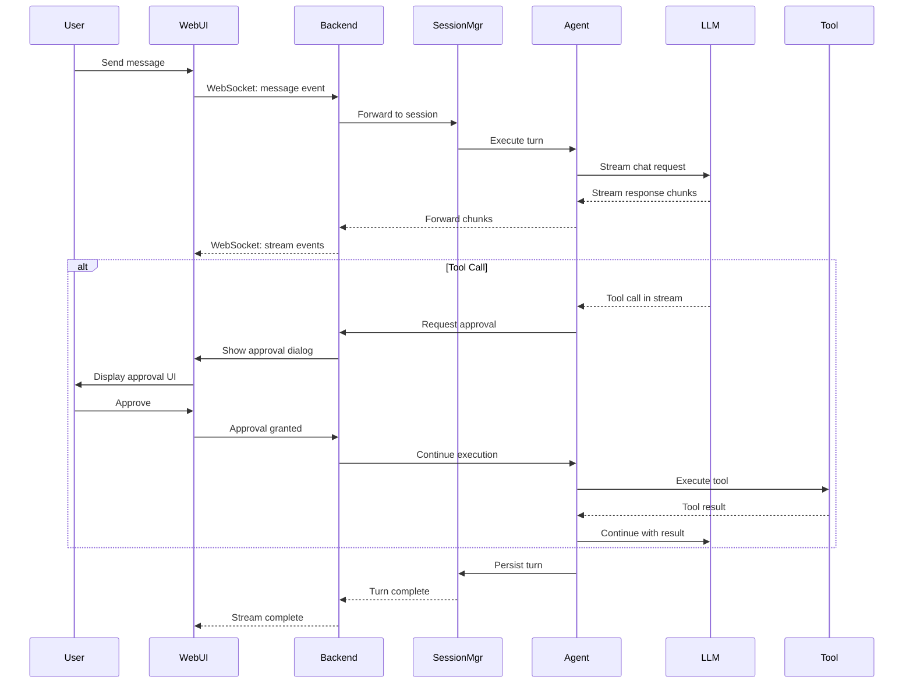

# Kimi CLI System Architecture Documentation

## Document Information

| Item | Content |
|------|---------|
| **Project Name** | kimi-cli |
| **Document Version** | v1.0 |
| **Generation Date** | 2026-03-01 |
| **Architecture Model** | C4 Model (Context/Container/Component) |
| **Confidence Score** | 9.2/10 |

---

## 1. Architecture Overview

### 1.1 Architecture Design Philosophy

Kimi CLI embodies a **local-first, multi-provider, extensible AI workbench** philosophy. The architecture prioritizes developer autonomy, data sovereignty, and flexible integration over cloud-dependent, vendor-locked solutions.

**Core Design Principles:**



**Design Principle Details:**

1. **Local-First Architecture**
   - All session data, configuration, and history stored locally in filesystem
   - No mandatory cloud dependencies for core functionality
   - Offline replay and session forking capabilities
   - User maintains complete control over conversation data

2. **Multi-Provider Abstraction**
   - Unified ChatProvider protocol via kosong engine
   - Seamless switching between Kimi, OpenAI, Anthropic, Google GenAI
   - Provider-agnostic tool integration
   - Consistent API regardless of backend LLM

3. **Event Sourcing Pattern**
   - Wire protocol appends JSON-RPC events to JSONL files
   - Complete conversation history preserved for replay
   - Session forking at arbitrary conversation points
   - Immutable audit trail of all interactions

4. **Extensible Tool System**
   - Built-in tools for file, shell, web, multi-agent operations
   - MCP (Model Context Protocol) integration for external tools
   - Custom tool development through standardized interfaces
   - Approval workflows for security-sensitive operations

5. **Dual Interface Strategy**
   - CLI for terminal-native developers
   - Web UI for visual workspace users
   - Shared core business logic across interfaces
   - Consistent feature parity between modes

### 1.2 Core Architecture Patterns

**Pattern Application Matrix:**

| Pattern | Application Domain | Benefit |
|---------|-------------------|---------|
| **Strategy Pattern** | LLM Provider Selection | Runtime provider switching without code changes |
| **Adapter Pattern** | Provider Message Formatting | Normalize diverse API formats to unified interface |
| **Command Pattern** | Tool Execution | Encapsulate operations with undo/approval support |
| **Observer Pattern** | Real-time Streaming | Reactive UI updates from backend events |
| **Repository Pattern** | Configuration Management | Abstract storage details from business logic |
| **Event Sourcing** | Conversation History | Complete audit trail with replay capability |
| **CQRS** | Session Management | Separate read/write concerns for scalability |

**Layered Architecture:**



### 1.3 Technology Stack Overview

**Backend Stack:**

| Layer | Technology | Purpose |
|-------|-----------|---------|
| **Runtime** | Python 3.11+ | Core language with async/await support |
| **Web Framework** | FastAPI + Uvicorn | High-performance async web server |
| **Async I/O** | asyncio + aiohttp | Non-blocking operations for streaming |
| **Data Serialization** | Pydantic | Type-safe data validation and serialization |
| **CLI Framework** | Rich library | Terminal UI with markdown rendering |
| **HTTP Client** | aiohttp | Async HTTP requests for LLM APIs |
| **Process Management** | multiprocessing | Worker process orchestration |

**Frontend Stack:**

| Layer | Technology | Purpose |
|-------|-----------|---------|
| **Framework** | React 18 | Component-based UI library |
| **Language** | TypeScript | Type-safe JavaScript development |
| **Build Tool** | Vite | Fast development server and bundler |
| **State Management** | Zustand | Lightweight reactive state |
| **UI Components** | Radix UI + Tailwind CSS | Accessible primitives with utility styling |
| **Real-time** | WebSocket | Bidirectional streaming communication |
| **Virtualization** | react-window | Efficient large list rendering |

**Infrastructure Stack:**

| Component | Technology | Purpose |
|-----------|-----------|---------|
| **Storage Format** | JSONL (JSON Lines) | Append-only event logs |
| **Configuration** | TOML + JSON | Human-readable settings |
| **Authentication** | OAuth 2.0 | Secure provider authentication |
| **Protocol** | JSON-RPC 2.0 | Structured event messaging |
| **Tool Integration** | MCP (Model Context Protocol) | External tool standardization |

---

## 2. System Context

### 2.1 System Positioning and Value

**Business Value Proposition:**

Kimi CLI addresses the friction developers face when integrating AI capabilities into their workflows. Traditional approaches require managing multiple API clients, handling diverse message formats, and building custom UIs. Kimi CLI provides a unified platform that:

1. **Accelerates Development Velocity**
   - Natural language interface reduces time to execute complex operations
   - Persistent sessions eliminate context rebuilding overhead
   - Tool automation handles repetitive tasks

2. **Reduces Integration Complexity**
   - Single interface for multiple LLM providers
   - Standardized tool framework for extensions
   - Pre-built integrations for common development tasks

3. **Ensures Data Sovereignty**
   - Local-first architecture keeps sensitive data on-premises
   - No mandatory cloud dependencies
   - Complete audit trail for compliance

4. **Enables Flexible Deployment**
   - Run entirely on local machine
   - Deploy on LAN for team access
   - Integrate with existing development infrastructure

**Market Positioning:**



### 2.2 User Roles and Scenarios

**Primary User Personas:**

1. **Software Developer**
   - **Profile:** Professional developer working on codebases ranging from small scripts to large applications
   - **Goals:** 
     - Execute file operations without leaving conversation context
     - Search and analyze code patterns across projects
     - Generate boilerplate code and documentation
     - Debug issues with AI assistance
   - **Key Scenarios:**
     - "Read all TypeScript files in src/ and suggest refactoring opportunities"
     - "Search for all usages of deprecated API and propose migration"
     - "Generate unit tests for this module"

2. **DevOps Engineer**
   - **Profile:** Infrastructure specialist managing servers, deployments, and automation
   - **Goals:**
     - Execute system commands with safety approval
     - Analyze log files and system outputs
     - Generate infrastructure-as-code configurations
     - Troubleshoot deployment issues
   - **Key Scenarios:**
     - "Check disk usage on all mounted volumes and suggest cleanup"
     - "Generate Kubernetes deployment manifest for this application"
     - "Analyze nginx error logs and identify patterns"

3. **Technical Lead**
   - **Profile:** Senior engineer overseeing projects and reviewing code
   - **Goals:**
     - Generate comprehensive documentation
     - Perform architectural analysis
     - Review code changes and suggest improvements
     - Coordinate team workflows
   - **Key Scenarios:**
     - "Generate architecture documentation from codebase structure"
     - "Review this pull request and identify potential issues"
     - "Create onboarding guide for new team members"

4. **SDK Developer**
   - **Profile:** Developer building applications on Kimi CLI platform
   - **Goals:**
     - Programmatic access to AI capabilities
     - Custom agent creation for specialized tasks
     - Tool extension development
     - Integration with existing applications
   - **Key Scenarios:**
     - "Build custom agent for database schema migration"
     - "Integrate Kimi CLI into CI/CD pipeline"
     - "Develop MCP tool for proprietary API access"

### 2.3 External System Interactions

**System Context Diagram:**



**External System Details:**

| External System | Interaction Protocol | Data Flow | Security Considerations |
|----------------|---------------------|-----------|------------------------|
| **LLM Providers** | HTTPS REST + Server-Sent Events (SSE) | Bidirectional: Send messages with tools, receive streaming responses | API key encryption, OAuth token refresh, rate limiting |
| **MCP Servers** | JSON-RPC over stdio/HTTP | Bidirectional: Tool discovery, invocation, result retrieval | Capability-based access control, sandboxed execution |
| **OAuth Providers** | OAuth 2.0 Authorization Code Flow | Unidirectional: Receive access tokens | PKCE extension, secure token storage, automatic refresh |
| **Git VCS** | Local git CLI commands | Read-only: Diff viewing, status checking, log analysis | Working directory validation, no destructive operations |
| **Shell Environment** | Subprocess spawning with async I/O | Bidirectional: Send commands, receive stdout/stderr | User approval workflow, command sanitization, timeout enforcement |
| **File System** | Python pathlib + async file operations | Bidirectional: Read/write files, directory traversal | Path validation, work directory restriction, size limits |
| **Web Content** | aiohttp HTTPS client | Unidirectional: Fetch web pages, API calls | SSL verification, timeout limits, content-type validation |

### 2.4 System Boundary Definition

**Included Components:**

The Kimi CLI system boundary encompasses all components necessary for local AI-assisted development:

- **User Interfaces:** CLI terminal application and web-based workspace
- **Session Management:** Conversation lifecycle, history persistence, forking
- **LLM Integration:** Multi-provider abstraction, message formatting, streaming
- **Tool System:** File operations, shell execution, web access, multi-agent coordination
- **Agent Framework:** Customizable behaviors, prompt management, skill extensions
- **Configuration:** Settings management, provider credentials, OAuth integration
- **Infrastructure:** Wire protocol, authentication, MCP client, async utilities

**Excluded Components:**

The following are explicitly outside the system boundary:

- **LLM Model Training:** No model fine-tuning or training infrastructure
- **Cloud Hosting:** No managed cloud deployment (users self-host)
- **IDE Extensions:** No native IDE plugins (integration via MCP possible)
- **Remote Server Management:** No SSH server management (client-side only)
- **Database Systems:** No relational/NoSQL databases (file-based storage)
- **Authentication Backend:** No user authentication server (relies on external OAuth)

**Boundary Rationale:**

The boundary is drawn to maximize local autonomy while leveraging external services only where necessary (LLM inference, OAuth). This design ensures:

1. **Data Sovereignty:** All conversation data remains under user control
2. **Offline Capability:** Core functionality works without internet (except LLM calls)
3. **Deployment Flexibility:** Run on laptop, workstation, or LAN server
4. **Security:** Minimize attack surface by avoiding unnecessary network services

---

## 3. Container View

### 3.1 High-Level Container Architecture



### 3.2 Container Descriptions

#### 3.2.1 CLI Application Container

**Technology Stack:**
- Python 3.11+ runtime
- Rich library for terminal UI rendering
- asyncio for asynchronous operations
- pathlib for file system operations

**Responsibilities:**
- Interactive REPL (Read-Eval-Print Loop) for user input
- Terminal-based UI rendering with markdown support
- Code block syntax highlighting in terminal
- Progress indicators and status updates
- Direct agent execution without web server overhead
- Shell command mode integration (Ctrl-X toggle)
- Setup wizard for first-time configuration

**Key Components:**
- `src/kimi_cli/cli/__main__.py` - Entry point and command routing
- `src/kimi_cli/ui/shell/` - Terminal UI components and rendering
- `packages/kosong/src/kosong/__main__.py` - Standalone REPL mode

**Deployment Characteristics:**
- Single Python process
- Minimal memory footprint (~50MB)
- No network ports required
- Direct filesystem access

#### 3.2.2 Web Frontend Container

**Technology Stack:**
- React 18 with TypeScript
- Vite for development and production builds
- Zustand for lightweight state management
- Radix UI primitives + Tailwind CSS for styling
- react-window for virtualized message lists
- WebSocket for real-time communication

**Responsibilities:**
- Rich visual interface for conversation management
- Real-time message streaming with WebSocket
- Session sidebar with search and filtering
- Tool execution visualization (diffs, outputs, search results)
- Configuration controls and model selection
- File attachment and mention support
- Responsive design for desktop and mobile

**Key Components:**
- `web/src/features/chat/` - Chat workspace and conversation UI
- `web/src/features/sessions/` - Session management UI
- `web/src/hooks/useSessionStream.ts` - WebSocket streaming hook
- `web/src/lib/apiClient.ts` - REST API client

**Deployment Characteristics:**
- Static assets served by backend
- Single-page application (SPA)
- WebSocket connection to backend
- Local storage for UI preferences

#### 3.2.3 Web Backend Container

**Technology Stack:**
- FastAPI web framework
- Uvicorn ASGI server
- Pydantic for data validation
- WebSocket support for streaming
- multiprocessing for worker orchestration

**Responsibilities:**
- RESTful API for session CRUD operations
- WebSocket endpoints for real-time streaming
- Configuration management API
- File upload handling
- Worker process orchestration
- Security middleware (CORS, token validation, path protection)
- Static file serving for frontend

**Key Components:**
- `src/kimi_cli/web/app.py` - FastAPI application setup
- `src/kimi_cli/web/api/sessions.py` - Session management endpoints
- `src/kimi_cli/web/api/config.py` - Configuration endpoints
- `src/kimi_cli/web/runner/` - Worker process management

**Deployment Characteristics:**
- Single Uvicorn process
- Configurable port (default 8080)
- Optional LAN access with security controls
- Worker processes for session execution

#### 3.2.4 Session Manager Container

**Technology Stack:**
- Python asyncio for concurrent operations
- JSONL file format for event storage
- multiprocessing for worker isolation
- pathlib for directory management

**Responsibilities:**
- Session lifecycle management (create, list, update, delete, archive)
- Conversation history persistence and replay
- Session forking at specific turn indices
- Work directory management
- Auto-archival of inactive sessions
- Concurrent session handling
- Session metadata tracking

**Key Components:**
- `src/kimi_cli/web/store/sessions.py` - Session store implementation
- `src/kimi_cli/session.py` - Session state management
- `src/kimi_cli/session_state.py` - Session state definitions

**Data Structures:**
```python
# Session metadata structure
{
    "id": "uuid-string",
    "title": "Session Title",
    "work_dir": "/path/to/directory",
    "created_at": "2026-03-01T11:31:27Z",
    "updated_at": "2026-03-01T11:31:27Z",
    "archived": false,
    "message_count": 42
}
```

#### 3.2.5 Agent Engine Container

**Technology Stack:**
- Python asyncio for agent loop
- YAML for agent configuration
- Markdown for prompt templates
- JSON Schema for tool definitions

**Responsibilities:**
- Agent behavior orchestration (soul)
- System prompt assembly and context management
- Tool selection and approval workflow
- Conversation compaction for token management
- Slash command processing
- Multi-agent coordination
- Thinking mode management

**Key Components:**
- `src/kimi_cli/soul/` - Agent core logic
- `src/kimi_cli/agents/` - Agent configurations
- `src/kimi_cli/prompts/` - System prompt templates
- `src/kimi_cli/agentspec.py` - Agent specification parser

**Agent Configuration Example:**
```yaml
# agents/default/agent.yaml
name: "Default Assistant"
description: "General-purpose development assistant"
system_prompt: "prompts/init.md"
tools:
  - file_operations
  - shell_execution
  - web_search
thinking_mode: "auto"
```

#### 3.2.6 Kosong Engine Container

**Technology Stack:**
- Python asyncio for async operations
- Abstract base classes for provider interface
- Provider-specific adapters (Kimi, OpenAI, Anthropic, Google)
- JSON Schema for tool definitions

**Responsibilities:**
- Unified ChatProvider interface for multiple LLM vendors
- Message format conversion between providers
- Streaming response handling
- Tool call detection and formatting
- JSON Schema tool definition
- Provider-specific authentication
- Model capability detection

**Key Components:**
- `packages/kosong/src/kosong/chat_provider/` - Provider implementations
- `packages/kosong/src/kosong/message.py` - Message data structures
- `packages/kosong/src/kosong/tooling/` - Tool framework

**Provider Abstraction:**
```python
class ChatProvider(ABC):
    @abstractmethod
    async def chat(
        self,
        messages: List[Message],
        tools: Optional[List[Tool]] = None,
        stream: bool = True
    ) -> AsyncIterator[ChatResponse]:
        """Unified chat interface across providers"""
        pass
```

#### 3.2.7 Tool System Container

**Technology Stack:**
- Python asyncio for async tool execution
- subprocess for shell command execution
- aiohttp for web requests
- MCP client for external tool integration

**Responsibilities:**
- File operations (read, write, search, glob)
- Shell command execution with approval
- Web search and content fetching
- Multi-agent task orchestration
- MCP tool server integration
- Custom tool extension support
- Tool result formatting

**Key Components:**
- `src/kimi_cli/tools/file/` - File operation tools
- `src/kimi_cli/tools/shell/` - Shell execution tools
- `src/kimi_cli/tools/web/` - Web interaction tools
- `src/kimi_cli/acp/mcp.py` - MCP client implementation

**Tool Categories:**

| Category | Tools | Security Level |
|----------|-------|----------------|
| **File Operations** | read, write, search, glob, replace | Medium (path validation) |
| **Shell Execution** | bash, powershell | High (user approval required) |
| **Web Tools** | search, fetch | Low (read-only) |
| **Multi-Agent** | create_agent, assign_task | Medium (resource limits) |
| **MCP Integration** | Dynamic tool discovery | Variable (per tool) |

### 3.3 Domain Module Architecture

**Domain Interaction Map:**



**Domain Responsibility Matrix:**

| Domain | Core Responsibility | Complexity | Importance |
|--------|-------------------|------------|------------|
| **Conversation Management** | Session lifecycle, history persistence, streaming | 8/10 | 10/10 |
| **LLM Provider Integration** | Multi-provider abstraction, message formatting | 9/10 | 10/10 |
| **Web Interface** | Visual UI, real-time updates, tool visualization | 8/10 | 9/10 |
| **Configuration Management** | Settings, credentials, provider configuration | 7/10 | 9/10 |
| **Tool Execution** | File/shell/web operations, approval workflows | 8/10 | 9/10 |
| **Agent System** | Behavior orchestration, prompt management | 8/10 | 9/10 |
| **CLI Interface** | Terminal UI, REPL loop, command processing | 6/10 | 7/10 |
| **Infrastructure** | Auth, wire protocol, MCP, SDK | 7/10 | 8/10 |

### 3.4 Storage Design

**Storage Architecture:**



**Storage Format Details:**

1. **Wire Protocol (wire.jsonl)**
   - Format: JSON Lines (one JSON object per line)
   - Purpose: Append-only event log for complete conversation history
   - Structure:
     ```json
     {"jsonrpc":"2.0","method":"message","params":{"role":"user","content":"Hello"}}
     {"jsonrpc":"2.0","method":"message","params":{"role":"assistant","content":"Hi!"}}
     {"jsonrpc":"2.0","method":"tool_call","params":{"tool":"read","args":{"path":"file.txt"}}}
     ```
   - Benefits: Immutable audit trail, efficient append operations, easy replay

2. **Context Storage (context.jsonl)**
   - Format: JSON Lines
   - Purpose: Structured conversation messages for LLM context
   - Structure:
     ```json
     {"role":"user","content":"Read file.txt","timestamp":"2026-03-01T11:31:27Z"}
     {"role":"assistant","content":"File contents...","timestamp":"2026-03-01T11:31:28Z"}
     ```
   - Benefits: Optimized for LLM input, supports message compaction

3. **Configuration (config.toml)**
   - Format: TOML (Tom's Obvious Minimal Language)
   - Purpose: Human-readable global settings
   - Structure:
     ```toml
     default_model = "kimi"
     thinking = true
     
     [providers.kimi]
     type = "kimi"
     api_key = "encrypted_key"
     base_url = "https://api.moonshot.cn/v1"
     ```
   - Benefits: Easy manual editing, clear structure, comments support

**Storage Scalability:**

| Metric | Typical Value | Maximum Tested | Mitigation Strategy |
|--------|--------------|----------------|---------------------|
| **Session Count** | 10-50 | 1000+ | Auto-archival, pagination |
| **Messages per Session** | 50-200 | 10,000+ | Conversation compaction, forking |
| **File Size (wire.jsonl)** | 100KB-1MB | 50MB+ | Compression, archival |
| **Concurrent Sessions** | 1-5 | 20+ | Worker process isolation |

### 3.5 Inter-Container Communication

**Communication Patterns:**



**Communication Protocols:**

| Source | Destination | Protocol | Data Format | Purpose |
|--------|------------|----------|-------------|---------|
| Web UI | Web Backend | WebSocket | JSON-RPC | Real-time bidirectional streaming |
| Web UI | Web Backend | REST API | JSON | Session CRUD, configuration |
| CLI | Agent Engine | Direct Call | Python Objects | Synchronous execution |
| Agent | LLM Provider | HTTPS + SSE | JSON | Streaming chat requests |
| Agent | Tool System | Direct Call | Python Objects | Tool execution |
| Tool System | MCP Server | JSON-RPC | JSON | External tool integration |
| Session Manager | File System |