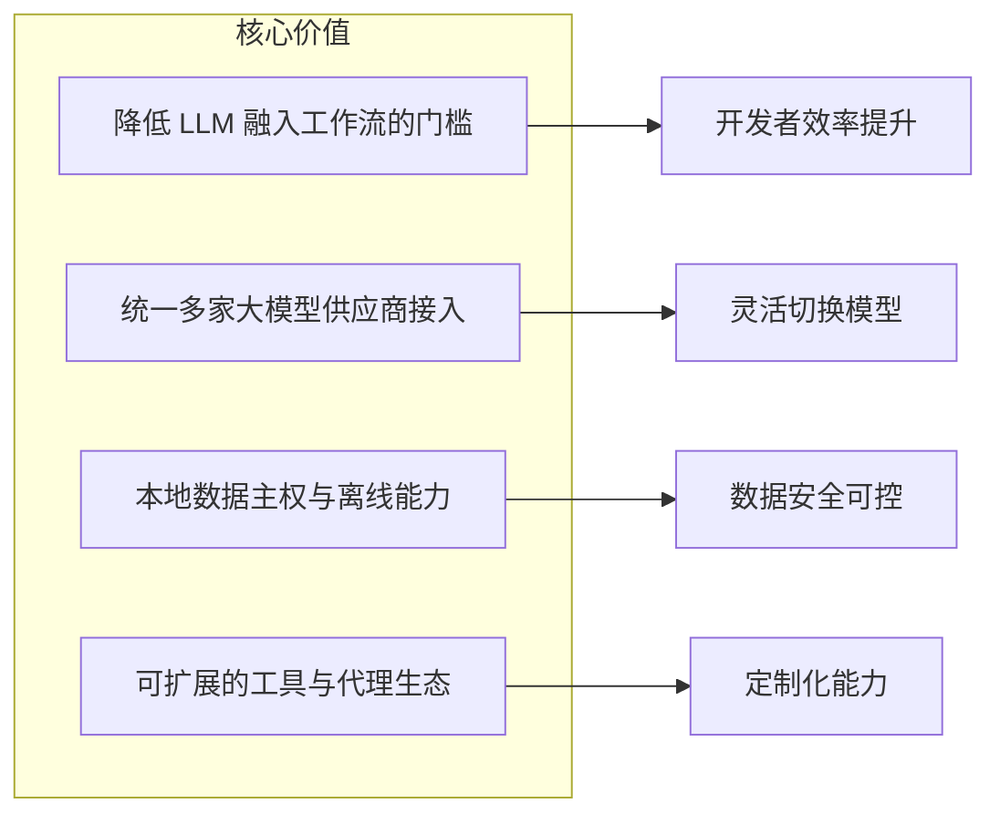
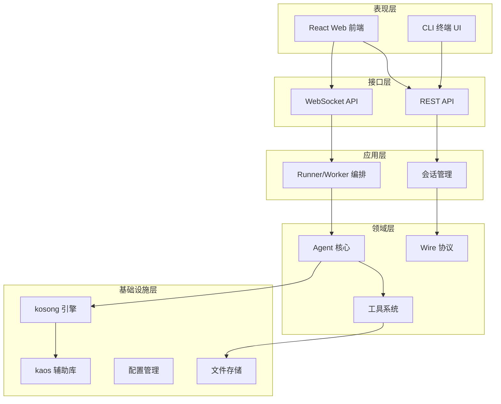
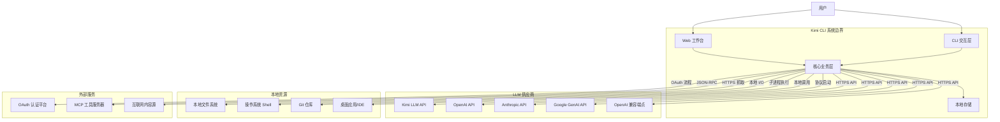
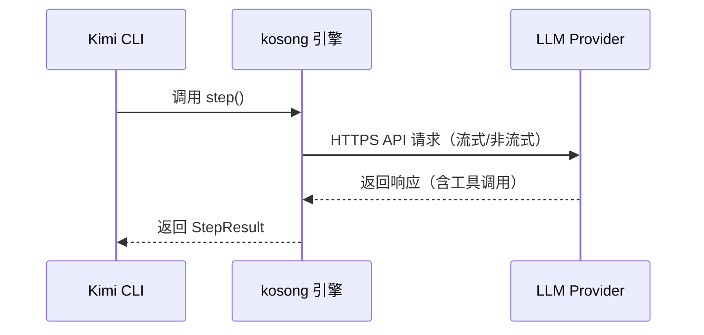
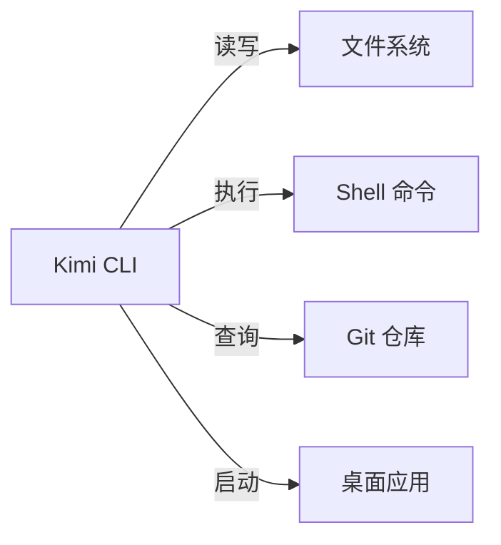
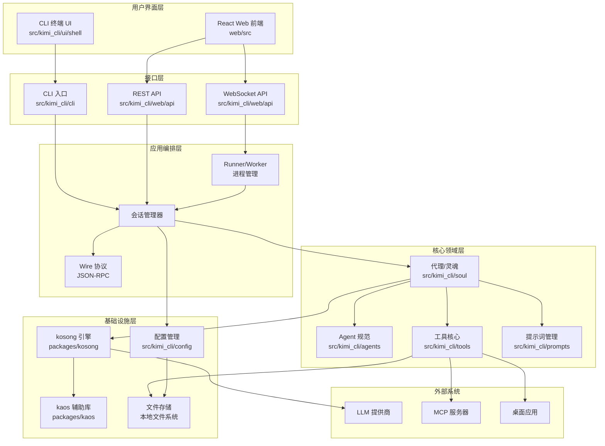
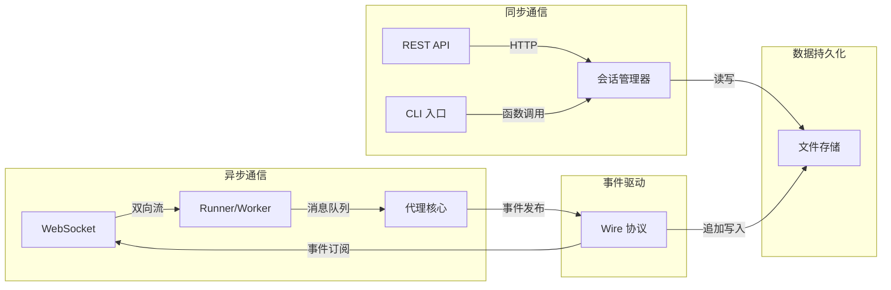
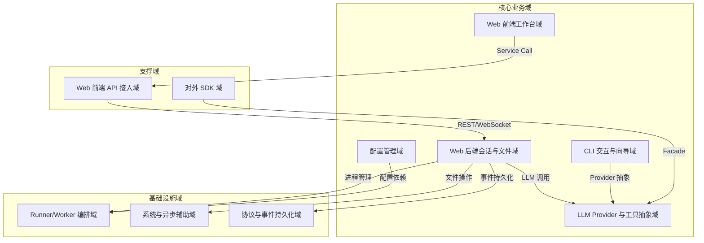
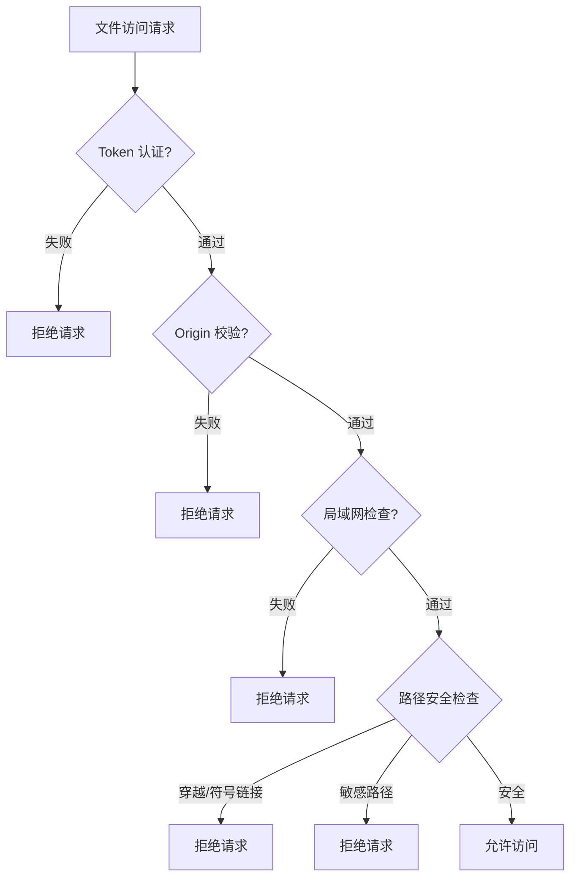

# Kimi CLI 系统架构文档

## 文档信息

| 项目 | 内容 |
|------|------|
| **项目名称** | kimi-cli |
| **文档版本** | v1.0 |
| **生成时间** | 2026-02-28 |
| **架构模型** | C4 Model (Context/Container/Component) |
| **置信度评分** | 8.2/10 |

---

## 1. 架构概述

### 1.1 系统定位与价值主张

Kimi CLI 是一个**本地优先的 AI 代理工作台**，旨在为开发者提供可扩展的命令行与本地 Web 工作环境。系统将 LLM 对话、工具调用（文件/命令行/网络/MCP）、会话历史、配置与鉴权整合到一个可在本机运行的产品中。

**核心价值主张：**

**业务收益：**
- 提升研发与知识工作效率
- 降低使用多家模型与工具链的集成成本
- 支持团队在本地或局域网内以更安全的方式运行
- 提供可审计的对话历史与工具调用记录

### 1.2 架构设计理念

系统架构遵循以下核心设计原则：

| 设计原则 | 实现方式 | 架构收益 |
|----------|----------|----------|
| **本地优先** | 会话数据、配置、历史记录均存储在本地文件系统，支持离线回放与审计 | 数据主权、隐私保护、离线可用 |
| **多模型接入** | 通过 kosong 引擎提供统一的 ChatProvider 协议，屏蔽 Kimi、OpenAI、Anthropic、Google GenAI 等供应商差异 | 灵活切换、避免供应商锁定 |
| **双界面融合** | CLI 与 Web 共享核心业务逻辑，满足终端开发者与可视化工作台用户的不同需求 | 用户体验多样化、代码复用 |
| **事件溯源模式** | Wire 协议以 JSON-RPC 格式追加写入，支持历史回放与会话派生 | 可审计、可回放、可派生 |
| **可扩展工具生态** | 内置文件、Shell、Web、多代理等工具，支持 MCP 协议扩展外部能力 | 功能可扩展、生态开放 |
| **安全边界清晰** | 多层安全控制（Token/Origin/LAN/路径防护），确保本地资源访问受控 | 安全可控、防止滥用 |

### 1.3 核心架构模式

**1. 事件溯源（Event Sourcing）**
- Wire 协议以 JSONL 格式记录所有对话与工具调用事件
- 支持历史回放、会话派生、审计追溯
- 实现前后端状态同步与实时推送

**2. CQRS（命令查询职责分离）**
- 写操作：通过 WebSocket 发送命令，触发 Agent 执行
- 读操作：通过 REST API 查询会话列表、配置、文件等
- 分离提升系统可扩展性与性能

**3. 插件化架构**
- 工具系统：内置工具 + MCP 协议扩展
- Provider 抽象：统一接口适配多家 LLM 供应商
- Agent 配置：通过 YAML 定义 Agent 行为与工具集

**4. 分层架构**

### 1.4 技术栈概览

| 层次 | 技术选型 | 版本要求 | 选型理由 |
|------|----------|----------|----------|
| **后端语言** | Python | 3.11+ | 丰富的 AI/ML 生态、原生异步支持、快速迭代 |
| **后端框架** | FastAPI | - | 高性能异步、自动 OpenAPI 文档、Pydantic 类型安全 |
| **前端框架** | React | 18+ | 组件化开发、类型安全、生态成熟 |
| **前端语言** | TypeScript | - | 类型安全、IDE 支持、可维护性强 |
| **前端构建** | Vite | - | 快速 HMR、ESM 原生支持、开发体验优秀 |
| **状态管理** | Zustand | - | 轻量简洁、TypeScript 友好、无样板代码 |
| **UI 组件** | Radix UI + Tailwind CSS | - | 无障碍访问、高度可定制、现代设计系统 |
| **通信协议** | JSON-RPC 2.0 | - | 简洁双向通信、易于持久化与回放 |
| **配置格式** | TOML | - | 可读性强、支持注释、Python 生态友好 |
| **异步运行时** | asyncio | - | Python 原生异步、高并发支持 |

---

## 2. 系统上下文

### 2.1 系统边界定义

### 2.2 系统边界说明

**包含组件（系统内部）：**

| 组件类别 | 具体内容 | 职责 |
|----------|----------|------|
| **用户界面** | CLI 入口、Web 工作台（FastAPI 后端 + React 前端） | 用户交互、会话管理、可视化展示 |
| **核心业务** | 会话管理、Wire 事件记录、代理执行、工具审批 | 业务逻辑编排、状态管理 |
| **底层引擎** | kosong（LLM 抽象）、kaos（异步辅助） | 技术能力封装、跨平台支持 |
| **对外 SDK** | kimi-sdk | 二次开发接口、能力复用 |
| **配置管理** | TOML/JSON 配置、环境变量覆盖 | 配置持久化、验证、迁移 |
| **本地存储** | 会话目录、wire.jsonl、context.jsonl、metadata.json | 数据持久化、历史记录 |

**排除组件（外部依赖）：**

| 组件类别 | 具体内容 | 交互方式 |
|----------|----------|----------|
| **LLM 服务** | 云端模型推理、计费系统 | HTTPS API 调用 |
| **身份认证** | OAuth 平台的账号体系 | OAuth 授权流程 |
| **版本控制** | Git 实现与仓库托管服务 | 本地 Git 命令调用 |
| **操作系统** | Shell、文件系统、进程管理 | 系统调用、子进程 |
| **外部工具** | MCP 服务器、桌面应用、IDE | 协议调用、进程启动 |

### 2.3 目标用户与场景

| 用户角色 | 典型场景 | 核心需求 | 使用界面 |
|----------|----------|----------|----------|
| **个人开发者** | 在本地仓库中工作，希望把 AI 对话、代码阅读与工具执行整合到终端或 Web 面板 | 快速配置多家模型与密钥、在工作目录内安全读写文件并执行命令、对话可持久化/可回放/可搜索/可 fork、查看 Git 变更与上下文 token 占用、对工具调用进行审批 | CLI + Web |
| **Web 工作台用户** | 需要浏览器可视化与可控性的使用者 | 会话列表管理、流式消息可视化、附件上传、消息搜索、全局配置、队列管理、Git diff 展示 | Web |
| **工具开发者** | 需要通过脚本或二次开发把 kimi 的 agent 能力嵌入到自己的工具/服务中 | 稳定的 SDK 接口（kimi-sdk）与 provider 抽象（kosong）、可扩展的 tool / MCP 接入方式、可复用的消息模型与 step-based agent loop | SDK |
| **小团队技术负责人** | 在局域网内运行本地 Web 工作台，集中管理多个会话与工作目录 | 局域网访问与 token/origin 安全控制、会话列表缓存与自动归档、配置变更时可控地重启会话并跳过 busy 会话 | Web |

### 2.4 外部系统交互

**LLM 供应商交互：**

**本地资源交互：**

**外部服务交互：**
- **OAuth 平台**：授权码流程、本机浏览器回调
- **MCP 服务器**：JSON-RPC 协议、工具与资源访问
- **互联网内容源**：HTTPS 抓取、搜索 API

---

## 3. 容器视图

### 3.1 容器架构图

### 3.2 容器职责说明

#### 3.2.1 用户界面层

| 容器 | 技术栈 | 职责 | 关键模块 |
|------|--------|------|----------|
| **CLI 终端 UI** | Python (Rich/Prompt Toolkit) | 终端交互界面，处理输入输出渲染、交互式向导 | `src/kimi_cli/ui/shell` |
| **React Web 前端** | React 18 + TypeScript + Zustand | 浏览器可视化界面，会话管理与聊天工作区、状态工具栏、队列管理 | `web/src` |

#### 3.2.2 接口层

| 容器 | 技术栈 | 职责 | 关键模块 |
|------|--------|------|----------|
| **CLI 入口** | Python (Click/Argparse) | 命令行参数解析、子命令路由、配置向导 | `src/kimi_cli/cli` |
| **REST API** | FastAPI | HTTP 接口，会话 CRUD、配置管理、文件访问、Git 状态查询 | `src/kimi_cli/web/api` |
| **WebSocket API** | FastAPI WebSocket | 双向流式通道，实时消息推送、历史回放、runner 消息转发 | `src/kimi_cli/web/api` |

#### 3.2.3 应用编排层

| 容器 | 技术栈 | 职责 | 关键模块 |
|------|--------|------|----------|
| **Runner/Worker** | Python asyncio | 子进程生命周期管理、忙碌态跟踪、消息路由、进程重启协调 | `src/kimi_cli/web/runner` |
| **会话管理器** | Python | 会话实体生命周期、工作目录绑定、元数据管理、会话 fork | `src/kimi_cli/session` |
| **Wire 协议** | Python | JSON-RPC 事件序列化、历史回放、会话派生、SPMC 消息分发 | `src/kimi_cli/wire` |

#### 3.2.4 核心领域层

| 容器 | 技术栈 | 职责 | 关键模块 |
|------|--------|------|----------|
| **代理核心** | Python | Agent loop 编排、工具调用协调、审批与提问交互 | `src/kimi_cli/soul` |
| **Agent 规范** | Python | Agent 定义、YAML 配置解析、技能管理 | `src/kimi_cli/agents` |
| **工具系统** | Python | 内置工具实现（文件/Shell/Web/多代理）、工具审批机制、MCP 协议适配 | `src/kimi_cli/tools` |
| **提示词管理** | Python | 系统提示词模板、提示词组装 | `src/kimi_cli/prompts` |

#### 3.2.5 基础设施层

| 容器 | 技术栈 | 职责 | 关键模块 |
|------|--------|------|----------|
| **kosong 引擎** | Python | 多供应商 LLM 抽象、Tooling 框架、step 函数、消息模型 | `packages/kosong` |
| **kaos 辅助库** | Python | 异步文件系统、SSH 等通用能力 | `packages/kaos` |
| **配置管理** | Python (Pydantic) | TOML/JSON 配置加载、校验、迁移、敏感信息保护 | `src/kimi_cli/config` |
| **文件存储** | 本地文件系统 | 会话目录、wire.jsonl、context.jsonl、metadata.json、配置文件 | 本地文件系统 |

### 3.3 容器间通信

---

## 4. 领域模块分析

### 4.1 领域模块关系图

### 4.2 核心领域模块详解

#### 4.2.1 Web 前端工作台域

**领域定位：** 核心业务域  
**重要性：** 10/10  
**复杂度：** 7/10  
**代码路径：** `web/src/`

**领域职责：**
面向用户的本地 Web 工作台（React/TS），提供会话侧边栏、聊天工作区、提示词编辑、状态工具栏、消息搜索、审批/提问对话框、工具结果展示等核心交互。该域的价值是把"会话+工具+项目文件+模型能力"以可视化方式呈现并支持高频操作。

**子模块划分：**

| 子模块 | 代码路径 | 功能描述 | 关键能力 |
|--------|----------|----------|----------|
| **应用启动与容错引导** | `web/src/main.tsx`, `web/src/bootstrap.tsx` | 应用启动入口与初始化 | React 应用挂载、Chunk 加载失败自动恢复、初始化监控工具 |
| **会话导航与工作区编排** | `web/src/App.tsx`, `web/src/features/sessions/` | 会话生命周期操作入口 | 会话选择与持久化、创建会话对话框、归档/删除会话触发 |
| **聊天工作区与对话体验** | `web/src/features/chat/chat-workspace-container.tsx`, `web/src/features/chat/chat.tsx` | 聊天工作区编排 | 建立/维护会话流式连接、消息虚拟化渲染、审批与提问 UI 工作流 |
| **提示词编辑与交互增强** | `web/src/features/chat/components/chat-prompt-composer.tsx`, `web/src/features/chat/useSlashCommands.ts` | 提示词编辑增强能力 | slash 命令检测/过滤/插入、文件提及建议与选择、附件管理 |
| **状态工具栏与队列管理** | `web/src/features/chat/components/prompt-toolbar/`, `web/src/features/chat/queue-store.ts` | 聊天状态可观测性 | 队列入队/编辑/重排/出队、自动开关工具栏面板、活动状态映射 |
| **工具结果展示与产物追踪** | `web/src/features/tool/components/display-content.tsx`, `web/src/features/tool/store.ts` | 工具结果可视化 | 工具输出类型识别与分发渲染、diff 语法高亮、写文件路径提取 |

**关键技术决策：**
- **Zustand 状态管理**：轻量级、无样板代码，适合中小型应用
- **虚拟化渲染**：处理长对话历史，提升性能
- **WebSocket 流式连接**：实时推送消息，提升用户体验
- **Radix UI + Tailwind CSS**：无障碍访问、高度可定制

#### 4.2.2 Web 后端会话与文件域

**领域定位：** 核心业务域  
**重要性：** 10/10  
**复杂度：** 9/10  
**代码路径：** `src/kimi_cli/web/api/sessions.py`, `src/kimi_cli/session/`

**领域职责：**
Web 后端会话与文件管理域（FastAPI）：提供会话 CRUD、会话目录/工作目录文件访问（含上传）、会话 fork、Git diff、标题生成，以及 WebSocket 流式事件通道与历史回放。该域是产品数据与实时交互的核心枢纽，并承担严格的本地/局域网安全控制。

**子模块划分：**

| 子模块 | 功能描述 | 关键能力 |
|--------|----------|----------|
| **会话生命周期管理 API** | 会话 REST API | 会话 CRUD、列表缓存与失效、会话元数据维护、自动归档策略 |
| **文件管理与安全访问** | 文件与目录访问 | 文件上传与大小限制、workdir 文件读取与目录遍历（受控）、安全过滤（敏感路径、symlink、traversal） |
| **实时流式通讯** | WebSocket 流 | 历史回放与同步、runner 进程绑定与转发、忙碌拒绝与并发控制、鉴权与来源校验 |
| **会话 Fork 服务** | 会话派生 | wire/context 裁剪、资源选择性复制、新会话目录初始化 |
| **Git 变更统计服务** | Git 集成 | 仓库检测（初始化/未初始化）、diff 统计计算、变更文件列表输出 |

**安全控制措施：**

**关键技术决策：**
- **TTL 缓存**：减少文件系统 I/O，提升列表查询性能
- **原子更新**：metadata.json 原子写入，避免并发冲突
- **安全边界**：多层安全控制，防止路径穿越与敏感文件泄露
- **忙碌态管理**：避免并发执行，确保会话状态一致性

#### 4.2.3 LLM Provider 与工具抽象域（kosong）

**领域定位：** 核心业务域  
**重要性：** 9/10  
**复杂度：** 8/10  
**代码路径：** `packages/kosong/src/kosong/`

**领域职责：**
以统一的消息/step/工具调用接口屏蔽不同 LLM 供应商差异，并提供工具系统（Toolset、参数校验、工