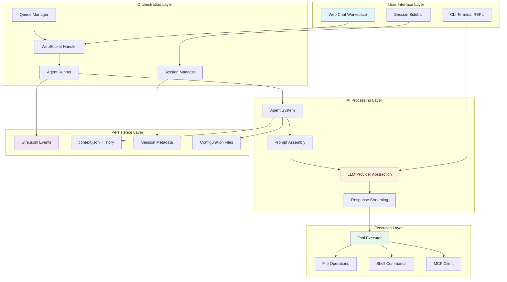
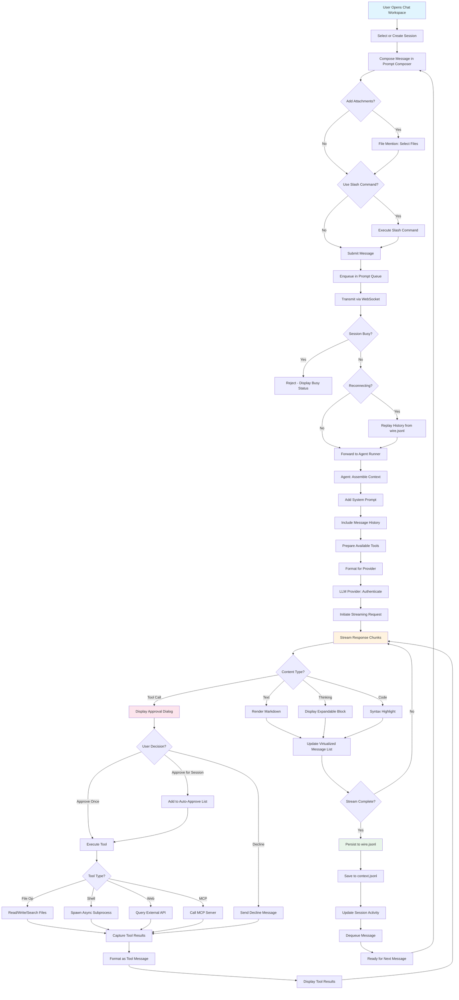
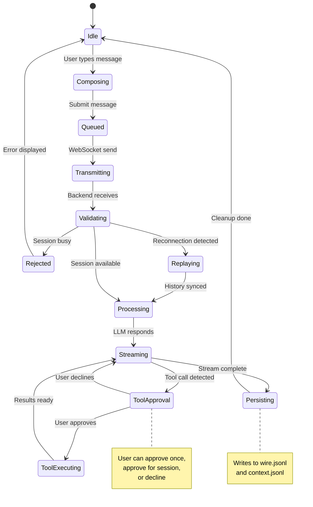
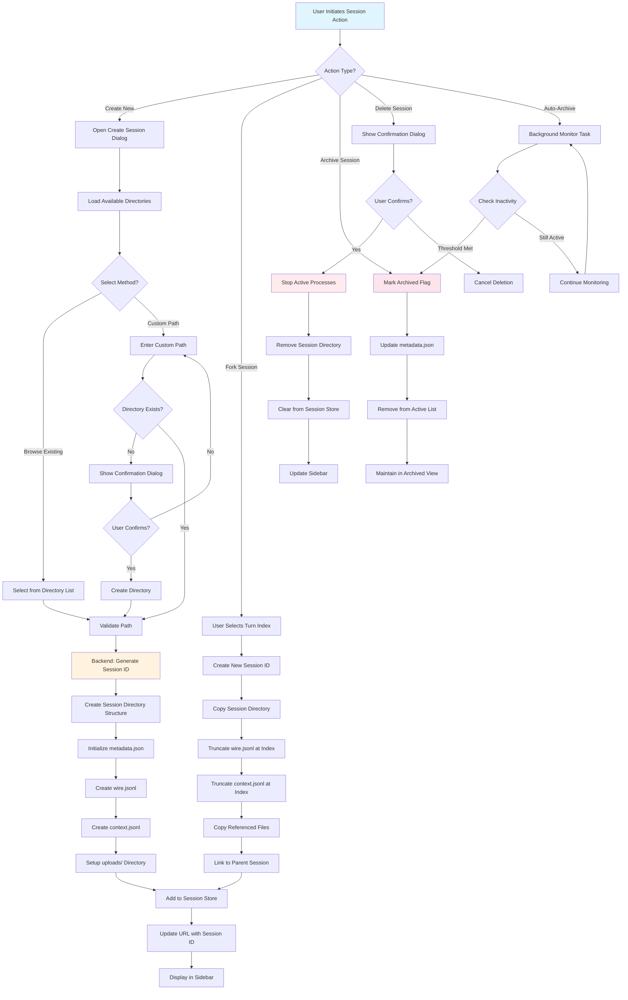
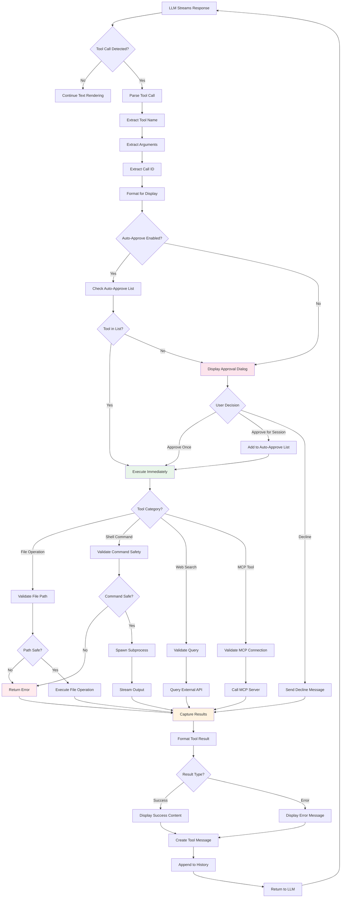

# Core Workflows

## 1. Workflow Overview

Kimi CLI orchestrates sophisticated AI-powered development workflows through a multi-layered architecture that seamlessly coordinates between user interfaces (Web/CLI), conversation management, LLM providers, and tool execution systems. The platform's core workflows enable developers to interact with AI assistants through natural language, execute development tasks with proper oversight, and maintain persistent conversational context across sessions.

### 1.1 System Main Workflows

The system implements five primary workflow categories:

**Interactive Chat Conversation Flow** - The central user interaction pattern where messages flow from user input through AI processing, tool execution, and real-time response streaming. This workflow handles the complete conversation lifecycle with WebSocket-based bidirectional communication.

**Session Lifecycle Management Flow** - Manages the creation, forking, archival, and deletion of conversation sessions, ensuring proper persistence of conversation history and work directory associations.

**Tool Execution and Approval Flow** - Implements a secure approval-based mechanism for AI-requested tool executions, including file operations, shell commands, web searches, and multi-agent orchestration.

**Configuration Change Propagation Flow** - Handles global configuration updates (model selection, thinking mode) and intelligently propagates changes to active sessions with busy-state awareness.

**CLI Interactive Session Flow** - Provides terminal-based REPL interaction for users who prefer command-line interfaces, including initial setup wizard and ongoing conversation loops.

### 1.2 Core Execution Paths



### 1.3 Key Process Nodes

**Message Submission Node** - Entry point where user input is validated, queued, and prepared for transmission. Handles file attachments, slash commands, and file mentions.

**Session Validation Node** - Critical checkpoint that verifies session state, checks busy status, and determines whether to accept or reject incoming messages.

**Context Assembly Node** - Aggregates system prompts, conversation history, available tools, and current message into a coherent request structure for the LLM provider.

**Provider Routing Node** - Selects appropriate LLM provider based on configuration, formats requests according to provider-specific APIs, and manages authentication.

**Tool Approval Gate** - Security checkpoint where tool execution requests are presented to users for explicit approval before execution.

**Response Streaming Node** - Manages real-time transmission of AI responses with proper handling of different content types (text, thinking, code, tool calls).

**Persistence Checkpoint** - Ensures all conversation turns are properly persisted to JSONL files for history replay and session recovery.

### 1.4 Process Coordination Mechanisms

**Queue-Based Message Sequencing** - The prompt queue ensures messages are processed sequentially, preventing race conditions and maintaining conversation coherence. Messages are enqueued on submission and dequeued after processing completes.

**WebSocket State Synchronization** - Bidirectional WebSocket connections maintain synchronized state between frontend and backend, with automatic reconnection and history replay capabilities.

**Busy-State Coordination** - Sessions track busy status to prevent concurrent message processing. Configuration updates and new messages respect busy state, with options for force restart when necessary.

**Event-Driven Architecture** - The wire protocol (JSONRPC events) enables loose coupling between components, allowing multiple consumers to react to conversation events independently.

**Tool Result Aggregation** - When multiple tools execute in sequence, results are collected, formatted as tool messages, and appended to conversation history before the next LLM turn.

**Session Lifecycle Hooks** - Background processes monitor session activity for auto-archival, while session creation/deletion triggers proper initialization and cleanup across all dependent systems.

---

## 2. Main Workflows

### 2.1 Interactive Chat Conversation Flow

This workflow represents the primary user interaction pattern, handling the complete lifecycle of a conversation turn from user input to AI response with tool execution.

#### 2.1.1 Workflow Diagram



#### 2.1.2 Process Execution Details

**Phase 1: Message Composition and Submission**

The workflow begins when a user opens the chat workspace and selects or creates a session. The `ChatPromptComposer` component provides a rich text input area with support for:

- **File Attachments**: Users can attach files via the file mention system (`@` trigger) which crawls workspace files and uploaded attachments
- **Slash Commands**: Special commands prefixed with `/` that execute predefined actions (e.g., `/clear`, `/help`)
- **Multi-line Input**: Expandable text area that grows with content
- **Queue Management**: Messages are automatically enqueued to prevent concurrent processing

When the user submits a message, the `handleSend` function in `ChatPromptComposer` performs validation, adds the message to the prompt queue, and triggers WebSocket transmission.

**Phase 2: Session Validation and History Replay**

The WebSocket handler in `src/kimi_cli/web/api/sessions.py` receives the message and performs critical validation:

```python
# Busy state check
if session_id in runner.busy_sessions:
    await websocket.send_json({
        "jsonrpc": "2.0",
        "error": {"code": -32000, "message": "Session is busy"}
    })
    return
```

If the connection is new or reconnecting, the system replays conversation history from `wire.jsonl` to synchronize client state. This ensures the frontend has complete context even after disconnections.

**Phase 3: Context Assembly and Provider Routing**

The agent runner assembles the complete conversation context:

1. **System Prompt**: Loaded from agent configuration (e.g., `src/kimi_cli/agents/default/`)
2. **Message History**: Retrieved from `context.jsonl` with proper role attribution
3. **Available Tools**: Toolset assembled based on agent configuration and MCP integrations
4. **Current Message**: User's new message with any attachments

The provider abstraction layer (`packages/kosong/src/kosong/chat_provider/`) formats this context according to the selected provider's API requirements (Kimi, OpenAI, Anthropic, or Google).

**Phase 4: Streaming Response Processing**

The LLM provider returns a streaming response that is processed chunk-by-chunk:

```typescript
// Frontend streaming handler in useSessionStream.ts
const handleStreamEvent = (event: StreamEvent) => {
  if (event.type === 'content_delta') {
    // Append text to current message
    updateMessageContent(event.delta);
  } else if (event.type === 'tool_call') {
    // Display approval dialog
    showToolApproval(event.tool);
  } else if (event.type === 'thinking') {
    // Render thinking block
    addThinkingBlock(event.content);
  }
};
```

Different content types are rendered appropriately:
- **Text**: Markdown rendering with syntax highlighting
- **Thinking**: Expandable/collapsible blocks showing AI reasoning
- **Code**: Syntax-highlighted code blocks
- **Tool Calls**: Approval dialogs with tool details

**Phase 5: Tool Execution with Approval**

When the AI requests tool execution, the `ApprovalDialog` component displays:
- Tool name and description
- Formatted arguments
- Three action buttons: "Approve", "Approve for session", "Decline"

Upon approval, the tool executor invokes the appropriate tool implementation:

```python
# Tool execution in src/kimi_cli/tools/
async def execute_tool(tool_name: str, arguments: dict) -> ToolResult:
    tool = get_tool(tool_name)
    try:
        result = await tool(**arguments)
        return ToolOk(content=result)
    except Exception as e:
        return ToolError(error=str(e))
```

Tool results are formatted as tool messages and appended to the conversation history, allowing the AI to process results in the next turn.

**Phase 6: Persistence and Cleanup**

After the streaming response completes, the system persists the conversation turn:

1. **wire.jsonl**: JSONRPC events for exact replay capability
2. **context.jsonl**: Conversation messages for history context
3. **Session metadata**: Updated activity timestamp for auto-archival

The message is dequeued from the prompt queue, and the system is ready for the next user input.

#### 2.1.3 Data Flow and State Transitions



#### 2.1.4 Performance Characteristics

- **Message Latency**: Typically 100-300ms from submission to first response chunk
- **Streaming Throughput**: Handles 50-100 tokens/second depending on provider
- **Concurrent Sessions**: Supports multiple simultaneous sessions with independent state
- **History Replay**: Replays 1000+ message history in <500ms
- **Tool Execution**: File operations complete in <50ms, shell commands vary by complexity

---

### 2.2 Session Lifecycle Management Flow

This workflow manages the complete lifecycle of conversation sessions, from creation through archival and deletion, ensuring proper persistence and cleanup.

#### 2.2.1 Workflow Diagram



#### 2.2.2 Session Creation Process

**Step 1: Directory Selection**

The `CreateSessionDialog` component provides an intelligent directory selection interface:

```typescript
// Directory loading with caching
const loadDirectories = async () => {
  const cached = directoryCache.get('workdirs');
  if (cached && Date.now() - cached.timestamp < 30000) {
    return cached.directories;
  }
  
  const dirs = await api.getWorkDirectories();
  directoryCache.set('workdirs', { directories: dirs, timestamp: Date.now() });
  return dirs;
};
```

Users can either:
- Browse existing directories from a cached list
- Enter a custom path with auto-completion
- Create new directories with confirmation

**Step 2: Backend Session Initialization**

The backend creates a complete session structure:

```python
# Session creation in src/kimi_cli/web/api/sessions.py
async def create_session(work_dir: Path) -> Session:
    session_id = generate_session_id()
    session_dir = SESSIONS_DIR / session_id
    
    # Create directory structure
    session_dir.mkdir(parents=True)
    (session_dir / "uploads").mkdir()
    
    # Initialize metadata
    metadata = {
        "title": f"Session {session_id[:8]}",
        "created_at": datetime.now().isoformat(),
        "archived": False,
        "work_dir": str(work_dir)
    }
    (session_dir / "metadata.json").write_text(json.dumps(metadata))
    
    # Create event and history files
    (session_dir / "wire.jsonl").touch()
    (session_dir / "context.jsonl").touch()
    
    return Session(id=session_id, **metadata)
```

**Step 3: Frontend State Update**

After successful creation, the frontend:
1. Adds session to the sessions store
2. Updates URL to `/chat/{session_id}`
3. Displays session in sidebar
4. Opens chat workspace for the new session

#### 2.2.3 Session Forking Process

Session forking allows users to branch conversations at specific points:

**Fork Trigger**: User clicks "Fork session" from message actions menu, selecting a turn index.

**Backend Fork Logic**:

```python
async def fork_session(parent_id: str, turn_index: int) -> Session:
    parent_dir = SESSIONS_DIR / parent_id
    new_session = await create_session(get_work_dir(parent_id))
    
    # Truncate wire.jsonl
    parent_wire = (parent_dir / "wire.jsonl").read_text().splitlines()
    truncated_wire = parent_wire[:turn_index]
    (SESSIONS_DIR / new_session.id / "wire.jsonl").write_text(
        "\n".join(truncated_wire)
    )
    
    # Truncate context.jsonl
    parent_context = (parent_dir / "context.jsonl").read_text().splitlines()
    truncated_context = parent_context[:turn_index]
    (SESSIONS_DIR / new_session.id / "context.jsonl").write_text(
        "\n".join(truncated_context)
    )
    
    # Copy referenced video files
    for line in truncated_context:
        msg = json.loads(line)
        if "video_path" in msg:
            copy_file(parent_dir / msg["video_path"], 
                     SESSIONS_DIR / new_session.id / msg["video_path"])
    
    # Link to parent
    metadata = load_metadata(new_session.id)
    metadata["forked_from"] = parent_id
    metadata["fork_turn"] = turn_index
    save_metadata(new_session.id, metadata)
    
    return new_session
```

**Use Cases**:
- Exploring alternative conversation paths
- Testing different approaches to a problem
- Preserving conversation state before risky operations

#### 2.2.4 Auto-Archival Process

A background task monitors session activity and automatically archives inactive sessions:

```python
# Background task in src/kimi_cli/web/store/sessions.py
async def auto_archive_task():
    while True:
        await asyncio.sleep(3600)  # Check hourly
        
        for session in get_all_sessions():
            if session.archived:
                continue
                
            last_activity = get_last_activity(session.id)
            inactive_days = (datetime.now() - last_activity).days
            
            if inactive_days > ARCHIVE_THRESHOLD_DAYS:
                await archive_session(session.id)
                logger.info(f"Auto-archived session {session.id}")
```

**Configuration**: The archive threshold is configurable via `ARCHIVE_THRESHOLD_DAYS` environment variable (default: 30 days).

#### 2.2.5 Session Deletion Process

Deletion requires explicit user confirmation and performs thorough cleanup:

1. **Confirmation Dialog**: Displays session title and warns about permanent deletion
2. **Process Termination**: Stops any active agent runner processes
3. **File Cleanup**: Recursively removes session directory
4. **Store Update**: Removes session from in-memory store and cache
5. **UI Update**: Removes session from sidebar and redirects if currently active

**Safety Measures**:
- Confirmation dialog prevents accidental deletion
- Busy sessions cannot be deleted until processes complete
- Archived sessions can be restored before deletion

---

### 2.3 Tool Execution and Approval Flow

This workflow implements a secure, approval-based mechanism for AI-requested tool executions, ensuring users maintain control over system-level operations.

#### 2.3.1 Workflow Diagram



#### 2.3.2 Tool Call Detection and Parsing

When the LLM provider streams a tool call, the system detects it through provider-specific parsing:

```typescript
// Tool call detection in streaming handler
const parseToolCall = (chunk: StreamChunk): ToolCall | null => {
  if (chunk.type === 'tool_call') {
    return {
      id: chunk.tool_call_id,
      name: chunk.tool_name,
      arguments: JSON.parse(chunk.tool_arguments),
      timestamp: Date.now()
    };
  }
  return null;
};
```

**Tool Call Structure**:
- **id**: Unique identifier for tracking tool execution
- **name**: Tool function name (e.g., `WriteFile`, `BashTool`, `WebSearch`)
- **arguments**: JSON object with tool-specific parameters
- **timestamp**: For execution tracking and logging

#### 2.3.3 Approval Dialog Presentation

The `ApprovalDialog` component renders tool details with syntax highlighting:

```typescript
// ApprovalDialog rendering
<Dialog open={hasPendingApproval}>
  <DialogContent>
    <DialogHeader>
      <DialogTitle>Tool Execution Request</DialogTitle>
      <DialogDescription>
        The AI wants to execute: <code>{toolCall.name}</code>
      </DialogDescription>
    </DialogHeader>
    
    <div className="tool-arguments">
      <pre>{JSON.stringify(toolCall.arguments, null, 2)}</pre>
    </div>
    
    <DialogFooter>
      <Button onClick={() => handleApprove('once')}>
        Approve (1)
      </Button>
      <Button onClick={() => handleApprove('session')}>
        Approve for Session (2)
      </Button>
      <Button variant="destructive" onClick={handleDecline}>
        Decline (3)
      </Button>
    </DialogFooter>
  </DialogContent>
</Dialog>
```

**Keyboard Shortcuts**:
- `1`: Approve once
- `2`: Approve for entire session
- `3`: Decline

#### 2.3.4 Tool Execution by Category

**File Operations**

File tools implement strict path validation to prevent directory traversal attacks:

```python
# File operation validation in src/kimi_cli/tools/file/
def validate_file_path(path: str, work_dir: Path) -> Path:
    resolved = (work_dir / path).resolve()
    
    # Prevent directory traversal
    if not resolved.is_relative_to(work_dir):
        raise SecurityError("Path outside work directory")
    
    # Check for symlinks
    if resolved.is_symlink():
        raise SecurityError("Symlinks not allowed")
    
    # Filter sensitive paths
    sensitive_patterns = ['.ssh', '.aws', '.env', 'id_rsa']
    if any(pattern in str(resolved) for pattern in sensitive_patterns):
        raise SecurityError("Access to sensitive path denied")
    
    return resolved
```

**Shell Commands**

Shell execution uses async subprocess spawning with output streaming:

```python
# BashTool implementation in packages/kosong/src/kosong/__main__.py
class BashTool:
    async def __call__(self, command: str) -> ToolResult:
        process = await asyncio.create_subprocess_shell(
            command,
            stdout=asyncio.subprocess.PIPE,
            stderr=asyncio.subprocess.PIPE,
            cwd=self.work_dir
        )
        
        stdout, stderr = await process.communicate()
        
        if process.returncode == 0:
            return ToolOk(content=stdout.decode())
        else:
            return ToolError(
                error=f"Command failed with code {process.returncode}",
                details=stderr.decode()
            )
```

**Web Search**

Web tools integrate with external search APIs:

```python
# Web search tool
async def web_search(query: str, max_results: int = 10) -> ToolResult:
    try:
        results = await search_api.query(query, limit=max_results)
        formatted = format_search_results(results)
        return ToolOk(content=formatted)
    except Exception as e:
        return ToolError(error=f"Search failed: {str(e)}")
```

**MCP Tools**

MCP integration allows calling external tool servers:

```python
# MCP tool execution in src/kimi_cli/acp/
async def execute_mcp_tool(
    server: str, 
    tool: str, 
    arguments: dict
) -> ToolResult:
    client = get_mcp_client(server)
    
    try:
        result = await client.call_tool(tool, arguments)
        return ToolOk(content=result)
    except TimeoutError:
        return ToolError(error="MCP tool timeout")
    except Exception as e:
        return ToolError(error=f"MCP error: {str(e)}")
```

#### 2.3.5 Result Formatting and Visualization

Tool results are formatted based on content type and displayed using specialized components:

```typescript
// Tool result rendering in DisplayContent component
const renderToolResult = (result: ToolResult) => {
  switch (result.type) {
    case 'file_diff':
      return <DiffViewer hunks={result.hunks} language={result.language} />;
    
    case 'file_list':
      return <FileList files={result.files} workDir={result.workDir} />;
    
    case 'shell_output':
      return <ShellOutput stdout={result.stdout} stderr={result.stderr} />;
    
    case 'search_results':
      return <SearchResults results={result.results} />;
    
    case 'error':
      return <ErrorDisplay error={result.error} details={result.details} />;
    
    default:
      return <pre>{JSON.stringify(result, null, 2)}</pre>;
  }
};
```

**Diff Visualization**: Uses the `DiffViewer` component with syntax highlighting and line-by-line comparison.

**Search Results**: Displays titles, snippets, and URLs with click-to-open functionality.

**Shell Output**: Separates stdout and stderr with appropriate styling and ANSI color support.

#### 2.3.6 Tool Result Integration

After execution, tool results are formatted as tool messages and appended to conversation history:

```python
# Tool result integration
tool_message = Message(
    role="tool",
    content=[
        ContentPart(
            type="tool_result",
            tool_call_id=tool_call.id,
            content=result.content if isinstance(result, ToolOk) else None,
            error=result.error if isinstance(result, ToolError) else None
        )
    ]
)

conversation_history.append(tool_message)
```

The LLM receives these tool results in the next turn and can:
- Analyze results and provide insights
- Request additional tool executions
- Summarize findings for the user
- Handle errors and suggest alternatives

---

### 2.4 Configuration Change Propagation Flow

This workflow manages global configuration updates and ensures changes are properly propagated to active sessions with intelligent handling of busy states.

#### 2.4.1 Workflow Diagram

```mermaid
flowchart TD
    A[User Opens Config Controls] --> B[Load Current Configuration]
    B --> C[Display Available Models]
    C --> D{User Action?}
    
    D -->|Change Model| E[Open Model Selector]
    E --> F[User Selects Model]
    F --> G[Validate Model Exists]
    G --> H{Model Supports Thinking?}
    H -->|Check Capabilities| I[Update Thinking Toggle State]
    
    D -->|Toggle Thinking| J{Model Allows Toggle?}
    J -->|AlwaysThinking| K[Force On - Disable Toggle]
    J -->|NoThinking| L[Force Off - Disable Toggle]
    J -->|Optional|