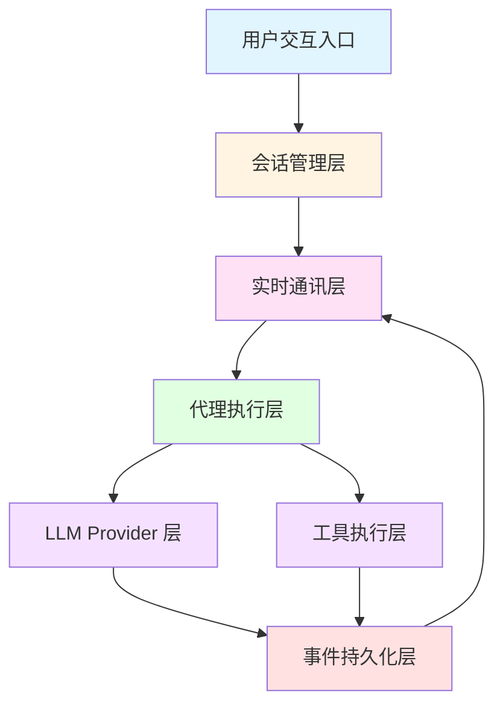
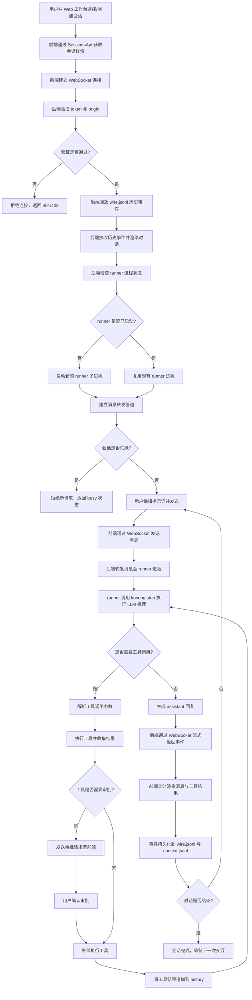
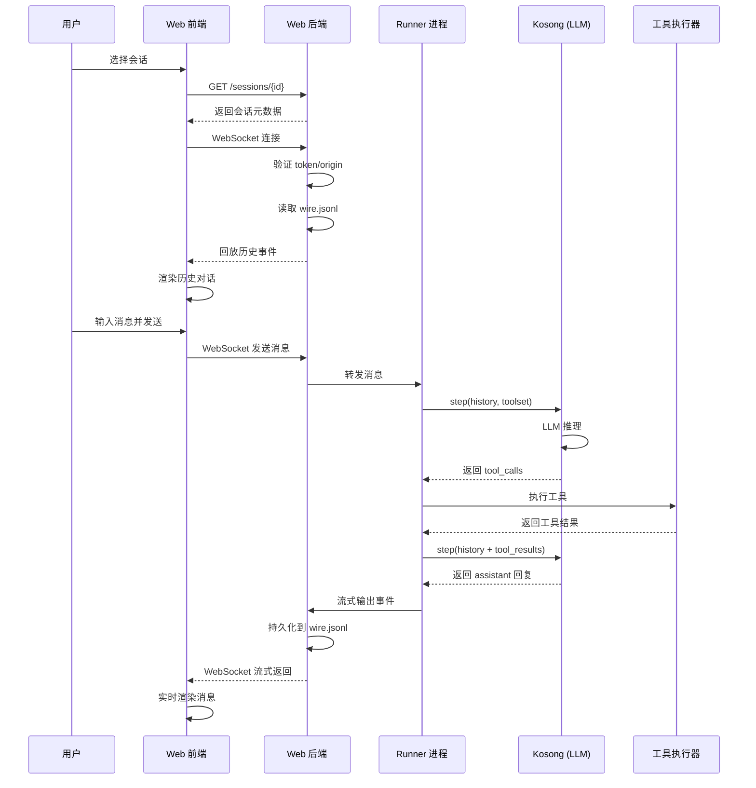
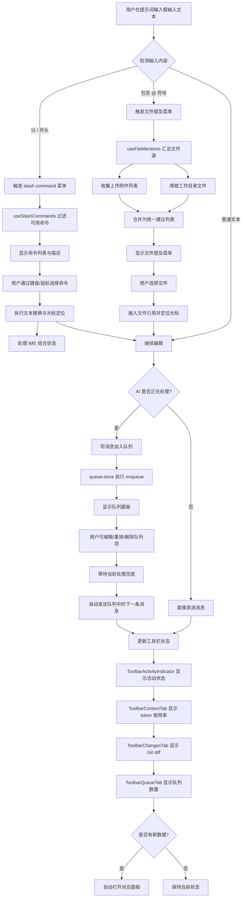
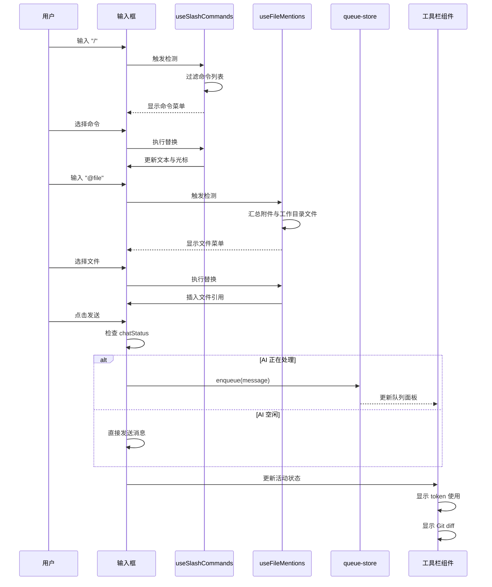
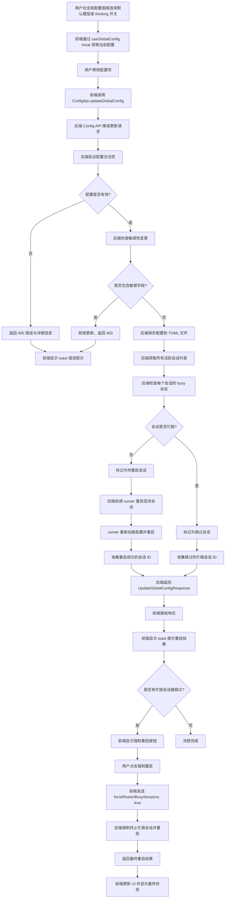
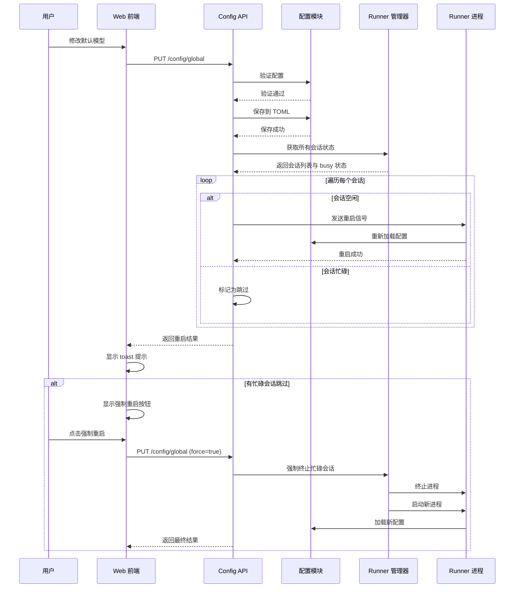

# 核心工作流程

## 1. 工作流程概览

### 1.1 系统主要工作流程

kimi-cli 作为本地优先的 AI 代理工作台，其核心工作流程围绕"会话驱动的 AI 对话与工具执行"展开。系统通过 Web 工作台或 CLI 终端为用户提供交互入口，将用户意图转化为 LLM 调用与工具执行，并通过流式事件机制实现实时反馈与历史持久化。

**核心执行路径包括：**

1. **会话生命周期管理路径**：从会话创建、选择、实时对话、历史回放到会话归档/删除/Fork 的完整生命周期
2. **实时对话与工具执行路径**：用户输入 → LLM 推理 → 工具调用 → 结果反馈 → 持久化的闭环流程
3. **配置管理与协调路径**：全局配置变更 → 会话重启协调 → 状态同步的配置生效流程
4. **增强交互路径**：slash commands、文件提及、队列管理、审批/提问等提升用户体验的辅助流程

### 1.2 关键流程节点



**关键节点说明：**

- **用户交互入口**：Web 工作台（React）或 CLI 终端，负责用户输入采集与结果展示
- **会话管理层**：会话 CRUD、元数据维护、文件访问控制、Git 集成
- **实时通讯层**：WebSocket 流式通道、历史回放、消息路由、busy-state 控制
- **代理执行层**：Runner/Worker 子进程编排、消息转发、执行状态跟踪
- **LLM Provider 层**：多模型适配、对话 step 执行、流式响应处理
- **工具执行层**：工具集管理、参数校验、工具调用与结果汇聚
- **事件持久化层**：wire.jsonl/context.jsonl 写入、事件序列化、历史索引

### 1.3 流程协调机制

系统采用**事件驱动 + 流式通讯**的协调模式：

1. **前后端协调**：通过 REST API 获取快照状态，通过 WebSocket 订阅实时事件流
2. **进程间协调**：Web 后端通过子进程管理器启动/终止 runner，通过管道转发消息
3. **状态同步机制**：wire 事件作为唯一真相源，前端通过回放与增量订阅保持同步
4. **并发控制**：基于 busy-state 的会话互斥，避免同一会话并发执行冲突
5. **配置协调**：配置变更触发会话重启，支持忙碌会话跳过与强制重启策略

---

## 2. 主要工作流程

### 2.1 会话实时聊天与事件流同步流程

这是系统的**核心业务流程**，体现了 AI 代理产品的主要价值——将用户对话、LLM 调用、工具执行与实时反馈完整串联。

#### 2.1.1 流程概述

用户在 Web 工作台创建或选择会话后，前端通过 REST API 获取会话元信息，并通过 WebSocket 建立流式通道。后端首先回放历史 wire 事件以同步历史对话，随后转发 runner 进程的实时输出。用户发送消息后，runner 调用 kosong 执行 LLM step，根据模型响应决定是否进行工具调用，最终将 assistant 回复与工具结果流式返回前端并持久化。

#### 2.1.2 详细流程图



#### 2.1.3 关键执行细节

**阶段 1：连接建立与历史同步**

- **入口**：`web/src/features/chat/chat-workspace-container.tsx` 在会话切换时触发 WebSocket 连接
- **后端处理**：`src/kimi_cli/web/api/sessions.py` 的 WebSocket endpoint 执行：
  1. 验证 token（从 query 或 header 提取）
  2. 验证 origin（LAN-only 模式下检查私有 IP）
  3. 读取 `wire.jsonl` 并逐行解析为 JSON-RPC 事件
  4. 按序发送历史事件至前端
- **前端处理**：接收事件并通过 `VirtualizedMessageList` 渲染历史对话

**阶段 2：Runner 进程管理**

- **进程启动**：后端检查会话对应的 runner 是否存在，不存在则通过 `src/kimi_cli/web/runner/process` 启动新子进程
- **Busy-state 控制**：runner 进程维护 `busy` 标志，同一会话同时只能有一个活跃请求
- **消息转发**：后端作为中间层，将 WebSocket 消息转发至 runner 的 stdin，并将 runner 的 stdout 转发回 WebSocket

**阶段 3：LLM 推理与工具调用**

- **Step 执行**：runner 调用 `packages/kosong` 的 `step` 函数，传入 history、system prompt 与 toolset
- **工具调用判断**：LLM 响应中包含 `tool_calls` 时触发工具执行
- **工具执行**：
  - 解析工具名称与参数（JSON Schema 校验）
  - 调用对应工具实现（如 `WriteFile`、`BashTool`、`WebFetch` 等）
  - 收集工具结果（`ToolOk` 或 `ToolError`）
- **审批机制**：敏感工具（如 shell 执行、文件写入）可配置为需要审批，前端弹出 `ApprovalDialog` 等待用户确认

**阶段 4：事件持久化与前端渲染**

- **事件序列化**：所有 assistant 消息、tool calls、tool results 被序列化为 JSON-RPC 事件
- **持久化**：追加写入 `wire.jsonl`（完整事件流）与 `context.jsonl`（对话上下文）
- **流式返回**：后端通过 WebSocket 实时发送事件，前端增量更新 UI
- **状态更新**：前端更新活动状态指示器、上下文 token 使用率、工具结果展示等

#### 2.1.4 数据流与状态转换



---

### 2.2 提示词编辑、附件与队列管理流程

这是**提升用户体验和工作效率的关键交互流程**，通过智能输入增强、文件引用与消息队列机制，让用户能够高效地与 AI 代理交互。

#### 2.2.1 流程概述

用户在提示词输入框编辑时，系统自动检测特殊输入模式（`/` 触发 slash commands，`@` 触发文件提及），提供智能补全与替换。当 AI 正在处理时，新消息自动进入队列，避免并发冲突。发送后，工具栏实时展示活动状态、上下文 token 使用、Git diff 统计与队列信息。

#### 2.2.2 详细流程图



#### 2.2.3 关键执行细节

**Slash Commands 实现**

- **检测逻辑**：`useSlashCommands.ts` 监听 `input` 事件，检测光标前文本是否匹配 `/` 开头模式
- **命令过滤**：根据用户输入的查询字符串（如 `/sea`）过滤命令列表，支持名称与别名匹配
- **菜单导航**：支持 `ArrowUp/Down` 键盘导航，`Enter` 确认选择，`Escape` 关闭菜单
- **文本替换**：
  1. 计算替换范围（从 `/` 起始位置到当前光标）
  2. 插入命令文本（如 `/search query`）
  3. 精确定位光标到合适位置（如 `query` 占位符处）
- **IME 处理**：通过 `compositionstart/compositionend` 事件避免在输入法组合期间触发菜单

**文件提及实现**

- **检测逻辑**：`useFileMentions.ts` 检测光标前是否有 `@` 符号且后续为文件名模式
- **文件源汇总**：
  1. **上传附件**：从 `usePromptInputAttachments` 获取待上传文件列表
  2. **工作目录文件**：调用 `/sessions/{id}/workdir` API 爬取文件树（可配置深度限制）
- **建议列表**：合并两个来源，按文件名过滤并排序
- **选择处理**：
  1. 替换 `@` 及后续文本为完整文件路径
  2. 添加空格分隔符
  3. 定位光标到文件引用后

**队列管理实现**

- **状态管理**：`queue-store.ts` 使用 Zustand 维护队列状态（数组 + 唯一 ID）
- **入队时机**：`ChatPromptComposer` 检测到 `chatStatus === 'streaming'` 时自动入队
- **队列操作**：
  - `enqueue`：追加到队列尾部
  - `dequeue`：移除队列头部
  - `editQueueItem`：原地编辑队列项文本
  - `moveQueueItemUp`：向前移动队列项
  - `removeQueueItem`：删除指定队列项
- **自动发送**：`ChatWorkspaceContainer` 监听 `chatStatus` 变化，当从 `streaming` 转为 `idle` 时自动 dequeue 并发送

**工具栏状态展示**

- **活动状态**：`ActivityStatusIndicator` 根据 `chatStatus`、最新消息类型、工具调用状态映射为用户友好描述（如"正在思考"、"正在执行 WriteFile"）
- **Token 使用**：`ToolbarContextTab` 显示百分比进度条与详细统计（input tokens、cache reads/writes、output tokens）
- **Git Diff**：`ToolbarChangesTab` 调用 `/sessions/{id}/git-diff` 获取统计并展示增删行数与文件数
- **队列面板**：`ToolbarQueuePanel` 渲染队列项列表，支持内联编辑与操作按钮

#### 2.2.4 用户交互时序



---

### 2.3 全局配置更新与会话重启协调流程

此流程确保**配置变更能够正确应用到所有相关会话**，同时避免中断正在进行的对话，体现了系统的配置管理与会话协调能力。

#### 2.3.1 流程概述

用户在 Web 前端的全局配置面板修改默认模型或 thinking 开关，前端调用 Config API 提交更新请求。后端验证配置合法性与敏感性后保存到 TOML 文件，随后检查所有活跃会话状态，协调 runner 重启空闲会话，忙碌会话则标记为跳过。前端根据返回结果显示重启摘要，并提供强制重启忙碌会话的选项。

#### 2.3.2 详细流程图



#### 2.3.3 关键执行细节

**前端配置控制**

- **入口组件**：`global-config-controls.tsx` 提供模型选择器与 thinking 开关
- **状态管理**：`useGlobalConfig` Hook 维护配置状态、loading/updating 标志与 error 信息
- **模型选择**：
  1. 打开 `ModelSelector` 对话框，展示 `config.models` 列表
  2. 用户选择后调用 `update({ defaultModel })`
  3. 显示 loading 状态直到后端响应
- **Thinking 开关**：
  1. 通过 `getThinkingState` 检查当前模型能力
  2. 如果模型强制 thinking（`AlwaysThinking`），开关强制开启且禁用
  3. 如果模型不支持 thinking，开关强制关闭且禁用
  4. 否则反映 `config.defaultThinking` 并允许切换

**后端配置验证与保存**

- **API 入口**：`src/kimi_cli/web/api/config.py` 的 `update_global_config` endpoint
- **验证逻辑**：
  1. 检查 `defaultModel` 是否在 `config.models` 列表中
  2. 检查 `defaultThinking` 是否与模型能力兼容
  3. 检查请求是否包含敏感字段（如 `api_key`），拒绝通过 Web API 修改
- **保存流程**：
  1. 调用 `src/kimi_cli/config.py` 的 `save_config` 方法
  2. 序列化为 TOML 格式并写入文件
  3. 触发配置重载事件（如果有监听器）

**会话重启协调**

- **会话状态检查**：
  1. 遍历所有会话目录（从 `sessions_dir` 读取）
  2. 通过 runner 进程管理器查询每个会话的 busy 状态
- **重启策略**：
  - **空闲会话**：发送重启信号至 runner，runner 重新加载配置并重置状态
  - **忙碌会话**：
    - 默认跳过，将会话 ID 添加到 `skippedBusySessionIds`
    - 如果 `forceRestartBusySessions: true`，强制终止 runner 进程并重启
- **结果汇总**：
  - `restartedSessionIds`：成功重启的会话列表
  - `skippedBusySessionIds`：因忙碌而跳过的会话列表

**前端结果处理**

- **Toast 提示**：
  - 成功：显示"已重启 X 个会话"
  - 部分跳过：显示"已重启 X 个会话，Y 个忙碌会话已跳过"
  - 失败：显示错误信息
- **强制重启 UI**：
  1. 将 `skippedBusySessionIds` 存储到组件状态 `lastBusySkip`
  2. 显示"强制重启忙碌会话"按钮
  3. 用户点击后发送新请求，更新 `lastBusySkip` 并显示最终结果

#### 2.3.4 配置协调时序



---

### 2.4 Web 工作台启动与初始化流程

这是用户访问系统的**入口流程**，确保应用正确初始化并处理各种异常情况，为后续交互奠定基础。

#### 2.4.1 流程概述

用户打开 Web 应用 URL 后，`main.tsx` 作为入口执行，可选启用性能监控工具，随后加载 `bootstrap.tsx` 创建 React Root 并挂载应用。`bootstrap` 实现了动态 import 失败的自动恢复机制，避免因版本更新导致的 chunk 加载失败。`App.tsx` 构建整体布局，处理 URL 会话选择与 token 状态，最终渲染 `ChatWorkspaceContainer` 并准备会话交互。

#### 2.4.2 详细流程图

```mermaid
flowchart TD
    A[用户打开 Web 应用 URL] --> B[main.tsx 入口执行]
    B --> C{是否开发模式?}
    C -->|是| D[尝试启用 react-scan 性能监控]
    D --> E{react-scan 是否可用?}
    E -->|是| F[启用性能监控]
    E -->|否| G[跳过监控，继续启动]
    