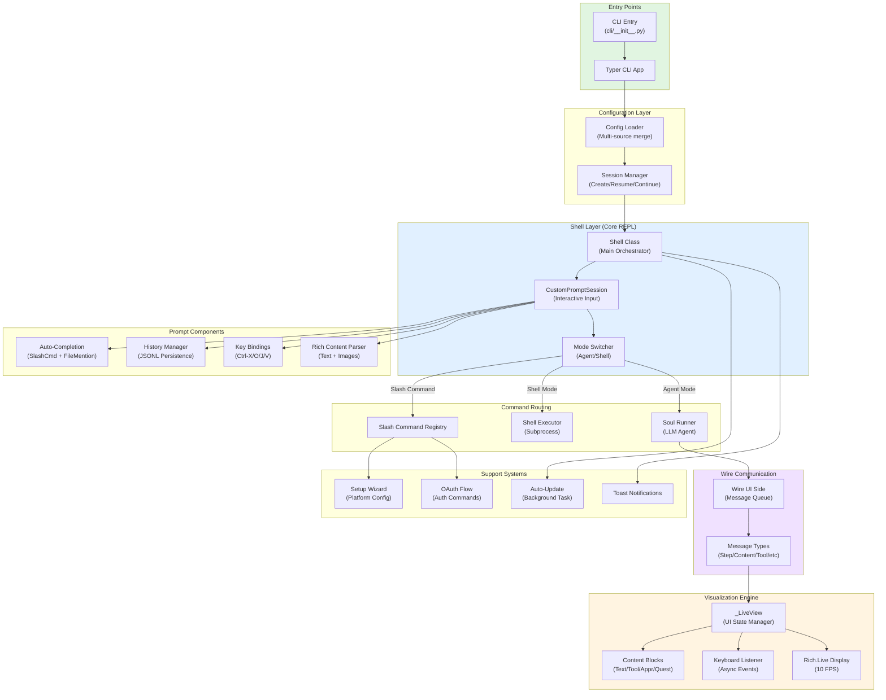
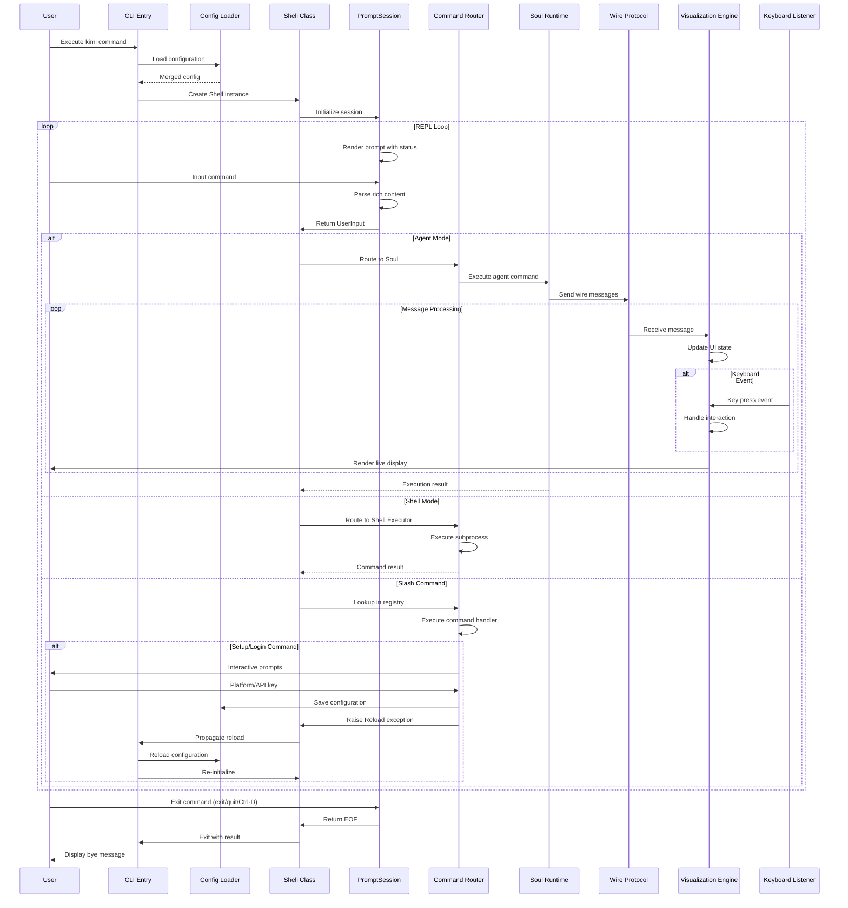
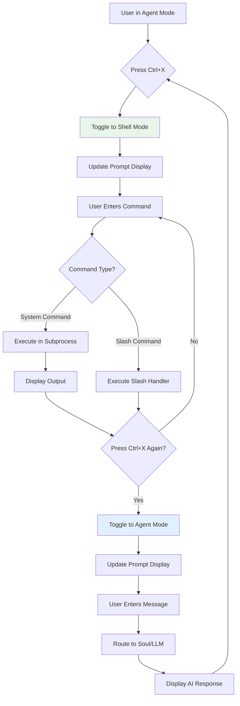
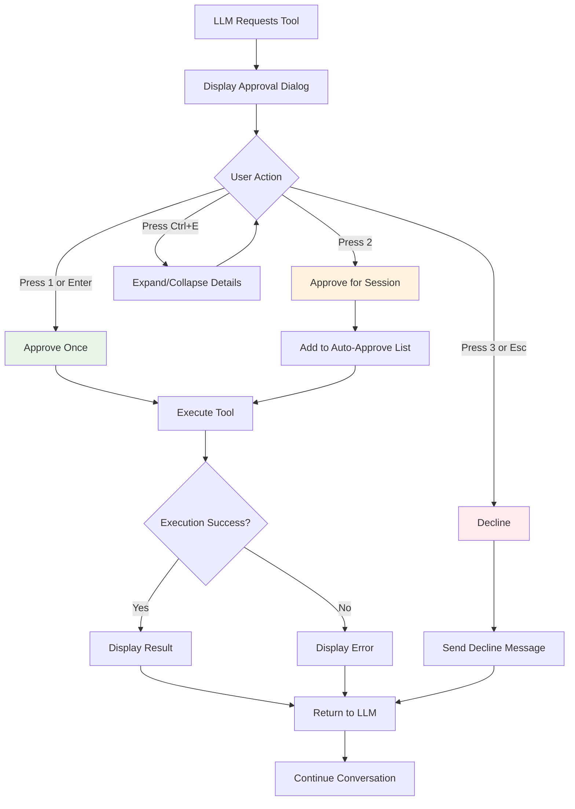

# CLI Interface Domain - Technical Documentation

## 1. Domain Overview

### 1.1 Purpose and Scope

The CLI Interface Domain provides a sophisticated terminal-based user interface for the Kimi CLI application, enabling developers to interact with AI assistants through a command-line environment. This domain implements a full-featured REPL (Read-Eval-Print Loop) with advanced capabilities including multi-mode operation, intelligent command processing, real-time visualization, and comprehensive session management.

**Core Capabilities:**
- Interactive REPL with agent and shell execution modes
- Rich terminal UI with real-time streaming visualization
- Intelligent auto-completion for commands and file mentions
- Slash command system for quick actions
- Interactive setup wizard for first-time configuration
- OAuth and API key authentication flows
- Session history management and replay
- Cross-platform keyboard event handling

### 1.2 Business Value

The CLI Interface Domain delivers significant value by:

1. **Lowering Entry Barriers**: Provides immediate access to AI capabilities without requiring web browser or complex setup
2. **Developer Productivity**: Terminal-native workflow integration allows developers to stay in their preferred environment
3. **Flexibility**: Dual-mode operation (agent/shell) enables seamless switching between AI assistance and direct command execution
4. **Accessibility**: Works in SSH sessions, remote servers, and environments where GUI is unavailable
5. **Efficiency**: Keyboard-driven interface with shortcuts and auto-completion accelerates common tasks

### 1.3 Architecture Position

```
┌─────────────────────────────────────────────────────────────┐
│                    User Interface Layer                      │
├──────────────────────────┬──────────────────────────────────┤
│   CLI Interface Domain   │    Web Interface Domain          │
│   (Terminal-based)       │    (Browser-based)               │
└──────────────┬───────────┴──────────────────┬───────────────┘
               │                               │
               └───────────┬───────────────────┘
                           │
               ┌───────────▼───────────────────┐
               │  Core Business Layer          │
               │  - Conversation Management    │
               │  - LLM Provider Integration   │
               │  - Agent System               │
               │  - Tool Execution             │
               └───────────────────────────────┘
```

The CLI Interface Domain operates as one of two primary user-facing interfaces, sharing the same core business logic with the Web Interface Domain while providing a terminal-optimized experience.

## 2. Technical Architecture

### 2.1 Layered Architecture

The domain follows a clean layered architecture with clear separation of concerns:

```
┌─────────────────────────────────────────────────────────────┐
│  Layer 1: Entry Points & CLI Framework                      │
│  - Typer-based CLI application                              │
│  - Command routing and argument processing                  │
│  - Configuration loading and merging                        │
└─────────────────────────┬───────────────────────────────────┘
                          │
┌─────────────────────────▼───────────────────────────────────┐
│  Layer 2: Shell & REPL Engine                               │
│  - Shell orchestrator class                                 │
│  - Mode switching (agent/shell)                             │
│  - Command dispatch and execution                           │
└─────────────────────────┬───────────────────────────────────┘
                          │
┌─────────────────────────▼───────────────────────────────────┐
│  Layer 3: Interactive Components                            │
│  - Prompt session with auto-completion                      │
│  - Visualization engine with live display                   │
│  - Slash command registry                                   │
│  - Setup wizard and authentication flows                    │
└─────────────────────────┬───────────────────────────────────┘
                          │
┌─────────────────────────▼───────────────────────────────────┐
│  Layer 4: Utilities & Support                               │
│  - Keyboard event handling                                  │
│  - Console output formatting                                │
│  - History management                                       │
│  - Print mode for batch processing                          │
└─────────────────────────────────────────────────────────────┘
```

### 2.2 Component Diagram



## 3. Core Components

### 3.1 CLI Entry Point (`src/kimi_cli/cli/__init__.py`)

The main entry point implements a comprehensive CLI application using the Typer framework.

**Key Responsibilities:**
- Command-line argument parsing and validation
- Multi-source configuration loading with precedence
- Session lifecycle management (create/resume/continue)
- UI mode dispatch (interactive shell vs print mode)
- Process initialization and signal handling

**Configuration Precedence:**
```
Default Config → Config File → Inline Config → CLI Arguments
(lowest priority)                            (highest priority)
```

**Main Entry Function:**
```python
@app.command()
def main(
    command: Optional[str] = None,
    session: Optional[str] = None,
    continue_session: bool = False,
    work_dir: Optional[Path] = None,
    model: Optional[str] = None,
    thinking: Optional[bool] = None,
    # ... additional parameters
):
    # 1. Load and merge configuration
    # 2. Initialize session
    # 3. Dispatch to appropriate UI mode
    # 4. Handle exceptions and cleanup
```

**Command Groups:**
- `web`: Launch web UI server
- `mcp`: Manage MCP (Model Context Protocol) servers
- `info`: Display system information
- `term`: Launch Toad terminal interface

### 3.2 Shell Orchestrator (`src/kimi_cli/ui/shell/__init__.py`)

The Shell class serves as the central orchestrator for the REPL experience.

**Core Architecture:**

```python
class Shell:
    def __init__(
        self,
        config: Config,
        session: Session,
        soul: Soul,
        prompt_session: CustomPromptSession,
    ):
        self.config = config
        self.session = session
        self.soul = soul
        self.prompt_session = prompt_session
        self._mode = Mode.AGENT  # or Mode.SHELL
```

**Key Methods:**

1. **Main REPL Loop:**
```python
async def run(self, command: str | None = None) -> bool:
    # Display welcome screen
    # Execute initial command if provided
    # Enter REPL loop
    while True:
        user_input = await self.prompt_session.prompt()
        if user_input is EOF:
            break
        # Route command based on mode and content
        await self._execute_command(user_input)
```

2. **Mode Switching:**
```python
def toggle_mode(self):
    if self._mode == Mode.AGENT:
        self._mode = Mode.SHELL
    else:
        self._mode = Mode.AGENT
    # Update prompt session mode
```

3. **Command Routing:**
```python
async def _execute_command(self, user_input: UserInput):
    if user_input.is_slash_command:
        await self._run_slash_command(user_input.slash_command)
    elif self._mode == Mode.AGENT:
        await self.run_soul_command(user_input.content)
    else:
        await self._run_shell_command(user_input.text)
```

**Mode System:**
- **AGENT Mode**: Routes input to LLM agent (Soul) for AI-powered assistance
- **SHELL Mode**: Executes commands directly in system shell
- **Toggle**: `Ctrl+X` switches between modes

### 3.3 Prompt Session (`src/kimi_cli/ui/shell/prompt.py`)

The CustomPromptSession provides an advanced interactive input system built on prompt_toolkit.

**Architecture:**

```python
class CustomPromptSession:
    def __init__(
        self,
        work_dir: Path,
        mode: Mode,
        history_file: Path,
        slash_commands: list[SlashCommand],
    ):
        self._session = PromptSession(
            completer=self._create_completer(),
            history=FileHistory(history_file),
            key_bindings=self._create_key_bindings(),
            bottom_toolbar=self._create_toolbar,
        )
```

**Key Features:**

1. **Auto-Completion System:**

```python
class SlashCommandCompleter(Completer):
    """Fuzzy matching for slash commands with aliases"""
    def get_completions(self, document, complete_event):
        # Match against command names and aliases
        # Return sorted by relevance
```

```python
class LocalFileMentionCompleter(Completer):
    """Workspace file indexing with intelligent filtering"""
    def __init__(self, work_dir: Path):
        self._file_index = self._build_index(work_dir)
    
    def _build_index(self, work_dir: Path):
        # Recursively scan workspace
        # Filter out VCS, caches, build artifacts
        # Build searchable index
```

2. **Rich Content Parsing:**

```python
def _parse_rich_content(self, text: str) -> list[ContentPart]:
    """Parse @mentions and [image:id,WxH] placeholders"""
    parts = []
    # Extract file mentions: @path/to/file
    # Extract image placeholders: [image:sha256,800x600]
    # Resolve to actual file paths
    return parts
```

3. **Key Bindings:**

| Key Combination | Action | Description |
|----------------|--------|-------------|
| `Ctrl+X` | Toggle Mode | Switch between agent and shell modes |
| `Ctrl+O` | External Editor | Open configured editor for multi-line input |
| `Ctrl+J` / `Alt+Enter` | New Line | Insert line break in multi-line input |
| `Ctrl+V` | Paste Image | Paste clipboard image as attachment |
| `Ctrl+D` | EOF | Exit REPL |

4. **Bottom Toolbar:**

```python
def _create_toolbar(self) -> str:
    """Real-time status display"""
    parts = [
        f"Mode: {self._mode.value}",
        f"Time: {datetime.now():%H:%M:%S}",
        f"Session: {self._session_id}",
    ]
    if self._toast_message:
        parts.append(f"📢 {self._toast_message}")
    return " | ".join(parts)
```

5. **History Management:**

```python
class WorkspaceAwareHistory(FileHistory):
    """Workspace-specific history isolation"""
    def __init__(self, work_dir: Path):
        # Use MD5 hash of work_dir for isolation
        history_file = self._get_history_file(work_dir)
        super().__init__(history_file)
```

### 3.4 Visualization Engine (`src/kimi_cli/ui/shell/visualize.py`)

The visualization engine provides real-time rendering of agent behavior and tool execution.

**Core Architecture:**

```python
async def visualize(
    wire: WireUISide,
    initial_status: StatusUpdate,
    cancel_event: asyncio.Event,
):
    """Main visualization loop"""
    view = _LiveView(initial_status)
    keyboard_listener = KeyboardListener()
    
    with Live(view.render(), refresh_per_second=10) as live:
        async for message in wire.receive():
            view.handle_message(message)
            live.update(view.render())
            
            # Handle keyboard events
            if keyboard_listener.has_event():
                event = keyboard_listener.get_event()
                view.handle_keyboard(event)
```

**UI State Management:**

```python
class _LiveView:
    def __init__(self, initial_status: StatusUpdate):
        self.status = initial_status
        self.content_blocks: list[_ContentBlock] = []
        self.tool_calls: dict[str, _ToolCallBlock] = {}
        self.approval_request: Optional[_ApprovalRequestPanel] = None
        self.question_request: Optional[_QuestionRequestPanel] = None
```

**Content Block Types:**

1. **Text Content Block:**
```python
class _ContentBlock:
    """Displays thinking/composing text"""
    def __init__(self, content_type: str):
        self.type = content_type  # "thinking" or "composing"
        self.text = ""
        self.expanded = True
    
    def render(self) -> Panel:
        # Render with appropriate styling
        # Support expand/collapse
```

2. **Tool Call Block:**
```python
class _ToolCallBlock:
    """Tracks tool execution with sub-agent support"""
    def __init__(self, tool_name: str, arguments: dict):
        self.tool_name = tool_name
        self.arguments = arguments
        self.status = "pending"  # pending/running/completed/failed
        self.result = None
        self.sub_agents: list[str] = []
```

3. **Approval Request Panel:**
```python
class _ApprovalRequestPanel:
    """Interactive approval dialog"""
    def __init__(self, tool_call: ToolCall):
        self.tool_call = tool_call
        self.expanded = False
        self.selected_option = 0  # 0=Approve, 1=Decline
    
    def render(self) -> Panel:
        # Display tool details
        # Show approval options
        # Handle keyboard navigation
```

4. **Question Request Panel:**
```python
class _QuestionRequestPanel:
    """Multi-question form with tabs"""
    def __init__(self, questions: list[Question]):
        self.questions = questions
        self.current_tab = 0
        self.answers: dict[str, Any] = {}
    
    def render(self) -> Panel:
        # Tab navigation
        # Multi-select support
        # "Other" option handling
```

**Keyboard Event Handling:**

```python
class KeyboardListener:
    """Cross-platform async keyboard monitoring"""
    def __init__(self):
        self._queue = asyncio.Queue()
        self._thread = threading.Thread(target=self._listen)
        self._thread.start()
    
    def _listen(self):
        """Platform-specific implementation"""
        if sys.platform == "win32":
            self._listen_windows()
        else:
            self._listen_unix()
```

**Supported Key Events:**
- Arrow keys (Up/Down/Left/Right)
- Enter, Escape, Tab, Space
- Ctrl+E (expand/collapse)
- Number keys 1-5 (quick selection)

### 3.5 Slash Command System (`src/kimi_cli/ui/shell/slash.py`)

The slash command system provides quick access to common operations.

**Registry Pattern:**

```python
class SlashCommandRegistry:
    def __init__(self):
        self._commands: dict[str, SlashCommand] = {}
    
    def command(
        self,
        name: str,
        aliases: list[str] = None,
        description: str = "",
    ):
        """Decorator for command registration"""
        def decorator(func):
            cmd = SlashCommand(
                name=name,
                aliases=aliases or [],
                description=description,
                handler=func,
            )
            self._commands[name] = cmd
            return func
        return decorator
```

**Available Commands:**

| Command | Aliases | Description |
|---------|---------|-------------|
| `/help` | `/h`, `/?` | Display keyboard shortcuts and commands |
| `/model` | `/m` | Interactive model switching |
| `/editor` | `/e` | Set external editor for Ctrl+O |
| `/sessions` | `/s` | List available sessions |
| `/resume` | `/r` | Resume a previous session |
| `/mcp` | - | Show MCP servers and tools |
| `/login` | - | Authenticate with LLM provider |
| `/logout` | - | Remove stored credentials |
| `/new` | `/n` | Start new session |
| `/clear` | `/c` | Clear conversation history |
| `/debug` | `/d` | Toggle debug mode |
| `/version` | `/v` | Show version information |
| `/changelog` | - | Display recent changes |
| `/feedback` | - | Submit feedback |
| `/web` | `/w` | Launch web UI |
| `/usage` | `/u` | Show token usage statistics |

**Command Implementation Example:**

```python
@registry.command("model", aliases=["m"], description="Switch model")
async def cmd_model(shell: Shell):
    """Interactive model selection"""
    # 1. Load available models
    models = await shell.config.get_available_models()
    
    # 2. Display selection dialog
    selected = await prompt_choice(
        "Select model:",
        choices=[m.name for m in models]
    )
    
    # 3. Check thinking mode capability
    model = models[selected]
    if model.supports_thinking:
        thinking = await prompt_yes_no("Enable thinking mode?")
    
    # 4. Update configuration
    shell.config.default_model = model.id
    shell.config.thinking = thinking
    await shell.config.save()
    
    # 5. Trigger reload
    raise Reload("Model changed")
```

### 3.6 Setup Wizard (`src/kimi_cli/ui/shell/setup.py`)

The setup wizard guides users through initial configuration.

**Workflow:**

```python
async def run_setup_wizard() -> bool:
    """Interactive setup flow"""
    # Step 1: Platform selection
    platform = await select_platform()
    if not platform:
        return False
    
    # Step 2: Platform-specific configuration
    success = await setup_platform(platform)
    if not success:
        return False
    
    # Step 3: Model discovery and selection
    models = await discover_models(platform)
    default_model = await select_default_model(models)
    
    # Step 4: Save configuration
    await save_config({
        "platform": platform,
        "default_model": default_model,
    })
    
    return True
```

**Platform Selection:**

```python
async def select_platform() -> Platform | None:
    """Display platform options"""
    platforms = [
        Platform("kimi", "Kimi (Moonshot AI)"),
        Platform("openai", "OpenAI"),
        Platform("anthropic", "Anthropic Claude"),
        Platform("google", "Google Gemini"),
    ]
    
    choice = await _prompt_choice(
        "Select your LLM platform:",
        choices=[p.display_name for p in platforms]
    )
    
    return platforms[choice] if choice is not None else None
```

**Authentication Flow:**

```python
async def setup_platform(platform: Platform) -> bool:
    """Platform-specific authentication"""
    if platform.supports_oauth:
        # OAuth flow
        return await oauth_login(platform)
    else:
        # API key input
        api_key = await _prompt_text(
            f"Enter {platform.name} API key:",
            is_password=True
        )
        return await validate_and_save_api_key(platform, api_key)
```

### 3.7 Print Mode (`src/kimi_cli/ui/print/`)

Print mode provides non-interactive batch processing capabilities.

**Printer Strategies:**

```python
class Printer(ABC):
    """Base printer interface"""
    @abstractmethod
    async def handle_message(self, message: WireMessage):
        pass
    
    @abstractmethod
    async def finalize(self):
        pass
```

**Available Printers:**

1. **TextPrinter**: Streams text output in real-time
2. **JsonPrinter**: Outputs structured JSON for each message
3. **FinalOnlyTextPrinter**: Only displays final response
4. **FinalOnlyJsonPrinter**: Only outputs final JSON result

**Usage:**

```python
async def run_print_mode(
    command: str,
    printer_type: str = "text",
    final_only: bool = False,
):
    """Execute command in print mode"""
    # Select printer
    printer = create_printer(printer_type, final_only)
    
    # Execute command
    wire = await execute_soul_command(command)
    
    # Process messages
    async for message in wire.receive():
        await printer.handle_message(message)
    
    # Finalize output
    await printer.finalize()
```

## 4. Key Workflows

### 4.1 Interactive Chat Session Flow



### 4.2 Mode Switching Flow



### 4.3 Tool Approval Workflow



## 5. Data Models

### 5.1 User Input Model

```python
class UserInput:
    """Parsed user input from prompt"""
    text: str                           # Raw input text
    content: list[ContentPart]          # Parsed content parts
    attachments: list[Attachment]       # File attachments
    is_slash_command: bool              # Whether input is slash command
    slash_command: Optional[SlashCommandCall]  # Parsed slash command
    
class ContentPart:
    """Content part (text or file)"""
    type: Literal["text", "file", "image"]
    content: str | Path | bytes
    metadata: dict[str, Any]

class Attachment:
    """File attachment"""
    path: Path
    sha256: str                         # Content hash for deduplication
    mime_type: str
    size: int
```

### 5.2 Wire Message Types

```python
class WireMessage:
    """Base wire protocol message"""
    type: str
    timestamp: datetime

class StepBegin(WireMessage):
    """Agent step begins"""
    step_id: str
    step_type: str

class ContentPart(WireMessage):
    """Content chunk"""
    content_type: Literal["thinking", "composing", "text"]
    text: str
    is_final: bool

class ToolCall(WireMessage):
    """Tool execution request"""
    call_id: str
    tool_name: str
    arguments: dict[str, Any]

class ToolResult(WireMessage):
    """Tool execution result"""
    call_id: str
    success: bool
    result: Any
    error: Optional[str]

class ApprovalRequest(WireMessage):
    """User approval needed"""
    request_id: str
    tool_call: ToolCall
    options: list[str]

class QuestionRequest(WireMessage):
    """User input needed"""
    request_id: str
    questions: list[Question]
```

### 5.3 Configuration Model

```python
class Config:
    """CLI configuration"""
    # LLM settings
    default_model: str
    thinking: bool
    
    # Provider configurations
    providers: dict[str, ProviderConfig]
    
    # Session settings
    work_dir: Path
    session_id: Optional[str]
    
    # UI settings
    editor: Optional[str]
    history_size: int
    
    # Feature flags
    auto_update: bool
    debug_mode: bool
```

## 6. Integration Points

### 6.1 Core Business Layer Integration

**Soul (Agent) Integration:**
```python
# Execute agent command
result = await soul.run(
    user_input=user_input.content,
    wire=wire_ui_side,
)
```

**Session Management:**
```python
# Create or resume session
session = await session_manager.get_or_create(
    session_id=config.session_id,
    work_dir=config.work_dir,
)
```

**Configuration Management:**
```python
# Load configuration with precedence
config = Config.load(
    config_file=config_path,
    cli_overrides=cli_args,
)
```

### 6.2 External System Integration

**OAuth Authentication:**
```python
# Initiate OAuth flow
auth_url = await oauth_client.get_authorization_url(platform)
# Open browser
webbrowser.open(auth_url)
# Wait for callback
credentials = await oauth_client.wait_for_callback()
```

**MCP Server Integration:**
```python
# List MCP tools
mcp_tools = await mcp_client.list_tools()
# Display in slash command
display_mcp_tools(mcp_tools)
```

## 7. Error Handling

### 7.1 Exception Hierarchy

```python
class CLIException(Exception):
    """Base CLI exception"""
    pass

class Reload(CLIException):
    """Trigger configuration reload"""
    reason: str

class SwitchToWeb(CLIException):
    """Switch to web UI"""
    pass

class SetupRequired(CLIException):
    """Setup wizard needed"""
    pass
```

### 7.2 Error Recovery Strategies

**Configuration Errors:**
```python
try:
    config = Config.load(config_path)
except ConfigError as e:
    console.print(f"[red]Configuration error: {e}[/red]")
    if prompt_yes_no("Run setup wizard?"):
        await run_setup_wizard()
    else:
        sys.exit(1)
```

**Network Errors:**
```python
try:
    response = await llm_provider.chat(messages)
except NetworkError as e:
    console.print(