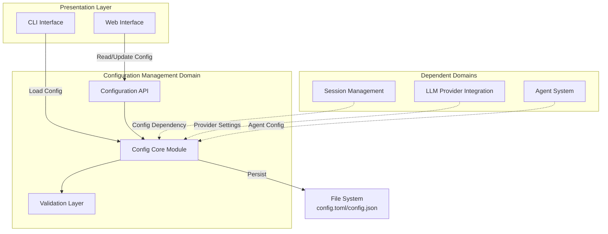
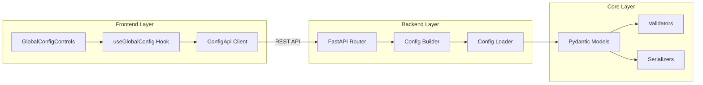
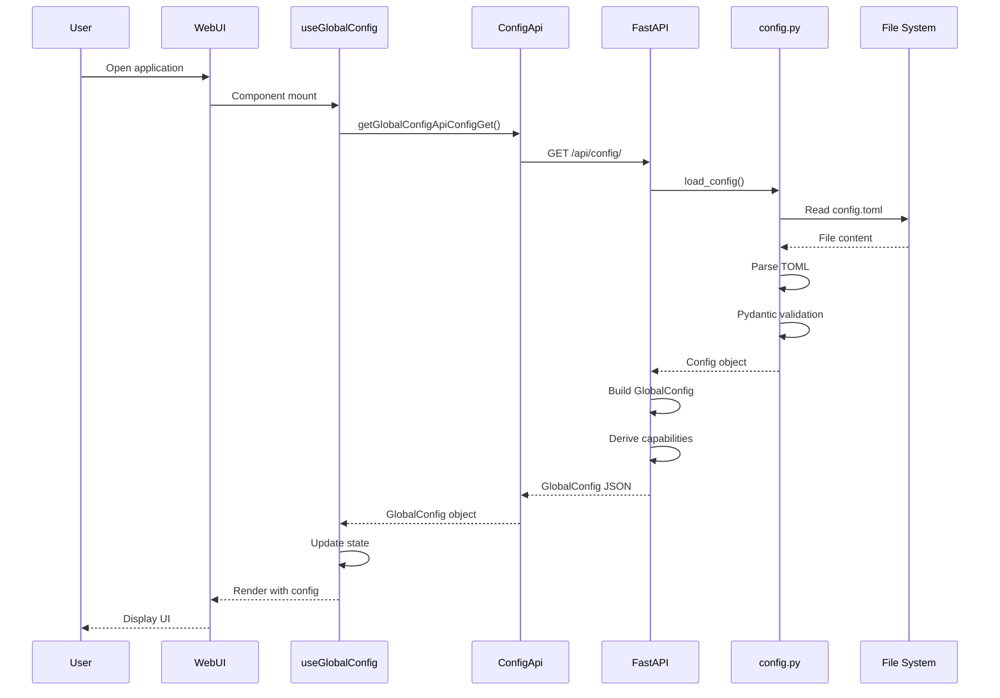
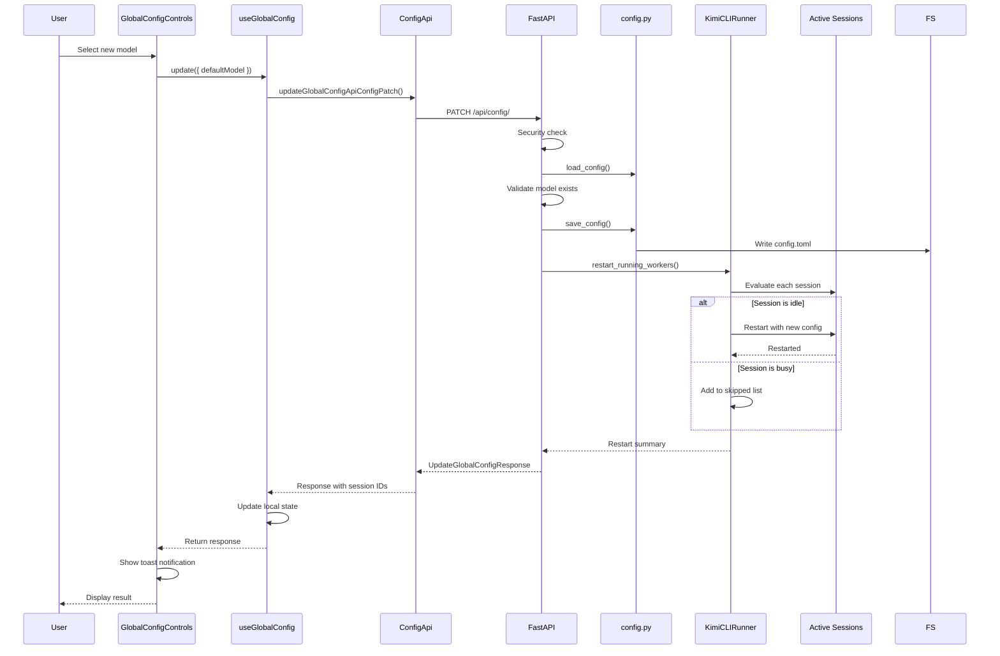
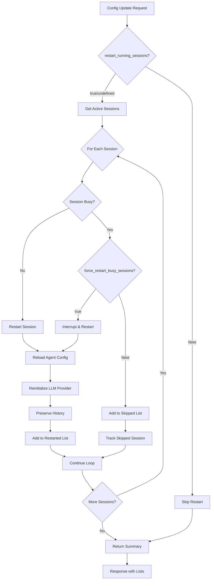

# Configuration Management Domain - Technical Documentation

## 1. Domain Overview

### 1.1 Purpose and Scope

The Configuration Management Domain serves as the centralized system for managing all application settings, LLM provider configurations, model selections, and user preferences in Kimi CLI. It provides a robust, type-safe configuration layer that supports multiple file formats (TOML/JSON), secure credential storage, and real-time configuration updates with session coordination.

**Core Responsibilities:**
- Global application settings management (default model, thinking mode)
- LLM provider configuration (API keys, endpoints, OAuth credentials)
- Model capability discovery and validation
- Configuration persistence with format migration support
- RESTful API for configuration access and updates
- Session restart coordination on configuration changes

### 1.2 Architecture Position



**Domain Metrics:**
- **Importance:** 9/10 - Critical for system initialization and runtime behavior
- **Complexity:** 7/10 - Moderate complexity with validation and migration logic
- **Stability:** High - Configuration schema is well-defined and stable

---

## 2. Technical Architecture

### 2.1 Component Structure

The Configuration Management Domain consists of three primary layers:



### 2.2 Data Models

#### 2.2.1 Core Configuration Models (Python/Pydantic)

**Config** - Main configuration container
```python
class Config(BaseModel):
    default_model: str              # Default LLM model key
    default_thinking: bool          # Default thinking mode
    default_yolo: bool             # Auto-approve mode
    default_editor: str            # External editor command
    models: dict[str, LLMModel]    # Available models
    providers: dict[str, LLMProvider]  # Provider configurations
    loop_control: LoopControl      # Agent execution limits
    services: Services             # External services config
    mcp: MCPConfig                 # MCP client config
```

**LLMProvider** - Provider-specific settings
```python
class LLMProvider(BaseModel):
    type: ProviderType             # kimi | openai | anthropic | google_genai
    base_url: str                  # API endpoint
    api_key: SecretStr             # Encrypted API key
    env: dict[str, str] | None     # Environment variables
    custom_headers: dict[str, str] | None  # Custom HTTP headers
    oauth: OAuthRef | None         # OAuth credential reference
```

**LLMModel** - Model configuration
```python
class LLMModel(BaseModel):
    provider: str                  # Provider reference
    model: str                     # Model identifier
    max_context_size: int          # Token limit
    capabilities: set[ModelCapability] | None  # Model features
```

**ModelCapability** - Feature flags
```python
class ModelCapability(str, Enum):
    CHAT = "chat"
    VISION = "vision"
    TOOLS = "tools"
    THINKING = "thinking"
    ALWAYS_THINKING = "always_thinking"
```

#### 2.2.2 API Models (TypeScript)

**GlobalConfig** - Frontend configuration snapshot
```typescript
interface GlobalConfig {
  defaultModel: string;           // Current default model
  defaultThinking: boolean;       // Current thinking mode
  models: ConfigModel[];          // Available models with metadata
}

interface ConfigModel extends LLMModel {
  name: string;                   // Model key
  providerType: ProviderType;     // Provider type for UI display
}
```

**UpdateGlobalConfigRequest** - Configuration update payload
```typescript
interface UpdateGlobalConfigRequest {
  defaultModel?: string;          // New default model
  defaultThinking?: boolean;      // New thinking mode
  restartRunningSessions?: boolean;  // Restart active sessions
  forceRestartBusySessions?: boolean;  // Force restart busy sessions
}
```

**UpdateGlobalConfigResponse** - Update result
```typescript
interface UpdateGlobalConfigResponse {
  config: GlobalConfig;           // Updated configuration
  restartedSessionIds?: string[]; // Successfully restarted sessions
  skippedBusySessionIds?: string[];  // Busy sessions that were skipped
}
```

---

## 3. Core Implementation

### 3.1 Backend Configuration System

#### 3.1.1 Configuration Loading (`src/kimi_cli/config.py`)

**Format Detection and Loading:**
```python
def load_config(config_file: Path | None = None) -> Config:
    """Load configuration with automatic format detection."""
    if config_file is None:
        config_file = get_config_file()
    
    if not config_file.exists():
        # Create default config on first run
        config = get_default_config()
        save_config(config, config_file)
        return config
    
    # Detect format by extension
    content = config_file.read_text(encoding="utf-8")
    if config_file.suffix == ".toml":
        return _load_toml_config(content, config_file)
    else:
        return _load_json_config(content, config_file)
```

**TOML Parsing with tomlkit:**
```python
def _load_toml_config(content: str, source_file: Path) -> Config:
    """Parse TOML configuration with validation."""
    try:
        data = tomlkit.parse(content)
        config = Config.model_validate(data)
        config.source_file = source_file
        config.is_from_default_location = (source_file == get_config_file())
        return config
    except TOMLKitError as e:
        raise ConfigError(f"Invalid TOML syntax: {e}")
    except ValidationError as e:
        raise ConfigError(f"Configuration validation failed: {e}")
```

**Secret Management:**
```python
class LLMProvider(BaseModel):
    api_key: SecretStr  # Pydantic SecretStr for automatic masking
    
    @field_serializer("api_key", when_used="json")
    def dump_secret(self, v: SecretStr):
        """Serialize secret for JSON output."""
        return v.get_secret_value()
```

#### 3.1.2 Configuration Validation

**Cross-Reference Validation:**
```python
class Config(BaseModel):
    @model_validator(mode="after")
    def validate_model(self) -> Self:
        # Ensure default_model exists
        if self.default_model and self.default_model not in self.models:
            raise ValueError(
                f"Default model {self.default_model} not found in models"
            )
        
        # Ensure all model providers exist
        for model in self.models.values():
            if model.provider not in self.providers:
                raise ValueError(
                    f"Provider {model.provider} not found in providers"
                )
        
        return self
```

**Provider Type Validation:**
```python
class ProviderType(str, Enum):
    KIMI = "kimi"
    OPENAI = "openai"
    ANTHROPIC = "anthropic"
    GOOGLE_GENAI = "google_genai"
    OPENAI_COMPATIBLE = "openai_compatible"
```

#### 3.1.3 Configuration Persistence

**Format-Aware Serialization:**
```python
def save_config(config: Config, config_file: Path | None = None) -> None:
    """Save configuration with format preservation."""
    if config_file is None:
        config_file = config.source_file or get_config_file()
    
    # Serialize to dict
    data = config.model_dump(mode="json", exclude={"source_file", "is_from_default_location"})
    
    # Write based on format
    if config_file.suffix == ".toml":
        content = tomlkit.dumps(data)
    else:
        content = json.dumps(data, indent=2)
    
    config_file.write_text(content, encoding="utf-8")
```

**Migration Support:**
```python
def migrate_json_to_toml() -> bool:
    """One-time migration from legacy JSON to TOML."""
    json_file = get_share_dir() / "config.json"
    toml_file = get_config_file()
    
    if json_file.exists() and not toml_file.exists():
        # Load JSON config
        config = load_config(json_file)
        
        # Backup original
        backup = json_file.with_suffix(".json.backup")
        json_file.rename(backup)
        
        # Save as TOML
        save_config(config, toml_file)
        return True
    
    return False
```

### 3.2 Backend API Layer

#### 3.2.1 Configuration Endpoints (`src/kimi_cli/web/api/config.py`)

**GET /api/config/ - Retrieve Global Configuration:**
```python
@router.get("/", summary="Get global (kimi-cli) config snapshot")
async def get_global_config() -> GlobalConfig:
    """Build frontend-ready configuration snapshot."""
    return _build_global_config()

def _build_global_config() -> GlobalConfig:
    """Transform backend config to frontend format."""
    config = load_config()
    
    models: list[ConfigModel] = []
    for model_name, model in config.models.items():
        provider = config.providers.get(model.provider)
        if provider is None:
            continue
        
        # Derive model capabilities
        capabilities = derive_model_capabilities(model)
        
        models.append(
            ConfigModel(
                name=model_name,
                model=model.model,
                provider=model.provider,
                provider_type=provider.type,
                max_context_size=model.max_context_size,
                capabilities=capabilities,
            )
        )
    
    return GlobalConfig(
        default_model=config.default_model,
        default_thinking=config.default_thinking,
        models=models,
    )
```

**PATCH /api/config/ - Update Global Configuration:**
```python
@router.patch("/", summary="Update global (kimi-cli) default model/thinking")
async def update_global_config(
    request: UpdateGlobalConfigRequest,
    http_request: Request,
    runner: KimiCLIRunner = Depends(_get_runner),
) -> UpdateGlobalConfigResponse:
    """Update configuration with session restart coordination."""
    
    # Security check
    _ensure_sensitive_apis_allowed(http_request)
    
    # Load and validate
    config = load_config()
    
    if request.default_model is not None:
        if request.default_model not in config.models:
            raise HTTPException(
                status_code=status.HTTP_400_BAD_REQUEST,
                detail=f"Model '{request.default_model}' not found in config",
            )
        config.default_model = request.default_model
    
    if request.default_thinking is not None:
        config.default_thinking = request.default_thinking
    
    # Persist changes
    save_config(config)
    
    # Coordinate session restarts
    restarted: list[str] = []
    skipped_busy: list[str] = []
    
    if request.restart_running_sessions is not False:
        summary = await runner.restart_running_workers(
            reason="config_update",
            force=request.force_restart_busy_sessions or False,
        )
        restarted = [str(sid) for sid in summary.restarted_session_ids]
        skipped_busy = [str(sid) for sid in summary.skipped_busy_session_ids]
    
    return UpdateGlobalConfigResponse(
        config=_build_global_config(),
        restarted_session_ids=restarted if restarted else None,
        skipped_busy_session_ids=skipped_busy if skipped_busy else None,
    )
```

**Security Middleware:**
```python
def _ensure_sensitive_apis_allowed(request: Request) -> None:
    """Block configuration writes in restricted mode."""
    if getattr(request.app.state, "restrict_sensitive_apis", False):
        raise HTTPException(
            status_code=status.HTTP_403_FORBIDDEN,
            detail="Sensitive config APIs are disabled in this mode.",
        )
```

### 3.3 Frontend State Management

#### 3.3.1 React Hook (`web/src/hooks/useGlobalConfig.ts`)

**State Management:**
```typescript
export function useGlobalConfig(): UseGlobalConfigReturn {
  const [config, setConfig] = useState<GlobalConfig | null>(null);
  const [isLoading, setIsLoading] = useState(false);
  const [isUpdating, setIsUpdating] = useState(false);
  const [error, setError] = useState<string | null>(null);
  
  const isInitializedRef = useRef(false);
  
  // Load configuration on mount
  useEffect(() => {
    if (isInitializedRef.current) return;
    isInitializedRef.current = true;
    refresh();
  }, [refresh]);
  
  return { config, isLoading, isUpdating, error, refresh, update };
}
```

**Configuration Refresh:**
```typescript
const refresh = useCallback(async () => {
  setIsLoading(true);
  setError(null);
  try {
    const nextConfig = await apiClient.config.getGlobalConfigApiConfigGet();
    setConfig(nextConfig);
  } catch (err) {
    const message = err instanceof Error 
      ? err.message 
      : "Failed to load global config";
    setError(message);
    console.error("[useGlobalConfig] Failed to load:", err);
  } finally {
    setIsLoading(false);
  }
}, []);
```

**Configuration Update:**
```typescript
const update = useCallback(
  async (args: UpdateGlobalConfigArgs): Promise<UpdateGlobalConfigResponse> => {
    setIsUpdating(true);
    setError(null);
    try {
      const body: UpdateGlobalConfigRequest = {
        defaultModel: args.defaultModel ?? undefined,
        defaultThinking: args.defaultThinking ?? undefined,
        restartRunningSessions: args.restartRunningSessions ?? undefined,
        forceRestartBusySessions: args.forceRestartBusySessions ?? undefined,
      };
      
      const resp = await apiClient.config.updateGlobalConfigApiConfigPatch({
        updateGlobalConfigRequest: body,
      });
      
      setConfig(resp.config);
      return resp;
    } catch (err) {
      const message = err instanceof Error 
        ? err.message 
        : "Failed to update global config";
      setError(message);
      throw err;
    } finally {
      setIsUpdating(false);
    }
  },
  []
);
```

#### 3.3.2 UI Components (`web/src/features/chat/global-config-controls.tsx`)

**Model Selection Component:**
```typescript
export function GlobalConfigControls({ className }: GlobalConfigControlsProps) {
  const { config, isLoading, isUpdating, error, refresh, update } = useGlobalConfig();
  const [lastBusySkip, setLastBusySkip] = useState<string[] | null>(null);
  
  const handleSelectModel = useCallback(async (modelKey: string) => {
    if (!config || modelKey === config.defaultModel) return;
    
    try {
      const resp = await update({ defaultModel: modelKey });
      const restarted = resp.restartedSessionIds ?? [];
      const skippedBusy = resp.skippedBusySessionIds ?? [];
      
      if (restarted.length > 0) {
        toast.success("Global model updated", {
          description: `Restarted ${restarted.length} running session(s).`,
        });
      }
      
      if (skippedBusy.length > 0) {
        setLastBusySkip(skippedBusy);
        toast.message("Some sessions were skipped (busy)", {
          description: `Skipped ${skippedBusy.length} busy session(s).`,
        });
      }
    } catch (err) {
      toast.error("Failed to update global model");
    }
  }, [config, update]);
  
  return (
    <ModelSelector value={config?.defaultModel} onValueChange={handleSelectModel}>
      <ModelSelectorTrigger disabled={isLoading || isUpdating}>
        <Cpu className="h-4 w-4" />
        <ModelSelectorName />
      </ModelSelectorTrigger>
      <ModelSelectorContent>
        <ModelSelectorInput placeholder="Search models..." />
        <ModelSelectorList>
          {config?.models.map((model) => (
            <ModelSelectorItem key={model.name} value={model.name}>
              {model.name}
            </ModelSelectorItem>
          ))}
        </ModelSelectorList>
      </ModelSelectorContent>
    </ModelSelector>
  );
}
```

**Thinking Mode Toggle:**
```typescript
function getThinkingState(model: ConfigModel | null): ThinkingState {
  const capabilities = model?.capabilities;
  if (!capabilities) return "disabled";
  
  if (capabilities.has(ModelCapability.AlwaysThinking)) {
    return "forced";  // Model always uses thinking
  }
  if (capabilities.has(ModelCapability.Thinking)) {
    return "enabled";  // User can toggle
  }
  return "disabled";  // Model doesn't support thinking
}

const handleThinkingToggle = useCallback(async (checked: boolean) => {
  try {
    await update({ defaultThinking: checked });
  } catch (err) {
    toast.error("Failed to update global thinking");
  }
}, [update]);

// Render toggle with state-based behavior
<Switch
  checked={thinkingState === "forced" ? true : thinkingChecked}
  disabled={thinkingState !== "enabled"}
  onCheckedChange={handleThinkingToggle}
/>
```

---

## 4. Key Workflows

### 4.1 Configuration Load Flow



### 4.2 Configuration Update Flow



### 4.3 Session Restart Coordination



---

## 5. Integration Points

### 5.1 Session Management Integration

**Configuration Dependency:**
```python
# Session initialization uses global config
def create_session(work_dir: Path) -> Session:
    config = load_config()
    
    session = Session(
        id=generate_session_id(),
        work_dir=work_dir,
        default_model=config.default_model,
        default_thinking=config.default_thinking,
    )
    
    return session
```

**Session Restart on Config Change:**
```python
async def restart_running_workers(
    self,
    reason: str,
    force: bool = False,
) -> RestartSummary:
    """Restart active sessions with new configuration."""
    restarted = []
    skipped_busy = []
    
    for session_id, worker in self.workers.items():
        if worker.is_busy() and not force:
            skipped_busy.append(session_id)
            continue
        
        # Stop current worker
        await worker.stop()
        
        # Reload configuration
        config = load_config()
        
        # Start new worker with updated config
        new_worker = await self.start_worker(session_id, config)
        restarted.append(session_id)
    
    return RestartSummary(
        restarted_session_ids=restarted,
        skipped_busy_session_ids=skipped_busy,
    )
```

### 5.2 LLM Provider Integration

**Provider Initialization:**
```python
def create_provider(provider_name: str) -> ChatProvider:
    """Create LLM provider from configuration."""
    config = load_config()
    provider_config = config.providers.get(provider_name)
    
    if provider_config is None:
        raise ValueError(f"Provider {provider_name} not found")
    
    # Initialize provider with config
    if provider_config.type == ProviderType.KIMI:
        return KimiProvider(
            base_url=provider_config.base_url,
            api_key=provider_config.api_key.get_secret_value(),
            custom_headers=provider_config.custom_headers,
        )
    elif provider_config.type == ProviderType.OPENAI:
        return OpenAIProvider(
            base_url=provider_config.base_url,
            api_key=provider_config.api_key.get_secret_value(),
        )
    # ... other providers
```

### 5.3 CLI Integration

**Setup Wizard:**
```python
def run_setup_wizard():
    """Interactive configuration wizard for first-time setup."""
    print("Welcome to Kimi CLI Setup")
    
    # Platform selection
    platform = prompt_platform_selection()
    
    # API key input
    if platform.requires_api_key:
        api_key = prompt_api_key()
    else:
        api_key = perform_oauth_flow(platform)
    
    # Model discovery
    models = discover_available_models(platform, api_key)
    
    # Default model selection
    default_model = prompt_model_selection(models)
    
    # Build and save configuration
    config = Config(
        default_model=default_model,
        providers={
            platform.name: LLMProvider(
                type=platform.type,
                base_url=platform.base_url,
                api_key=SecretStr(api_key),
            )
        },
        models={
            model.name: LLMModel(
                provider=platform.name,
                model=model.id,
                max_context_size=model.context_size,
            )
            for model in models
        },
    )
    
    save_config(config)
    print("Configuration saved successfully!")
```

---

## 6. Security Considerations

### 6.1 Credential Protection

**SecretStr Usage:**
```python
class LLMProvider(BaseModel):
    api_key: SecretStr  # Automatically masked in logs and repr
    
    @field_serializer("api_key", when_used="json")
    def dump_secret(self, v: SecretStr):
        """Only serialize when explicitly converting to JSON."""
        return v.get_secret_value()
```

**OAuth Credential Storage:**
```python
class OAuthRef(BaseModel):
    """Reference to externally stored OAuth credentials."""
    storage: Literal["keyring", "file"] = "file"
    key: str  # Storage key, not the actual token
```

### 6.2 API Access Control

**Sensitive API Protection:**
```python
def _ensure_sensitive_apis_allowed(request: Request) -> None:
    """Block configuration writes in restricted mode."""
    if getattr(request.app.state, "restrict_sensitive_apis", False):
        raise HTTPException(
            status_code=status.HTTP_403_FORBIDDEN,
            detail="Sensitive config APIs are disabled in this mode.",
        )
```

**Path Validation:**
```python
def validate_config_path(path: Path) -> None:
    """Ensure configuration file is in allowed location."""
    allowed_dirs = [get_share_dir(), Path.cwd()]
    
    if not any(path.is_relative_to(d) for d in allowed_dirs):
        raise ValueError(f"Configuration path {path} is not allowed")
```

### 6.3 Validation and Sanitization

**Input Validation:**
```python
class UpdateGlobalConfigRequest(BaseModel):
    default_model: str | None = Field(
        default=None,
        min_length=1,
        max_length=100,
        pattern=r"^[a-zA-Z0-9_-]+$",
    )
```

**Cross-Reference Validation:**
```python
@model_validator(mode="after")
def validate_model(self) -> Self:
    # Ensure default_model exists in models dict
    if self.default_model and self.default_model not in self.models:
        raise ValueError(f"Default model {self.default_model} not found")
    
    # Ensure all model providers exist
    for model in self.models.values():
        if model.provider not in self.providers:
            raise ValueError(f"Provider {model.provider} not found")
    
    return self
```

---

## 7. Error Handling

### 7.1 Configuration Loading Errors

**Parse Errors:**
```python
def load_config(config_file: Path) -> Config:
    try:
        content = config_file.read_text(encoding="utf-8")
        data = tomlkit.parse(content)
        return Config.model_validate(data)
    except TOMLKitError as e:
        raise ConfigError(f"Invalid TOML syntax in {config_file}: {e}")
    except ValidationError as e:
        raise ConfigError(f"Configuration validation failed: {e}")
    except FileNotFoundError:
        raise ConfigError(f"Configuration file not found: {config_file}")
```

**Frontend Error Handling:**
```typescript
const refresh = useCallback(async () => {
  setIsLoading(true);
  setError(null);
  try {
    const nextConfig = await apiClient.config.getGlobalConfigApiConfigGet();
    setConfig(nextConfig);
  } catch (err) {
    const message = err instanceof Error 
      ? err.message 
      : "Failed to load global config";
    setError(message);
    console.error("[useGlobalConfig] Failed to load:", err);
  } finally {
    setIsLoading(false);
  }
}, []);
```

### 7.2 Update Errors

**Validation Errors:**
```python
@router.patch("/")
async def update_global_config(request: UpdateGlobalConfigRequest) -> UpdateGlobalConfigResponse:
    config = load_config()
    
    if request.default_model is not None:
        if request.default_model not in config.models:
            raise HTTPException(
                status_code=status.HTTP_400_BAD_REQUEST,
                detail=f"Model '{request.default_model}' not found in config",
            )
```

**User Feedback:**
```typescript
const handleSelectModel = useCallback(async (modelKey: string) => {
  try {
    const resp = await update({ defaultModel: modelKey });
    toast.success("Global model updated");
  } catch (err) {
    const message = err instanceof Error ? err.message : "Failed to update";
    toast.error("Failed to update global model", { description: message });
  }
}, [update]);
```

---

## 8. Performance Considerations

### 8.1 Configuration Caching

**In-Memory Cache:**
```python
_config_cache: Config | None = None
_config_cache_mtime: float | None = None

def load_config(config_file: Path | None = None) -> Config:
    """Load configuration with file modification time caching."""
    global _config_cache, _config_cache_mtime
    
    if config_file is None:
        config_file = get_config_file()
    
    current_mtime = config_file.stat().st_mtime
    
    if _config_cache is not None and _config_cache_mtime == current_mtime:
        return _config_cache
    
    config = _load_config_from_file(config_file)
    _config_cache = config
    _config_cache_mtime = current_mtime
    
    return config
```

### 8.2 Lazy Loading

**Model Capability Derivation:**
```python
def derive_model_capabilities(