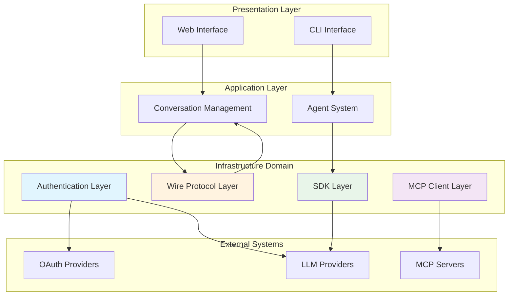
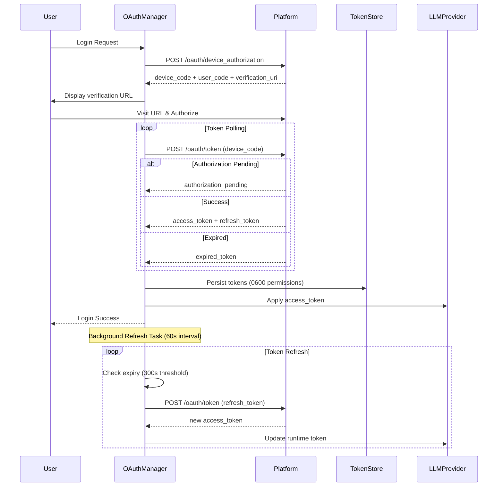
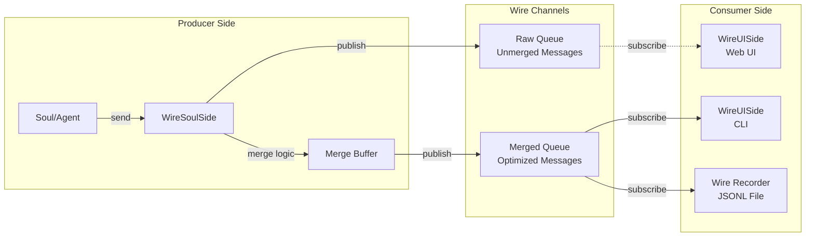
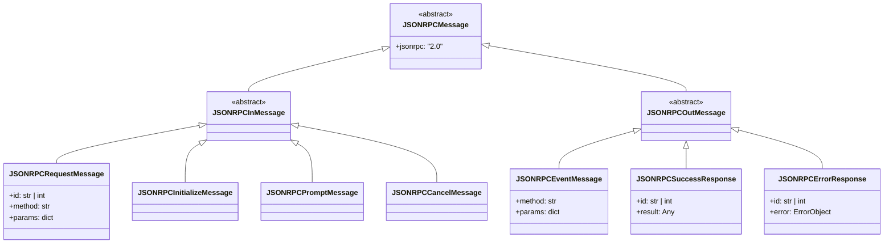
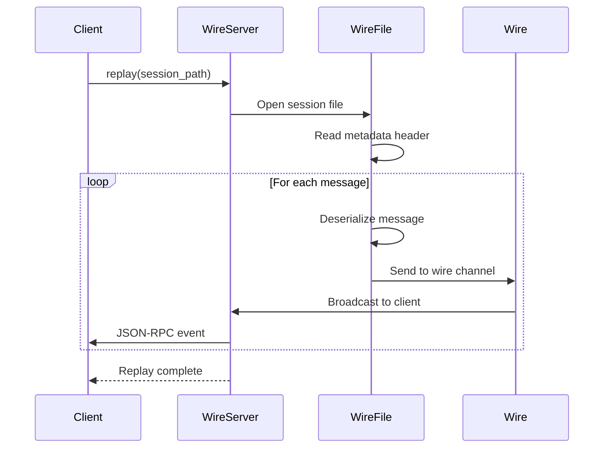
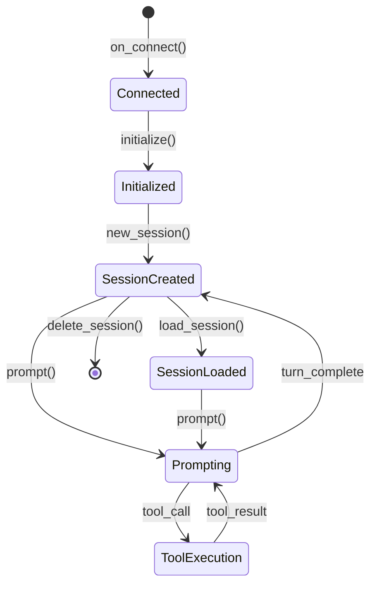
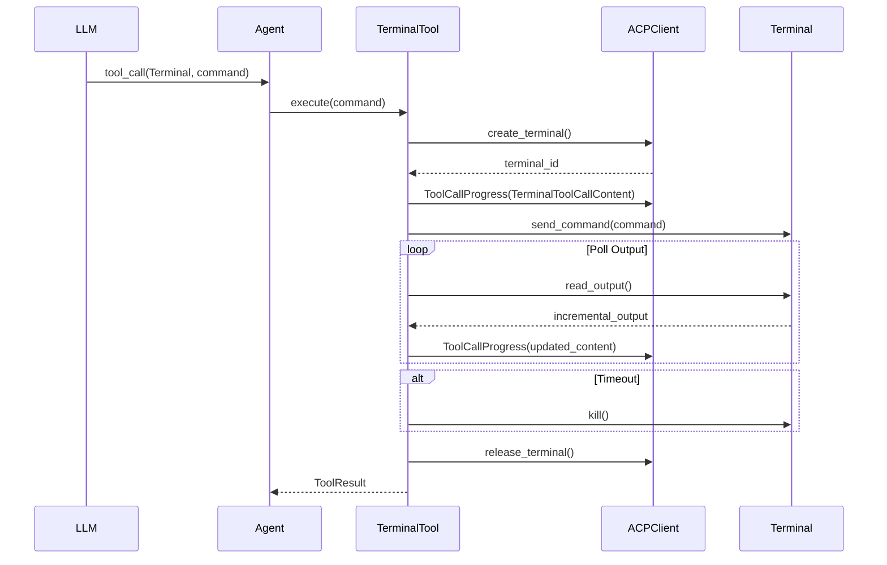
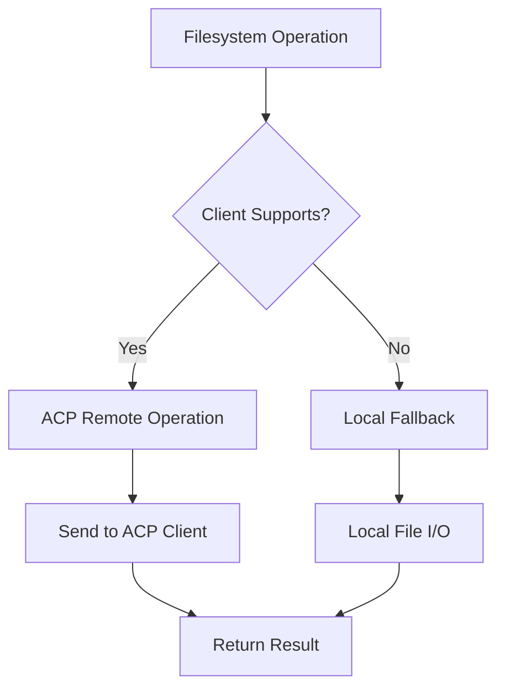
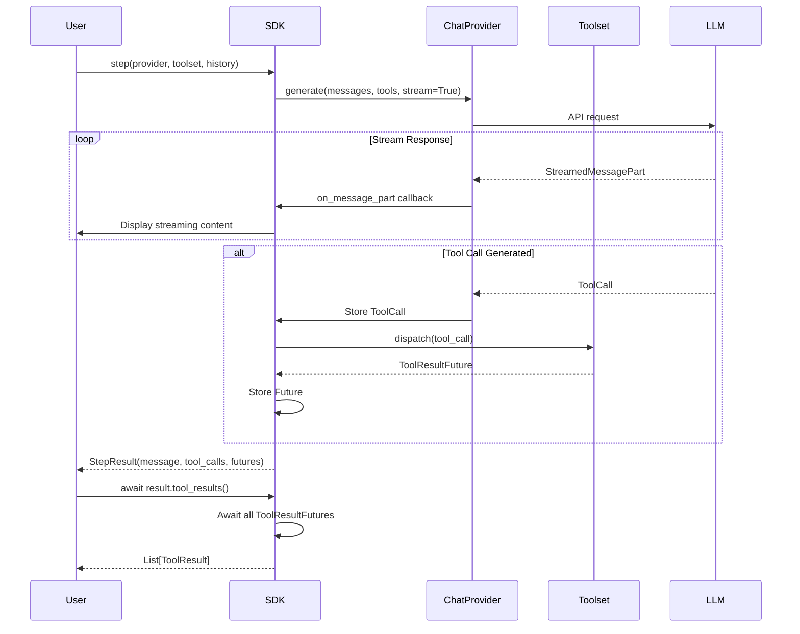

# Infrastructure Domain - Technical Documentation

## Document Information

| Item | Content |
|------|---------|
| **Domain Name** | Infrastructure Domain |
| **Document Version** | v1.0 |
| **Generation Date** | 2026-03-01 11:48:29 CST |
| **Complexity Score** | 7/10 |
| **Importance Score** | 8/10 |

---

## 1. Domain Overview

### 1.1 Purpose and Scope

The Infrastructure Domain serves as the foundational cross-cutting layer of Kimi CLI, providing four critical capabilities that enable secure, extensible, and vendor-agnostic AI agent operations:

1. **Authentication Layer** - OAuth 2.0 Device Authorization Grant flow and API key management with automatic token refresh
2. **Wire Protocol Layer** - JSON-RPC 2.0 based bidirectional communication protocol for agent turn lifecycle management and event persistence
3. **MCP Client Layer** - Model Context Protocol integration for external tool discovery and execution
4. **SDK Layer** - Public facade providing agent loop abstraction with vendor-agnostic chat provider interfaces

This domain abstracts away the complexity of multi-provider authentication, protocol-level communication, external tool integration, and programmatic access, allowing higher-level business domains to focus on core AI assistant functionality.

### 1.2 Business Value

The Infrastructure Domain delivers strategic value through:

- **Vendor Independence**: Unified authentication and provider abstraction enables seamless switching between LLM providers (Kimi, OpenAI, Anthropic, Google GenAI) without business logic changes
- **Security & Compliance**: OAuth-based credential management with automatic token refresh eliminates hardcoded API keys and reduces security risks
- **Extensibility**: MCP protocol support allows integration with external tool ecosystems without modifying core codebase
- **Developer Experience**: SDK facade simplifies programmatic access for developers building custom agents and integrations
- **Auditability**: Wire protocol event sourcing provides complete conversation history replay and debugging capabilities

### 1.3 Domain Position in System Architecture



The Infrastructure Domain sits between the application layer and external systems, providing:
- **Upward Services**: Authentication, protocol handling, tool integration, and SDK interfaces to business domains
- **Downward Integration**: Secure communication with OAuth providers, LLM APIs, and MCP tool servers
- **Horizontal Coordination**: Shared utilities and abstractions used across multiple domains

---

## 2. Sub-Module Architecture

### 2.1 Authentication Layer

**Purpose**: Manages secure authentication for LLM providers using OAuth 2.0 Device Authorization Grant flow with automatic token refresh and credential persistence.

**Key Components**:
- `src/kimi_cli/auth/oauth.py` - OAuth flow implementation
- `src/kimi_cli/auth/platforms.py` - Platform registry and model discovery
- `src/kimi_cli/auth/__init__.py` - Platform ID constants

#### 2.1.1 OAuth Manager Implementation

The OAuth Manager implements the Device Authorization Grant flow as specified in RFC 8628:

```python
# OAuth Flow Sequence
class OAuthManager:
    """
    Manages OAuth 2.0 Device Authorization Grant flow with:
    - Device code request and user verification
    - Token polling with exponential backoff
    - Automatic token refresh (60s interval, 300s threshold)
    - Secure credential persistence (0600 permissions)
    - Migration from legacy keyring storage
    """
```

**Authentication Flow**:



**Key Features**:

1. **Device Authorization Grant**:
   - Device code obtained via `POST /api/oauth/device_authorization`
   - User visits verification URL with user code
   - Client polls `/api/oauth/token` until success or expiration
   - Supports custom OAuth hosts via `KIMI_CODE_OAUTH_HOST` environment variable

2. **Token Persistence**:
   - Tokens stored in `~/.local/share/kimi-code/credentials/oauth/kimi-code.json`
   - File permissions set to 0600 (owner read/write only)
   - Supports migration from legacy keyring storage
   - JSON format with `access_token`, `refresh_token`, `expires_at`, `scope`, `token_type`

3. **Automatic Token Refresh**:
   - Background task runs every 60 seconds
   - Refreshes tokens when expiry < 300 seconds
   - Applies refreshed tokens to runtime chat provider via injection
   - Handles refresh failures with error logging

4. **Platform Model Sync**:
   - Fetches available models via `/models` endpoint
   - Derives capabilities (thinking, image_in, video_in) from API flags
   - Model ID heuristics for capability detection
   - Updates configuration with discovered models

**Security Considerations**:
- Device ID generated once and persisted for device identification
- Tokens never logged or exposed in error messages
- File permissions enforced on credential storage
- OAuth state validation to prevent CSRF attacks

#### 2.1.2 Platform Registry

The Platform Registry manages multiple authentication platforms:

```python
# Supported Platforms
KIMI_CODE_PLATFORM_ID = "kimi-code"  # Primary platform
# Additional platforms: moonshot-cn, moonshot-ai

# Platform Configuration
@dataclass
class Platform:
    id: str
    name: str
    base_url: str
    client_id: str
    oauth_host: str
```

**Platform Features**:
- Dynamic platform discovery
- Model capability derivation
- Provider-specific configuration
- OAuth credential mapping

---

### 2.2 Wire Protocol Layer

**Purpose**: Implements JSON-RPC 2.0 based bidirectional communication protocol for real-time agent turn lifecycle management, event streaming, and session replay.

**Key Components**:
- `src/kimi_cli/wire/server.py` - JSON-RPC server over stdio
- `src/kimi_cli/wire/__init__.py` - Wire channel with broadcast queue
- `src/kimi_cli/wire/types.py` - Message type definitions
- `src/kimi_cli/wire/jsonrpc.py` - JSON-RPC protocol handler
- `src/kimi_cli/wire/file.py` - Session recording backend
- `src/kimi_cli/wire/serde.py` - Serialization utilities

#### 2.2.1 Wire Channel Architecture

The Wire class provides a single-producer, multiple-consumer (SPMC) broadcast channel:

```python
class Wire:
    """
    SPMC channel for communication between soul (agent) and UI.
    
    Features:
    - Raw queue: Unmerged messages for debugging
    - Merged queue: Optimized messages with merge logic
    - File backend: Optional JSONL recording
    - Message merging: Reduces overhead for streaming content
    """
    
    def __init__(self, *, file_backend: WireFile | None = None):
        self._raw_queue = BroadcastQueue[WireMessage]()
        self._merged_queue = BroadcastQueue[WireMessage]()
        self._soul_side = WireSoulSide(self._raw_queue, self._merged_queue)
        self._recorder = _WireRecorder(file_backend, self._merged_queue.subscribe())
```

**Message Flow Architecture**:



**Message Merging Optimization**:

The Wire implements intelligent message merging for `MergeableMixin` types (ContentPart, ToolCallPart):

```python
class WireSoulSide:
    def send(self, msg: WireMessage) -> None:
        # Send to raw queue (no merging)
        self._raw_queue.publish_nowait(msg)
        
        # Merge logic for optimized queue
        match msg:
            case MergeableMixin():
                if self._merge_buffer is None:
                    self._merge_buffer = copy.deepcopy(msg)
                elif self._merge_buffer.merge_in_place(msg):
                    pass  # Merged successfully
                else:
                    self.flush()  # Cannot merge, flush buffer
                    self._merge_buffer = copy.deepcopy(msg)
            case _:
                self.flush()  # Non-mergeable, flush and send
                self._send_merged(msg)
```

**Benefits of Merging**:
- Reduces message overhead for streaming text content
- Combines incremental tool call updates
- Maintains message ordering guarantees
- Improves UI rendering performance

#### 2.2.2 JSON-RPC Server Implementation

The WireServer implements full JSON-RPC 2.0 specification over stdio:

```python
class WireServer:
    """
    JSON-RPC 2.0 server over stdio with:
    - 100MB buffer limit for large payloads
    - Typed message classes with polymorphic deserialization
    - Concurrent message processing with asyncio
    - Error codes following JSON-RPC spec
    """
```

**Supported JSON-RPC Methods**:

| Method | Purpose | Request Parameters | Response |
|--------|---------|-------------------|----------|
| `initialize` | Protocol negotiation | `protocol_version`, `capabilities`, `external_tools` | Available tools, slash commands, protocol version |
| `prompt` | Start agent turn | `user_input`, `attachments` | Turn status (FINISHED/CANCELLED/MAX_STEPS_REACHED) |
| `replay` | Replay recorded session | `session_path` | Replayed events stream |
| `steer` | Inject user input mid-turn | `user_input` | Acknowledgment |
| `cancel` | Abort running turn | None | Cancellation status |
| `event` | Server-to-client event | Event-specific params | N/A (notification) |

**Message Type Hierarchy**:



**Error Code Specification**:

```python
class ErrorCodes:
    # JSON-RPC standard errors
    PARSE_ERROR = -32700          # Invalid JSON
    INVALID_REQUEST = -32600      # Invalid request object
    METHOD_NOT_FOUND = -32601     # Method does not exist
    INVALID_PARAMS = -32602       # Invalid method parameters
    INTERNAL_ERROR = -32603       # Internal JSON-RPC error
    
    # Domain-specific errors
    LLM_NOT_SET = 1               # LLM provider not configured
    LLM_NOT_SUPPORTED = 2         # LLM provider not supported
    SOUL_RUNNING = 3              # Agent already running
```

**Status Constants**:

```python
class Statuses:
    FINISHED = "finished"                    # Turn completed successfully
    CANCELLED = "cancelled"                  # User cancelled turn
    MAX_STEPS_REACHED = "max_steps_reached"  # Hit step limit
    STEERED = "steered"                      # User injected input
```

#### 2.2.3 File Backend for Session Recording

The WireFile class implements JSONL-based session recording:

```python
class WireFile:
    """
    JSONL file backend for wire protocol events.
    
    Format:
    - First line: Metadata header with protocol version
    - Subsequent lines: JSON-serialized WireMessage objects
    
    Features:
    - Async file I/O for non-blocking writes
    - Atomic append operations
    - Protocol version tracking
    - Message deserialization for replay
    """
```

**File Format**:

```jsonl
{"protocol_version": "v1.3", "created_at": "2026-03-01T11:48:29Z"}
{"method": "turn_begin", "params": {"turn_id": "turn-001"}}
{"method": "message", "params": {"role": "user", "content": "Hello"}}
{"method": "message", "params": {"role": "assistant", "content": "Hi there!"}}
{"method": "turn_end", "params": {"turn_id": "turn-001", "status": "finished"}}
```

**Replay Mechanism**:



---

### 2.3 MCP Client Layer

**Purpose**: Integrates Model Context Protocol (MCP) for external tool discovery and execution, supporting HTTP/SSE/Stdio transports with capability negotiation.

**Key Components**:
- `src/kimi_cli/acp/server.py` - ACP server managing sessions
- `src/kimi_cli/acp/session.py` - Session state machine
- `src/kimi_cli/acp/tools.py` - Tool replacement mechanism
- `src/kimi_cli/acp/mcp.py` - MCP server configuration conversion
- `src/kimi_cli/acp/kaos.py` - Filesystem bridge (KAOS abstraction)

#### 2.3.1 ACP Server Architecture

The ACPServer manages multiple concurrent sessions with MCP integration:

```python
class ACPServer:
    """
    Agent Communication Protocol server with:
    - Multi-session management (in-memory state dictionary)
    - MCP server configuration conversion
    - Tool replacement mechanism for capability-based injection
    - Client capability negotiation
    """
    
    def __init__(self):
        self.client_capabilities: ClientCapabilities | None = None
        self.conn: Client | None = None
        self.sessions: dict[str, tuple[ACPSession, ModelIDConv]] = {}
```

**Session Lifecycle**:



**Initialization Flow**:

```python
async def initialize(
    self,
    protocol_version: int,
    client_capabilities: ClientCapabilities | None = None,
    client_info: Implementation | None = None,
) -> InitializeResponse:
    """
    Protocol negotiation with client.
    
    Returns:
    - Agent capabilities (load_session, prompt, MCP support)
    - Auth methods (terminal-auth for OAuth login)
    - Agent info (name, version)
    """
    return InitializeResponse(
        protocol_version=protocol_version,
        agent_capabilities=AgentCapabilities(
            load_session=True,
            prompt_capabilities=PromptCapabilities(
                embedded_context=False,
                image=True,
                audio=False
            ),
            mcp_capabilities=McpCapabilities(http=True, sse=False),
            session_capabilities=SessionListCapabilities()
        ),
        auth_methods=[
            AuthMethod(
                id="login",
                name="Login with Kimi account",
                field_meta={"terminal-auth": {...}}
            )
        ]
    )
```

#### 2.3.2 Tool Replacement Mechanism

The tool replacement mechanism injects Terminal tool when client capabilities indicate terminal support:

```python
def replace_tools(
    client_capabilities: ClientCapabilities,
    conn: Client,
    session_id: str,
    toolset: KimiToolset,
    runtime: Runtime
) -> None:
    """
    Replace Shell tool with Terminal tool when client supports terminal.
    
    Process:
    1. Check client_capabilities.terminal
    2. Remove Shell tool from toolset
    3. Inject Terminal tool with same name/description
    4. Terminal execution via ACP terminal API
    """
```

**Terminal Tool Execution Flow**:



**Benefits**:
- Seamless replacement without LLM awareness
- Same tool name/description for consistent behavior
- Incremental output streaming
- Timeout and kill support
- Automatic terminal cleanup

#### 2.3.3 MCP Configuration Conversion

The MCP module converts ACP server configurations to FastMCP format:

```python
def acp_mcp_servers_to_mcp_config(
    mcp_servers: list[MCPServer]
) -> MCPConfig:
    """
    Convert ACP MCP server configs to FastMCP MCPConfig.
    
    Supports:
    - HTTP transport: base_url, headers
    - SSE transport: base_url, headers
    - Stdio transport: command, args, env
    
    Pattern matching on transport type for conversion.
    """
```

**Transport Type Mapping**:

| ACP Transport | FastMCP Config | Parameters |
|--------------|----------------|------------|
| HTTP | `MCPHTTPConfig` | `base_url`, `headers` |
| SSE | `MCPSSEConfig` | `base_url`, `headers` |
| Stdio | `MCPStdioConfig` | `command`, `args`, `env` |

#### 2.3.4 KAOS Filesystem Abstraction

The ACPKaos class provides filesystem operations with capability-gated routing:

```python
class ACPKaos:
    """
    Filesystem abstraction with routing:
    - ACP remote operations when client supports filesystem
    - Local fallback for unsupported operations
    
    Operations:
    - read_file: Read file content
    - write_file: Write file with validation
    - execute: Run commands (if terminal supported)
    """
```

**Capability-Gated Routing**:



---

### 2.4 SDK Layer

**Purpose**: Provides public facade for programmatic access to Kimi CLI capabilities with agent loop abstraction and vendor-agnostic interfaces.

**Key Components**:
- `sdks/kimi-sdk/src/kimi_sdk/__init__.py` - Public SDK facade
- `packages/kosong/src/kosong/__init__.py` - Core agent loop implementation

#### 2.4.1 SDK Facade Architecture

The Kimi SDK is a thin facade re-exporting kosong components:

```python
# SDK Public API
from kosong import (
    generate,      # LLM generation with streaming
    step,          # Agent loop with tool dispatch
    GenerateResult,
    StepResult
)

from kosong.chat_provider import (
    ChatProviderError,
    StreamedMessagePart,
    TokenUsage
)

from kosong.chat_provider.kimi import (
    Kimi,          # Kimi provider implementation
    KimiFiles      # File upload support
)

from kosong.message import (
    Message,       # Message data structure
    ContentPart,   # Content part types
    ToolCall       # Tool call representation
)

from kosong.tooling import (
    Tool,          # Tool abstraction
    CallableTool,  # Single function tool
    CallableTool2, # Typed params tool
    Toolset,       # Tool collection
    ToolResult     # Tool execution result
)
```

#### 2.4.2 Core step() Function

The `step()` function orchestrates the agent loop:

```python
async def step(
    chat_provider: ChatProvider,
    system_prompt: str,
    toolset: Toolset,
    history: list[Message],
    *,
    on_message_part: Callable[[StreamedMessagePart], None] | None = None
) -> StepResult:
    """
    Execute one agent turn with tool dispatch.
    
    Process:
    1. Generate LLM response with streaming callbacks
    2. Handle tool calls asynchronously via toolset.dispatch()
    3. Manage ToolResultFuture for each tool call
    4. Return StepResult with message, usage, tool_calls, futures
    
    Features:
    - Context variables for thread-safe state
    - Frozen dataclass preventing mutation
    - Pydantic models with model_dump(mode='json')
    """
```

**Agent Loop Flow**:



**StepResult Data Structure**:

```python
@dataclass(frozen=True)
class StepResult:
    """
    Result of one agent turn.
    
    Attributes:
    - message: Assistant message with content and tool calls
    - usage: Token usage statistics
    - tool_calls: List of tool calls made
    - _tool_result_futures: Internal futures for async tool execution
    
    Methods:
    - tool_results(): Await all tool execution futures
    - extract_text(): Extract text content from message
    """
    message: Message
    usage: TokenUsage | None
    tool_calls: list[ToolCall]
    _tool_result_futures: list[ToolResultFuture]
    
    async def tool_results(self) -> list[ToolResult]:
        """Await all tool result futures and return results."""
        return await asyncio.gather(*self._tool_result_futures)
```

#### 2.4.3 Tool Abstractions

The SDK provides two tool abstraction patterns:

**CallableTool (Simple Function)**:

```python
class CallableTool(Tool):
    """
    Tool wrapping a single callable function.
    
    Features:
    - Automatic JSON Schema generation from function signature
    - Async and sync function support
    - Type hints for parameter validation
    """
    
    def __init__(
        self,
        name: str,
        description: str,
        func: Callable,
        parameters_schema: dict | None = None
    ):
        self.func = func
        self.schema = parameters_schema or generate_schema(func)
```

**CallableTool2 (Typed Parameters)**:

```python
class CallableTool2(Tool):
    """
    Tool with Pydantic BaseModel for typed parameters.
    
    Features:
    - Strong type validation via Pydantic
    - Automatic schema generation from model
    - IDE autocomplete support
    """
    
    def __init__(
        self,
        name: str,
        description: str,
        func: Callable[[ParamsModel], Any],
        params_model: Type[BaseModel]
    ):
        self.func = func
        self.params_model = params_model
        self.schema = params_model.model_json_schema()
```

**Example Usage**:

```python
# Simple function tool
async def search_web(query: str) -> str:
    """Search the web for information."""
    return await perform_search(query)

search_tool = CallableTool(
    name="search_web",
    description="Search the web",
    func=search_web
)

# Typed parameters tool
class FileReadParams(BaseModel):
    path: str = Field(description="File path to read")
    encoding: str = Field(default="utf-8")

async def read_file(params: FileReadParams) -> str:
    return Path(params.path).read_text(encoding=params.encoding)

read_tool = CallableTool2(
    name="read_file",
    description="Read file content",
    func=read_file,
    params_model=FileReadParams
)
```

---

## 3. Key Technical Implementations

### 3.1 OAuth Token Refresh Mechanism

**Implementation Details**:

```python
class OAuthManager:
    def __init__(self):
        self._access_token: str | None = None
        self._refresh_task: asyncio.Task | None = None
    
    async def start_refresh_loop(self):
        """
        Background task for automatic token refresh.
        
        Algorithm:
        1. Sleep for REFRESH_INTERVAL_SECONDS (60s)
        2. Check if token expires within REFRESH_THRESHOLD_SECONDS (300s)
        3. If yes, refresh token via POST /oauth/token
        4. Apply new token to runtime chat provider
        5. Persist updated token to file
        6. Repeat
        """
        while True:
            await asyncio.sleep(REFRESH_INTERVAL_SECONDS)
            
            if self._should_refresh():
                try:
                    new_token = await self._refresh_token()
                    await self._apply_token_to_provider(new_token)
                    await self._persist_token(new_token)
                except OAuthError as e:
                    logger.error(f"Token refresh failed: {e}")
```

**Runtime Token Injection**:

```python
async def _apply_token_to_provider(self, token: OAuthToken):
    """
    Apply refreshed token to runtime chat provider.
    
    Process:
    1. Get current Kimi chat provider instance
    2. Update provider's access token
    3. No need to restart session or reconnect
    """
    if isinstance(runtime.chat_provider, KimiProvider):
        runtime.chat_provider.access_token = token.access_token
```

### 3.2 Wire Message Merging Algorithm

**Merge Logic**:

```python
class MergeableMixin:
    """
    Mixin for messages that can be merged in-place.
    
    Implemented by:
    - ContentPart (text streaming)
    - ToolCallPart (incremental tool call updates)
    """
    
    def merge_in_place(self, other: MergeableMixin) -> bool:
        """
        Attempt to merge other