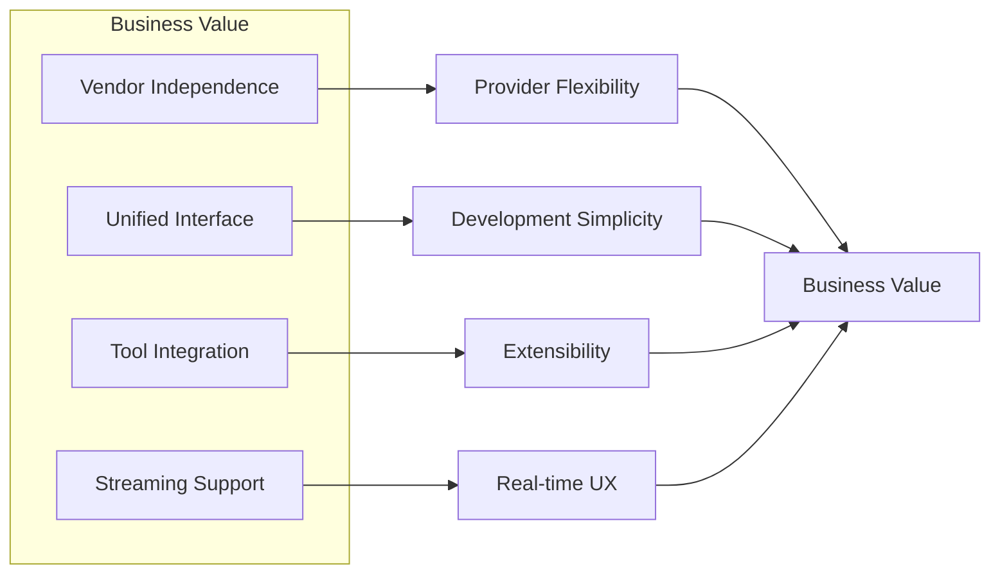
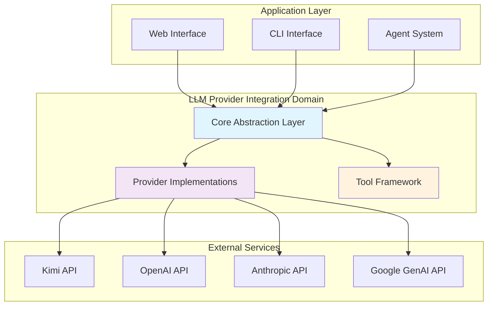
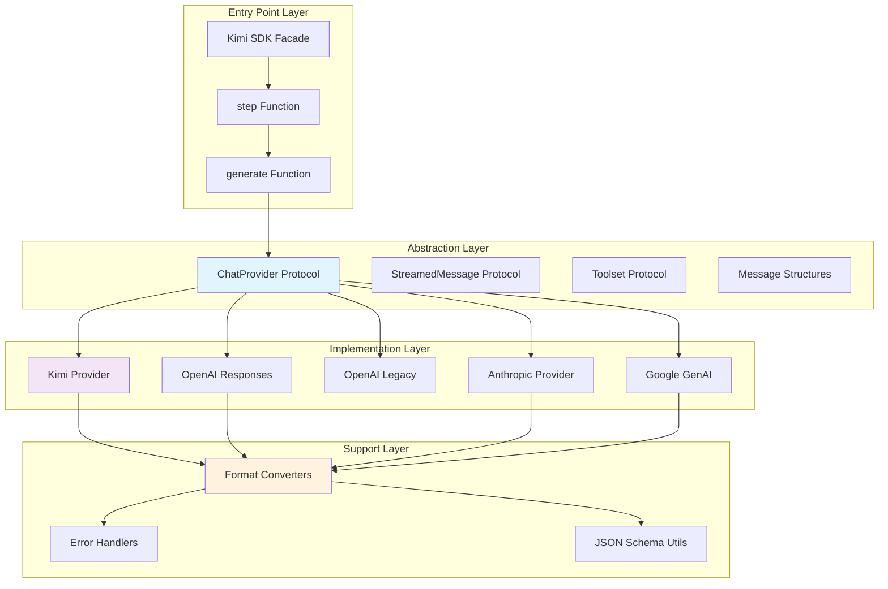
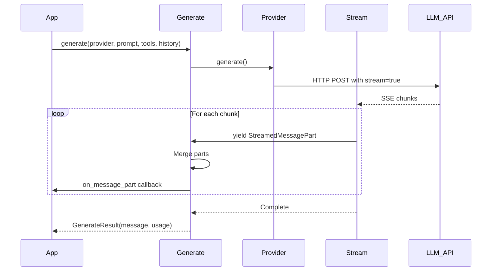

# LLM Provider Integration Domain - Technical Documentation

## Document Information

| Item | Content |
|------|---------|
| **Domain Name** | LLM Provider Integration Domain |
| **Document Version** | v1.0 |
| **Generation Date** | 2026-03-01 |
| **Importance Score** | 10/10 |
| **Complexity Score** | 9/10 |
| **Confidence Score** | 9.2/10 |

---

## 1. Executive Summary

### 1.1 Domain Overview

The LLM Provider Integration Domain serves as the **strategic abstraction layer** that enables Kimi CLI to communicate with multiple Large Language Model providers through a unified interface. This domain implements a sophisticated provider-agnostic architecture that allows seamless switching between Kimi (Moonshot AI), OpenAI, Anthropic Claude, and Google Gemini without requiring changes to upstream application code.

**Core Value Proposition:**



**Key Capabilities:**
- **Multi-Provider Abstraction**: Single interface for 4+ LLM providers with automatic format conversion
- **Streaming Architecture**: Async iterator-based streaming for real-time response rendering
- **Tool Orchestration**: Complete framework for defining, validating, and executing LLM-callable tools
- **Message Polymorphism**: Flexible content handling supporting text, thinking, images, audio, video, and tool calls
- **Error Resilience**: Standardized exception hierarchy with retry mechanisms and connection recovery

### 1.2 Architecture Position



---

## 2. Domain Architecture

### 2.1 Architectural Layers

The domain implements a **three-tier architecture** with clear separation of concerns:



### 2.2 Design Patterns

| Pattern | Implementation | Purpose |
|---------|---------------|---------|
| **Protocol-Based Abstraction** | `ChatProvider`, `StreamedMessage`, `Toolset` protocols | Enable duck typing and provider interchangeability |
| **Adapter Pattern** | Provider-specific implementations wrap native SDKs | Convert between internal and provider-specific formats |
| **Strategy Pattern** | Pluggable provider selection at runtime | Allow dynamic provider switching |
| **Registry Pattern** | `ContentPart` and `DisplayBlock` subclass registration | Enable polymorphic validation and extensibility |
| **Async Iterator Pattern** | `StreamedMessage.__aiter__()` | Support real-time streaming responses |
| **Future Pattern** | `ToolResultFuture` for async tool execution | Decouple tool invocation from result collection |
| **Builder Pattern** | `with_thinking()`, `with_generation_kwargs()` | Immutable configuration chaining |

---

## 3. Core Components

### 3.1 Provider Abstraction Layer

#### 3.1.1 ChatProvider Protocol

**Location**: `packages/kosong/src/kosong/chat_provider/__init__.py`

The `ChatProvider` protocol defines the contract that all LLM providers must implement:

```python
@runtime_checkable
class ChatProvider(Protocol):
    """The interface of chat providers."""
    
    name: str
    """The name of the chat provider."""
    
    @property
    def model_name(self) -> str:
        """The name of the model to use."""
        ...
    
    @property
    def thinking_effort(self) -> "ThinkingEffort | None":
        """The current thinking effort level. Returns None if not explicitly set."""
        ...
    
    async def generate(
        self,
        system_prompt: str,
        tools: Sequence[Tool],
        history: Sequence[Message],
    ) -> "StreamedMessage":
        """Generate a new message based on the given system prompt, tools, and history."""
        ...
    
    def with_thinking(self, effort: "ThinkingEffort") -> Self:
        """Return a copy of self configured with the given thinking effort."""
        ...
```

**Key Design Decisions:**

1. **Protocol vs Abstract Base Class**: Uses `Protocol` for structural subtyping, allowing any class with matching methods to be used as a provider without explicit inheritance
2. **Immutable Configuration**: `with_thinking()` returns a new instance rather than modifying in place
3. **Async-First**: All I/O operations are async to support concurrent requests and streaming

**Thinking Effort Levels**:

```python
type ThinkingEffort = Literal["off", "low", "medium", "high"]
```

- `off`: Disable reasoning/thinking mode
- `low`: Minimal reasoning (≤1024 tokens budget for Anthropic)
- `medium`: Moderate reasoning (≤4096 tokens budget)
- `high`: Maximum reasoning (adaptive or >4096 tokens)

#### 3.1.2 StreamedMessage Protocol

**Location**: `packages/kosong/src/kosong/chat_provider/__init__.py`

Defines the interface for streaming LLM responses:

```python
type StreamedMessagePart = ContentPart | ToolCall | ToolCallPart

@runtime_checkable
class StreamedMessage(Protocol):
    """The interface of streamed messages."""
    
    def __aiter__(self) -> AsyncIterator[StreamedMessagePart]:
        """Create an async iterator from the stream."""
        ...
    
    @property
    def id(self) -> str | None:
        """The ID of the streamed message."""
        ...
    
    @property
    def usage(self) -> "TokenUsage | None":
        """The token usage of the streamed message."""
        ...
```

**Streaming Architecture**:



#### 3.1.3 Token Usage Tracking

```python
class TokenUsage(BaseModel):
    """Token usage statistics."""
    
    input_other: int
    """Input tokens excluding cache_read and cache_creation."""
    output: int
    """Total output tokens."""
    input_cache_read: int = 0
    """Cached input tokens."""
    input_cache_creation: int = 0
    """Input tokens used for cache creation (Anthropic only)."""
    
    @property
    def total(self) -> int:
        """Total tokens used, including input and output tokens."""
        return self.input + self.output
    
    @property
    def input(self) -> int:
        """Total input tokens, including cached and uncached tokens."""
        return self.input_other + self.input_cache_read + self.input_cache_creation
```

**Cache Optimization**: Supports Anthropic's prompt caching to reduce costs and latency for repeated context.

### 3.2 Message Handling Layer

#### 3.2.1 Message Structure

**Location**: `packages/kosong/src/kosong/message.py`

```python
class Message(BaseModel):
    """A message in a conversation."""
    
    role: Literal["user", "assistant", "system", "tool"]
    """The role of the message sender."""
    
    content: str | list[ContentPart]
    """The content of the message."""
    
    tool_calls: list[ToolCall] | None = None
    """Tool calls requested by the assistant."""
    
    name: str | None = None
    """The name of the tool that produced this message (for tool role)."""
    
    tool_call_id: str | None = None
    """The ID of the tool call that this message responds to (for tool role)."""
```

#### 3.2.2 ContentPart Polymorphism

The `ContentPart` base class implements a **registry pattern** for automatic subclass dispatch:

```python
class ContentPart(BaseModel, ABC, MergeableMixin):
    """A part of a message content."""
    
    __content_part_registry: ClassVar[dict[str, type["ContentPart"]]] = {}
    
    type: str
    
    def __init_subclass__(cls, **kwargs: Any) -> None:
        super().__init_subclass__(**kwargs)
        type_value = getattr(cls, "type", None)
        if type_value is None or not isinstance(type_value, str):
            raise ValueError(f"ContentPart subclass {cls.__name__} must have a `type` field")
        cls.__content_part_registry[type_value] = cls
    
    @classmethod
    def __get_pydantic_core_schema__(cls, source_type: Any, handler: GetCoreSchemaHandler):
        if cls.__name__ == "ContentPart":
            def validate_content_part(value: Any) -> Any:
                if isinstance(value, dict) and "type" in value:
                    type_value = value.get("type")
                    target_class = cls.__content_part_registry[type_value]
                    return target_class.model_validate(value)
                raise ValueError(f"Cannot validate {value} as ContentPart")
            return core_schema.no_info_plain_validator_function(validate_content_part)
        return handler(source_type)
```

**Supported Content Types**:

| Type | Class | Purpose | Mergeable |
|------|-------|---------|-----------|
| `text` | `TextPart` | Plain text content | ✓ |
| `think` | `ThinkPart` | Reasoning/thinking content | ✓ |
| `image_url` | `ImageURLPart` | Image references (URL or base64) | ✗ |
| `audio_url` | `AudioURLPart` | Audio references | ✗ |
| `video_url` | `VideoURLPart` | Video references | ✗ |

**MergeableMixin Pattern**:

```python
class MergeableMixin:
    def merge_in_place(self, other: Any) -> bool:
        """Merge the other part into the current part. Return True if successful."""
        return False

class TextPart(ContentPart):
    type: str = "text"
    text: str
    
    def merge_in_place(self, other: Any) -> bool:
        if not isinstance(other, TextPart):
            return False
        self.text += other.text  # Concatenate text
        return True
```

This enables efficient streaming by merging consecutive text chunks without creating intermediate objects.

#### 3.2.3 Tool Call Structures

```python
class ToolCall(BaseModel, MergeableMixin):
    """A tool call requested by the assistant."""
    
    class FunctionBody(BaseModel):
        name: str
        """The name of the tool to be called."""
        arguments: str | None
        """Arguments of the tool call in JSON string format."""
    
    type: Literal["function"] = "function"
    id: str
    """The ID of the tool call."""
    function: FunctionBody
    extras: dict[str, JsonType] | None = None
    """Extra information about the tool call."""
    
    def merge_in_place(self, other: Any) -> bool:
        if not isinstance(other, ToolCallPart):
            return False
        if other.id != self.id:
            return False
        # Merge function arguments
        if other.function_name:
            self.function.name = other.function_name
        if other.function_arguments:
            if self.function.arguments is None:
                self.function.arguments = ""
            self.function.arguments += other.function_arguments
        return True
```

**ToolCallPart** (for streaming):

```python
class ToolCallPart(BaseModel, MergeableMixin):
    """A partial tool call during streaming."""
    
    type: Literal["function"] = "function"
    index: int
    """The index of the tool call in the list."""
    id: str | None = None
    function_name: str | None = None
    function_arguments: str | None = None
```

### 3.3 Tool Integration Layer

#### 3.3.1 Tool Definition

**Location**: `packages/kosong/src/kosong/tooling/__init__.py`

```python
class Tool(BaseModel):
    """The definition of a tool that can be recognized by the model."""
    
    name: str
    """The name of the tool."""
    
    description: str
    """The description of the tool."""
    
    parameters: ParametersType
    """The parameters of the tool, in JSON Schema format."""
    
    @model_validator(mode="after")
    def _validate_parameters(self) -> Self:
        jsonschema.validate(self.parameters, jsonschema.Draft202012Validator.META_SCHEMA)
        return self
```

#### 3.3.2 CallableTool Patterns

**Pattern 1: JSON Schema-Based (CallableTool)**

```python
class CallableTool(Tool, ABC):
    """Tool that can be called with JSON Schema validation."""
    
    async def call(self, arguments: JsonType) -> ToolReturnValue:
        # Validate arguments against JSON Schema
        jsonschema.validate(arguments, self.parameters)
        
        # Dispatch based on argument type
        if isinstance(arguments, list):
            ret = await self.__call__(*arguments)  # Positional args
        elif isinstance(arguments, dict):
            ret = await self.__call__(**arguments)  # Keyword args
        else:
            ret = await self.__call__(arguments)  # Single arg
        
        return ret if isinstance(ret, ToolReturnValue) else ToolOk(output=str(ret))
    
    @abstractmethod
    async def __call__(self, *args: Any, **kwargs: Any) -> ToolReturnValue | Any:
        """Execute the tool."""
        ...
```

**Pattern 2: Pydantic-Based (CallableTool2)**

```python
class CallableTool2(Tool, ABC, Generic[ParamsT]):
    """Tool with Pydantic model validation."""
    
    params: type[ParamsT]
    """The Pydantic model for parameters."""
    
    def __init_subclass__(cls, **kwargs: Any) -> None:
        super().__init_subclass__(**kwargs)
        # Auto-generate JSON Schema from Pydantic model
        if hasattr(cls, "params"):
            schema = cls.params.model_json_schema(mode="validation")
            cls.parameters = deref_json_schema(schema)
    
    async def call(self, arguments: JsonType) -> ToolReturnValue:
        # Validate with Pydantic
        params = self.params.model_validate(arguments)
        ret = await self.__call__(params)
        return ret if isinstance(ret, ToolReturnValue) else ToolOk(output=str(ret))
    
    @abstractmethod
    async def __call__(self, params: ParamsT) -> ToolReturnValue | Any:
        """Execute the tool with validated parameters."""
        ...
```

**Example Tool Implementation**:

```python
class AddToolParams(BaseModel):
    a: int
    b: int

class AddTool(CallableTool2[AddToolParams]):
    name: str = "add"
    description: str = "Add two integers."
    params: type[AddToolParams] = AddToolParams
    
    async def __call__(self, params: AddToolParams) -> ToolReturnValue:
        result = params.a + params.b
        return ToolOk(
            output=str(result),
            message=f"Successfully added {params.a} + {params.b} = {result}",
            brief=f"Result: {result}"
        )
```

#### 3.3.3 ToolReturnValue Structure

```python
class ToolReturnValue(BaseModel):
    """The return type of a callable tool."""
    
    is_error: bool
    """Whether the tool call resulted in an error."""
    
    # For model
    output: str | list[ContentPart]
    """The output content returned by the tool."""
    message: str
    """An explanatory message to be given to the model."""
    
    # For user
    display: list[DisplayBlock]
    """The content blocks to be displayed to the user."""
    
    # For debugging/testing
    extras: dict[str, JsonType] | None = None
    
    @property
    def brief(self) -> str:
        """Get the brief display block data, if any."""
        for block in self.display:
            if isinstance(block, BriefDisplayBlock):
                return block.text
        return ""
```

**Convenience Constructors**:

```python
class ToolOk(ToolReturnValue):
    """Successful tool call."""
    def __init__(self, *, output: str | ContentPart | list[ContentPart], 
                 message: str = "", brief: str = ""):
        super().__init__(
            is_error=False,
            output=([output] if isinstance(output, ContentPart) else output),
            message=message,
            display=[BriefDisplayBlock(text=brief)] if brief else []
        )

class ToolError(ToolReturnValue):
    """Failed tool call."""
    def __init__(self, *, message: str, brief: str, 
                 output: str | ContentPart | list[ContentPart] = ""):
        super().__init__(
            is_error=True,
            output=([output] if isinstance(output, ContentPart) else output),
            message=message,
            display=[BriefDisplayBlock(text=brief)] if brief else []
        )
```

#### 3.3.4 Toolset Protocol and SimpleToolset

```python
@runtime_checkable
class Toolset(Protocol):
    """The interface of toolsets."""
    
    @property
    def tools(self) -> Sequence[Tool]:
        """The tools in the toolset."""
        ...
    
    def handle(self, tool_call: ToolCall) -> ToolResult | ToolResultFuture:
        """Handle a tool call and return the result or a future."""
        ...
```

**SimpleToolset Implementation**:

```python
class SimpleToolset:
    """A simple toolset implementation with concurrent tool execution."""
    
    def __init__(self):
        self._tools: dict[str, CallableTool] = {}
    
    def __iadd__(self, tool: CallableTool) -> Self:
        """Add a tool to the toolset."""
        self._tools[tool.name] = tool
        return self
    
    @property
    def tools(self) -> Sequence[Tool]:
        return list(self._tools.values())
    
    def handle(self, tool_call: ToolCall) -> ToolResultFuture:
        """Handle tool call asynchronously."""
        tool = self._tools.get(tool_call.function.name)
        if tool is None:
            future = ToolResultFuture()
            future.set_result(ToolResult(
                tool_call_id=tool_call.id,
                tool_name=tool_call.function.name,
                value=ToolError(message=f"Tool {tool_call.function.name} not found", 
                               brief="Tool not found")
            ))
            return future
        
        # Execute tool asynchronously
        future = ToolResultFuture()
        
        async def execute():
            try:
                arguments = json.loads(tool_call.function.arguments or "{}")
                value = await tool.call(arguments)
                future.set_result(ToolResult(
                    tool_call_id=tool_call.id,
                    tool_name=tool_call.function.name,
                    value=value
                ))
            except Exception as e:
                future.set_result(ToolResult(
                    tool_call_id=tool_call.id,
                    tool_name=tool_call.function.name,
                    value=ToolError(message=str(e), brief="Execution error")
                ))
        
        asyncio.create_task(execute())
        return future
```

---

## 4. Provider Implementations

### 4.1 Kimi Provider

**Location**: `packages/kosong/src/kosong/chat_provider/kimi.py`

**Backend**: Moonshot AI API (OpenAI-compatible)

```python
class Kimi:
    """A chat provider that uses the Kimi API."""
    
    name = "kimi"
    
    def __init__(
        self,
        *,
        model: str,
        api_key: str | None = None,
        base_url: str | None = None,
        stream: bool = True,
        **client_kwargs: Any,
    ):
        if api_key is None:
            api_key = os.getenv("KIMI_API_KEY")
        if base_url is None:
            base_url = os.getenv("KIMI_BASE_URL", "https://api.moonshot.ai/v1")
        
        self.model = model
        self.stream = stream
        self.client = AsyncOpenAI(api_key=api_key, base_url=base_url, **client_kwargs)
        self._generation_kwargs: Kimi.GenerationKwargs = {}
```

**Thinking Mode Support**:

```python
def with_thinking(self, effort: ThinkingEffort) -> Self:
    match effort:
        case "off":
            reasoning_effort = None
        case "low":
            reasoning_effort = "low"
        case "medium":
            reasoning_effort = "medium"
        case "high":
            reasoning_effort = "high"
    
    return self.with_generation_kwargs(reasoning_effort=reasoning_effort).with_extra_body({
        "thinking": {
            "type": "enabled" if effort != "off" else "disabled",
        }
    })
```

**Video Upload Support**:

Kimi uniquely supports video file uploads:

```python
async def generate(self, system_prompt: str, tools: Sequence[Tool], 
                   history: Sequence[Message]) -> "KimiStreamedMessage":
    messages = []
    if system_prompt:
        messages.append({"role": "system", "content": system_prompt})
    
    # Convert messages with video upload handling
    for message in history:
        converted = _convert_message(message)
        
        # Upload video files if present
        if message.role == "user":
            for part in message.content if isinstance(message.content, list) else []:
                if isinstance(part, VideoURLPart):
                    video_url = await self._upload_video(part.video_url.url)
                    # Replace with uploaded URL
                    part.video_url.url = video_url
        
        messages.append(converted)
    
    response = await self.client.chat.completions.create(
        model=self.model,
        messages=messages,
        tools=[_convert_tool(tool) for tool in tools],
        stream=self.stream,
        stream_options={"include_usage": True} if self.stream else omit,
        **self._generation_kwargs,
    )
    return KimiStreamedMessage(response)
```

**Streaming Implementation**:

```python
class KimiStreamedMessage:
    """Streamed message wrapper for Kimi responses."""
    
    def __init__(self, response: AsyncStream[ChatCompletionChunk] | ChatCompletion):
        self._response = response
        self._id: str | None = None
        self._usage: TokenUsage | None = None
    
    async def __aiter__(self) -> AsyncIterator[StreamedMessagePart]:
        if isinstance(self._response, ChatCompletion):
            # Non-streaming response
            self._id = self._response.id
            self._usage = _convert_usage(self._response.usage)
            # Yield all parts at once
            for choice in self._response.choices:
                if choice.message.content:
                    yield TextPart(text=choice.message.content)
                if choice.message.tool_calls:
                    for tc in choice.message.tool_calls:
                        yield _convert_tool_call(tc)
        else:
            # Streaming response
            async for chunk in self._response:
                self._id = chunk.id
                if chunk.usage:
                    self._usage = _convert_usage(chunk.usage)
                
                for choice in chunk.choices:
                    delta = choice.delta
                    
                    # Handle thinking content
                    if hasattr(delta, "reasoning_content") and delta.reasoning_content:
                        yield ThinkPart(think=delta.reasoning_content)
                    
                    # Handle text content
                    if delta.content:
                        yield TextPart(text=delta.content)
                    
                    # Handle tool calls
                    if delta.tool_calls:
                        for tc in delta.tool_calls:
                            yield ToolCallPart(
                                index=tc.index,
                                id=tc.id,
                                function_name=tc.function.name if tc.function else None,
                                function_arguments=tc.function.arguments if tc.function else None
                            )
    
    @property
    def id(self) -> str | None:
        return self._id
    
    @property
    def usage(self) -> TokenUsage | None:
        return self._usage
```

### 4.2 Anthropic Provider

**Location**: `packages/kosong/src/kosong/contrib/chat_provider/anthropic.py`

**Backend**: Anthropic Claude API

**Key Differences from OpenAI**:

1. **System Prompt Handling**: Anthropic uses a separate `system` parameter instead of system role messages
2. **Prompt Caching**: Supports cache control ephemeral markers for cost optimization
3. **Thinking Modes**: Supports both budget-based thinking (older models) and adaptive thinking (Opus 4.6+)
4. **Beta Features**: Requires beta headers for interleaved thinking

```python
class Anthropic:
    """Chat provider backed by Anthropic's Messages API."""
    
    name = "anthropic"
    
    def __init__(
        self,
        *,
        model: str,
        api_key: str | None = None,
        base_url: str | None = None,
        stream: bool = True,
        tool_message_conversion: ToolMessageConversion | None = None,
        default_max_tokens: int,
        **client_kwargs: Any,
    ):
        self._model = model
        self._stream = stream
        self._client = AsyncAnthropic(api_key=api_key, base_url=base_url, **client_kwargs)
        self._generation_kwargs: Anthropic.GenerationKwargs = {
            "max_tokens": default_max_tokens,
            "beta_features": ["interleaved-thinking-2025-05-14"],
        }
```

**Prompt Caching Implementation**:

```python
async def generate(self, system_prompt: str, tools: Sequence[Tool], 
                   history: Sequence[Message]) -> "AnthropicStreamedMessage":
    # System prompt with cache control
    system = [
        TextBlockParam(
            text=system_prompt,
            type="text",
            cache_control=CacheControlEphemeralParam(type="ephemeral"),
        )
    ] if system_prompt else omit
    
    messages = [self._convert_message(msg) for msg in history]
    
    # Inject cache control in the last message content
    if messages:
        last_message = messages[-1]
        last_content = last_message["content"]
        if isinstance(last_content, list) and last_content:
            last_block = last_content[-1]
            if last_block["type"] in ["text", "image", "tool_use", "tool_result"]:
                last_block["cache_control"] = CacheControlEphemeralParam(type="ephemeral")
    
    # Add cache control to last tool
    tools_ = [_convert_tool(tool) for tool in tools]
    if tools_:
        tools_[-1]["cache_control"] = CacheControlEphemeralParam(type="ephemeral")
    
    response = await self._client.messages.create(
        model=self._model,
        messages=messages,
        system=system,
        tools=tools_,
        stream=self._stream,
        extra_headers={"anthropic-beta": "interleaved-thinking-2025-05-14"},
        **self._generation_kwargs,
    )
    return AnthropicStreamedMessage(response)
```

**Adaptive Thinking (Opus 4.6+)**:

```python
def with_thinking(self, effort: ThinkingEffort) -> Self:
    if self._use_adaptive_thinking():
        # Opus 4.6+: use adaptive thinking
        match effort:
            case "off":
                thinking_config = {"type": "disabled"}
            case _:
                thinking_config = {"type": "adaptive"}
        new = self.with_generation_kwargs(thinking=thinking_config)
        # Remove interleaved-thinking beta header (not needed with adaptive)
        if beta_features := new._generation_kwargs.get("beta_features"):
            beta_features = [f for f in beta_features if f != "interleaved-thinking-2025-05-14"]
            new._generation_kwargs["beta_features"] = beta_features
        return new
    else:
        # Older models: use budget-based thinking
        match effort:
            case "off":
                