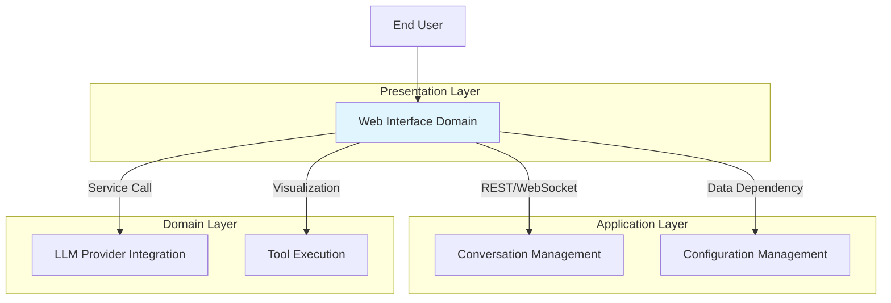
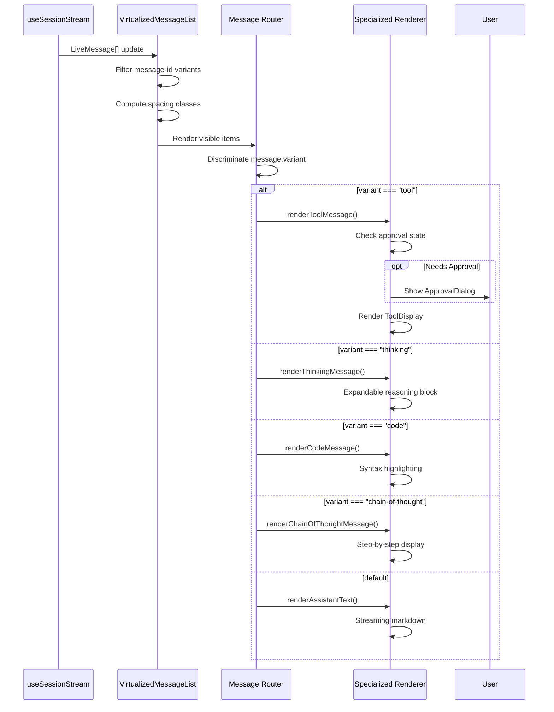

Based on the research materials and code analysis, I'll now create comprehensive technical documentation for the Web Interface Domain.

---

# Web Interface Domain - Technical Documentation

**Document Version:** 1.0  
**Generation Date:** 2026-03-01  
**System:** Kimi CLI  
**Domain Type:** Core Business Domain  
**Importance:** 9/10 | **Complexity:** 8/10

---

## 1. Domain Overview

### 1.1 Purpose and Scope

The Web Interface Domain provides a rich, browser-based graphical user interface for interacting with the Kimi CLI AI assistant. It serves as the primary visual interaction layer, offering real-time conversation management, tool visualization, and session orchestration through an intuitive web application.

**Core Responsibilities:**
- Real-time chat workspace with streaming AI responses
- Session management and navigation interface
- Tool execution visualization with approval workflows
- Configuration controls and model selection
- Multi-modal input support (text, files, @mentions, /commands)
- Responsive design for desktop and mobile experiences

**Business Value:**
- **Lower Barrier to Entry:** Visual interface reduces learning curve for non-technical users
- **Rich Visual Feedback:** Complex operations (diffs, search results, tool outputs) rendered with syntax highlighting and structured layouts
- **Efficient Multi-Session Management:** Sidebar navigation with search, filtering, and URL-based persistence
- **Intuitive Approval Workflows:** Visual dialogs with keyboard shortcuts for sensitive operations
- **Collaborative Workflows:** Shareable session URLs enable team collaboration

### 1.2 Architecture Position



---

## 2. Technical Architecture

### 2.1 Technology Stack

| Layer | Technology | Version | Purpose |
|-------|-----------|---------|---------|
| **Framework** | React | 18.x | Component-based UI with concurrent rendering and automatic batching |
| **Language** | TypeScript | 5.x | Type-safe development with enhanced IDE support and compile-time validation |
| **Build Tool** | Vite | Latest | Fast HMR development server and optimized production builds |
| **State Management** | Zustand | Latest | Lightweight state management for queue and tool stores (< 1KB) |
| **UI Components** | Radix UI | Latest | Accessible primitives (Dialog, Dropdown, Tooltip) with ARIA support |
| **Styling** | Tailwind CSS | 3.x | Utility-first CSS with custom design tokens |
| **Virtualization** | react-virtuoso | Latest | Efficient rendering of large message lists with dynamic heights |
| **Syntax Highlighting** | refractor | Latest | Code highlighting for 40+ programming languages |
| **Diff Rendering** | diff library | Latest | Character-level diff visualization with inline changes |
| **Animation** | Framer Motion | Latest | GPU-accelerated transitions and status indicators |
| **API Client** | OpenAPI Generator | Latest | Type-safe REST API client generated from OpenAPI spec |

### 2.2 Module Structure

```
web/src/
├── features/                    # Feature-based modules
│   ├── chat/                   # Chat workspace (primary interface)
│   │   ├── chat.tsx           # Main chat container
│   │   ├── chat-workspace-container.tsx  # State management wrapper
│   │   ├── components/
│   │   │   ├── chat-conversation.tsx     # Message display area
│   │   │   ├── chat-prompt-composer.tsx  # Input composer
│   │   │   ├── virtualized-message-list.tsx  # Virtualized rendering
│   │   │   ├── assistant-message.tsx     # AI message variants
│   │   │   ├── approval-dialog.tsx       # Tool approval UI
│   │   │   ├── question-dialog.tsx       # Multi-step questions
│   │   │   ├── chat-workspace-header.tsx # Session header
│   │   │   └── prompt-toolbar/           # Status toolbar
│   │   ├── useFileMentions.ts  # @file mention autocomplete
│   │   ├── useSlashCommands.ts # /command autocomplete
│   │   └── queue-store.ts      # Message queue state
│   ├── sessions/               # Session management
│   │   └── create-session-dialog.tsx
│   └── tool/                   # Tool visualization
│       ├── components/
│       │   └── display-content.tsx  # Tool output rendering
│       └── store.ts            # Tool state management
├── components/                 # Shared UI components
│   ├── ui/                    # Base UI primitives
│   │   └── diff/              # Diff viewer
│   └── ai-elements/           # AI-specific components
├── hooks/                     # Custom React hooks
│   ├── useSessionStream.ts   # WebSocket streaming
│   ├── useSessions.ts        # Session CRUD operations
│   ├── useGlobalConfig.ts    # Configuration management
│   └── useGitDiffStats.ts    # Git integration
├── lib/                       # Utilities and API client
│   ├── api/                  # Generated API client
│   ├── apiClient.ts          # API configuration
│   └── utils.ts              # Helper functions
├── App.tsx                    # Root application component
├── main.tsx                   # Application entry point
└── bootstrap.tsx              # Dynamic import wrapper
```

---

## 3. Core Sub-Modules

### 3.1 Chat Workspace Module

**Importance:** 10/10 | **Complexity:** 9/10

The Chat Workspace is the primary conversation interface, implementing real-time chat with virtualized message rendering, multi-modal input, and tool approval workflows.

#### 3.1.1 Architecture Pattern

**Container-Presenter Pattern:**
- `ChatWorkspaceContainer`: Manages streaming state, side effects, and business logic
- `ChatWorkspace`: Pure presentation component handling rendering only

This isolation prevents high-frequency message updates from triggering unnecessary parent re-renders.

#### 3.1.2 Key Components

**ChatWorkspace (`chat.tsx`)**
```typescript
type ChatWorkspaceProps = {
  status: ChatStatus;                    // ready | submitted | streaming | error
  onSubmit: (message: PromptInputMessage) => Promise<void>;
  messages: LiveMessage[];               // Real-time message array
  selectedSessionId?: string;
  onApprovalResponse?: (requestId: string, decision: ApprovalResponseDecision) => Promise<void>;
  contextUsage?: number;                 // 0-1 context utilization
  tokenUsage?: TokenUsage | null;        // Current step token usage
  currentSession?: Session;
  isReplayingHistory?: boolean;
  onCancel?: () => void;
  slashCommands?: SlashCommandDef[];
  maxContextSize?: number;
  onForkSession?: (turnIndex: number) => void;
};
```

**Key Features:**
- **Activity Status Derivation:** Memoized computation with reference caching to avoid unnecessary re-renders
- **Git Diff Integration:** Real-time repository change visualization
- **Approval Management:** Pending state tracking to prevent duplicate requests
- **Block Expansion:** Global toggle for thinking/reasoning block visibility

**VirtualizedMessageList (`virtualized-message-list.tsx`)**

Performance-optimized message rendering using `react-virtuoso`:

```typescript
<Virtuoso
  data={listItems}
  followOutput={handleFollowOutput}      // Smart auto-scroll
  defaultItemHeight={160}                // Height estimation
  increaseViewportBy={{ top: 400, bottom: 400 }}  // Overscan buffer
  overscan={200}
  minOverscanItemCount={4}
  atBottomStateChange={handleAtBottomChange}
/>
```

**Spacing Algorithm:**
```typescript
function getMessageSpacingClass(message: LiveMessage, index: number, allMessages: LiveMessage[]): string {
  // Terminal-style compact spacing:
  // - User messages: mt-4 (breathing room)
  // - Assistant text: mt-1 to mt-2 (natural flow)
  // - Tool calls: mt-1.5 (grouped operations)
  // - Thinking blocks: mt-1 (minimal spacing)
}
```

**ChatPromptComposer (`chat-prompt-composer.tsx`)**

Multi-modal input interface with autocomplete:

```typescript
const ChatPromptComposer = ({
  status,
  onSubmit,
  currentSession,
  slashCommands,
  onListSessionDirectory,
  gitDiffStats,
  activityStatus,
  tokenUsage,
}) => {
  // File mention system (@)
  const { isOpen: isMentionOpen, sections, selectOption } = useFileMentions({
    text: promptController.textInput.value,
    sessionId: currentSession?.sessionId,
    listDirectory: onListSessionDirectory,
  });

  // Slash command system (/)
  const { isOpen: isSlashOpen, options, selectOption } = useSlashCommands({
    text: promptController.textInput.value,
    commands: slashCommands,
  });

  // Priority: slash menu first, then mention menu
  const handleKeyDown = (event) => {
    if (isSlashOpen) handleSlashKeyDown(event);
    else if (isMentionOpen) handleMentionKeyDown(event);
  };
};
```

**Features:**
- **Expandable Input:** Toggle between compact (min-h-10) and expanded (min-h-[220px]) modes
- **File Attachments:** Drag-and-drop with preview and validation (max 10 files)
- **@File Mentions:** Autocomplete with workspace file crawling (500 file limit)
- **Slash Commands:** Command palette with alias support
- **Prompt Toolbar:** Activity status, git changes, queue items, token usage

#### 3.1.3 Message Rendering Pipeline



**AssistantMessage Variants:**

1. **Text Messages:** Streaming markdown with green pulse indicator
```typescript
<MessageResponse
  mode={message.isStreaming ? "streaming" : "static"}
  parseIncompleteMarkdown={Boolean(message.isStreaming)}
>
  {message.content}
</MessageResponse>
```

2. **Tool Messages:** Execution display with approval workflow
```typescript
<Tool defaultOpen={blocksExpanded}>
  <ToolHeader state={toolCall.state} title={toolCall.title} />
  <ToolContent>
    <ToolInput input={toolCall.input} />
    <ToolDisplay display={toolCall.display} />
    <ToolOutput output={toolCall.output} />
    <Confirmation approval={approval}>
      <ConfirmationActions>
        <ConfirmationAction onClick={() => onApprove("approve")}>
          Approve (1)
        </ConfirmationAction>
        <ConfirmationAction onClick={() => onApprove("approve_for_session")}>
          Approve for session (2)
        </ConfirmationAction>
        <ConfirmationAction onClick={() => onApprove("decline")}>
          Decline (3)
        </ConfirmationAction>
      </ConfirmationActions>
    </Confirmation>
  </ToolContent>
</Tool>
```

3. **Thinking Messages:** Expandable reasoning blocks
```typescript
<Reasoning defaultOpen={blocksExpanded}>
  <ReasoningTrigger>
    <BrainIcon /> Thinking...
  </ReasoningTrigger>
  <ReasoningContent>
    {message.content}
  </ReasoningContent>
</Reasoning>
```

4. **Chain-of-Thought Messages:** Step-by-step reasoning
```typescript
<ChainOfThought>
  <ChainOfThoughtHeader>{details.title}</ChainOfThoughtHeader>
  <ChainOfThoughtContent>
    {visibleSteps.map((step, index) => (
      <ChainOfThoughtStep
        label={step.label}
        description={step.description}
        status={isLast && streaming ? "active" : "complete"}
      />
    ))}
  </ChainOfThoughtContent>
</ChainOfThought>
```

5. **Code Messages:** Syntax-highlighted code blocks
```typescript
<CodeBlock
  language={message.language}
  code={message.content}
  showLineNumbers
/>
```

#### 3.1.4 Performance Optimizations

**Virtualization Strategy:**
- **Overscan Buffer:** 400px top/bottom to reduce blank areas during fast scrolling
- **Dynamic Heights:** `defaultItemHeight={160}` with automatic measurement
- **Smart Follow-Output:** Auto-scroll only if within 1500px of bottom

**Memoization:**
```typescript
// Activity status with reference caching
const prevActivityRef = useRef<ActivityDetail | null>(null);
const activityStatus = useMemo(() => {
  const newStatus = deriveActivityStatus({ chatStatus, isAwaitingFirstResponse, messages });
  
  // Return cached reference if unchanged to prevent downstream re-renders
  if (prevActivityRef.current?.status === newStatus.status &&
      prevActivityRef.current?.description === newStatus.description) {
    return prevActivityRef.current;
  }
  
  prevActivityRef.current = newStatus;
  return newStatus;
}, [chatStatus, isAwaitingFirstResponse, messages]);
```

**Lazy Loading:**
```typescript
// Diff component loaded on-demand
const LazyDiff = lazy(() => import("@/components/ui/diff"));

<Suspense fallback={<div>Loading diff...</div>}>
  <LazyDiff files={diffFiles} />
</Suspense>
```

---

### 3.2 Session Streaming Module

**Importance:** 10/10 | **Complexity:** 9/10

The `useSessionStream` hook manages WebSocket connections for real-time conversation streaming.

#### 3.2.1 Architecture Overview

**Design Principles:**
1. **Single Active Stream:** One WebSocket per selected session
2. **Atomic Session Switching:** No cross-session event leakage
3. **Event Sourcing:** JSON-RPC events transformed into LiveMessage timeline
4. **Identity Guards:** Late callbacks prevented from mutating wrong session state

**Data Flow:**
```
Server (JSON-RPC) 
    ↓ WebSocket.onmessage
handleMessage(data)
    ↓ JSON.parse → WireMessage
extractEvent(msg)
    ↓ WireEvent
processEvent(event)
    ↓ Updates state
    ├─ status (ready/submitted/streaming/error)
    ├─ contextUsage (0-1)
    ├─ currentStep (number)
    └─ messages (LiveMessage[])
```

#### 3.2.2 Connection Management

**WebSocket Lifecycle:**
```typescript
useLayoutEffect(() => {
  if (!sessionId) {
    // Draft mode: clear state and disconnect
    setMessages([]);
    setStatus("ready");
    if (wsRef.current) {
      wsRef.current.close();
      wsRef.current = null;
    }
    return;
  }

  // Connect to session
  const ws = new WebSocket(wsUrl);
  wsRef.current = ws;

  ws.onopen = () => {
    if (wsRef.current !== ws) return;  // Identity guard
    setConnected(true);
    onConnectionChange?.(true);
  };

  ws.onmessage = (event) => {
    if (wsRef.current !== ws) return;  // Identity guard
    handleMessage(event.data);
  };

  ws.onerror = (error) => {
    if (wsRef.current !== ws) return;  // Identity guard
    console.error("[useSessionStream] WebSocket error", error);
    onError?.(new Error("WebSocket connection error"));
  };

  ws.onclose = (event) => {
    if (wsRef.current !== ws) return;  // Identity guard
    setConnected(false);
    onConnectionChange?.(false);
    
    // Handle close codes
    if (event.code === 1008) {
      // Session busy (another connection active)
      setStatus("error");
    }
  };

  // Cleanup on session switch
  return () => {
    if (wsRef.current === ws) {
      ws.close();
      wsRef.current = null;
    }
  };
}, [sessionId]);
```

**Identity Guard Pattern:**
```typescript
// Every callback checks if the WebSocket is still active
if (wsRef.current !== ws) return;

// This prevents late events from previous sessions from mutating current state
```

#### 3.2.3 Event Processing

**Wire Protocol Events:**
```typescript
type WireEvent = 
  | { method: "message"; params: { role: string; content: ContentPart[] } }
  | { method: "tool_call"; params: { tool_name: string; arguments: object } }
  | { method: "approval_request"; params: ApprovalRequestEvent }
  | { method: "question_request"; params: QuestionRequestEvent }
  | { method: "session_status"; params: SessionStatusPayload }
  | { method: "context_usage"; params: { usage: number } }
  | { method: "token_usage"; params: TokenUsage }
  | { method: "subagent_event"; params: SubagentEventWire };
```

**Event Reducer:**
```typescript
const processEvent = (event: WireEvent) => {
  switch (event.method) {
    case "message":
      handleMessageEvent(event.params);
      break;
    case "tool_call":
      handleToolCallEvent(event.params);
      break;
    case "approval_request":
      handleApprovalRequest(event.params);
      break;
    case "context_usage":
      setContextUsage(event.params.usage);
      break;
    case "token_usage":
      setTokenUsage(event.params);
      break;
    case "session_status":
      setSessionStatus(event.params);
      onSessionStatus?.(event.params);
      break;
  }
};
```

**Streaming Buffers (Refs):**
```typescript
// Accumulator refs for streaming content (not React state)
const currentThinkingRef = useRef<string>("");
const currentTextRef = useRef<string>("");
const currentToolArgsRef = useRef<string>("");

// These are flushed to messages state when complete
```

#### 3.2.4 Message Sending

```typescript
const sendMessage = useCallback(async (text: string, attachments?: File[]) => {
  if (!wsRef.current || wsRef.current.readyState !== WebSocket.OPEN) {
    throw new Error("WebSocket not connected");
  }

  setStatus("submitted");

  const request: JsonRpcRequest = {
    jsonrpc: "2.0",
    method: "send_message",
    params: {
      content: text,
      attachments: attachments?.map(f => f.name),
    },
    id: uuidV4(),
  };

  wsRef.current.send(JSON.stringify(request));
}, []);
```

**Approval Response:**
```typescript
const respondToApproval = useCallback(async (
  requestId: string,
  decision: ApprovalResponseDecision,
  reason?: string
) => {
  if (!wsRef.current) return;

  const response: JsonRpcResponse = {
    jsonrpc: "2.0",
    result: { decision, reason },
    id: requestId,
  };

  wsRef.current.send(JSON.stringify(response));
}, []);
```

---

### 3.3 Tool Visualization Module

**Importance:** 8/10 | **Complexity:** 7/10

Renders tool execution results with specialized visualizations for different content types.

#### 3.3.1 Display Content Types

**DisplayContent Component (`display-content.tsx`):**

```typescript
type DisplayItem = {
  type: string;
  data: unknown;
};

export function DisplayContent({ display }: { display: DisplayItem[] }) {
  return (
    <div className="space-y-2">
      {display.map((item, index) => {
        switch (item.type) {
          case "diff":
            return <DiffDisplay key={index} data={item.data} />;
          case "web_search":
            return <WebSearchResults key={index} data={item.data} />;
          case "image_search_by_text":
            return <ImageSearchResults key={index} data={item.data} />;
          case "search_response":
            return <SearchResponseResults key={index} data={item.data} />;
          case "mcp_resource":
            return <MCPResourceDisplay key={index} data={item.data} />;
          case "mcp_text":
            return <MCPTextDisplay key={index} data={item.data} />;
          case "mcp_image":
            return <MCPImageDisplay key={index} data={item.data} />;
          default:
            return <CodeBlock key={index} code={JSON.stringify(item.data, null, 2)} />;
        }
      })}
    </div>
  );
}
```

#### 3.3.2 Diff Visualization

**Syntax-Highlighted Diffs:**
```typescript
<Suspense fallback={<div>Loading diff...</div>}>
  <Diff viewType="split" className="text-xs">
    {files.map((file) => (
      <DiffFile key={file.oldPath || file.newPath}>
        <DiffFileHeader
          oldPath={file.oldPath}
          newPath={file.newPath}
          type={file.type}
        />
        {file.hunks.map((hunk, idx) => (
          <Hunk key={idx} hunk={hunk}>
            {(line) => (
              <DiffLine
                line={line}
                className={cn(
                  line.type === "insert" && "bg-green-500/10",
                  line.type === "delete" && "bg-red-500/10"
                )}
              />
            )}
          </Hunk>
        ))}
      </DiffFile>
    ))}
  </Diff>
</Suspense>
```

**Features:**
- Split view with side-by-side comparison
- Syntax highlighting via refractor (40+ languages)
- Character-level inline diffs
- Collapsible hunks for large files

#### 3.3.3 Search Results

**Web Search Results:**
```typescript
<div className="space-y-2">
  {chunks.map((chunk) => (
    <div className="rounded-md border border-border/40 bg-card/20 p-3">
      <a href={chunk.url} className="font-medium text-primary hover:underline">
        {chunk.title}
      </a>
      {chunk.siteName && (
        <div className="text-xs text-muted-foreground">{chunk.siteName}</div>
      )}
      <p className="mt-1 text-sm text-foreground/80">{chunk.text}</p>
      {chunk.labels && (
        <div className="mt-2 flex gap-1">
          {chunk.labels.map((label) => (
            <Badge variant="secondary">{label.text}</Badge>
          ))}
        </div>
      )}
    </div>
  ))}
</div>
```

**Image Search Results:**
```typescript
<div className="grid grid-cols-1 gap-3 sm:grid-cols-2 lg:grid-cols-3">
  {images.map((image) => (
    <a href={image.original} target="_blank" className="group relative">
      
      <div className="absolute inset-x-0 bottom-0 bg-gradient-to-t from-black/80 opacity-0 group-hover:opacity-100">
        <div className="text-xs text-white">{image.meta?.title}</div>
        <div className="text-xs text-white/80">{image.meta?.source}</div>
      </div>
    </a>
  ))}
</div>
```

#### 3.3.4 MCP Content Display

**Resource Display:**
```typescript
const MCPResourceDisplay = ({ resource }) => {
  if (resource.mimeType?.startsWith("image/")) {
    const src = resource.blob 
      ? `data:${resource.mimeType};base64,${resource.blob}`
      : resource.uri;
    return ;
  }
  
  if (resource.text) {
    return <CodeBlock code={resource.text} />;
  }
  
  return <div>Unsupported resource type</div>;
};
```

---

### 3.4 Session Sidebar Module

**Importance:** 8/10 | **Complexity:** 6/10

Session management interface with search, filtering, and organization capabilities.

#### 3.4.1 Session List Display

**Implementation in `App.tsx`:**
```typescript
const SessionSidebar = () => {
  const { sessions, isLoading } = useSessions();
  const [searchQuery, setSearchQuery] = useState("");
  const [showArchived, setShowArchived] = useState(false);

  const filteredSessions = useMemo(() => {
    return sessions
      .filter(s => showArchived || !s.archived)
      .filter(s => 
        s.title.toLowerCase().includes(searchQuery.toLowerCase()) ||
        s.workDir.toLowerCase().includes(searchQuery.toLowerCase())
      )
      .sort((a, b) => 
        new Date(b.updatedAt).getTime() - new Date(a.updatedAt).getTime()
      );
  }, [sessions, searchQuery, showArchived]);

  return (
    <div className="flex h-full flex-col">
      <div className="p-4">
        <Input
          placeholder="Search sessions..."
          value={searchQuery}
          onChange={(e) => setSearchQuery(e.target.value)}
        />
      </div>
      <ScrollArea className="flex-1">
        {filteredSessions.map((session) => (
          <SessionItem
            key={session.sessionId}
            session={session}
            isActive={session.sessionId === selectedSessionId}
            onClick={() => selectSession(session.sessionId)}
          />
        ))}
      </ScrollArea>
    </div>
  );
};
```

#### 3.4.2 Create Session Dialog

**Directory Selection with Autocomplete:**
```typescript
const CreateSessionDialog = ({ onCreateSession }) => {
  const [workDir, setWorkDir] = useState("");
  const [suggestions, setSuggestions] = useState<string[]>([]);

  const handleWorkDirChange = async (value: string) => {
    setWorkDir(value);
    
    // Fetch directory suggestions
    const dirs = await fetchDirectorySuggestions(value);
    setSuggestions(dirs);
  };

  const handleSubmit = async () => {
    await onCreateSession({ workDir, title: "" });
  };

  return (
    <Dialog>
      <DialogContent>
        <DialogHeader>
          <DialogTitle>Create New Session</DialogTitle>
        </DialogHeader>
        <div className="space-y-4">
          <div>
            <Label>Work Directory</Label>
            <Input
              value={workDir}
              onChange={(e) => handleWorkDirChange(e.target.value)}
              placeholder="/path/to/project"
            />
            {suggestions.length > 0 && (
              <div className="mt-1 rounded-md border">
                {suggestions.map((dir) => (
                  <div
                    key={dir}
                    className="cursor-pointer p-2 hover:bg-secondary"
                    onClick={() => setWorkDir(dir)}
                  >
                    {dir}
                  </div>
                ))}
              </div>
            )}
          </div>
          <Button onClick={handleSubmit}>Create Session</Button>
        </div>
      </DialogContent>
    </Dialog>
  );
};
```

---

### 3.5 File Mention System

**Importance:** 7/10 | **Complexity:** 7/10

Autocomplete system for @file mentions with workspace file crawling.

#### 3.5.1 Implementation

**useFileMentions Hook:**
```typescript
export const useFileMentions = ({
  text,
  setText,
  textareaRef,
  sessionId,
  listDirectory,
}) => {
  const [isOpen, setIsOpen] = useState(false);
  const [query, setQuery] = useState("");
  const [workspaceFiles, setWorkspaceFiles] = useState<string[]>([]);
  const [activeIndex, setActiveIndex] = useState(0);

  // Detect @ trigger
  const handleTextChange = (value: string, caret: number) => {
    const beforeCaret = value.slice(0, caret);
    const match = beforeCaret.match(/@(\S*)$/);
    
    if (match) {
      setQuery(match[1]);
      setIsOpen(true);
    } else {
      setIsOpen(false);
    }
  };

  // Crawl workspace files
  useEffect(() => {
    if (!sessionId || !listDirectory) return;
    
    const crawl = async () => {
      const files = await listDirectory(sessionId);
      setWorkspaceFiles(files.map(f => f.path));
    };
    
    crawl();
  }, [sessionId, listDirectory]);

  // Filter files by query
  const filteredFiles = useMemo(() => {
    return workspaceFiles
      .filter(f => f.toLowerCase().includes(query.toLowerCase()))
      .slice(0, 50);  // Limit to 50 results
  }, [workspaceFiles, query]);

  // Select file
  const selectOption = (file: string) => {
    const beforeCaret = text.slice(0, textareaRef.current.selectionStart);
    const afterCaret = text.slice(textareaRef.current.selectionStart);
    const beforeAt = beforeCaret.replace(/@\S*$/, `@${file} `);
    
    setText(beforeAt + afterCaret);
    setIsOpen(false);
  };

  return { isOpen, query, filteredFiles, activeIndex, selectOption };
};
```

#### 3.5.2 Keyboard Navigation

```typescript
const handleKeyDown = (event: KeyboardEvent) => {
  if (!isOpen) return;

  switch (event.key) {
    case "ArrowDown":
      event.preventDefault();
      setActiveIndex((prev) => Math.min(prev + 1, filteredFiles.length - 1));
      