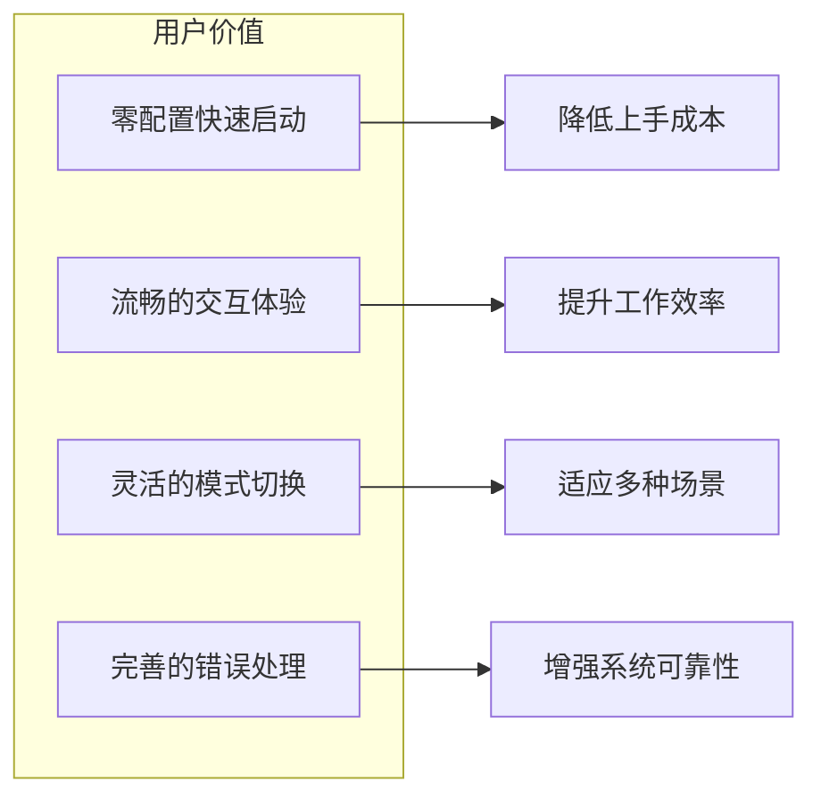
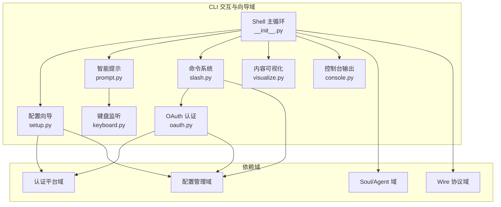
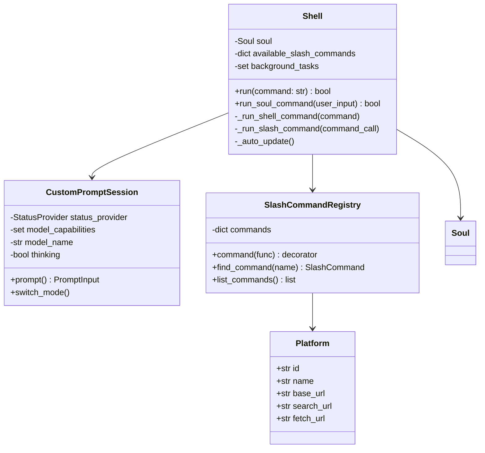
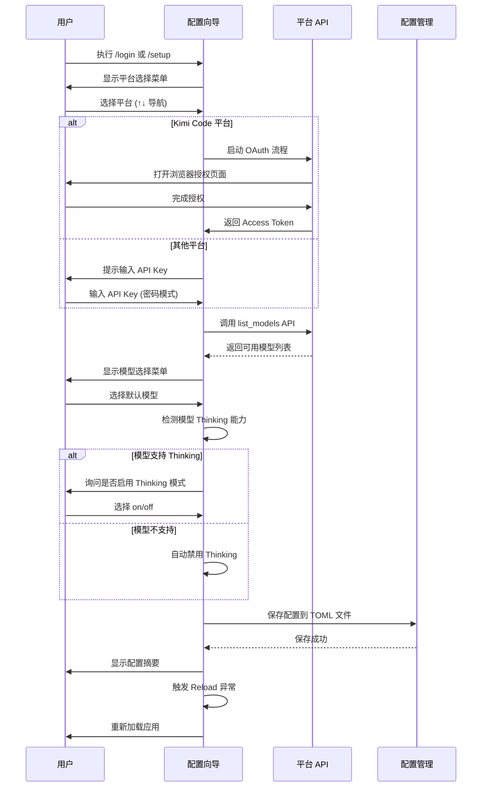
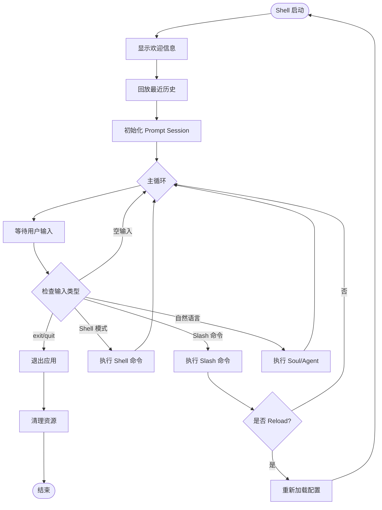
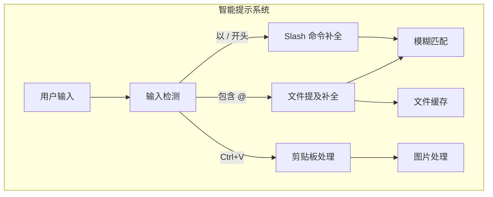

基于我收集的研究材料，现在为您生成 CLI 交互与向导域的完整技术文档。

# CLI 交互与向导域技术文档

## 文档信息

| 项目 | 内容 |
|------|------|
| **领域名称** | CLI 交互与向导域 |
| **文档版本** | v1.0 |
| **生成时间** | 2026-02-28 |
| **代码路径** | `src/kimi_cli/ui/shell/` |
| **重要性评分** | 8.0/10 |
| **复杂度评分** | 6.0/10 |

---

## 1. 领域概述

### 1.1 领域定位

CLI 交互与向导域是 Kimi CLI 系统中面向终端用户的核心交互层，负责提供命令行界面的完整用户体验。该域的核心价值在于：

- **降低使用门槛**：通过交互式向导引导用户完成首次配置
- **提升操作效率**：提供丰富的快捷键、命令补全和智能提示
- **增强可用性**：支持多种输入模式、历史回放和错误恢复

### 1.2 业务价值



### 1.3 核心能力

| 能力模块 | 功能描述 | 技术实现 |
|----------|----------|----------|
| **交互式配置向导** | 引导用户完成平台选择、认证、模型配置 | `setup.py` |
| **Shell 主循环** | 处理用户输入、命令分发、异常处理 | `__init__.py` |
| **智能提示系统** | Slash 命令补全、文件提及、多模态输入 | `prompt.py` |
| **命令注册与分发** | Slash 命令注册、参数解析、执行调度 | `slash.py` |
| **OAuth 认证流程** | 浏览器授权、Token 管理、登录登出 | `oauth.py` |
| **键盘事件监听** | 跨平台键盘输入捕获与处理 | `keyboard.py` |

---

## 2. 架构设计

### 2.1 模块架构图



### 2.2 核心类关系



---

## 3. 核心流程详解

### 3.1 交互式配置向导流程

这是用户首次使用或重新配置系统时的核心流程，通过分步引导降低配置复杂度。



#### 3.1.1 平台选择实现

```python
# src/kimi_cli/ui/shell/setup.py

async def select_platform() -> Platform | None:
    """交互式平台选择"""
    platform_name = await _prompt_choice(
        header="Select a platform (↑↓ navigate, Enter select, Ctrl+C cancel):",
        choices=[platform.name for platform in PLATFORMS],
    )
    if not platform_name:
        console.print("[red]No platform selected[/red]")
        return None
    
    platform = get_platform_by_name(platform_name)
    if platform is None:
        console.print("[red]Unknown platform[/red]")
        return None
    return platform
```

**关键技术点**：
- 使用 `prompt_toolkit.ChoiceInput` 提供键盘导航菜单
- 支持 `↑↓` 键导航、`Enter` 确认、`Ctrl+C` 取消
- 从预定义的 `PLATFORMS` 列表加载平台信息

#### 3.1.2 模型发现与配置

```python
async def _setup_platform(platform: Platform) -> _SetupResult | None:
    # 1. 获取 API Key
    api_key = await _prompt_text("Enter your API key", is_password=True)
    if not api_key:
        return None
    
    # 2. 发现可用模型
    try:
        models = await list_models(platform, api_key)
    except Exception as e:
        logger.error("Failed to get models: {error}", error=e)
        console.print(f"[red]Failed to get models: {e}[/red]")
        return None
    
    # 3. 选择模型
    model_map = {model.id: model for model in models}
    model_id = await _prompt_choice(
        header="Select a model (↑↓ navigate, Enter select, Ctrl+C cancel):",
        choices=list(model_map),
    )
    selected_model = model_map[model_id]
    
    # 4. 确定 Thinking 模式
    capabilities = selected_model.capabilities
    if "always_thinking" in capabilities:
        thinking = True
    elif "thinking" in capabilities:
        thinking_selection = await _prompt_choice(
            header="Enable thinking mode? (↑↓ navigate, Enter select, Ctrl+C cancel):",
            choices=["off", "on"],
        )
        thinking = thinking_selection == "on"
    else:
        thinking = False
    
    return _SetupResult(
        platform=platform,
        api_key=SecretStr(api_key),
        selected_model=selected_model,
        models=models,
        thinking=thinking,
    )
```

**关键技术点**：
- 密码模式输入保护 API Key 安全
- 异步调用平台 API 发现模型列表
- 根据模型能力自动推断 Thinking 配置策略
- 使用 `NamedTuple` 封装配置结果

#### 3.1.3 配置持久化

```python
def _apply_setup_result(result: _SetupResult) -> None:
    config = load_config()
    provider_key = managed_provider_key(result.platform.id)
    model_key = managed_model_key(result.platform.id, result.selected_model.id)
    
    # 创建 Provider 配置
    config.providers[provider_key] = LLMProvider(
        type="kimi",
        base_url=result.platform.base_url,
        api_key=result.api_key,
    )
    
    # 清理旧模型配置
    for key, model in list(config.models.items()):
        if model.provider == provider_key:
            del config.models[key]
    
    # 注册所有发现的模型
    for model_info in result.models:
        capabilities = model_info.capabilities or None
        config.models[managed_model_key(result.platform.id, model_info.id)] = LLMModel(
            provider=provider_key,
            model=model_info.id,
            max_context_size=model_info.context_length,
            capabilities=capabilities,
        )
    
    # 设置默认值
    config.default_model = model_key
    config.default_thinking = result.thinking
    
    # 配置搜索和抓取服务
    if result.platform.search_url:
        config.services.moonshot_search = MoonshotSearchConfig(
            base_url=result.platform.search_url,
            api_key=result.api_key,
        )
    
    if result.platform.fetch_url:
        config.services.moonshot_fetch = MoonshotFetchConfig(
            base_url=result.platform.fetch_url,
            api_key=result.api_key,
        )
    
    save_config(config)
```

**关键技术点**：
- 使用 `managed_provider_key` 和 `managed_model_key` 生成唯一标识
- 批量注册所有发现的模型，支持后续切换
- 自动配置关联服务（搜索、抓取）
- 原子性保存配置到 TOML 文件

---

### 3.2 Shell 主循环流程

Shell 主循环是 CLI 的核心运行时，负责处理用户输入、命令分发和异常恢复。



#### 3.2.1 主循环实现

```python
# src/kimi_cli/ui/shell/__init__.py

async def run(self, command: str | None = None) -> bool:
    if command is not None:
        # 单命令模式：执行后退出
        return await self.run_soul_command(command)
    
    # 启动后台任务（自动更新检查）
    if not get_env_bool("KIMI_CLI_NO_AUTO_UPDATE"):
        self._start_background_task(self._auto_update())
    
    # 显示欢迎信息
    _print_welcome_info(self.soul.name or "Kimi Code CLI", self._welcome_info)
    
    # 回放最近历史
    if isinstance(self.soul, KimiSoul):
        await replay_recent_history(
            self.soul.context.history,
            wire_file=self.soul.wire_file,
        )
    
    # 创建 Prompt Session
    with CustomPromptSession(
        status_provider=lambda: self.soul.status,
        model_capabilities=self.soul.model_capabilities or set(),
        model_name=self.soul.model_name,
        thinking=self.soul.thinking or False,
        agent_mode_slash_commands=list(self._available_slash_commands.values()),
        shell_mode_slash_commands=shell_mode_registry.list_commands(),
    ) as prompt_session:
        try:
            while True:
                ensure_tty_sane()
                try:
                    ensure_new_line()
                    user_input = await prompt_session.prompt()
                except KeyboardInterrupt:
                    console.print("[grey50]Tip: press Ctrl-D or send 'exit' to quit[/grey50]")
                    continue
                except EOFError:
                    console.print("Bye!")
                    break
                
                if not user_input:
                    continue
                
                # 处理退出命令
                if user_input.command in ["exit", "quit", "/exit", "/quit"]:
                    console.print("Bye!")
                    break
                
                # 分发命令
                if user_input.mode == PromptMode.SHELL:
                    await self._run_shell_command(user_input.command)
                    continue
                
                if slash_cmd_call := parse_slash_command_call(user_input.command):
                    await self._run_slash_command(slash_cmd_call)
                    continue
                
                await self.run_soul_command(user_input.content)
                console.print()
        finally:
            ensure_tty_sane()
    
    return True
```

**关键技术点**：
- 使用 `with` 语句管理 Prompt Session 生命周期
- 捕获 `KeyboardInterrupt` 和 `EOFError` 实现优雅退出
- 根据输入模式分发到不同的处理器
- 确保 TTY 状态始终正常（防止终端损坏）

#### 3.2.2 Shell 命令执行

```python
async def _run_shell_command(self, command: str) -> None:
    """在前台执行 Shell 命令"""
    if not command.strip():
        return
    
    # 检查是否为 Shell 模式允许的 Slash 命令
    if slash_cmd_call := parse_slash_command_call(command):
        if shell_mode_registry.find_command(slash_cmd_call.name):
            await self._run_slash_command(slash_cmd_call)
            return
        else:
            console.print(
                f'[yellow]"/{slash_cmd_call.name}" is not available in shell mode. '
                "Press Ctrl-X to switch to agent mode.[/yellow]"
            )
            return
    
    # 检查 cd 命令（不支持）
    stripped_cmd = command.strip()
    try:
        split_cmd = shlex.split(stripped_cmd)
        if split_cmd and len(split_cmd) == 2 and split_cmd[0] == "cd":
            console.print(
                "[yellow]Warning: Directory changes are not preserved across command executions."
                "[/yellow]"
            )
            return
    except ValueError:
        pass
    
    # 执行命令
    proc: asyncio.subprocess.Process | None = None
    
    def _handler():
        if proc:
            proc.terminate()
    
    loop = asyncio.get_running_loop()
    remove_sigint = install_sigint_handler(loop, _handler)
    try:
        with open_original_stderr() as stderr:
            kwargs: dict[str, Any] = {}
            if stderr is not None:
                kwargs["stderr"] = stderr
            proc = await asyncio.create_subprocess_shell(
                command, 
                env=get_clean_env(), 
                **kwargs
            )
            await proc.wait()
    except Exception as e:
        console.print(f"[red]Failed to run shell command: {e}[/red]")
    finally:
        remove_sigint()
```

**关键技术点**：
- 使用 `asyncio.create_subprocess_shell` 执行命令
- 安装 SIGINT 处理器支持 Ctrl+C 中断
- 使用 `get_clean_env()` 提供干净的环境变量
- 特殊处理 `cd` 命令（提示不支持）

#### 3.2.3 Slash 命令执行

```python
async def _run_slash_command(self, command_call: SlashCommandCall) -> None:
    from kimi_cli.cli import Reload, SwitchToWeb
    
    if command_call.name not in self._available_slash_commands:
        console.print(
            f'[red]Unknown slash command "/{command_call.name}", '
            'type "/" for all available commands[/red]'
        )
        return
    
    command = shell_slash_registry.find_command(command_call.name)
    if command is None:
        # Soul 级别的 Slash 命令
        await self.run_soul_command(command_call.raw_input)
        return
    
    try:
        ret = command.func(self, command_call.args)
        if isinstance(ret, Awaitable):
            await ret
    except (Reload, SwitchToWeb):
        # 传播控制流异常
        raise
    except (asyncio.CancelledError, KeyboardInterrupt):
        console.print("[red]Interrupted by user[/red]")
    except Exception as e:
        logger.exception("Unknown error:")
        console.print(f"[red]Unknown error: {e}[/red]")
        raise
```

**关键技术点**：
- 区分 Shell 级别和 Soul 级别的 Slash 命令
- 支持同步和异步命令函数
- 特殊处理 `Reload` 和 `SwitchToWeb` 控制流异常
- 捕获并友好显示用户中断

---

### 3.3 智能提示系统

智能提示系统提供 Slash 命令补全、文件提及和多模态输入支持。



#### 3.3.1 Slash 命令补全器

```python
# src/kimi_cli/ui/shell/prompt.py

class SlashCommandCompleter(Completer):
    """
    Slash 命令补全器：
    - 每个命令显示为一行："/name (alias1, alias2)"
    - 支持主名称和别名的模糊匹配
    - 仅在输入以 '/' 开头时激活
    """
    
    def __init__(self, available_commands: Sequence[SlashCommand[Any]]) -> None:
        super().__init__()
        self._available_commands = list(available_commands)
        self._command_lookup: dict[str, list[SlashCommand[Any]]] = {}
        words: list[str] = []
        
        # 构建命令查找表
        for cmd in sorted(self._available_commands, key=lambda c: c.name):
            if cmd.name not in self._command_lookup:
                self._command_lookup[cmd.name] = []
                words.append(cmd.name)
            self._command_lookup[cmd.name].append(cmd)
            
            # 注册别名
            for alias in cmd.aliases:
                if alias in self._command_lookup:
                    self._command_lookup[alias].append(cmd)
                else:
                    self._command_lookup[alias] = [cmd]
                    words.append(alias)
        
        # 创建模糊匹配器
        self._word_completer = WordCompleter(words, WORD=False, pattern=r"[^\s]+")
        self._fuzzy = FuzzyCompleter(self._word_completer, WORD=False, pattern=r"^[^\s]*")
    
    def get_completions(
        self, document: Document, complete_event: CompleteEvent
    ) -> Iterable[Completion]:
        text = document.text_before_cursor
        
        # 仅在输入缓冲区无其他内容时补全
        if document.text_after_cursor.strip():
            return
        
        # 提取最后一个 token
        last_space = text.rfind(" ")
        token = text[last_space + 1 :]
        prefix = text[: last_space + 1] if last_space != -1 else ""
        
        if prefix.strip():
            return
        if not token.startswith("/"):
            return
        
        typed = token[1:]
        if typed and typed in self._command_lookup:
            return
        
        # 模糊匹配
        mention_doc = Document(text=typed, cursor_position=len(typed))
        candidates = list(self._fuzzy.get_completions(mention_doc, complete_event))
        
        seen: set[str] = set()
        for candidate in candidates:
            commands = self._command_lookup.get(candidate.text)
            if not commands:
                continue
            for cmd in commands:
                if cmd.name in seen:
                    continue
                seen.add(cmd.name)
                yield Completion(
                    text=f"/{cmd.name}",
                    start_position=-len(token),
                    display=cmd.slash_name(),
                    display_meta=cmd.description,
                )
```

**关键技术点**：
- 使用 `FuzzyCompleter` 实现模糊匹配
- 支持命令别名的透明查找
- 去重确保每个命令只显示一次
- 显示命令描述作为元信息

#### 3.3.2 文件提及补全器

```python
class LocalFileMentionCompleter(Completer):
    """提供 @ 文件路径的模糊补全"""
    
    _IGNORED_NAMES = frozenset([
        ".DS_Store", ".git", ".hg", ".svn",
        "node_modules", "__pycache__", ".venv",
        "build", "dist", "target", "out",
        # ... 更多忽略项
    ])
    
    def __init__(
        self,
        root: Path,
        *,
        refresh_interval: float = 2.0,
        limit: int = 1000,
    ) -> None:
        self._root = root
        self._refresh_interval = refresh_interval
        self._limit = limit
        self._cache_time: float = 0.0
        self._cached_paths: list[str] = []
        
        self._word_completer = WordCompleter(
            self._get_paths,
            WORD=False,
            pattern=r"[^\s@]+",
        )
        
        self._fuzzy = FuzzyCompleter(
            self._word_completer,
            WORD=False,
            pattern=r"^[^\s@]*",
        )
    
    def _get_paths(self) -> list[str]:
        """获取文件路径列表（带缓存）"""
        fragment = self._fragment_hint or ""
        
        # 短片段使用顶层缓存
        if "/" not in fragment and len(fragment) < 3:
            now = time.time()
            if now - self._top_cache_time > self._refresh_interval:
                self._top_cached_paths = self._scan_top_level()
                self._top_cache_time = now
            return self._top_cached_paths
        
        # 长片段或包含路径分隔符时全量扫描
        now = time.time()
        if now - self._cache_time > self._refresh_interval:
            self._cached_paths = self._scan_workspace()
            self._cache_time = now
        return self._cached_paths
    
    def _scan_workspace(self) -> list[str]:
        """扫描工作区文件"""
        paths: list[str] = []
        try:
            for entry in self._root.rglob("*"):
                if len(paths) >= self._limit:
                    break
                if entry.is_file() and not self._is_ignored(entry.name):
                    rel_path = entry.relative_to(self._root)
                    paths.append(str(rel_path))
        except Exception:
            pass
        return sorted(paths)
```

**关键技术点**：
- 两级缓存策略：顶层缓存和全量缓存
- 智能忽略常见的工具缓存目录
- 限制扫描数量防止性能问题
- 定时刷新缓存保持数据新鲜度

#### 3.3.3 多模态输入处理

```python
class CustomPromptSession:
    """自定义 Prompt Session，支持多模态输入"""
    
    def _setup_key_bindings(self) -> KeyBindings:
        kb = KeyBindings()
        
        # Ctrl+V: 粘贴（支持图片）
        @kb.add("c-v")
        def paste(event: KeyPressEvent) -> None:
            if not is_clipboard_available():
                # 降级到文本粘贴
                event.current_buffer.paste_clipboard_data(
                    event.app.clipboard.get_data()
                )
                return
            
            # 尝试获取剪贴板图片
            image = grab_image_from_clipboard()
            if image is None:
                # 无图片，粘贴文本
                event.current_buffer.paste_clipboard_data(
                    event.app.clipboard.get_data()
                )
                return
            
            # 处理图片
            self._handle_image_paste(event, image)
        
        # Ctrl+X: 切换 Agent/Shell 模式
        @kb.add("c-x")
        def toggle_mode(event: KeyPressEvent) -> None:
            self._current_mode = (
                PromptMode.AGENT 
                if self._current_mode == PromptMode.SHELL 
                else PromptMode.SHELL
            )
            toast(f"Switched to {self._current_mode.value} mode")
        
        # Alt+Enter / Ctrl+J: 插入换行
        @kb.add("escape", "enter")
        @kb.add("c-j")
        def newline(event: KeyPressEvent) -> None:
            event.current_buffer.insert_text("\n")
        
        return kb
    
    def _handle_image_paste(self, event: KeyPressEvent, image: Image.Image) -> None:
        """处理图片粘贴"""
        # 压缩图片
        buffer = BytesIO()
        image.save(buffer, format="PNG", optimize=True)
        image_data = buffer.getvalue()
        
        # 生成唯一文件名
        image_hash = sha256(image_data).hexdigest()[:16]
        filename = f"paste_{image_hash}.png"
        
        # 保存到临时目录
        temp_