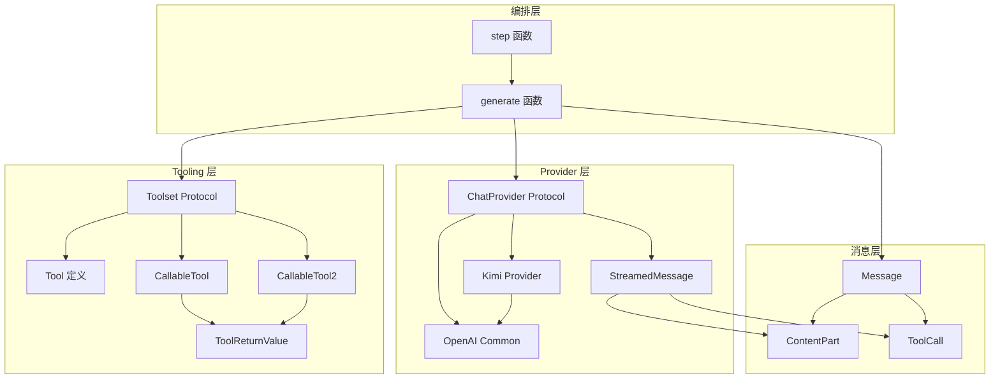

基于研究材料和代码分析，我现在为您编写 **LLM Provider 与工具抽象域（kosong）** 的技术文档。

---

# LLM Provider 与工具抽象域（kosong）技术文档

## 1. 模块概述

### 1.1 领域定位

kosong 是 kimi-cli 项目的核心执行引擎，提供了一个面向现代 AI Agent 应用的 LLM 抽象层。该模块通过统一的接口屏蔽不同 LLM 供应商的协议差异，并提供完整的工具编排能力，使上层应用（CLI/Web/SDK）能够以一致的方式构建 AI 代理。

**核心价值：**
- **供应商解耦**：通过 ChatProvider 协议统一 Kimi、OpenAI、Anthropic、Google GenAI 等多家 LLM API
- **工具编排**：提供声明式工具定义、参数校验、异步执行与结果汇聚的完整框架
- **流式优先**：原生支持流式消息生成与实时工具调用，优化用户体验
- **类型安全**：基于 Pydantic 的强类型系统，确保消息与工具参数的正确性

### 1.2 技术栈

| 技术 | 用途 |
|------|------|
| Python 3.11+ | 核心语言，利用原生异步与类型提示 |
| Pydantic | 数据模型校验与序列化 |
| jsonschema | 工具参数 JSON Schema 校验 |
| OpenAI SDK | OpenAI 兼容协议的客户端基础 |
| httpx | 异步 HTTP 客户端 |
| loguru | 结构化日志 |

---

## 2. 架构设计

### 2.1 三层架构

```
┌─────────────────────────────────────────────────────────┐
│              上层应用（CLI/Web/SDK）                      │
└─────────────────────────────────────────────────────────┘
                          ↓
┌─────────────────────────────────────────────────────────┐
│           编排层：step() / generate()                    │
│  • 消息流合并  • 工具调度  • 异常处理  • 回调管理        │
└─────────────────────────────────────────────────────────┘
                          ↓
┌──────────────────────┬──────────────────────────────────┐
│   Provider 抽象层     │        Tooling 抽象层            │
│  • ChatProvider       │  • Tool / Toolset                │
│  • StreamedMessage    │  • CallableTool / CallableTool2  │
│  • TokenUsage         │  • ToolReturnValue               │
│  • 错误统一           │  • DisplayBlock                  │
└──────────────────────┴──────────────────────────────────┘
                          ↓
┌─────────────────────────────────────────────────────────┐
│              外部系统（LLM API / 工具实现）               │
└─────────────────────────────────────────────────────────┘
```

### 2.2 核心组件关系



---

## 3. 核心模块详解

### 3.1 Provider 抽象层

#### 3.1.1 ChatProvider 协议

**文件位置：** `packages/kosong/src/kosong/chat_provider/__init__.py`

ChatProvider 是所有 LLM 供应商适配器必须实现的核心协议：

```python
@runtime_checkable
class ChatProvider(Protocol):
    name: str  # 供应商名称
    
    @property
    def model_name(self) -> str:
        """当前使用的模型名称"""
        ...
    
    @property
    def thinking_effort(self) -> ThinkingEffort | None:
        """思考强度配置（off/low/medium/high）"""
        ...
    
    async def generate(
        self,
        system_prompt: str,
        tools: Sequence[Tool],
        history: Sequence[Message],
    ) -> StreamedMessage:
        """生成一条新消息"""
        ...
    
    def with_thinking(self, effort: ThinkingEffort) -> Self:
        """返回配置了指定思考强度的副本"""
        ...
```

**关键设计：**
- **协议模式**：使用 Protocol 而非抽象基类，支持鸭子类型与结构化子类型
- **不可变语义**：`with_thinking()` 返回新实例而非修改自身，避免状态污染
- **统一输入**：所有 Provider 接收相同的 `system_prompt + tools + history` 三元组
- **流式输出**：返回 `StreamedMessage` 异步迭代器，支持实时消费

#### 3.1.2 StreamedMessage 与消息部分

```python
type StreamedMessagePart = ContentPart | ToolCall | ToolCallPart

@runtime_checkable
class StreamedMessage(Protocol):
    def __aiter__(self) -> AsyncIterator[StreamedMessagePart]:
        """异步迭代消息部分"""
        ...
    
    @property
    def id(self) -> str | None:
        """消息 ID"""
        ...
    
    @property
    def usage(self) -> TokenUsage | None:
        """Token 使用统计"""
        ...
```

**消息部分类型：**
- **ContentPart**：内容片段（TextPart、ThinkPart、ImageURLPart 等）
- **ToolCall**：完整的工具调用（包含 id、function name、arguments）
- **ToolCallPart**：工具调用的增量片段（用于流式拼接）

#### 3.1.3 Kimi Provider 实现

**文件位置：** `packages/kosong/src/kosong/chat_provider/kimi.py`

Kimi Provider 采用 "OpenAI 兼容 + 协议差异补丁" 的适配策略：

```python
class Kimi:
    name = "kimi"
    
    def __init__(
        self,
        *,
        model: str,
        api_key: str | None = None,
        base_url: str | None = None,
        stream: bool = True,
        **client_kwargs: Any,
    ):
        # 创建 AsyncOpenAI 客户端
        self.client = create_openai_client(
            api_key=api_key or os.getenv("KIMI_API_KEY"),
            base_url=base_url or os.getenv("KIMI_BASE_URL", "https://api.moonshot.ai/v1"),
            client_kwargs=client_kwargs,
        )
        self._generation_kwargs: Kimi.GenerationKwargs = {}
```

**关键特性：**

1. **ThinkPart 支持**：将内部 ThinkPart 转换为 Kimi 的 `reasoning_content` 字段
2. **内建工具**：支持 Kimi 的 `$` 前缀内建工具（如 `$web_search`）
3. **Thinking 配置**：通过 `reasoning_effort` 和 `extra_body.thinking` 双重配置
4. **重试恢复**：实现 `RetryableChatProvider.on_retryable_error`，重建客户端恢复连接

**消息转换示例：**

```python
def _convert_message(message: Message) -> ChatCompletionMessageParam:
    """将内部 Message 转换为 OpenAI 格式"""
    match message.role:
        case "assistant":
            # 提取 ThinkPart 作为 reasoning_content
            think_parts = [p for p in message.content if isinstance(p, ThinkPart)]
            reasoning_content = "".join(p.think for p in think_parts) if think_parts else None
            
            # 其他内容作为 content
            content_parts = [p for p in message.content if not isinstance(p, ThinkPart)]
            
            return {
                "role": "assistant",
                "content": _convert_content_parts(content_parts),
                "reasoning_content": reasoning_content,
                "tool_calls": _convert_tool_calls(message.tool_calls),
            }
```

#### 3.1.4 统一错误处理

**文件位置：** `packages/kosong/src/kosong/chat_provider/openai_common.py`

```python
def convert_error(error: OpenAIError | httpx.HTTPError) -> ChatProviderError:
    match error:
        case openai.APIStatusError():
            return APIStatusError(error.status_code, error.message)
        case openai.APIConnectionError():
            return APIConnectionError(error.message)
        case openai.APITimeoutError():
            return APITimeoutError(error.message)
        case httpx.TimeoutException():
            return APITimeoutError(str(error))
        case httpx.NetworkError():
            return APIConnectionError(str(error))
        case httpx.HTTPStatusError():
            return APIStatusError(error.response.status_code, str(error))
        case _:
            return ChatProviderError(f"Error: {error}")
```

**错误层级：**
```
ChatProviderError (基类)
├── APIConnectionError (连接失败)
├── APITimeoutError (请求超时)
├── APIStatusError (4xx/5xx 状态码)
└── APIEmptyResponseError (空响应)
```

---

### 3.2 Tooling 抽象层

#### 3.2.1 Tool 定义

**文件位置：** `packages/kosong/src/kosong/tooling/__init__.py`

```python
class Tool(BaseModel):
    """工具定义（供模型识别）"""
    
    name: str
    description: str
    parameters: ParametersType  # JSON Schema 格式
    
    @model_validator(mode="after")
    def _validate_parameters(self) -> Self:
        # 验证 parameters 本身是合法的 JSON Schema
        jsonschema.validate(self.parameters, jsonschema.Draft202012Validator.META_SCHEMA)
        return self
```

**设计要点：**
- **JSON Schema 校验**：确保工具参数定义本身符合 Draft 2020-12 规范
- **OpenAI 兼容**：字段结构与 OpenAI function tool 一致，便于转换

#### 3.2.2 CallableTool 与 CallableTool2

**CallableTool（基于 JSON Schema）：**

```python
class CallableTool(Tool, ABC):
    """基于 JSON Schema 校验的可调用工具"""
    
    async def call(self, arguments: JsonType) -> ToolReturnValue:
        # 1. JSON Schema 校验
        jsonschema.validate(arguments, self.parameters)
        
        # 2. 根据参数类型分发调用
        if isinstance(arguments, list):
            ret = await self.__call__(*arguments)  # 位置参数
        elif isinstance(arguments, dict):
            ret = await self.__call__(**arguments)  # 关键字参数
        else:
            ret = await self.__call__(arguments)  # 单参数
        
        return ret
    
    @abstractmethod
    async def __call__(self, *args, **kwargs) -> ToolReturnValue:
        """子类实现具体逻辑"""
        ...
```

**CallableTool2（基于 Pydantic）：**

```python
class CallableTool2(Tool, ABC, Generic[Params]):
    """基于 Pydantic 模型的强类型工具"""
    
    params: type[Params]  # Pydantic 模型类
    
    def __init__(self, **data: Any):
        # 自动从 Pydantic 模型生成 JSON Schema
        schema = self.params.model_json_schema(mode="validation")
        # 内联本地 $ref，减少下游兼容负担
        parameters = deref_json_schema(schema)
        
        super().__init__(parameters=parameters, **data)
    
    async def call(self, arguments: JsonType) -> ToolReturnValue:
        # 使用 Pydantic 校验并解析参数
        try:
            params = self.params.model_validate(arguments)
        except pydantic.ValidationError as e:
            return ToolValidateError(str(e))
        
        return await self.__call__(params)
    
    @abstractmethod
    async def __call__(self, params: Params) -> ToolReturnValue:
        """子类实现，接收强类型参数"""
        ...
```

**对比：**

| 特性 | CallableTool | CallableTool2 |
|------|-------------|---------------|
| 参数校验 | jsonschema.validate | Pydantic model_validate |
| 类型安全 | 弱类型（*args/**kwargs） | 强类型（Params 模型） |
| Schema 定义 | 手动编写 JSON Schema | 自动从 Pydantic 生成 |
| 适用场景 | 简单工具、动态参数 | 复杂参数、需要类型提示 |

#### 3.2.3 ToolReturnValue 体系

```python
class ToolReturnValue(BaseModel):
    """工具返回值统一结构"""
    
    is_error: bool
    
    # 给模型的输出
    output: str | list[ContentPart]
    message: str  # 解释性消息
    
    # 给用户 UI 的展示
    display: list[DisplayBlock]
    
    # 调试/测试用
    extras: dict[str, JsonType] | None = None
```

**便捷子类：**

```python
# 成功返回
ToolOk(
    output="42",
    message="计算完成",
    brief="结果：42"  # 自动转为 BriefDisplayBlock
)

# 错误返回
ToolError(
    message="参数错误：a 必须为正整数",
    brief="参数错误",
    output=""
)
```

**DisplayBlock 扩展机制：**

```python
class DisplayBlock(BaseModel, ABC):
    """用户界面展示块（可扩展）"""
    
    type: str
    
    def __init_subclass__(cls, **kwargs):
        # 自动注册子类到 type -> class 映射
        cls.__display_block_registry[cls.type] = cls
    
    @classmethod
    def __get_pydantic_core_schema__(cls, source_type, handler):
        # 运行时根据 type 字段分派到对应子类
        # 未知类型回落到 UnknownDisplayBlock
        ...
```

**内置 DisplayBlock：**
- `BriefDisplayBlock`：简短文本摘要
- `UnknownDisplayBlock`：未知类型的回退容器

#### 3.2.4 Toolset 协议

```python
@runtime_checkable
class Toolset(Protocol):
    """工具集协议"""
    
    @property
    def tools(self) -> list[Tool]:
        """暴露给模型的工具列表"""
        ...
    
    def handle(self, tool_call: ToolCall) -> ToolResult | Future[ToolResult]:
        """
        处理工具调用（必须非阻塞）
        
        返回：
        - ToolResult：同步工具的立即结果
        - Future[ToolResult]：异步工具的 Future
        
        约定：
        - 除 CancelledError 外不抛异常
        - 错误通过 ToolReturnValue.is_error 返回
        """
        ...
```

**SimpleToolset 实现示例：**

```python
class SimpleToolset:
    def __init__(self):
        self._tools: dict[str, CallableTool] = {}
    
    def __iadd__(self, tool: CallableTool) -> Self:
        """支持 += 操作符添加工具"""
        self._tools[tool.name] = tool
        return self
    
    @property
    def tools(self) -> list[Tool]:
        return [t.base for t in self._tools.values()]
    
    def handle(self, tool_call: ToolCall) -> ToolResult | Future[ToolResult]:
        tool = self._tools.get(tool_call.function.name)
        if not tool:
            return ToolResult(
                tool_call_id=tool_call.id,
                value=ToolError(message=f"工具 {tool_call.function.name} 不存在", brief="工具不存在")
            )
        
        # 解析参数并调用
        arguments = json.loads(tool_call.function.arguments or "{}")
        future = asyncio.create_task(tool.call(arguments))
        
        # 包装为 ToolResult Future
        result_future = ToolResultFuture()
        future.add_done_callback(lambda f: result_future.set_result(
            ToolResult(tool_call_id=tool_call.id, value=f.result())
        ))
        return result_future
```

---

### 3.3 编排层

#### 3.3.1 generate() 函数

**文件位置：** `packages/kosong/src/kosong/_generate.py`

```python
async def generate(
    chat_provider: ChatProvider,
    system_prompt: str,
    tools: Sequence[Tool],
    history: Sequence[Message],
    *,
    on_message_part: Callback[[StreamedMessagePart], None] | None = None,
    on_tool_call: Callback[[ToolCall], None] | None = None,
) -> GenerateResult:
    """
    生成一条完整消息
    
    核心逻辑：
    1. 调用 provider.generate() 获取流
    2. 逐个消费 StreamedMessagePart
    3. 尝试合并相邻可合并的部分（如连续 TextPart）
    4. 完整的 ToolCall 触发 on_tool_call 回调
    5. 返回完整 Message + TokenUsage
    """
    message = Message(role="assistant", content=[])
    pending_part: StreamedMessagePart | None = None
    
    stream = await chat_provider.generate(system_prompt, tools, history)
    async for part in stream:
        # 流式回调
        if on_message_part:
            await callback(on_message_part, part.model_copy(deep=True))
        
        # 尝试合并到 pending_part
        if pending_part is None:
            pending_part = part
        elif not pending_part.merge_in_place(part):
            # 无法合并，推送 pending_part 到消息
            _message_append(message, pending_part)
            if isinstance(pending_part, ToolCall) and on_tool_call:
                await callback(on_tool_call, pending_part)
            pending_part = part
    
    # 处理最后一个 pending_part
    if pending_part is not None:
        _message_append(message, pending_part)
        if isinstance(pending_part, ToolCall) and on_tool_call:
            await callback(on_tool_call, pending_part)
    
    if not message.content and not message.tool_calls:
        raise APIEmptyResponseError("The API returned an empty response.")
    
    return GenerateResult(id=stream.id, message=message, usage=stream.usage)
```

**消息合并机制：**

```python
class TextPart(ContentPart):
    def merge_in_place(self, other: Any) -> bool:
        if not isinstance(other, TextPart):
            return False
        self.text += other.text  # 拼接文本
        return True

class ThinkPart(ContentPart):
    def merge_in_place(self, other: Any) -> bool:
        if not isinstance(other, ThinkPart):
            return False
        if self.encrypted:  # 已加密则不可合并
            return False
        self.think += other.think
        if other.encrypted:
            self.encrypted = other.encrypted
        return True
```

#### 3.3.2 step() 函数

**文件位置：** `packages/kosong/src/kosong/__init__.py`

```python
async def step(
    chat_provider: ChatProvider,
    system_prompt: str,
    toolset: Toolset,
    history: Sequence[Message],
    *,
    on_message_part: Callback[[StreamedMessagePart], None] | None = None,
    on_tool_result: Callable[[ToolResult], None] | None = None,
) -> StepResult:
    """
    执行一个 Agent 步骤
    
    流程：
    1. 调用 generate() 生成消息
    2. 在 on_tool_call 回调中立即触发 toolset.handle()
    3. 收集工具结果 Future 到字典（按 tool_call.id 索引）
    4. 返回 StepResult，包含消息、用量、工具调用列表和 Future 字典
    5. 异常时取消所有 Future 并清理
    """
    tool_calls: list[ToolCall] = []
    tool_result_futures: dict[str, ToolResultFuture] = {}
    
    def future_done_callback(future: ToolResultFuture):
        if on_tool_result:
            try:
                result = future.result()
                on_tool_result(result)
            except asyncio.CancelledError:
                return
    
    async def on_tool_call(tool_call: ToolCall):
        tool_calls.append(tool_call)
        result = toolset.handle(tool_call)
        
        # 统一包装为 Future
        if isinstance(result, ToolResult):
            future = ToolResultFuture()
            future.add_done_callback(future_done_callback)
            future.set_result(result)
            tool_result_futures[tool_call.id] = future
        else:
            result.add_done_callback(future_done_callback)
            tool_result_futures[tool_call.id] = result
    
    try:
        result = await generate(
            chat_provider,
            system_prompt,
            toolset.tools,
            history,
            on_message_part=on_message_part,
            on_tool_call=on_tool_call,
        )
    except (ChatProviderError, asyncio.CancelledError):
        # 异常清理：取消所有工具 Future
        for future in tool_result_futures.values():
            future.remove_done_callback(future_done_callback)
            future.cancel()
        await asyncio.gather(*tool_result_futures.values(), return_exceptions=True)
        raise
    
    return StepResult(
        result.id,
        result.message,
        result.usage,
        tool_calls,
        tool_result_futures,
    )
```

**StepResult 与工具结果收集：**

```python
@dataclass(frozen=True, slots=True)
class StepResult:
    id: str | None
    message: Message
    usage: TokenUsage | None
    tool_calls: list[ToolCall]
    _tool_result_futures: dict[str, ToolResultFuture]
    
    async def tool_results(self) -> list[ToolResult]:
        """
        按 tool_calls 顺序等待并返回工具结果
        
        保证：
        - 结果顺序与 tool_calls 一致
        - finally 中取消剩余 Future 并清理
        """
        results: list[ToolResult] = []
        try:
            for tool_call in self.tool_calls:
                future = self._tool_result_futures[tool_call.id]
                result = await future
                results.append(result)
        finally:
            # 清理所有 Future（包括未完成的）
            for future in self._tool_result_futures.values():
                future.cancel()
            await asyncio.gather(*self._tool_result_futures.values(), return_exceptions=True)
        return results
```

---

## 4. 关键技术实现

### 4.1 JSON Schema $ref 内联

**文件位置：** `packages/kosong/src/kosong/utils/jsonschema.py`

**问题背景：**
Pydantic 生成的 JSON Schema 包含本地 `$ref`（如 `#/$defs/User`），部分 LLM API 不支持 `$defs`，需要内联展开。

**实现原理：**

```python
def deref_json_schema(schema: JsonDict) -> JsonDict:
    """展开本地 $ref 引用"""
    full_schema = copy.deepcopy(schema)
    
    def resolve_pointer(root: JsonDict, pointer: str) -> JsonType:
        """解析 JSON Pointer（如 #/$defs/User）"""
        parts = pointer.lstrip("#/").split("/")
        current = root
        for part in parts:
            current = current[part]
        return current
    
    def traverse(node: JsonType, root: JsonDict) -> JsonType:
        """递归遍历并内联 $ref"""
        if isinstance(node, dict):
            if "$ref" in node and node["$ref"].startswith("#"):
                # 解析引用目标
                target = resolve_pointer(root, node["$ref"])
                # 递归内联目标（可能包含更多 $ref）
                ref = traverse(target, root)
                # 替换 $ref 为实际内容
                node.pop("$ref")
                node.update(ref)
                return node
            # 递归处理其他字段
            return {k: traverse(v, root) for k, v in node.items()}
        elif isinstance(node, list):
            return [traverse(item, root) for item in node]
        else:
            return node
    
    resolved = traverse(full_schema, full_schema)
    # 移除顶层 $defs/definitions
    resolved.pop("$defs", None)
    resolved.pop("definitions", None)
    return resolved
```

**使用示例：**

```python
# 原始 Schema（包含 $ref）
schema = {
    "type": "object",
    "properties": {
        "user": {"$ref": "#/$defs/User"}
    },
    "$defs": {
        "User": {
            "type": "object",
            "properties": {"name": {"type": "string"}}
        }
    }
}

# 内联后
deref_json_schema(schema)
# {
#     "type": "object",
#     "properties": {
#         "user": {
#             "type": "object",
#             "properties": {"name": {"type": "string"}}
#         }
#     }
# }
```

### 4.2 OpenAI 客户端生命周期管理

**文件位置：** `packages/kosong/src/kosong/chat_provider/openai_common.py`

**挑战：**
- AsyncOpenAI 的 `close()` 可能是同步或异步
- 多个 Provider 实例可能共享同一个 `httpx.AsyncClient`
- 在已有 event loop 中需要避免阻塞

**解决方案：**

```python
def close_openai_client(client: AsyncOpenAI) -> None:
    """安全关闭 OpenAI 客户端"""
    close = getattr(client, "close", None)
    if not callable(close):
        return
    
    try:
        result = close()
    except Exception:
        return
    
    # 如果 close() 返回 awaitable
    if inspect.isawaitable(result):
        try:
            loop = asyncio.get_running_loop()
        except RuntimeError:
            # 没有运行中的 loop，直接关闭
            if hasattr(result, "close"):
                result.close()
            return
        # 在当前 loop 中创建后台任务
        loop.create_task(_drain_awaitable(result))

async def _drain_awaitable(awaitable: Awaitable[object]) -> None:
    """消费 awaitable 并忽略异常"""
    try:
        await awaitable
    except Exception:
        return
```

**共享客户端保护：**

```python
def close_replaced_openai_client(
    client: AsyncOpenAI, 
    *, 
    client_kwargs: Mapping[str, Any]
) -> None:
    """
    关闭被替换的客户端，但保护共享的 http_client
    
    场景：
    Provider 重建时需要关闭旧客户端，但如果用户传入了
    http_client=shared_client，则不能关闭它（会影响新客户端）
    """
    shared_http_client = client_kwargs.get("http_client")
    if isinstance(shared_http_client, httpx.AsyncClient):
        