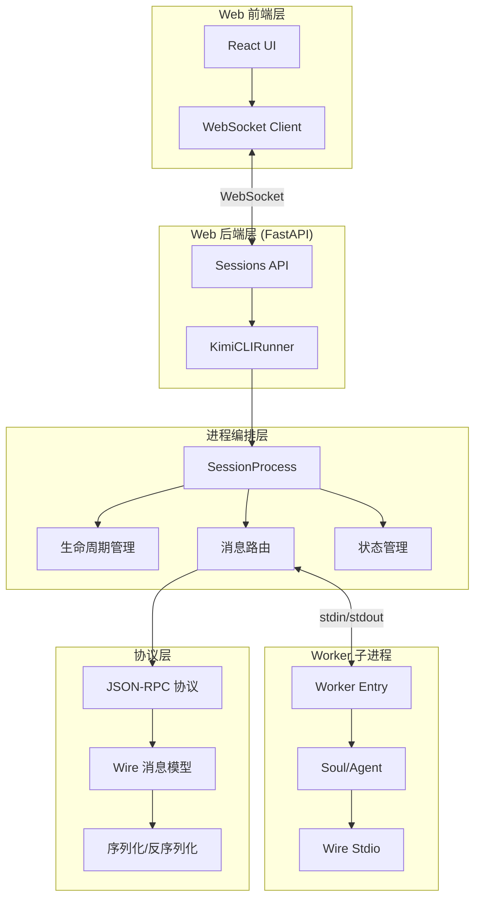

基于我对代码库的深入分析，我将为您编写 **Runner/Worker 编排与流式通讯域** 的技术实现文档。

---

# Runner/Worker 编排与流式通讯域技术实现文档

## 1. 领域概述

### 1.1 领域定位

Runner/Worker 编排与流式通讯域是 Kimi CLI 系统的**基础设施核心层**，负责在 Web 后端与 AI 代理执行进程之间建立可靠的通讯桥梁。该域将"AI 代理执行"与"Web 交互通道"解耦，通过标准化的 JSON-RPC/Wire 消息格式实现：

- **进程生命周期管理**：按会话粒度启动/停止/重启 worker 子进程
- **流式消息转发**：在 WebSocket 与 worker 子进程的 stdin/stdout 之间进行双向流式转发
- **状态跟踪与广播**：维护会话的忙碌/空闲/重启/错误状态，并实时广播给所有订阅客户端
- **历史回放支持**：为新加入的客户端提供历史事件回放与实时消息的有序拼接

### 1.2 核心价值

| 价值维度 | 具体体现 |
|---------|---------|
| **可靠性** | 通过进程隔离确保单个会话故障不影响其他会话；异常退出时自动清理并通知客户端 |
| **实时性** | 基于 WebSocket 的流式通讯，毫秒级延迟传递 AI 输出与工具执行结果 |
| **可扩展性** | 支持单会话多客户端订阅（SPMC 模式），新客户端可边回放历史边接收实时消息 |
| **可观测性** | 细粒度的状态机（idle/busy/restarting/error/stopped）与状态变更事件 |

---

## 2. 架构设计

### 2.1 整体架构图



### 2.2 核心组件职责

| 组件 | 职责 | 关键能力 |
|------|------|---------|
| **KimiCLIRunner** | 多会话编排器 | 管理所有 SessionProcess 实例；协调全局配置变更时的批量重启 |
| **SessionProcess** | 单会话进程容器 | 管理单个会话的 worker 子进程生命周期、WebSocket 连接集合、消息转发与状态广播 |
| **Worker 子进程** | AI 代理执行环境 | 加载会话配置、初始化 Soul/Agent、执行 Wire Stdio 模式的对话循环 |
| **Wire 协议** | 消息抽象层 | 定义事件/请求/响应的类型系统，支持工具调用、审批、提问等复杂交互 |
| **JSON-RPC 适配器** | 协议边界 | 在 WebSocket 文本帧与强类型 Wire 消息之间进行转换与校验 |

---

## 3. 核心实现

### 3.1 SessionProcess：单会话进程管理

#### 3.1.1 类结构与状态

```python
class SessionProcess:
    """管理单个会话的 KimiCLI 子进程"""
    
    def __init__(self, session_id: UUID):
        self.session_id = session_id
        
        # 忙碌状态跟踪
        self._in_flight_prompt_ids: set[str] = set()
        
        # 进程与任务
        self._process: asyncio.subprocess.Process | None = None
        self._read_task: asyncio.Task[None] | None = None
        
        # WebSocket 管理
        self._websockets: set[WebSocket] = set()
        self._replay_buffers: dict[WebSocket, list[str]] = {}
        
        # 状态管理
        self._status: SessionStatus = ...
        self._worker_id: str | None = None
        
        # 并发控制
        self._lock = asyncio.Lock()  # 保护进程生命周期与忙碌状态
        self._ws_lock = asyncio.Lock()  # 保护 WebSocket 集合
```

#### 3.1.2 关键属性

| 属性 | 说明 |
|------|------|
| `is_alive` | worker 子进程是否存在且未退出 |
| `is_busy` | 是否有进行中的 prompt 请求（`_in_flight_prompt_ids` 非空） |
| `status` | 当前状态快照（state/seq/worker_id/reason/detail/updated_at） |
| `websocket_count` | 已连接的 WebSocket 数量 |

**重要区分**：
- `is_alive` / `is_running`：进程存活性
- `is_busy`：业务忙碌性（有未完成的 prompt）

两者独立维护，支持"进程存活但空闲"与"进程重启但保持 WebSocket 连接"等场景。

### 3.2 进程生命周期管理

#### 3.2.1 启动流程

```python
async def start(
    self,
    *,
    reason: str | None = None,
    detail: str | None = None,
    restart_started_at: float | None = None,
) -> None:
    """启动 KimiCLI 子进程"""
    async with self._lock:
        if self.is_alive:
            # 进程已存在，确保读取任务运行
            if self._read_task is None or self._read_task.done():
                self._read_task = asyncio.create_task(self._read_loop())
            return
        
        # 清理状态
        self._in_flight_prompt_ids.clear()
        self._expecting_exit = False
        self._worker_id = str(uuid4())
        
        # 构建命令
        if getattr(sys, "frozen", False):
            worker_cmd = [sys.executable, "__web-worker", str(self.session_id)]
        else:
            worker_cmd = [
                sys.executable, "-m",
                "kimi_cli.web.runner.worker",
                str(self.session_id),
            ]
        
        # 创建子进程（16MB 缓冲区支持大消息如 base64 图片）
        self._process = await asyncio.create_subprocess_exec(
            *worker_cmd,
            stdin=asyncio.subprocess.PIPE,
            stdout=asyncio.subprocess.PIPE,
            stderr=asyncio.subprocess.PIPE,
            limit=16 * 1024 * 1024,
            env=get_clean_env(),  # 清洁环境变量
        )
        
        # 启动读取循环
        self._read_task = asyncio.create_task(self._read_loop())
        
        # 发送状态更新
        if restart_started_at is not None:
            elapsed_ms = int((time.perf_counter() - restart_started_at) * 1000)
            await self._emit_status("idle", reason=reason, detail=f"restart_ms={elapsed_ms}")
            await self._emit_restart_notice(reason=reason, restart_ms=elapsed_ms)
        else:
            await self._emit_status("idle", reason=reason or "start")
```

**关键设计点**：
1. **幂等性**：重复调用 `start()` 不会创建多个进程
2. **清洁环境**：通过 `get_clean_env()` 隔离环境变量，避免污染
3. **大缓冲区**：16MB 限制支持 base64 编码的图片等大消息
4. **重启计时**：记录重启耗时并通知前端

#### 3.2.2 停止与重启

```python
async def stop_worker(
    self,
    *,
    reason: str | None = None,
    emit_status: bool = True,
) -> None:
    """停止 worker 子进程，保持 WebSocket 连接"""
    async with self._lock:
        self._expecting_exit = True
        
        if self._process is not None:
            if self._process.returncode is None:
                self._process.terminate()
            try:
                await asyncio.wait_for(self._process.wait(), timeout=10.0)
            except TimeoutError:
                self._process.kill()
                await self._process.wait()
            self._process = None
        
        # 取消读取任务
        if self._read_task is not None:
            self._read_task.cancel()
            with contextlib.suppress(asyncio.CancelledError):
                await self._read_task
            self._read_task = None
        
        # 清理状态
        self._in_flight_prompt_ids.clear()
        self._worker_id = None
        self._expecting_exit = False
        
        if emit_status:
            await self._emit_status("stopped", reason=reason or "stop")

async def restart_worker(self, *, reason: str | None = None) -> None:
    """重启 worker 子进程，不断开 WebSocket"""
    started_at = time.perf_counter()
    await self._emit_status("restarting", reason=reason or "restart")
    await self.stop_worker(reason="restart", emit_status=False)
    await self.start(reason=reason or "restart", restart_started_at=started_at)
```

**设计亮点**：
- **优雅终止**：先 `terminate()`，10 秒超时后 `kill()`
- **状态连续性**：重启时先发 `restarting` 状态，完成后发 `idle`，避免状态跳变
- **WebSocket 保持**：`stop_worker()` 不关闭 WebSocket，支持无感重启

### 3.3 消息转发与处理

#### 3.3.1 读取循环（worker → WebSocket）

```python
async def _read_loop(self) -> None:
    """从子进程 stdout 读取消息并广播到 WebSocket"""
    assert self._process is not None
    assert self._process.stdout is not None
    
    try:
        while True:
            line = await self._process.stdout.readline()
            
            if not line:
                if self._process.stdout.at_eof():
                    if self._expecting_exit:
                        break
                    # 非预期退出，读取 stderr 并广播错误
                    stderr = await self._process.stderr.read()
                    await self._broadcast(
                        JSONRPCErrorResponse(
                            id=str(uuid4()),
                            error=JSONRPCErrorObject(
                                code=self._process.returncode or -1,
                                message=stderr.decode("utf-8"),
                            ),
                        ).model_dump_json()
                    )
                    self._in_flight_prompt_ids.clear()
                    await self._emit_status("error", reason="process_exit", detail=stderr.decode("utf-8"))
                    break
                else:
                    continue
            
            # 先广播原始行（保证实时性）
            await self._broadcast(line.decode("utf-8").rstrip("\n"))
            
            # 解析并处理结构化消息
            try:
                msg = json.loads(line)
                match msg.get("method"):
                    case "event":
                        msg["params"] = deserialize_wire_message(msg["params"])
                        await self._handle_out_message(JSONRPCEventMessage.model_validate(msg))
                    case "request":
                        msg["params"] = deserialize_wire_message(msg["params"])
                        await self._handle_out_message(JSONRPCRequestMessage.model_validate(msg))
                    case _:
                        if msg.get("error"):
                            await self._handle_out_message(JSONRPCErrorResponse.model_validate(msg))
                        else:
                            await self._handle_out_message(JSONRPCSuccessResponse.model_validate(msg))
            except json.JSONDecodeError:
                logger.error(f"Invalid JSONRPC out message: {line}")
    
    except asyncio.CancelledError:
        raise
    except Exception as e:
        logger.warning(f"Unexpected error in read loop: {e}")
```

**关键流程**：
1. **逐行读取**：按行解析 JSON-RPC 消息
2. **先广播后解析**：确保原始消息实时到达前端，再进行结构化处理
3. **Wire 反序列化**：对 `event`/`request` 的 `params` 字段调用 `deserialize_wire_message()` 转换为强类型对象
4. **异常处理**：非预期退出时读取 stderr 并广播错误响应

#### 3.3.2 出站消息处理

```python
async def _handle_out_message(self, message: JSONRPCOutMessage) -> None:
    """处理 worker 输出的消息，更新忙碌状态"""
    match message:
        case JSONRPCSuccessResponse():
            was_busy = self.is_busy
            if message.id in self._in_flight_prompt_ids:
                self._in_flight_prompt_ids.remove(message.id)
            if was_busy and not self.is_busy:
                await self._emit_status("idle", reason="prompt_complete")
        
        case JSONRPCErrorResponse():
            was_busy = self.is_busy
            if message.id in self._in_flight_prompt_ids:
                self._in_flight_prompt_ids.remove(message.id)
            if was_busy and not self.is_busy:
                await self._emit_status("idle", reason="prompt_error")
        
        case _:
            return
```

**状态转换逻辑**：
- 收到 `success`/`error` 响应时，从 `_in_flight_prompt_ids` 移除对应 ID
- 若集合变为空（`was_busy and not self.is_busy`），则发送 `idle` 状态

#### 3.3.3 入站消息处理（WebSocket → worker）

```python
async def send_message(self, message: str) -> None:
    """发送消息到子进程 stdin"""
    await self.start()  # 确保进程已启动
    process = self._process
    assert process is not None
    assert process.stdin is not None
    
    # 解析并处理入站消息
    try:
        in_message = JSONRPCInMessageAdapter.validate_json(message)
        
        if isinstance(in_message, JSONRPCPromptMessage):
            # 标记为忙碌
            was_busy = self.is_busy
            self._in_flight_prompt_ids.add(in_message.id)
            if not was_busy:
                await self._emit_status("busy", reason="prompt")
        
        elif isinstance(in_message, JSONRPCCancelMessage) and not self.is_busy:
            # 若不忙碌，直接返回成功避免错误
            await self._broadcast(
                JSONRPCSuccessResponse(id=in_message.id, result={}).model_dump_json()
            )
            return
        
        # 处理上传文件编码
        new_message = await self._handle_in_message(in_message)
        if new_message is not None:
            message = new_message
    
    except ValueError as e:
        logger.error(f"Invalid JSONRPC in message: {message}")
        return
    
    # 写入 stdin
    process.stdin.write((message + "\n").encode("utf-8"))
    await process.stdin.drain()
```

**关键处理**：
1. **自动启动**：调用 `start()` 确保进程存在
2. **忙碌标记**：prompt 消息到达时立即标记为 `busy`
3. **取消优化**：若当前不忙碌，直接返回成功响应，避免无意义错误
4. **文件编码**：通过 `_handle_in_message()` 将上传文件内嵌到 prompt 中

### 3.4 上传文件编码

```python
async def _encode_uploaded_files(self) -> AsyncGenerator[ContentPart]:
    """将上传文件编码为 ContentPart 发送给模型"""
    session = load_session_by_id(self.session_id)
    uploads_dir = session.kimi_cli_session.dir / "uploads"
    
    if not uploads_dir.exists():
        return
    
    # 加载 .sent 标记，避免重复发送（支持 fork 继承）
    sent_marker = uploads_dir / ".sent"
    if sent_marker.exists():
        already_sent = json.loads(sent_marker.read_text())
        self._sent_files.update(already_sent)
    
    # 过滤已发送文件
    all_files = sorted(uploads_dir.iterdir(), key=lambda x: x.name)
    files = [f for f in all_files if f.name not in self._sent_files and f.name != ".sent"]
    
    if not files:
        return
    
    # 输出文件列表摘要
    yield TextPart(text="<uploaded_files>\n" + "\n".join(f"{i}. {f}" for i, f in enumerate(files, 1)) + "\n</uploaded_files>\n\n")
    
    # 检查模型能力
    config = load_config()
    capabilities = config.models[config.default_model].capabilities or set()
    is_vision = "image_in" in capabilities
    is_video_in = "video_in" in capabilities
    
    # 处理每个文件
    for file in files:
        mime_type, _ = mimetypes.guess_type(file.name)
        ext = file.suffix.lower()
        
        if is_vision and mime_type.startswith("image/"):
            # 图片：压缩并 base64 编码
            content = file.read_bytes()
            with Image.open(io.BytesIO(content)) as img:
                # 限制最大边长 4096
                width, height = img.size
                if max(width, height) > 4096:
                    scale = 4096 / max(width, height)
                    img = img.resize((int(width * scale), int(height * scale)))
                
                buffer = io.BytesIO()
                img.save(buffer, format="PNG")
                encoded = base64.b64encode(buffer.getvalue()).decode("ascii")
                
                yield TextPart(text=f'<image path="{file}" content_type="{mime_type}">')
                yield ImageURLPart(image_url=ImageURLPart.ImageURL(url=f"data:image/png;base64,{encoded}"))
                yield TextPart(text="</image>\n\n")
        
        elif is_video_in and mime_type.startswith("video/"):
            # 视频：仅输出标签，由工具读取
            yield TextPart(text=f'<video path="{file}" content_type="{mime_type}"></video>\n\n')
        
        elif ext in TEXT_EXTENSIONS or mime_type.startswith("text/"):
            # 文本：直接内嵌内容
            text_content = file.read_bytes().decode("utf-8", errors="replace")
            yield TextPart(text=f'<document path="{file}" content_type="{mime_type}">{text_content}</document>\n\n')
    
    # 标记为已发送
    for file in files:
        self._sent_files.add(file.name)
```

**设计要点**：
1. **去重机制**：通过 `.sent` 标记文件避免重复发送，支持 fork 会话继承
2. **能力检测**：根据模型能力决定是否内嵌图片/视频
3. **图片压缩**：限制最大边长 4096，减少 token 消耗
4. **视频延迟加载**：仅输出标签，由 `ReadMediaFile` 工具按需读取
5. **容错处理**：编码失败时跳过文件，不阻塞整体上传

### 3.5 WebSocket 管理与历史回放

#### 3.5.1 连接管理

```python
async def add_websocket_and_begin_replay(self, ws: WebSocket) -> None:
    """原子地添加 WebSocket 并进入回放模式"""
    async with self._ws_lock:
        if ws not in self._websockets:
            self._websockets.add(ws)
            self._websocket_count = len(self._websockets)
        # 创建回放缓冲区
        self._replay_buffers.setdefault(ws, [])

async def end_replay(self, ws: WebSocket) -> None:
    """回放完成后，批量发送缓冲的实时消息"""
    while True:
        async with self._ws_lock:
            buffer = self._replay_buffers.get(ws)
            if buffer is None:
                return
            if not buffer:
                self._replay_buffers.pop(ws, None)
                return
            chunk = buffer.copy()
            buffer.clear()
        
        # 批量发送
        if ws.client_state != WebSocketState.CONNECTED:
            async with self._ws_lock:
                self._replay_buffers.pop(ws, None)
            return
        
        for message in chunk:
            try:
                await ws.send_text(message)
            except Exception as e:
                logger.warning(f"end_replay: send failed: {e}")
                async with self._ws_lock:
                    self._replay_buffers.pop(ws, None)
                return

async def remove_websocket(self, ws: WebSocket) -> None:
    """移除 WebSocket 连接"""
    async with self._ws_lock:
        if ws in self._websockets:
            self._websockets.discard(ws)
            self._websocket_count = len(self._websockets)
        self._replay_buffers.pop(ws, None)
```

#### 3.5.2 广播机制

```python
async def _broadcast(self, message: str) -> None:
    """广播消息到所有 WebSocket"""
    disconnected: set[WebSocket] = set()
    
    async with self._ws_lock:
        websockets = list(self._websockets)
        to_send: list[WebSocket] = []
        
        for ws in websockets:
            buffer = self._replay_buffers.get(ws)
            if buffer is not None:
                # 回放模式：追加到缓冲区
                buffer.append(message)
            else:
                # 正常模式：直接发送
                to_send.append(ws)
    
    # 发送消息（不持锁）
    for ws in to_send:
        try:
            if ws.client_state == WebSocketState.CONNECTED:
                await ws.send_text(message)
            else:
                disconnected.add(ws)
        except Exception as e:
            logger.warning(f"websocket failed: {e}")
            disconnected.add(ws)
    
    # 清理断开的连接
    if disconnected:
        async with self._ws_lock:
            self._websockets -= disconnected
            self._websocket_count = len(self._websockets)
            for ws in disconnected:
                self._replay_buffers.pop(ws, None)
```

**回放机制设计**：
1. **原子进入回放**：`add_websocket_and_begin_replay()` 同时添加 WebSocket 和创建缓冲区
2. **实时消息缓冲**：回放期间的 live 消息追加到 `_replay_buffers[ws]`
3. **批量 flush**：`end_replay()` 按批次发送缓冲消息，确保顺序
4. **锁分离**：广播时先持锁分类，再释放锁发送，避免阻塞

**顺序保证**：
```
时间线：
  [历史回放开始] → [live 消息 1] → [live 消息 2] → [历史回放结束] → [flush 缓冲] → [live 消息 3]
  
客户端接收顺序：
  历史事件 1...N → live 消息 1 → live 消息 2 → live 消息 3
```

### 3.6 KimiCLIRunner：多会话编排

```python
class KimiCLIRunner:
    """管理多个会话进程"""
    
    def __init__(self):
        self._sessions: dict[UUID, SessionProcess] = {}
        self._lock = asyncio.Lock()
    
    async def get_or_create_session(self, session_id: UUID) -> SessionProcess:
        """获取或创建会话进程"""
        async with self._lock:
            if session_id not in self._sessions:
                self._sessions[session_id] = SessionProcess(session_id)
            return self._sessions[session_id]
    
    async def restart_running_workers(
        self,
        *,
        reason: str,
        force: bool,
    ) -> RestartWorkersSummary:
        """重启所有运行中的 worker（用于配置更新）"""
        async with self._lock:
            running = [(sid, proc) for sid, proc in self._sessions.items() if proc.is_running]
        
        restarted: list[UUID] = []
        skipped_busy: list[UUID] = []
        tasks: list[asyncio.Task[None]] = []
        
        for session_id, proc in running:
            if proc.is_busy and not force:
                # 忙碌会话跳过（除非强制）
                skipped_busy.append(session_id)
                continue
            
            restarted.append(session_id)
            tasks.append(asyncio.create_task(proc.restart_worker(reason=reason)))
        
        if tasks:
            await asyncio.gather(*tasks, return_exceptions=True)
        
        return RestartWorkersSummary(
            restarted_session_ids=restarted,
            skipped_busy_session_ids=skipped_busy,
        )
```

**批量重启策略**：
- **默认跳过忙碌会话**：避免中断正在进行的对话
- **支持强制重启**：`force=True` 时重启所有会话
- **并发执行**：使用 `asyncio.gather()` 并行重启
- **返回摘要**：区分已重启与跳过的会话列表

---

## 4. Wire 协议设计

### 4.1 JSON-RPC 消息模型

#### 4.1.1 入站消息（客户端 → 服务端 → worker）

```python
type JSONRPCInMessage = (
    JSONRPCSuccessResponse       # 响应（用于双向通讯）
    | JSONRPCErrorResponse
    | JSONRPCInitializeMessage   # 初始化
    | JSONRPCPromptMessage       # 用户输入
    | JSONRPCSteerMessage        # 引导消息
    | JSONRPCReplayMessage       # 回放请求
    | JSONRPCCancelMessage       # 取消请求
)
```

**关键消息类型**：

| 消息类型 | 用途 | 参数 |
|---------|------|------|
| `initialize` | 初始化会话，声明客户端能力 | `protocol_version`, `client`, `external_tools`, `capabilities` |
| `prompt` | 发送用户输入 | `user_input: str \| list[ContentPart]` |
| `steer` | 在当前 turn 中注入引导消息 | `user_input: str \| list[ContentPart]` |
| `replay` | 请求回放历史 | 无参数 |
| `cancel` | 取消当前执行 | 无参数 |

#### 4.1.2 出站消息（worker → 服务端 → 客户端）

```python
type JSONRPCOutMessage = (
    JSONRPCSuccessResponse           # 成功响应
    | JSONRPCErrorResponse           # 错误响应
    | JSONRPCErrorResponseNullableID # 错误响应（可空 ID）
    | JSONRPCEventMessage            # 事件通知
    | JSONRPCRequestMessage          # 请求（如审批、提问）
)
```

**事件与请求**：

| 类型 | 说明 | 示例 |
|------|------|------|
| `event` | 单向通知