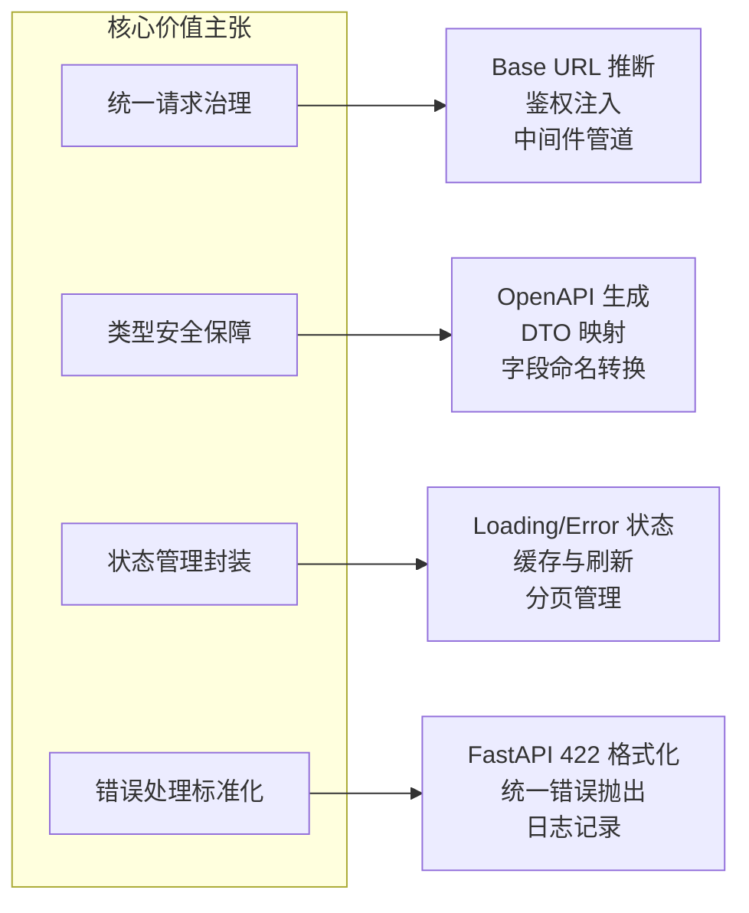
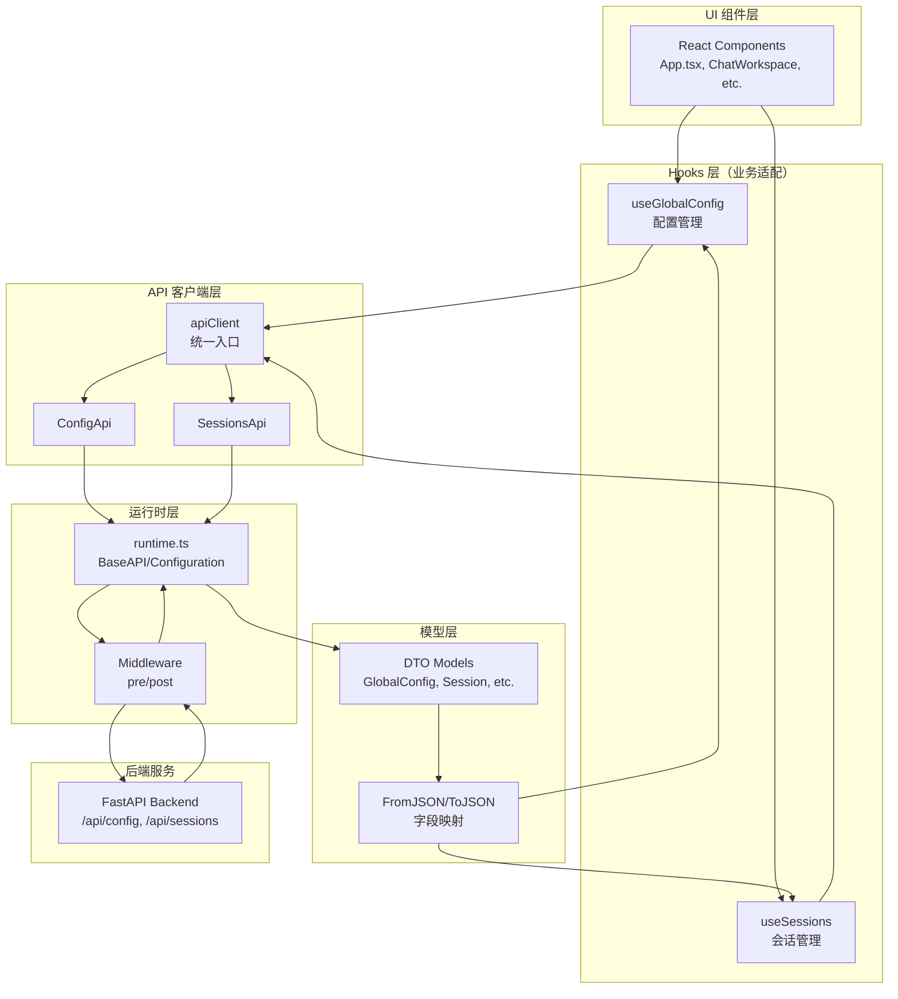

现在我已经收集了足够的信息，让我为您生成完整的 Web 前端 API 接入域技术文档。

# Web 前端 API 接入域技术文档

## 文档信息

| 项目 | 内容 |
|------|------|
| **领域名称** | Web 前端 API 接入域 |
| **领域类型** | 支撑域 |
| **文档版本** | v1.0 |
| **生成时间** | 2026-02-28 |
| **重要性评分** | 8/10 |
| **复杂度评分** | 6/10 |

---

## 1. 领域概述

### 1.1 领域定位

Web 前端 API 接入域是连接前端 UI 组件与后端 FastAPI 服务的关键支撑层。该域负责将后端通过 OpenAPI 规范暴露的 REST 接口以类型安全的 TypeScript 客户端形式接入前端，并在 React 层提供面向业务的自定义 Hooks，实现会话管理、全局配置等核心功能。

### 1.2 核心价值



### 1.3 技术选型

| 技术组件 | 选型 | 理由 |
|---------|------|------|
| **API 客户端生成** | OpenAPI Generator | 自动生成类型安全的 TypeScript 客户端，减少手工维护成本 |
| **HTTP 客户端** | Fetch API | 浏览器原生支持，配合 middleware 实现灵活的请求拦截 |
| **状态管理** | React Hooks (useState/useCallback) | 轻量级状态管理，适合 API 调用场景 |
| **字段映射** | FromJSON/ToJSON 函数 | 自动处理 snake_case ↔ camelCase 转换 |

---

## 2. 架构设计

### 2.1 分层架构



### 2.2 核心组件关系

| 组件 | 职责 | 依赖 |
|------|------|------|
| **apiClient** | 统一 API 入口，lazy 创建 Configuration | ConfigApi, SessionsApi, runtime |
| **ConfigApi** | 配置相关接口（获取/更新全局配置、TOML 文件） | BaseAPI, GlobalConfig DTO |
| **SessionsApi** | 会话相关接口（CRUD、文件上传、Fork、Git diff） | BaseAPI, Session DTO |
| **runtime.ts** | OpenAPI 运行时基础设施 | Configuration, Middleware, BaseAPI |
| **useGlobalConfig** | 全局配置状态管理 Hook | apiClient.config |
| **useSessions** | 会话状态管理 Hook | apiClient.sessions, 直接 fetch |

---

## 3. 核心模块详解

### 3.1 OpenAPI 客户端运行时（runtime.ts）

#### 3.1.1 Configuration 配置管理

```typescript
// 核心配置项
export interface ConfigurationParameters {
    basePath?: string;              // API 基础路径
    fetchApi?: FetchAPI;            // 自定义 fetch 实现
    middleware?: Middleware[];      // 中间件数组
    queryParamsStringify?: (params: HTTPQuery) => string;
    username?: string;              // Basic Auth
    password?: string;
    apiKey?: string | Promise<string> | Function;
    accessToken?: string | Promise<string> | Function;
    headers?: HTTPHeaders;          // 全局 headers
    credentials?: RequestCredentials;
}
```

**关键特性：**

- **动态 basePath**：支持运行时切换 API 基础路径（开发/生产环境）
- **中间件管道**：pre → fetch → post，支持请求/响应拦截
- **多种认证方式**：Basic Auth、API Key、OAuth2 Access Token
- **全局 headers**：统一注入通用请求头

#### 3.1.2 BaseAPI 请求基类

```typescript
export class BaseAPI {
    // 核心请求方法
    protected async request(
        context: RequestOpts, 
        initOverrides?: RequestInit
    ): Promise<Response> {
        const { url, init } = await this.createFetchParams(context, initOverrides);
        const response = await this.fetchApi(url, init);
        
        if (response.status >= 200 && response.status < 300) {
            return response;
        }
        throw new ResponseError(response, 'Response returned an error code');
    }
    
    // 构建请求参数
    private async createFetchParams(context: RequestOpts) {
        // 1. 拼接 URL：basePath + path + querystring
        let url = this.configuration.basePath + context.path;
        if (context.query && Object.keys(context.query).length > 0) {
            url += '?' + this.configuration.queryParamsStringify(context.query);
        }
        
        // 2. 合并 headers（全局 + 请求级别）
        const headers = Object.assign({}, 
            this.configuration.headers, 
            context.headers
        );
        
        // 3. 处理 body 序列化
        let body: any;
        if (isFormData(body) || body instanceof URLSearchParams || isBlob(body)) {
            body = overriddenInit.body;  // 直接透传
        } else if (this.isJsonMime(headers['Content-Type'])) {
            body = JSON.stringify(overriddenInit.body);  // JSON 序列化
        }
        
        return { url, init: { method, headers, body, credentials } };
    }
}
```

**请求处理流程：**

1. **URL 构建**：basePath + path，有 query 参数时追加 querystring
2. **Headers 合并**：全局 headers + 请求 headers，清理 undefined
3. **Body 序列化**：根据 Content-Type 判断是否 JSON.stringify
4. **中间件执行**：pre → fetch → post
5. **错误处理**：非 2xx 抛出 ResponseError

#### 3.1.3 Middleware 中间件机制

```typescript
export interface Middleware {
    pre?(context: RequestContext): Promise<FetchParams | void>;
    post?(context: ResponseContext): Promise<Response | void>;
    onError?(context: ErrorContext): Promise<Response | void>;
}

// 中间件执行流程
private fetchApi = async (url: string, init: RequestInit) => {
    let fetchParams = { url, init };
    
    // 1. 执行所有 pre 中间件
    for (const middleware of this.middleware) {
        if (middleware.pre) {
            fetchParams = await middleware.pre({
                fetch: this.fetchApi,
                ...fetchParams,
            }) || fetchParams;
        }
    }
    
    // 2. 执行 fetch
    let response: Response | undefined;
    try {
        response = await (this.configuration.fetchApi || fetch)(
            fetchParams.url, 
            fetchParams.init
        );
    } catch (error) {
        // 3. 错误时执行 onError 中间件
        for (const middleware of this.middleware) {
            if (middleware.onError) {
                response = await middleware.onError({
                    fetch: this.fetchApi,
                    url: fetchParams.url,
                    init: fetchParams.init,
                    error,
                    response: response?.clone(),
                });
                if (response) break;
            }
        }
        if (!response) throw new FetchError(error, 'Fetch failed');
    }
    
    // 4. 执行所有 post 中间件
    for (const middleware of this.middleware) {
        if (middleware.post) {
            response = await middleware.post({
                fetch: this.fetchApi,
                url: fetchParams.url,
                init: fetchParams.init,
                response: response.clone(),
            }) || response;
        }
    }
    
    return response;
};
```

---

### 3.2 统一请求入口（apiClient.ts）

#### 3.2.1 配置创建工厂

```typescript
function createConfig(): Configuration {
    return new Configuration({
        basePath: getApiBaseUrl(),  // 动态获取 API 基础路径
        middleware: [
            {
                // Pre 中间件：注入鉴权 header
                pre: async (context: RequestContext) => {
                    context.init.headers = {
                        ...context.init.headers,
                        ...getAuthHeader(),  // 注入 Bearer token
                    };
                    return context;
                },
                
                // Post 中间件：统一错误处理
                post: async (context: ResponseContext) => {
                    if (!context.response.ok) {
                        const data = await context.response.json();
                        let message: string;
                        
                        // FastAPI 422 验证错误特殊处理
                        if (context.response.status === 422 && data.detail) {
                            message = formatValidationError(data.detail);
                        } else if (typeof data.detail === 'string') {
                            message = data.detail;
                        } else if (typeof data.msg === 'string') {
                            message = data.msg;
                        } else {
                            message = 'Request failed';
                        }
                        
                        // 根据状态码输出差异化日志
                        switch (context.response.status) {
                            case 401:
                                console.error('Authentication failed. Please login again.');
                                break;
                            case 403:
                                console.error(message);
                                break;
                            case 404:
                                console.error('The requested resource was not found.');
                                break;
                            default:
                                console.error(message);
                        }
                        
                        throw new Error(message);
                    }
                    return context.response;
                },
            },
        ],
    });
}
```

#### 3.2.2 FastAPI 验证错误格式化

```typescript
/**
 * FastAPI 返回的验证错误格式：
 * {
 *   "detail": [
 *     { "loc": ["body", "llm", "model"], "msg": "Field required", "type": "missing" }
 *   ]
 * }
 */
function formatValidationError(detail: unknown): string {
    if (Array.isArray(detail)) {
        return detail
            .map((err) => {
                if (err && typeof err === 'object' && 'msg' in err) {
                    // 提取 loc 路径（跳过第一个元素 "body"）
                    const loc = Array.isArray(err.loc) 
                        ? err.loc.slice(1).join('.') 
                        : '';
                    return loc ? `${loc}: ${err.msg}` : err.msg;
                }
                return String(err);
            })
            .join('; ');
    }
    if (typeof detail === 'string') {
        return detail;
    }
    return 'Validation failed';
}

// 示例输出：
// "llm.model: Field required; default_thinking: Value must be boolean"
```

#### 3.2.3 Lazy Getters 模式

```typescript
export const apiClient = {
    // 每次访问时创建新的 ConfigApi 实例
    get config() {
        return new ConfigApi(createConfig());
    },
    
    // 每次访问时创建新的 SessionsApi 实例
    get sessions() {
        return new SessionsApi(createConfig());
    },
};
```

**设计理由：**

- **避免过期配置**：每次调用都获取最新的 basePath 和鉴权信息
- **支持运行时切换**：用户可能在运行时修改 API 地址或登录状态
- **无状态设计**：不持有长期实例，减少内存泄漏风险

---

### 3.3 生成的 API 类

#### 3.3.1 ConfigApi（配置管理）

```typescript
export class ConfigApi extends runtime.BaseAPI {
    /**
     * 获取全局配置
     * GET /api/config/
     */
    async getGlobalConfigApiConfigGet(
        initOverrides?: RequestInit
    ): Promise<GlobalConfig> {
        const response = await this.getGlobalConfigApiConfigGetRaw(initOverrides);
        return await response.value();
    }
    
    async getGlobalConfigApiConfigGetRaw(
        initOverrides?: RequestInit
    ): Promise<runtime.ApiResponse<GlobalConfig>> {
        const queryParameters: any = {};
        const headerParameters: runtime.HTTPHeaders = {};
        
        const response = await this.request({
            path: `/api/config/`,
            method: 'GET',
            headers: headerParameters,
            query: queryParameters,
        }, initOverrides);
        
        return new runtime.JSONApiResponse(response, (jsonValue) => 
            GlobalConfigFromJSON(jsonValue)
        );
    }
    
    /**
     * 更新全局配置
     * PATCH /api/config/
     */
    async updateGlobalConfigApiConfigPatch(
        requestParameters: UpdateGlobalConfigApiConfigPatchRequest,
        initOverrides?: RequestInit
    ): Promise<UpdateGlobalConfigResponse> {
        // 参数校验
        if (requestParameters['updateGlobalConfigRequest'] == null) {
            throw new runtime.RequiredError(
                'updateGlobalConfigRequest',
                'Required parameter was null or undefined'
            );
        }
        
        const queryParameters: any = {};
        const headerParameters: runtime.HTTPHeaders = {};
        headerParameters['Content-Type'] = 'application/json';
        
        const response = await this.request({
            path: `/api/config/`,
            method: 'PATCH',
            headers: headerParameters,
            query: queryParameters,
            body: UpdateGlobalConfigRequestToJSON(
                requestParameters['updateGlobalConfigRequest']
            ),
        }, initOverrides);
        
        return new runtime.JSONApiResponse(response, (jsonValue) => 
            UpdateGlobalConfigResponseFromJSON(jsonValue)
        ).value();
    }
}
```

#### 3.3.2 SessionsApi（会话管理）

```typescript
export class SessionsApi extends runtime.BaseAPI {
    /**
     * 列出会话
     * GET /api/sessions/
     */
    async listSessionsApiSessionsGet(
        requestParameters: ListSessionsApiSessionsGetRequest = {},
        initOverrides?: RequestInit
    ): Promise<Array<Session>> {
        const queryParameters: any = {};
        
        if (requestParameters['limit'] != null) {
            queryParameters['limit'] = requestParameters['limit'];
        }
        if (requestParameters['offset'] != null) {
            queryParameters['offset'] = requestParameters['offset'];
        }
        if (requestParameters['q'] != null) {
            queryParameters['q'] = requestParameters['q'];
        }
        if (requestParameters['archived'] != null) {
            queryParameters['archived'] = requestParameters['archived'];
        }
        
        const response = await this.request({
            path: `/api/sessions/`,
            method: 'GET',
            headers: {},
            query: queryParameters,
        }, initOverrides);
        
        return new runtime.JSONApiResponse(response, (jsonValue) => 
            jsonValue.map(SessionFromJSON)
        ).value();
    }
    
    /**
     * 上传文件到会话
     * POST /api/sessions/{session_id}/files
     */
    async uploadSessionFileApiSessionsSessionIdFilesPost(
        requestParameters: UploadSessionFileRequest,
        initOverrides?: RequestInit
    ): Promise<UploadSessionFileResponse> {
        // 参数校验
        if (requestParameters['sessionId'] == null) {
            throw new runtime.RequiredError('sessionId', 'Required parameter');
        }
        if (requestParameters['file'] == null) {
            throw new runtime.RequiredError('file', 'Required parameter');
        }
        
        const queryParameters: any = {};
        const headerParameters: runtime.HTTPHeaders = {};
        
        // 构建 FormData
        const formData = new FormData();
        if (requestParameters['file'] != null) {
            formData.append('file', requestParameters['file']);
        }
        
        const response = await this.request({
            path: `/api/sessions/{session_id}/files`
                .replace(`{session_id}`, encodeURIComponent(
                    String(requestParameters['sessionId'])
                )),
            method: 'POST',
            headers: headerParameters,
            query: queryParameters,
            body: formData,
        }, initOverrides);
        
        return new runtime.JSONApiResponse(response, (jsonValue) => 
            UploadSessionFileResponseFromJSON(jsonValue)
        ).value();
    }
}
```

---

### 3.4 DTO 模型与字段映射

#### 3.4.1 GlobalConfig 模型

```typescript
/**
 * 全局配置快照（前端使用）
 */
export interface GlobalConfig {
    defaultModel: string;           // 当前默认模型
    defaultThinking: boolean;       // 当前默认 thinking 模式
    models: Array<ConfigModel>;     // 所有已配置模型
}

// FromJSON：snake_case → camelCase
export function GlobalConfigFromJSON(json: any): GlobalConfig {
    return {
        defaultModel: json['default_model'],
        defaultThinking: json['default_thinking'],
        models: json['models'].map(ConfigModelFromJSON),
    };
}

// ToJSON：camelCase → snake_case
export function GlobalConfigToJSON(value: GlobalConfig): any {
    return {
        'default_model': value.defaultModel,
        'default_thinking': value.defaultThinking,
        'models': value.models.map(ConfigModelToJSON),
    };
}
```

#### 3.4.2 UpdateGlobalConfigResponse 模型

```typescript
/**
 * 更新全局配置后的响应
 */
export interface UpdateGlobalConfigResponse {
    config: GlobalConfig;                    // 更新后的配置快照
    restartedSessionIds?: Array<string>;     // 已重启的会话 ID 列表
    skippedBusySessionIds?: Array<string>;   // 跳过的忙碌会话 ID 列表
}

export function UpdateGlobalConfigResponseFromJSON(json: any): UpdateGlobalConfigResponse {
    return {
        config: GlobalConfigFromJSON(json['config']),
        restartedSessionIds: json['restarted_session_ids'],
        skippedBusySessionIds: json['skipped_busy_session_ids'],
    };
}
```

**副作用信息设计：**

- **restartedSessionIds**：告知前端哪些会话已成功重启
- **skippedBusySessionIds**：告知前端哪些会话因忙碌被跳过，可提示用户强制重启

---

### 3.5 React Hooks 层

#### 3.5.1 useGlobalConfig Hook

```typescript
export function useGlobalConfig(): UseGlobalConfigReturn {
    const [config, setConfig] = useState<GlobalConfig | null>(null);
    const [isLoading, setIsLoading] = useState(false);
    const [isUpdating, setIsUpdating] = useState(false);
    const [error, setError] = useState<string | null>(null);
    const isInitializedRef = useRef(false);
    
    // 刷新配置
    const refresh = useCallback(async () => {
        setIsLoading(true);
        setError(null);
        try {
            const nextConfig = await apiClient.config.getGlobalConfigApiConfigGet();
            setConfig(nextConfig);
        } catch (err) {
            const message = err instanceof Error 
                ? err.message 
                : 'Failed to load global config';
            setError(message);
            console.error('[useGlobalConfig] Failed to load:', err);
        } finally {
            setIsLoading(false);
        }
    }, []);
    
    // 更新配置
    const update = useCallback(async (
        args: UpdateGlobalConfigArgs
    ): Promise<UpdateGlobalConfigResponse> => {
        setIsUpdating(true);
        setError(null);
        try {
            // 构造请求体（显式 undefined 避免误传 null）
            const body: UpdateGlobalConfigRequest = {
                defaultModel: args.defaultModel ?? undefined,
                defaultThinking: args.defaultThinking ?? undefined,
                restartRunningSessions: args.restartRunningSessions ?? undefined,
                forceRestartBusySessions: args.forceRestartBusySessions ?? undefined,
            };
            
            const resp = await apiClient.config.updateGlobalConfigApiConfigPatch({
                updateGlobalConfigRequest: body,
            });
            
            // 用响应中的 config 覆盖本地状态
            setConfig(resp.config);
            return resp;
        } catch (err) {
            const message = err instanceof Error 
                ? err.message 
                : 'Failed to update global config';
            setError(message);
            console.error('[useGlobalConfig] Failed to update:', err);
            throw err;
        } finally {
            setIsUpdating(false);
        }
    }, []);
    
    // 初始化：首次 mount 时自动刷新
    useEffect(() => {
        if (isInitializedRef.current) return;
        isInitializedRef.current = true;
        refresh();
    }, [refresh]);
    
    return { config, isLoading, isUpdating, error, refresh, update };
}
```

**状态管理策略：**

- **isLoading**：初始加载或手动刷新时为 true
- **isUpdating**：更新配置时为 true
- **error**：存储最近一次错误信息
- **防重复初始化**：使用 useRef 确保只初始化一次

#### 3.5.2 useSessions Hook（核心功能）

```typescript
export function useSessions(): UseSessionsReturn {
    const [sessions, setSessions] = useState<Session[]>([]);
    const [archivedSessions, setArchivedSessions] = useState<Session[]>([]);
    const [selectedSessionId, setSelectedSessionId] = useState<string>('');
    const [isLoading, setIsLoading] = useState(false);
    const [error, setError] = useState<string | null>(null);
    const [hasMoreSessions, setHasMoreSessions] = useState(true);
    const [searchQuery, setSearchQuery] = useState('');
    const lastRefreshRef = useRef(0);
    
    // 刷新会话列表
    const refreshSessions = useCallback(async () => {
        setIsLoading(true);
        setError(null);
        try {
            const sessionsList = await apiClient.sessions.listSessionsApiSessionsGet({
                limit: PAGE_SIZE,
                offset: 0,
                q: searchQuery.trim() || undefined,
            });
            
            setSessions(sessionsList);
            setHasMoreSessions(sessionsList.length === PAGE_SIZE);
            lastRefreshRef.current = Date.now();
        } catch (err) {
            const message = err instanceof Error 
                ? err.message 
                : 'Failed to load sessions';
            setError(message);
            console.error('Failed to refresh sessions:', err);
        } finally {
            setIsLoading(false);
        }
    }, [searchQuery]);
    
    // 分页加载更多
    const loadMoreSessions = useCallback(async () => {
        if (isLoadingMore || isLoading || !hasMoreSessions) return;
        
        setIsLoadingMore(true);
        setError(null);
        try {
            const offset = sessions.length;
            const moreSessions = await apiClient.sessions.listSessionsApiSessionsGet({
                limit: PAGE_SIZE,
                offset,
                q: searchQuery.trim() || undefined,
            });
            
            setSessions((current) => [...current, ...moreSessions]);
            setHasMoreSessions(moreSessions.length === PAGE_SIZE);
            lastRefreshRef.current = Date.now();
        } catch (err) {
            const message = err instanceof Error 
                ? err.message 
                : 'Failed to load more sessions';
            setError(message);
        } finally {
            setIsLoadingMore(false);
        }
    }, [hasMoreSessions, isLoading, isLoadingMore, searchQuery, sessions.length]);
    
    // 应用会话状态更新（来自 WebSocket）
    const applySessionStatus = useCallback((status: SessionStatus) => {
        setSessions((current) =>
            current.map((session) =>
                session.sessionId === status.sessionId
                    ? { ...session, status }
                    : session
            )
        );
    }, []);
    
    // 创建会话（使用直接 fetch）
    const createSession = useCallback(async (
        workDir?: string,
        createDir?: boolean
    ): Promise<Session> => {
        const basePath = getApiBaseUrl();
        const body: any = {};
        
        if (workDir) {
            body.work_dir = normalizeSessionPath(workDir);
        }
        if (createDir !== undefined) {
            body.create_dir = createDir;
        }
        
        const response = await fetch(`${basePath}/api/sessions/`, {
            method: 'POST',
            headers: {
                'Content-Type': 'application/json',
                ...getAuthHeader(),
            },
            body: JSON.stringify(body),
        });
        
        if (!response.ok) {
            const data = await response.json();
            if (response.status === 404 && data.detail?.includes('does not exist')) {
                throw new DirectoryNotFoundError(data.detail);
            }
            throw new Error(data.detail || 'Failed to create session');
        }
        
        const data = await response.json();
        return SessionFromJSON(data);
    }, []);
    
    // 路径规范化
    const normalizeSessionPath = (value?: string): string => {
        if (!value) return '.';
        const trimmed = value.trim();
        if (trimmed === '' || trimmed === '/' || trimmed === '.') return '.';
        
        return trimmed
            .replace(/^\.\/+/, '')      // 去除前导 ./
            .replace(/^\/+/, '')        // 去除前导 /
            .replace(/\s+$/, '');       // 去除尾部空白
    };
    
    // 自动刷新策略
    useEffect(() => {
        // searchQuery 变化时触发刷新
        refreshSessions();
    }, [searchQuery]);
    
    useEffect(() => {
        // 可见性切换时节流刷新（>=60s）
        const handleVisibilityChange = () => {
            if (document.visibilityState === 'visible') {
                const now = Date.now();
                if (now - lastRefreshRef.current >= 60_000) {
                    refreshSessions();
                }
            }
        };
        
        document.addEventListener('visibilitychange', handleVisibilityChange);
        return () => document.removeEventListener('visibilitychange', handleVisibilityChange);
    }, [refreshSessions]);
    
    useEffect(() => {
        // 无搜索时每 30s 定时刷新
        if (searchQuery) return;
        
        const interval = setInterval(() => {
            if (document.visibilityState === 'visible' && !isLoading) {
                refreshSessions();
            }
        }, AUTO_REFRESH_MS);
        
        return () => clearInterval(interval);
    }, [searchQuery, isLoading, refreshSessions]);
    
    return {
        sessions,
        archivedSessions,
        selectedSessionId,
        isLoading,
        error,
        refreshSessions,
        loadMoreSessions,
        hasMoreSessions,
        searchQuery,
        setSearchQuery,
        createSession,
        applySessionStatus,
        // ... 其他方法
    };
}
```

**混合调用策略：**

| 接口类型 | 调用方式 | 理由 |
|---------|---------|------|
| 标准 CRUD | apiClient.sessions | 使用生成客户端，类型安全 |
| 归档列表 | 直接 fetch | 生成客户端未覆盖 archived 参数 |
| 创建会话 | 直接 fetch | 需要自定义错误处理（DirectoryNotFoundError） |
| 批量操作 | 直接 fetch |