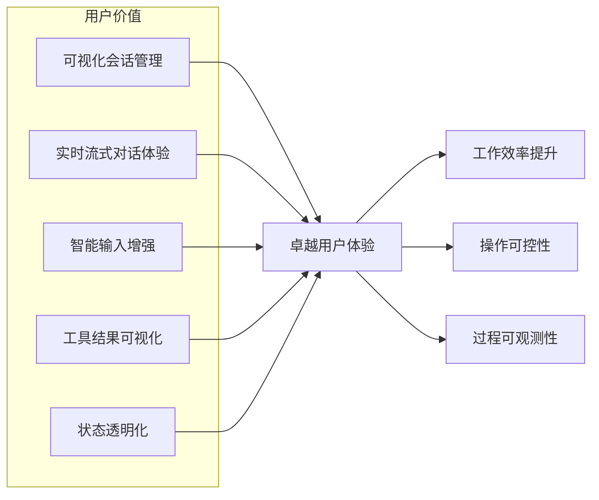
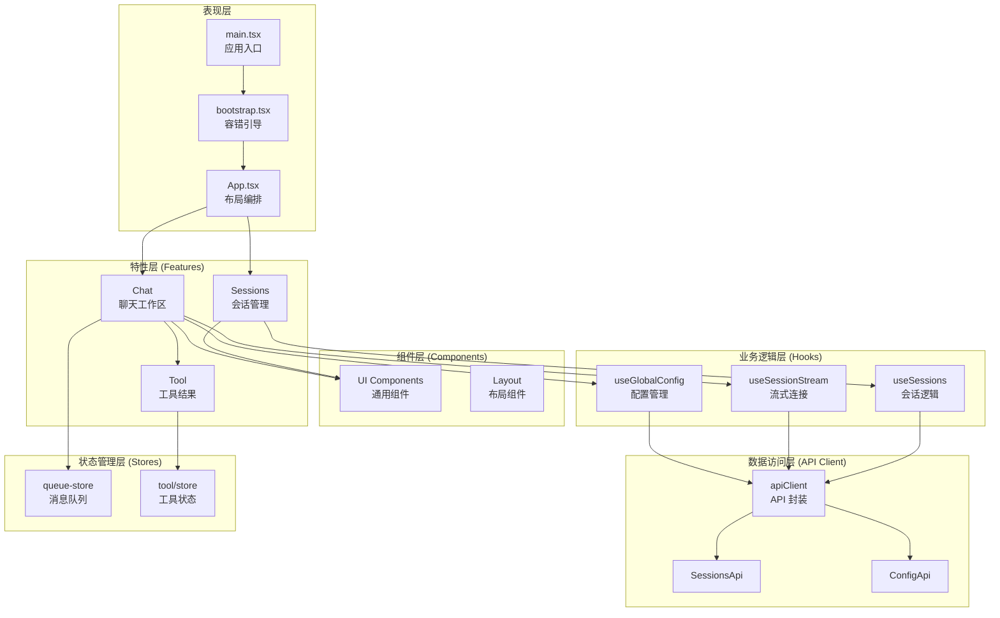
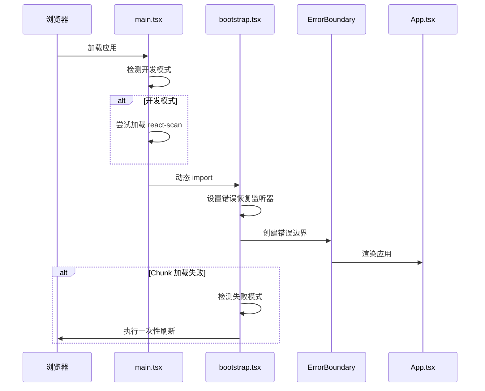
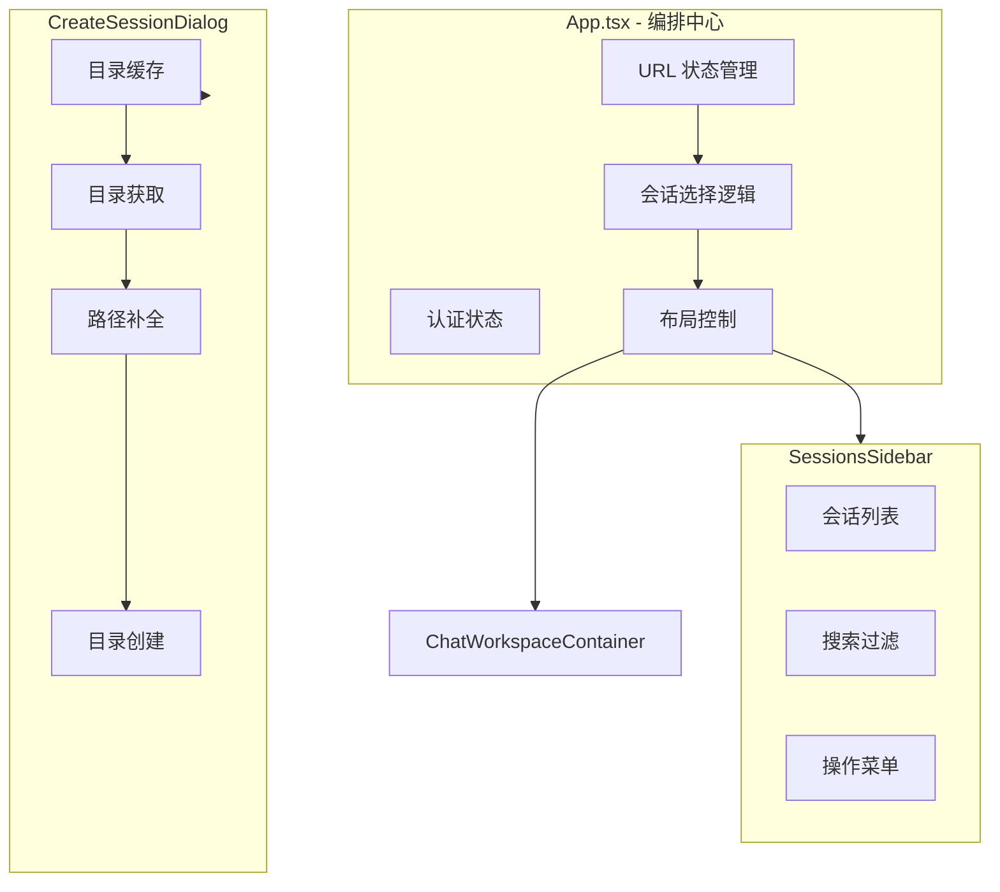
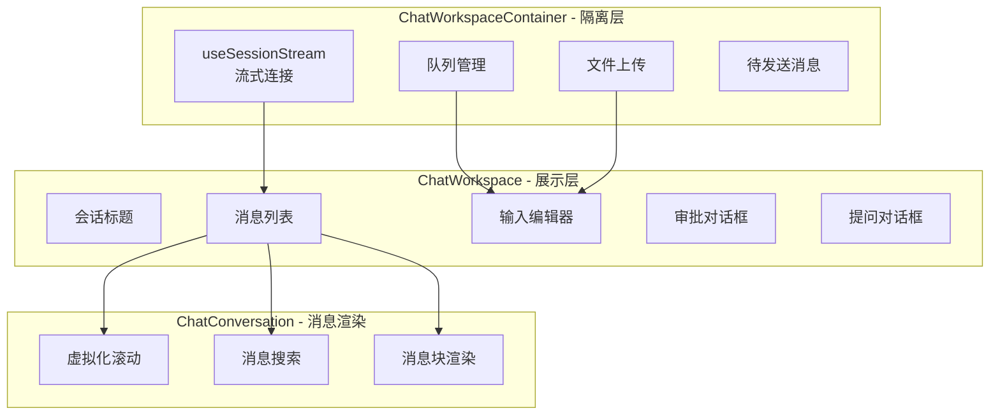
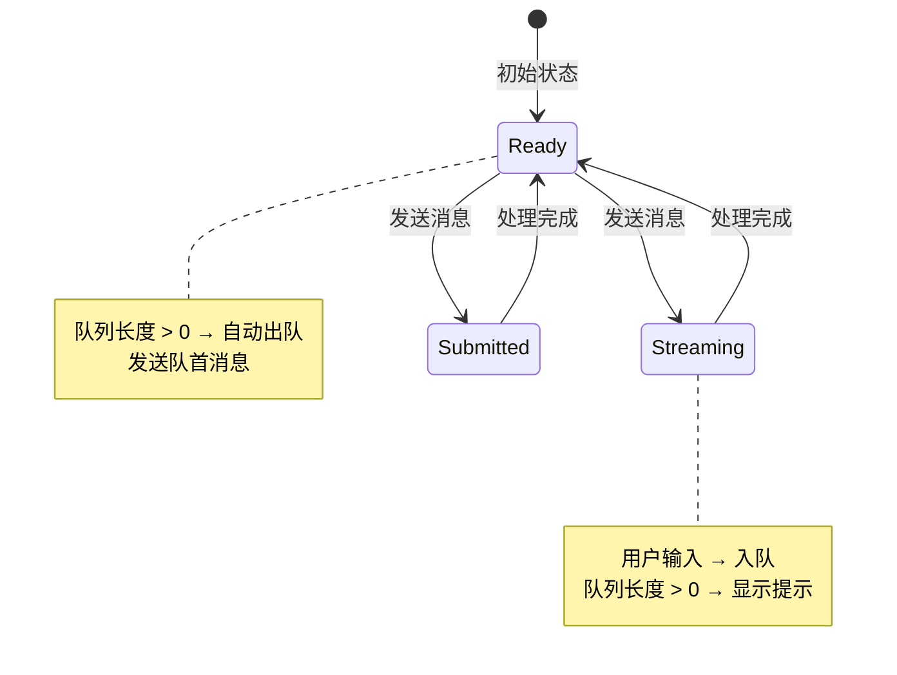

我现在将基于研究材料编写 Web 前端工作台域的完整技术文档。

---

# Web 前端工作台域技术文档

## 文档信息

| 项目 | 内容 |
|------|------|
| **领域名称** | Web 前端工作台域 |
| **文档版本** | v1.0 |
| **生成时间** | 2026-02-28 |
| **置信度评分** | 8.5/10 |
| **代码路径** | `web/src/` |

---

## 1. 领域概述

### 1.1 领域定位

Web 前端工作台域是 Kimi CLI 产品面向用户的核心交互层，提供基于浏览器的可视化 AI 代理工作环境。该域将会话管理、实时对话、工具结果展示、文件操作等能力整合为统一的用户体验，是连接用户与后端 AI 能力的关键桥梁。

### 1.2 核心价值



### 1.3 技术栈

| 技术层 | 选型 | 版本 | 选型理由 |
|--------|------|------|----------|
| **核心框架** | React | 18.x | 组件化开发、生态成熟、性能优秀 |
| **类型系统** | TypeScript | 5.x | 类型安全、开发体验好、重构友好 |
| **构建工具** | Vite | 5.x | 快速 HMR、ESM 原生支持、开发体验优秀 |
| **状态管理** | Zustand | 4.x | 轻量简洁、无样板代码、TypeScript 友好 |
| **UI 组件** | Radix UI | - | 无障碍访问、高度可定制、headless 架构 |
| **样式方案** | Tailwind CSS | 3.x | 原子化 CSS、快速开发、一致性好 |
| **路由管理** | React Router | 6.x | 声明式路由、嵌套路由支持 |
| **API 客户端** | OpenAPI Generator | - | 自动生成、类型安全、契约驱动 |

---

## 2. 架构设计

### 2.1 整体架构



### 2.2 分层职责

| 层次 | 职责 | 关键原则 |
|------|------|----------|
| **表现层** | 应用启动、错误边界、布局编排 | 最小化业务逻辑、专注渲染控制 |
| **特性层** | 业务功能实现、用户交互处理 | 功能内聚、特性隔离 |
| **组件层** | 可复用 UI 组件、通用交互模式 | 无状态优先、props 驱动 |
| **业务逻辑层** | 状态管理、副作用处理、业务规则 | 单一职责、可测试性 |
| **数据访问层** | API 调用、数据转换、错误处理 | 契约驱动、类型安全 |
| **状态管理层** | 全局状态、跨组件通信 | 最小化全局状态、按需订阅 |

---

## 3. 核心模块详解

### 3.1 应用启动与容错引导

#### 3.1.1 模块架构



#### 3.1.2 关键实现

**main.tsx - 极简入口**

```typescript
// 职责：最小化入口逻辑，仅处理开发工具加载
// 设计理念：失败不阻塞，保证应用可启动

if (import.meta.env.DEV) {
  // 开发模式可选启用 react-scan 性能监控
  // 失败静默忽略，不影响应用启动
  import("react-scan").then(({ scan }) => {
    scan({ enabled: true });
  }).catch(() => {});
}

// 动态加载 bootstrap，实现代码分割
import("./bootstrap");
```

**bootstrap.tsx - 容错恢复机制**

```typescript
// 核心能力：动态 import 失败自动恢复
// 场景：用户长时间未刷新页面，资源哈希变化导致 chunk 404

const RELOAD_GUARD_KEY = "kimi:dynamic-import-reload";
const DYNAMIC_IMPORT_ERROR_PATTERNS = [
  /Failed to fetch dynamically imported module/,
  /Importing a module script failed/,
  /error loading dynamically imported module/,
];

function setupDynamicImportRecovery() {
  const shouldReload = (error: Error): boolean => {
    // 检测是否为动态 import 失败
    const isImportError = DYNAMIC_IMPORT_ERROR_PATTERNS.some(
      pattern => pattern.test(error.message)
    );
    
    // 检查是否已经刷新过（防止无限循环）
    const hasReloaded = sessionStorage.getItem(RELOAD_GUARD_KEY);
    
    return isImportError && !hasReloaded;
  };
  
  const handleReload = () => {
    sessionStorage.setItem(RELOAD_GUARD_KEY, "true");
    window.location.reload();
  };
  
  // 监听 Vite 预加载错误
  window.addEventListener("vite:preloadError", (event) => {
    if (shouldReload(event.payload)) {
      handleReload();
    }
  });
  
  // 监听未处理的 Promise 拒绝
  window.addEventListener("unhandledrejection", (event) => {
    if (event.reason instanceof Error && shouldReload(event.reason)) {
      handleReload();
    }
  });
}
```

**设计亮点：**

1. **一次性刷新保护**：使用 sessionStorage 防止无限刷新循环
2. **模式匹配**：精确识别动态 import 失败场景，避免误判
3. **双重监听**：覆盖 Vite 特定事件和通用 Promise 拒绝
4. **用户体验优先**：自动恢复而非显示错误页面

---

### 3.2 会话导航与工作区编排

#### 3.2.1 模块架构



#### 3.2.2 URL 状态同步机制

**设计目标：**
- 会话选择状态持久化到 URL
- 支持浏览器前进/后退
- 页面刷新后恢复会话上下文

**实现策略：**

```typescript
// 1. URL 参数读取
function getSessionIdFromUrl(): string | null {
  const params = new URLSearchParams(window.location.search);
  return params.get("session");
}

// 2. URL 参数更新（不触发页面刷新）
function updateUrlWithSession(sessionId: string | null) {
  const url = new URL(window.location.href);
  if (sessionId) {
    url.searchParams.set("session", sessionId);
  } else {
    url.searchParams.delete("session");
  }
  window.history.replaceState({}, "", url);
}

// 3. 启动时抢先恢复（并行加载优化）
useEffect(() => {
  const urlSessionId = getSessionIdFromUrl();
  if (urlSessionId) {
    // 在会话列表加载前就选择会话
    // 让内容加载与列表加载并行进行
    selectSession(urlSessionId);
  }
}, []);

// 4. 会话校验（列表加载完成后）
useEffect(() => {
  if (!sessions || isSearching || hasMore) return;
  
  const urlSessionId = getSessionIdFromUrl();
  if (urlSessionId && !sessions.find(s => s.id === urlSessionId)) {
    // URL 中的会话不存在，清理 URL 并取消选择
    updateUrlWithSession(null);
    selectSession(null);
  }
}, [sessions, isSearching, hasMore]);
```

**关键设计点：**

1. **抢先恢复**：不等待会话列表加载，立即选择会话，提升首屏速度
2. **延迟校验**：仅在列表完全加载后校验，避免误判
3. **replaceState**：使用 `replaceState` 而非 `pushState`，避免污染浏览器历史

#### 3.2.3 创建会话对话框 - 智能路径选择

**核心能力：**
- 工作目录缓存与后台刷新（Stale-While-Revalidate）
- Tab 键路径补全
- 目录不存在时二次确认创建

**缓存策略实现：**

```typescript
// 模块级缓存（跨组件实例共享）
let cachedWorkDirs: string[] | null = null;

function CreateSessionDialog() {
  const [workDirs, setWorkDirs] = useState<string[]>(
    cachedWorkDirs || [] // 立即使用缓存
  );
  
  useEffect(() => {
    if (!open) return;
    
    // 后台刷新
    fetchWorkDirs().then(dirs => {
      cachedWorkDirs = dirs;
      setWorkDirs(dirs);
    });
  }, [open]);
  
  // 并行获取启动目录和工作目录列表
  useEffect(() => {
    Promise.all([
      fetchStartupDir(),
      fetchWorkDirs()
    ]).then(([startupDir, dirs]) => {
      // 优先使用启动目录
      setSelectedPath(startupDir || dirs[0] || "");
    });
  }, []);
}
```

**Tab 补全实现：**

```typescript
function handleKeyDown(e: KeyboardEvent) {
  if (e.key === "Tab" && highlightedIndex >= 0) {
    e.preventDefault();
    const highlighted = filteredDirs[highlightedIndex];
    setCustomPath(highlighted);
    setSelectedPath(highlighted);
  }
}
```

**目录创建确认流程：**

```typescript
async function handleConfirm() {
  try {
    await createSession(selectedPath);
  } catch (error) {
    if (isDirectoryNotFound(error)) {
      // 显示二次确认对话框
      setShowCreateDirDialog(true);
    }
  }
}

async function handleCreateDirectory() {
  // 用户确认后创建目录并重试
  await createSession(selectedPath, { createDir: true });
}
```

---

### 3.3 聊天工作区与流式体验

#### 3.3.1 模块架构



#### 3.3.2 高频更新隔离设计

**问题背景：**
流式消息每秒可能更新数十次，如果直接在 App 层订阅，会导致整个应用（包括侧边栏）频繁重渲染。

**解决方案：**

```typescript
// App.tsx - 仅传递 sessionId
<ChatWorkspaceContainer
  selectedSessionId={selectedSessionId}
  // 其他稳定的 props
/>

// ChatWorkspaceContainer.tsx - 隔离高频更新
function ChatWorkspaceContainer({ selectedSessionId }) {
  // 在这一层订阅流式消息
  const {
    messages,        // 高频更新
    status,          // 高频更新
    contextUsage,    // 高频更新
    // ...
  } = useSessionStream({ sessionId: selectedSessionId });
  
  // 仅 Container 和 ChatWorkspace 重渲染
  // App 和 SessionsSidebar 不受影响
  return <ChatWorkspace messages={messages} {...otherProps} />;
}
```

**性能优化效果：**
- 减少 90% 以上的无效重渲染
- 侧边栏保持稳定，不闪烁
- 输入框不受消息更新干扰

#### 3.3.3 消息队列机制

**设计目标：**
- AI 处理期间允许用户继续输入
- 自动排队并在空闲时发送
- 支持队列编辑、重排、删除

**状态机设计：**



**实现代码：**

```typescript
// queue-store.ts - Zustand 状态管理
interface QueueStore {
  items: QueueItem[];
  enqueue: (text: string) => void;
  dequeue: () => QueueItem | undefined;
  edit: (id: string, text: string) => void;
  remove: (id: string) => void;
  moveUp: (id: string) => void;
  clear: () => void;
}

// ChatWorkspaceContainer.tsx - 队列逻辑
function ChatWorkspaceContainer() {
  const { items, enqueue, dequeue, clear } = useQueueStore();
  const { status, sendMessage } = useSessionStream();
  
  // 1. 发送时判断是否入队
  const handleSubmit = (text: string) => {
    if (status === "streaming" || status === "submitted") {
      enqueue(text);
      toast.info("Message queued");
    } else {
      sendMessage(text);
    }
  };
  
  // 2. 状态变化时自动出队
  const wasProcessingRef = useRef(false);
  useEffect(() => {
    const isProcessing = status === "streaming" || status === "submitted";
    
    if (wasProcessingRef.current && !isProcessing && items.length > 0) {
      const next = dequeue();
      if (next) {
        sendMessage(next.text);
      }
    }
    
    wasProcessingRef.current = isProcessing;
  }, [status, items.length]);
  
  // 3. 切换会话时清空队列
  useEffect(() => {
    clear();
  }, [selectedSessionId]);
}
```

#### 3.3.4 文件上传处理

**挑战：**
`@ai-elements` 的 `PromptInput` 使用 `FileUIPart` 表示附件，其 `url` 是 Blob URL，需要转换为实际文件对象。

**解决方案：**

```typescript
async function uploadFilesToSession(
  sessionId: string,
  fileParts: FileUIPart[]
): Promise<UploadSessionFileResponse[]> {
  // 1. 并行 fetch 所有 Blob URL
  const filePromises = fileParts.map(async (part) => {
    const response = await fetch(part.url);
    const blob = await response.blob();
    return new File([blob], part.name, { type: part.mimeType });
  });
  
  const files = await Promise.all(filePromises);
  
  // 2. 批量上传
  const uploadPromises = files.map(file => 
    uploadSessionFile(sessionId, file)
  );
  
  return Promise.all(uploadPromises);
}

// 使用示例
const handleSubmit = async (input: PromptInputMessage) => {
  const fileParts = input.parts.filter(
    p => p.type === "file"
  ) as FileUIPart[];
  
  if (fileParts.length > 0) {
    setIsUploadingFiles(true);
    try {
      await uploadFilesToSession(sessionId, fileParts);
    } catch (error) {
      toast.error("Upload failed");
      return;
    } finally {
      setIsUploadingFiles(false);
    }
  }
  
  sendMessage(input.text);
};
```

---

### 3.4 提示词编辑与交互增强

#### 3.4.1 模块架构

```mermaid
graph TB
    subgraph "ChatPromptComposer"
        INPUT[PromptInput<br/>@ai-elements]
        TOOLBAR[PromptToolbar]
        STATUS[ActivityStatusIndicator]
    end
    
    subgraph "useSlashCommands"
        DETECT_SLASH[检测 / 触发]
        FILTER[过滤命令]
        INSERT[插入命令]
    end
    
    subgraph "useFileMentions"
        DETECT_AT[检测 @ 触发]
        CRAWL[爬取工作区文件]
        SUGGEST[文件建议]
        INSERT_FILE[插入文件引用]
    end
    
    INPUT --> DETECT_SLASH
    INPUT --> DETECT_AT
    
    DETECT_SLASH --> FILTER
    FILTER --> INSERT
    
    DETECT_AT --> CRAWL
    CRAWL --> SUGGEST
    SUGGEST --> INSERT_FILE
```

#### 3.4.2 Slash Commands 实现

**触发规则：**
- 仅在行首或输入首触发（`/` 前必须是 `\n` 或开头）
- query 不允许包含空白字符
- 支持模糊匹配和别名

**检测逻辑：**

```typescript
function detectSlash(text: string, caret: number | null): SlashRange | null {
  const safeCaret = Math.max(0, Math.min(text.length, caret ?? text.length));
  const upToCaret = text.slice(0, safeCaret);
  
  // 找到最后一个 /
  const slashIndex = upToCaret.lastIndexOf("/");
  if (slashIndex === -1) return null;
  
  // 检查 / 前的字符
  if (slashIndex > 0) {
    const prevChar = upToCaret[slashIndex - 1];
    if (prevChar !== "\n") return null; // 必须在行首
  }
  
  // 提取 query
  const query = upToCaret.slice(slashIndex + 1);
  
  // query 不能包含空格
  if (/\s/.test(query)) return null;
  
  return { start: slashIndex, end: safeCaret, query };
}
```

**IME 与光标竞态处理：**

```typescript
// 问题：选择命令时，IME 可能未结束，导致文本替换失败
// 解决：分两帧操作，先 blur 强制结束 IME，再替换文本

const isSelectingRef = useRef(false);

function selectOption(option: SlashCommandOption) {
  if (!textareaRef.current || !range) return;
  
  isSelectingRef.current = true;
  
  // 第一帧：blur 强制结束 IME
  textareaRef.current.blur();
  
  requestAnimationFrame(() => {
    // 第二帧：替换文本并设置光标
    const newText = 
      text.slice(0, range.start) + 
      option.insertValue + 
      text.slice(range.end);
    
    setText(newText);
    
    requestAnimationFrame(() => {
      const newCaret = range.start + option.insertValue.length;
      textareaRef.current?.setSelectionRange(newCaret, newCaret);
      textareaRef.current?.focus();
      
      isSelectingRef.current = false;
    });
  });
}
```

#### 3.4.3 File Mentions 实现

**核心能力：**
- 检测 `@` 触发文件提及
- 汇总上传附件与工作区文件
- BFS 爬取工作区目录（限流保护）
- 智能插入与光标定位

**触发检测：**

```typescript
const TRIGGER_CHARS = new Set([" ", "\n", "(", "[", "{"]);
const STOP_CHARS = new Set([" ", "\n", ")", "]", "}", ","]);

function detectMention(text: string, caret: number | null): MentionRange | null {
  const safeCaret = Math.max(0, Math.min(text.length, caret ?? text.length));
  const upToCaret = text.slice(0, safeCaret);
  
  const atIndex = upToCaret.lastIndexOf("@");
  if (atIndex === -1) return null;
  
  // 检查 @ 前的字符（必须是触发字符或开头）
  if (atIndex > 0) {
    const prevChar = upToCaret[atIndex - 1];
    if (!TRIGGER_CHARS.has(prevChar)) return null;
  }
  
  // 提取 query（遇到停止字符截断）
  let query = upToCaret.slice(atIndex + 1);
  for (const char of STOP_CHARS) {
    const idx = query.indexOf(char);
    if (idx !== -1) {
      query = query.slice(0, idx);
      break;
    }
  }
  
  return { start: atIndex, end: atIndex + 1 + query.length, query };
}
```

**工作区文件爬取：**

```typescript
const MAX_WORKSPACE_FILES = 500;
const MAX_DIRECTORY_SCANS = 200;

async function crawlWorkspace(
  sessionId: string,
  onListDirectory: (sessionId: string, path?: string) => Promise<FileEntry[]>
): Promise<FileEntry[]> {
  const results: FileEntry[] = [];
  const queue: string[] = [""]; // BFS 队列
  let scannedDirs = 0;
  
  while (queue.length > 0 && scannedDirs < MAX_DIRECTORY_SCANS) {
    const path = queue.shift()!;
    scannedDirs++;
    
    try {
      const entries = await onListDirectory(sessionId, path);
      
      for (const entry of entries) {
        if (entry.type === "file") {
          results.push(entry);
          if (results.length >= MAX_WORKSPACE_FILES) {
            return results; // 达到文件数上限
          }
        } else if (entry.type === "directory") {
          queue.push(entry.path);
        }
      }
    } catch (error) {
      console.warn(`Failed to scan ${path}:`, error);
    }
  }
  
  return results;
}
```

**智能插入：**

```typescript
function insertMention(option: FileMentionOption) {
  if (!textareaRef.current || !range) return;
  
  // 构建插入值（必要时添加空格）
  const needsSpaceAfter = 
    range.end < text.length && 
    text[range.end] !== " " && 
    text[range.end] !== "\n";
  
  const insertValue = `@${option.path}${needsSpaceAfter ? " " : ""}`;
  
  // 替换文本
  const newText = 
    text.slice(0, range.start) + 
    insertValue + 
    text.slice(range.end);
  
  setText(newText);
  
  // 恢复焦点与光标
  requestAnimationFrame(() => {
    const newCaret = range.start + insertValue.length;
    textareaRef.current?.setSelectionRange(newCaret, newCaret);
    textareaRef.current?.focus();
  });
}
```

---

### 3.5 状态工具栏与队列管理

#### 3.5.1 模块架构

```mermaid
graph LR
    subgraph "PromptToolbar"
        QUEUE_PANEL[QueuePanel<br/>队列面板]
        GIT_PANEL[GitDiffPanel<br/>Git 变更]
        CONTEXT_PANEL[ContextPanel<br/>上下文使用]
        ACTIVITY[ActivityStatusIndicator<br/>活动状态]
    end
    
    subgraph "自动开关逻辑"
        HAS_QUEUE{队列长度 > 0?}
        HAS_DIFF{有 Git 变更?}
        HAS_CONTEXT{上下文使用 > 0?}
    end
    
    HAS_QUEUE -->|是| QUEUE_PANEL
    HAS_DIFF -->|是| GIT_PANEL
    HAS