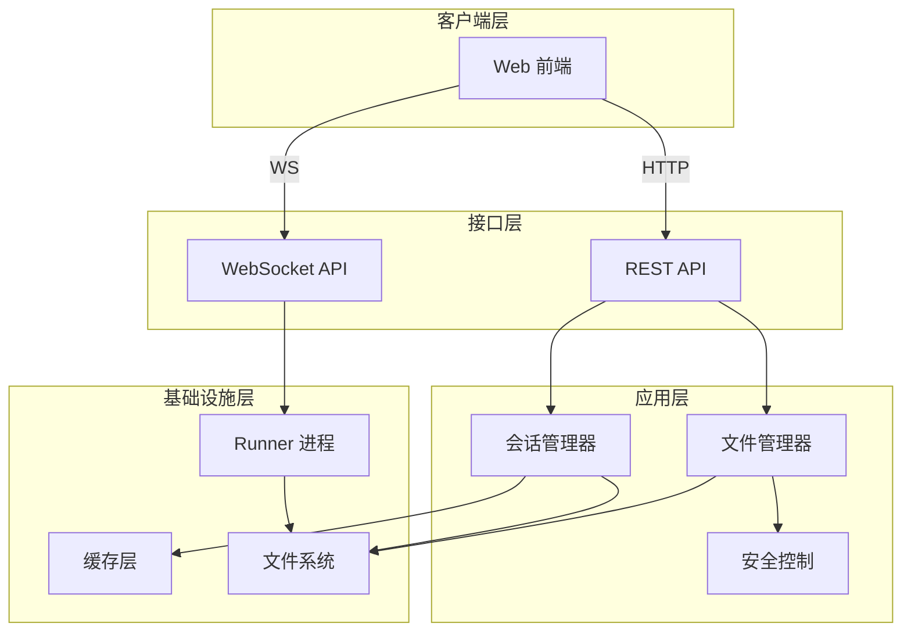

基于我收集的信息，现在我将为您编写关于"Web 后端会话与文件域"的完整技术文档。

# Web 后端会话与文件域技术文档

## 1. 领域概述

### 1.1 领域定位

Web 后端会话与文件域是 kimi-cli 系统的核心业务域，负责提供会话生命周期管理、文件安全访问、实时流式通讯等关键能力。该域通过 FastAPI 构建 REST + WebSocket 双协议接口，将"会话数据持久化（文件系统）+ 实时交互（WebSocket）+ 严格安全边界（public/LAN/本地）"有机整合，为 Web 前端工作台提供可靠的后端支撑。

### 1.2 核心价值

- **会话持久化与回放**：基于 wire.jsonl 事件流实现完整的对话历史记录与回放能力
- **安全的文件访问**：多层安全策略保护工作目录与会话文件，支持本地/局域网部署
- **实时流式交互**：WebSocket 通道支持历史回放、实时消息推送与 runner 进程协调
- **灵活的会话管理**：支持会话 fork、自动归档、标题生成等增值功能

### 1.3 技术栈

| 技术组件 | 用途 | 版本要求 |
|---------|------|---------|
| FastAPI | Web 框架与 API 路由 | - |
| WebSocket | 实时双向通讯 | Starlette |
| asyncio | 异步 I/O 与并发控制 | Python 3.11+ |
| Pydantic | 数据模型与验证 | V2 |
| kaos | 异步文件系统辅助 | 内部包 |

## 2. 架构设计

### 2.1 模块结构

```
src/kimi_cli/web/
├── api/
│   └── sessions.py          # 会话与文件 API 路由（核心）
├── runner/
│   ├── process.py           # Runner 进程管理
│   └── messages.py          # 消息构造辅助
├── store/
│   └── sessions.py          # 会话存储与缓存
├── auth.py                  # 认证与安全校验
└── models.py                # 数据模型定义
```

### 2.2 领域边界

**包含职责：**
- 会话 CRUD 与元数据管理
- 文件上传与受控访问（uploads + work_dir）
- WebSocket 流式通讯与历史回放
- Runner 子进程生命周期协调
- Git 变更统计与会话 fork
- 安全策略执行（路径穿越、符号链接、敏感路径过滤）

**排除职责：**
- LLM 调用与工具执行（由 kosong 与 runner 负责）
- 前端 UI 渲染与状态管理
- 配置管理（由独立的 config 域负责）

### 2.3 数据流架构



## 3. 核心功能实现

### 3.1 会话生命周期管理

#### 3.1.1 会话创建

**接口：** `POST /api/sessions`

**核心逻辑：**

```python
async def create_session(request: CreateSessionRequest | None = None) -> Session:
    # 1. 工作目录验证与自动创建
    if request and request.work_dir:
        work_dir_path = Path(request.work_dir).expanduser().resolve()
        if not work_dir_path.exists():
            if request.create_dir:
                work_dir_path.mkdir(parents=True, exist_ok=True)
            else:
                raise HTTPException(404, "Directory does not exist")
    
    # 2. 创建会话目录与初始化文件
    kimi_cli_session = await KimiCLISession.create(work_dir=work_dir)
    
    # 3. 缓存失效
    invalidate_sessions_cache()
    invalidate_work_dirs_cache()
    
    return Session(...)
```

**关键特性：**
- 支持自动创建工作目录（`create_dir` 参数）
- 使用 `expanduser()` 和 `resolve()` 规范化路径
- 初始化 wire.jsonl、context.jsonl 等核心文件
- 双缓存失效（会话列表 + 工作目录列表）

#### 3.1.2 会话列表查询

**接口：** `GET /api/sessions`

**查询参数：**
- `limit`：分页大小（默认 100，最大 500）
- `offset`：偏移量
- `q`：搜索关键词（标题或工作目录）
- `archived`：归档状态过滤（None=仅非归档，True=仅归档）

**核心逻辑：**

```python
async def list_sessions(
    runner: KimiCLIRunner,
    limit: int = 100,
    offset: int = 0,
    q: str | None = None,
    archived: bool | None = None,
) -> list[Session]:
    # 1. 后台触发自动归档（节流：最多 5 分钟一次）
    await asyncio.to_thread(run_auto_archive)
    
    # 2. 从缓存/存储加载会话列表
    sessions = load_sessions_page(limit, offset, q, archived)
    
    # 3. 注入运行态信息
    for session in sessions:
        session_process = runner.get_session(session.session_id)
        session.is_running = session_process is not None and session_process.is_running
        session.status = session_process.status if session_process else None
    
    return sessions
```

**缓存策略：**
- TTL 缓存：5 秒过期时间
- 写失效：任何修改操作调用 `invalidate_sessions_cache()`
- 适用场景：单进程 Web 服务（无多进程并发写入）

#### 3.1.3 会话更新

**接口：** `PATCH /api/sessions/{session_id}`

**可更新字段：**
- `title`：会话标题
- `archived`：归档状态

**归档逻辑：**

```python
if request.archived is not None:
    updates = {"archived": request.archived}
    if request.archived:
        # 手动归档：设置归档时间，清除豁免标记
        updates["archived_at"] = time.time()
        updates["auto_archive_exempt"] = False
    else:
        # 手动解档：清除归档时间，设置豁免标记（防止再次自动归档）
        updates["archived_at"] = None
        updates["auto_archive_exempt"] = True
    metadata = metadata.model_copy(update=updates)
```

**并发控制：**
- 通过 `get_editable_session()` 检查会话是否 busy
- busy 状态下拒绝修改，返回 400 错误

#### 3.1.4 会话删除

**接口：** `DELETE /api/sessions/{session_id}`

**删除流程：**

```python
async def delete_session(session_id: UUID, runner: KimiCLIRunner):
    # 1. 停止关联的 runner 进程
    session_process = runner.get_session(session_id)
    if session_process is not None:
        await session_process.stop()
    
    # 2. 清理全局元数据中的 last_session_id 引用
    wd_meta = session.kimi_cli_session.work_dir_meta
    if wd_meta.last_session_id == str(session_id):
        metadata = load_metadata()
        for wd in metadata.work_dirs:
            if wd.path == wd_meta.path:
                wd.last_session_id = None
                break
        save_metadata(metadata)
    
    # 3. 物理删除会话目录
    shutil.rmtree(session_dir)
    
    # 4. 缓存失效
    invalidate_sessions_cache()
```

### 3.2 文件管理与安全访问

#### 3.2.1 文件上传

**接口：** `POST /api/sessions/{session_id}/files`

**安全限制：**

```python
MAX_UPLOAD_SIZE = 100 * 1024 * 1024  # 100MB

async def upload_session_file(session_id: UUID, file: UploadFile, runner):
    # 1. 检查会话是否可编辑（非 busy）
    session = get_editable_session(session_id, runner)
    
    # 2. 读取并验证文件大小
    content = await file.read()
    if len(content) > MAX_UPLOAD_SIZE:
        raise HTTPException(413, "File too large")
    
    # 3. 生成安全文件名
    file_name = str(uuid4())
    if file.filename:
        safe_name = sanitize_filename(file.filename)
        name, ext = os.path.splitext(safe_name)
        file_name = f"{name}_{file_name[:6]}{ext}"
    
    # 4. 写入 uploads 目录
    upload_path = upload_dir / file_name
    upload_path.write_bytes(content)
```

**文件名净化：**

```python
def sanitize_filename(filename: str) -> str:
    """仅保留字母数字与 ._- 空格"""
    safe = "".join(c for c in filename if c.isalnum() or c in "._- ")
    return safe.strip() or "unnamed"
```

#### 3.2.2 访问 uploads 文件

**接口：** `GET /api/sessions/{session_id}/uploads/{path}`

**安全策略：**

```python
async def get_session_upload_file(session_id: UUID, path: str):
    # 1. 解析并验证路径
    uploads_dir = (session.kimi_cli_session.dir / "uploads").resolve()
    file_path = (uploads_dir / path).resolve()
    
    # 2. 路径穿越检查
    if not file_path.is_relative_to(uploads_dir):
        raise HTTPException(400, "Invalid path: path traversal not allowed")
    
    # 3. 存在性与类型检查
    if not file_path.exists() or not file_path.is_file():
        raise HTTPException(404, "File not found")
    
    # 4. 返回文件响应（RFC 5987 编码文件名）
    return FileResponse(file_path, headers={
        "Content-Disposition": f"inline; filename*=UTF-8''{encoded_filename}"
    })
```

#### 3.2.3 访问 work_dir 文件

**接口：** `GET /api/sessions/{session_id}/files/{path}`

**多层安全控制：**

```python
async def get_session_file(session_id: UUID, path: str, request: Request):
    # 1. 基础路径穿越检查
    work_dir = Path(str(session.kimi_cli_session.work_dir)).resolve()
    file_path = (work_dir / path).resolve()
    if not file_path.is_relative_to(work_dir):
        raise HTTPException(400, "Invalid path: path traversal not allowed")
    
    # 2. 公开模式增强安全检查
    restrict_sensitive_apis = getattr(request.app.state, "restrict_sensitive_apis", False)
    if restrict_sensitive_apis:
        # 2.1 符号链接检查
        if _contains_symlink(requested_path, work_dir):
            raise HTTPException(403, "Symbolic links are not allowed in public mode")
        
        # 2.2 敏感位置检查（~/.ssh、~/.aws 等）
        if _is_path_in_sensitive_location(file_path):
            raise HTTPException(403, "Access to sensitive system directories is not allowed")
        
        # 2.3 路径深度与敏感文件检查
        _ensure_public_file_access_allowed(rel_path, restrict_sensitive_apis, max_path_depth)
    
    # 3. 目录列举或文件下载
    if file_path.is_dir():
        # 列举目录（公开模式下过滤敏感项）
        return Response(content=json.dumps(result), media_type="application/json")
    else:
        # 返回文件内容
        return Response(content=content, media_type=media_type, headers={...})
```

**敏感路径定义：**

```python
SENSITIVE_PATH_PARTS = {
    "id_rsa", "id_ed25519", "known_hosts", "credentials",
    ".aws", ".ssh", ".gnupg", ".kube", ".npmrc", ".pypirc", ".netrc"
}

SENSITIVE_PATH_EXTENSIONS = {
    ".pem", ".key", ".p12", ".pfx", ".kdbx", ".der"
}

SENSITIVE_HOME_PATHS = {
    ".ssh", ".gnupg", ".aws", ".kube"
}
```

**符号链接检查实现：**

```python
def _contains_symlink(path: Path, base: Path) -> bool:
    """检查路径中任何组件是否为符号链接"""
    try:
        current = base
        rel_parts = path.relative_to(base).parts
        for part in rel_parts:
            current = current / part
            if current.is_symlink():
                return True
    except (ValueError, OSError):
        return True
    return False
```

### 3.3 WebSocket 实时流式通讯

#### 3.3.1 连接建立与安全验证

**接口：** `WS /api/sessions/{session_id}/stream`

**安全检查流程：**

```python
async def session_stream(session_id: UUID, websocket: WebSocket, runner):
    # 1. LAN-only 检查
    if lan_only:
        client_ip = websocket.client.host if websocket.client else None
        if client_ip and not is_private_ip(client_ip):
            await websocket.close(code=4403, reason="Access denied: LAN only")
            return
    
    # 2. Origin 校验
    if enforce_origin:
        origin = websocket.headers.get("origin")
        if origin and not is_origin_allowed(origin, allowed_origins):
            await websocket.close(code=4403, reason="Origin not allowed")
            return
    
    # 3. Token 认证
    if expected_token:
        token = websocket.query_params.get("token")
        if not verify_token(token, expected_token):
            await websocket.close(code=4401, reason="Auth required")
            return
    
    # 4. 接受连接
    await websocket.accept()
```

#### 3.3.2 历史回放机制

**回放流程：**

```python
async def session_stream(session_id: UUID, websocket: WebSocket, runner):
    # 1. 检查是否存在历史
    wire_file = session_dir / "wire.jsonl"
    has_history = await asyncio.to_thread(wire_file.exists)
    
    if has_history:
        # 2. 将 WebSocket 置于回放模式
        await session_process.add_websocket_and_begin_replay(websocket)
        attached = True
        
        # 3. 回放历史事件
        await replay_history(websocket, session_dir)
    
    # 4. 发送历史完成标记
    if not await send_history_complete(websocket):
        logger.debug("WebSocket disconnected during history replay")
        return
```

**wire.jsonl 解析：**

```python
def _read_wire_lines(wire_file: Path) -> list[str]:
    """读取并解析 wire.jsonl 为 JSON-RPC 事件字符串"""
    result = []
    with open(wire_file, encoding="utf-8") as f:
        for line in f:
            record = json.loads(line.strip())
            
            # 跳过 metadata 行
            if record.get("type") == "metadata":
                continue
            
            message_raw = record.get("message")
            message = deserialize_wire_message(message_raw)
            _is_req = is_request(message)
            
            # 构造 JSON-RPC 事件/请求
            event_msg = {
                "jsonrpc": "2.0",
                "method": "request" if _is_req else "event",
                "params": message_raw,
            }
            
            # 请求需要 id 字段用于响应关联
            if _is_req:
                event_msg["id"] = message.id
            
            result.append(json.dumps(event_msg, ensure_ascii=False))
    
    return result
```

#### 3.3.3 实时消息转发

**消息转发逻辑：**

```python
# 启动环境
await session_process.end_replay(websocket)
await session_process.start()
await session_process.send_status_snapshot(websocket)

# 消息转发循环
last_session_id_updated = False
while True:
    try:
        message = await websocket.receive_text()
        
        # 忙碌状态检查
        if session_process.is_busy:
            in_message = JSONRPCInMessageAdapter.validate_json(message)
            if isinstance(in_message, JSONRPCPromptMessage):
                # 拒绝新 prompt
                await websocket.send_text(
                    JSONRPCErrorResponse(
                        id=in_message.id,
                        error=JSONRPCErrorObject(
                            code=ErrorCodes.INVALID_STATE,
                            message="Session is busy; wait for completion before sending a new prompt."
                        )
                    ).model_dump_json()
                )
                continue
        
        # 首次 prompt 时更新 last_session_id
        if not last_session_id_updated:
            in_message = JSONRPCInMessageAdapter.validate_json(message)
            if isinstance(in_message, JSONRPCPromptMessage):
                await asyncio.to_thread(_update_last_session_id, session)
                last_session_id_updated = True
        
        # 转发消息到 runner 进程
        await session_process.send_message(message)
        
    except WebSocketDisconnect:
        break
```

**并发控制策略：**
- **is_busy 状态**：基于 `_in_flight_prompt_ids` 集合跟踪
- **拒绝策略**：busy 时拒绝新 prompt，返回 JSON-RPC 错误
- **允许操作**：busy 时仍可发送取消、审批响应等非 prompt 消息

#### 3.3.4 连接清理

```python
finally:
    if attached and session_process:
        await session_process.remove_websocket(websocket)
```

### 3.4 会话 Fork 功能

#### 3.4.1 Fork 接口

**接口：** `POST /api/sessions/{session_id}/fork`

**请求参数：**

```python
class ForkSessionRequest(BaseModel):
    turn_index: int = Field(..., ge=0)  # 0-based，包含此 turn 及之前所有 turn
```

#### 3.4.2 Wire 裁剪

**裁剪逻辑：**

```python
def truncate_wire_at_turn(wire_path: Path, turn_index: int) -> list[str]:
    """读取 wire.jsonl 并返回到指定 turn 的所有行"""
    lines = []
    current_turn = -1  # 首个 TurnBegin 时变为 0
    
    with open(wire_path, encoding="utf-8") as f:
        for line in f:
            record = json.loads(line.strip())
            
            # 始终保留 metadata header
            if record.get("type") == "metadata":
                lines.append(line.strip())
                continue
            
            message = record.get("message", {})
            msg_type = message.get("type")
            
            # TurnBegin 递增计数
            if msg_type == "TurnBegin":
                current_turn += 1
                if current_turn > turn_index:
                    break
            
            # 收集当前 turn 的所有行
            if current_turn <= turn_index:
                lines.append(line.strip())
            
            # TurnEnd 后停止
            if msg_type == "TurnEnd" and current_turn == turn_index:
                break
    
    if current_turn < turn_index:
        raise ValueError(f"turn_index {turn_index} out of range (max turn: {current_turn})")
    
    return lines
```

#### 3.4.3 Context 裁剪

**裁剪逻辑：**

```python
def truncate_context_at_turn(context_path: Path, turn_index: int) -> list[str]:
    """基于真实 user 消息计数裁剪 context.jsonl"""
    lines = []
    current_turn = -1
    
    with open(context_path, encoding="utf-8") as f:
        for line in f:
            record = json.loads(line.strip())
            
            # 排除 checkpoint 标记（<system>CHECKPOINT N</system>）
            if record.get("role") == "user" and not _is_checkpoint_user_message(record):
                current_turn += 1
                if current_turn > turn_index:
                    break
            
            if current_turn <= turn_index:
                lines.append(line.strip())
    
    return lines  # Best-effort：不足时返回全部
```

**Checkpoint 检测：**

```python
CHECKPOINT_USER_PATTERN = re.compile(r"^<system>CHECKPOINT \d+</system>$")

def _is_checkpoint_user_message(record: dict) -> bool:
    """检测是否为合成的 checkpoint 标记"""
    if record.get("role") != "user":
        return False
    
    content = record.get("content")
    if isinstance(content, str):
        return CHECKPOINT_USER_PATTERN.fullmatch(content.strip()) is not None
    
    # 处理 content 为 list 的情况
    parts = content if isinstance(content, list) else []
    if len(parts) == 1 and isinstance(parts[0], dict):
        text = parts[0].get("text")
        if isinstance(text, str):
            return CHECKPOINT_USER_PATTERN.fullmatch(text.strip()) is not None
    
    return False
```

#### 3.4.4 资源选择性复制

**视频文件复制：**

```python
# 1. 扫描裁剪后的 wire 行，提取视频引用
referenced_videos = set()
for line in truncated_wire_lines:
    for match in re.finditer(r"uploads/([^\"\<>\s]+)", line):
        fname = match.group(1)
        mime, _ = mimetypes.guess_type(fname)
        if mime and mime.startswith("video/"):
            referenced_videos.add(fname)

# 2. 仅复制存在的视频文件
files_to_copy = [
    source_uploads / name 
    for name in referenced_videos 
    if (source_uploads / name).is_file()
]

if files_to_copy:
    new_uploads = new_session_dir / "uploads"
    new_uploads.mkdir(parents=True, exist_ok=True)
    copied_names = []
    for vf in files_to_copy:
        shutil.copy2(vf, new_uploads / vf.name)
        copied_names.append(vf.name)
    
    # 3. 写入 .sent 标记防止重复发送
    (new_uploads / ".sent").write_text(
        json.dumps(copied_names), 
        encoding="utf-8"
    )
```

**设计理由：**
- **仅复制视频**：图片和文档已 base64 内联在 context.jsonl 中
- **引用检测**：通过正则匹配 `uploads/filename` 模式
- **.sent 标记**：防止 `_encode_uploaded_files()` 重复发送继承的视频

#### 3.4.5 元数据构造

```python
# 不继承源 metadata，重新构造
source_metadata = load_session_metadata(source_dir, str(session_id))
source_title = (
    source_metadata.title 
    if source_metadata.title != "Untitled" 
    else source_session.title
)

new_metadata = SessionMetadata(
    session_id=new_session.id,
    title=f"Fork: {source_title}",
    wire_mtime=new_wire_path.stat().st_mtime,
)
save_session_metadata(new_session_dir, new_metadata)
```

### 3.5 Git 变更统计

#### 3.5.1 接口定义

**接口：** `GET /api/sessions/{session_id}/git-diff`

**返回模型：**

```python
class GitDiffStats(BaseModel):
    is_git_repo: bool
    has_changes: bool = False
    total_additions: int = 0
    total_deletions: int = 0
    files: list[GitFileDiff] = []
    error: str | None = None

class GitFileDiff(BaseModel):
    path: str
    additions: int
    deletions: int
    status: Literal["added", "modified", "deleted"]
```

#### 3.5.2 实现逻辑

```python
async def get_session_git_diff(session_id: UUID) -> GitDiffStats:
    work_dir = Path(str(session.kimi_cli_session.work_dir))
    
    # 1. 检查是否为 git 仓库
    if not (work_dir / ".git").exists():
        return GitDiffStats(is_git_repo=False)
    
    try:
        # 2. 检查是否存在 HEAD（至少一次提交）
        check_proc = await asyncio.create_subprocess_exec(
            "git", "rev-parse", "--verify", "HEAD",
            cwd=str(work_dir),
            stdout=asyncio.subprocess.DEVNULL,
            stderr=asyncio.subprocess.DEVNULL,
            env=get_clean_env(),
        )
        await check_proc.wait()
        has_head = check_proc.returncode == 0
        
        if has_head:
            # 3. 执行 git diff --numstat HEAD
            proc = await asyncio.create_subprocess_exec(
                "git", "diff", "--numstat", "HEAD",
                cwd=str(work_dir),
                stdout=asyncio.subprocess.PIPE,
                stderr=asyncio.subprocess.PIPE,
                env=get_clean_env(),
            )
            stdout, _ = await asyncio.wait_for(proc.communicate(), timeout=5.0)
            
            # 4. 解析输出
            for line in stdout.decode().strip().split("\n"):
                parts = line.split("\t")
                if len(parts) >= 3:
                    add = int(parts[0]) if parts[0] != "-" else 0
                    dele = int(parts[1]) if parts[1] != "-" else 0
                    total_add += add
                    total_del += dele
                    
                    # 推断文件状态
                    file_status = "modified"
                    if dele == 0 and add > 0:
                        file_status = "added"
                    elif add == 0 and dele > 0:
                        file_status = "deleted"
                    
                    files.append(GitFileDiff(
                        path=parts[2],
                        additions=add,
                        deletions=dele,
                        status=file_status,
                    ))
        
        # 5. 获取未跟踪文件
        untracked_proc = await asyncio.create_subprocess_exec(
            "git", "ls-files", "--others", "--exclude-standard",
            cwd=str(work_dir),
            stdout=asyncio.subprocess.PIPE,
            stderr=asyncio.subprocess.DEVNULL,
            env=get_clean_env(),
        )
        untracked_stdout, _ = await asyncio.wait_for(
            untracked_proc.communicate(), 
            timeout=5.0
        )
        
        for line in untracked_stdout.decode().strip().split("\n"):
            if line:
                files.append(GitFileDiff(
                    path=line,
                    additions=0,
                    deletions=0,
                    status="added",
                ))
        
        return GitDiffStats(
            is_git_repo=True,
            has_changes=len(files) > 0,
            total_additions=total_add,
            total_deletions=total_del,
            files=files,
        )
    
    except TimeoutError:
        return GitDiffStats(is_git_repo=True, error="Git command timed out")
    except Exception as e:
        return