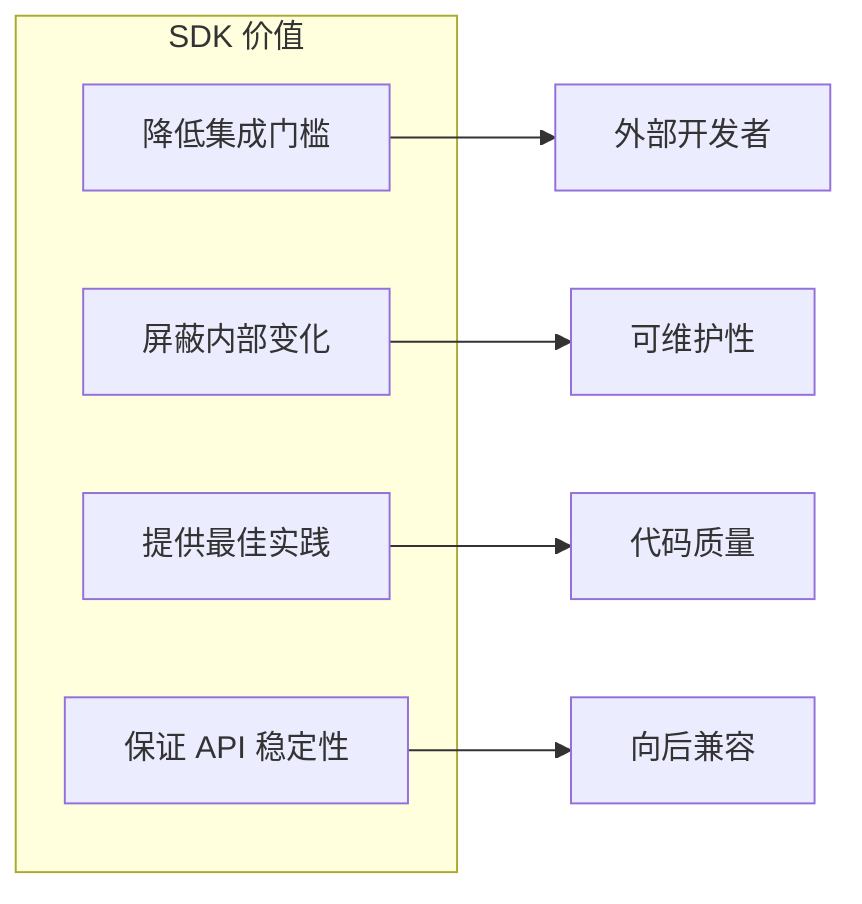
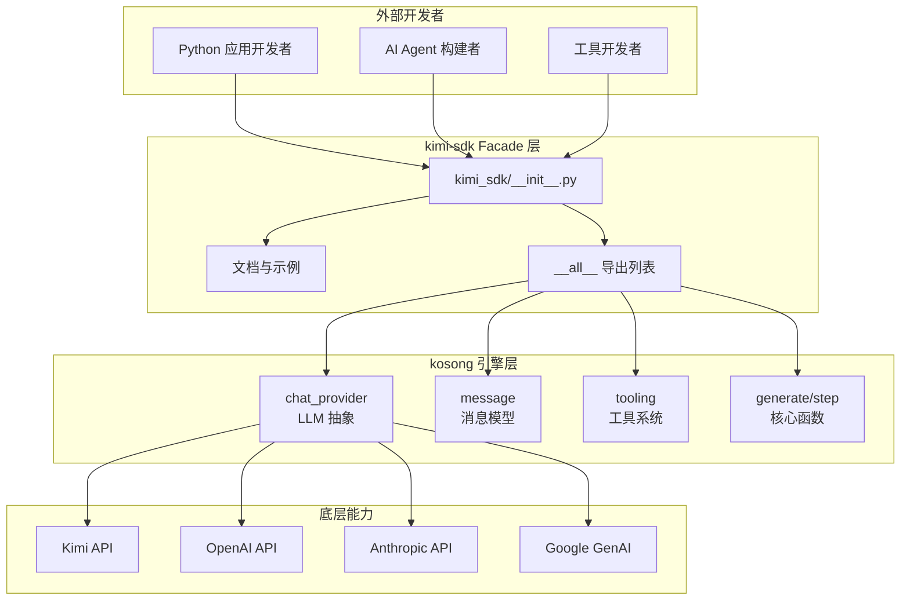
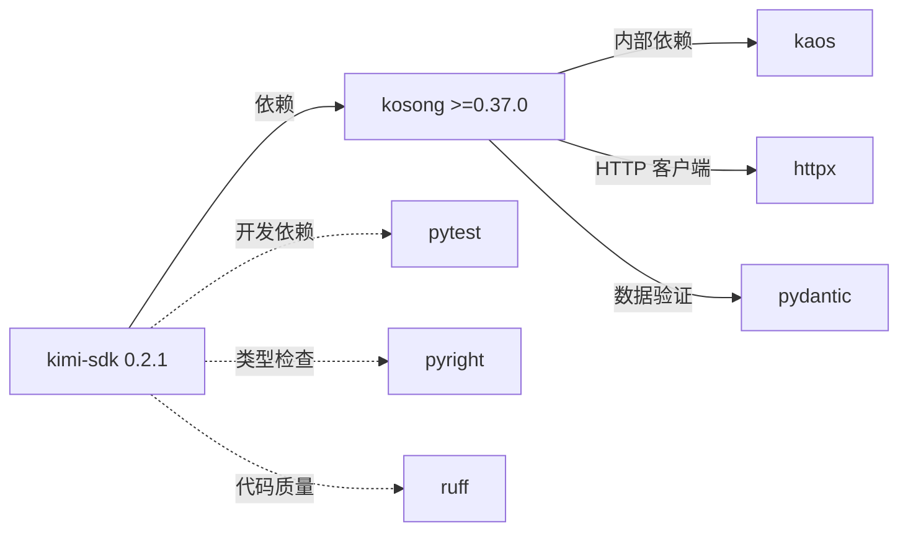
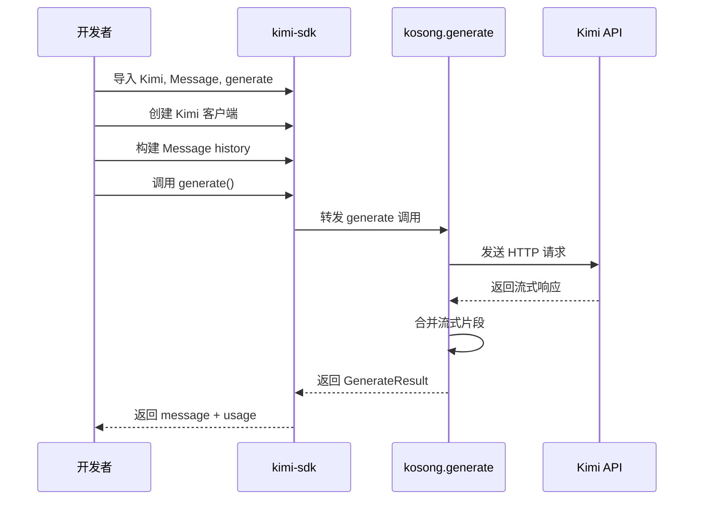
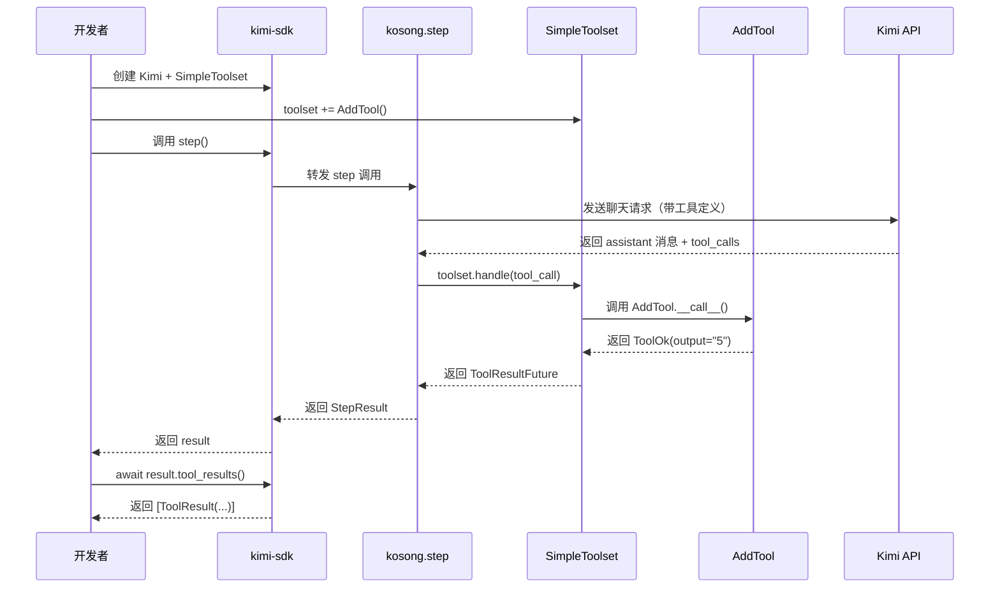
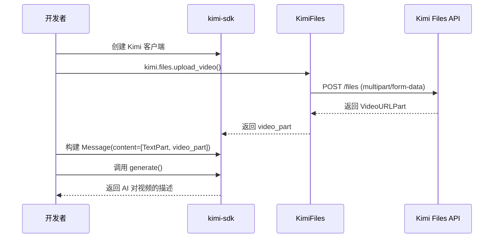
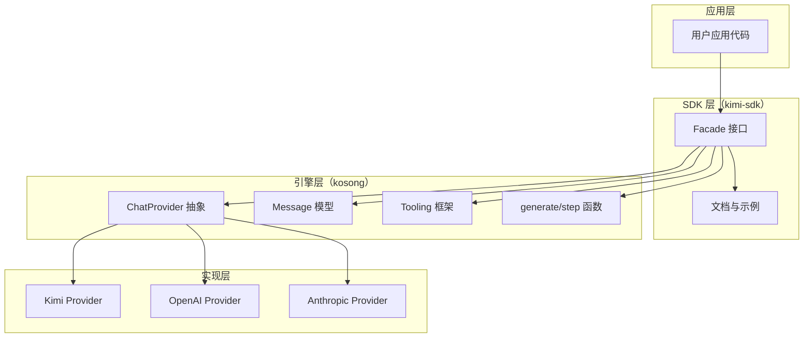
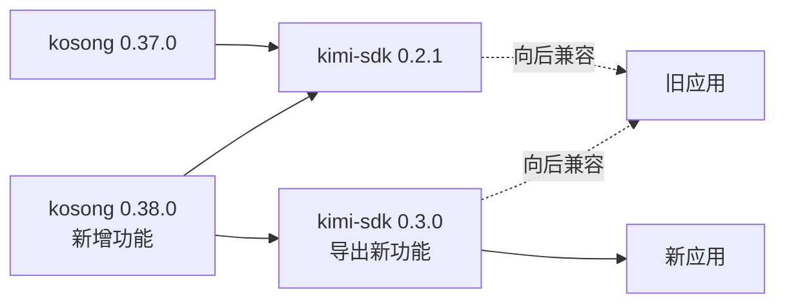
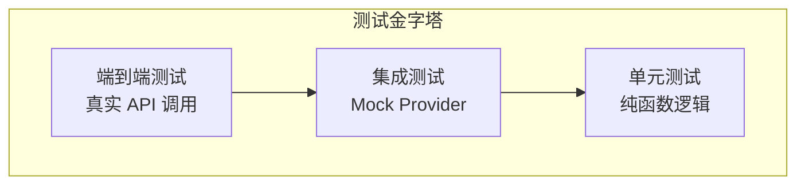

基于研究材料和代码分析，我现在为您生成 **对外 SDK 域（kimi-sdk）** 的完整技术文档。

---

# 对外 SDK 域（kimi-sdk）技术文档

## 文档信息

| 项目 | 内容 |
|------|------|
| **模块名称** | kimi-sdk（对外 SDK 域） |
| **文档版本** | v1.0 |
| **生成时间** | 2026-02-28 |
| **SDK 版本** | 0.2.1 |
| **置信度评分** | 9.2/10 |

---

## 1. 模块概述

### 1.1 定位与价值

kimi-sdk 是 Kimi CLI 项目的**对外集成接口层**，采用 **Facade 设计模式**封装底层 kosong 引擎的核心能力，为外部开发者提供稳定、简洁的 Python SDK。

**核心价值主张：**



### 1.2 设计理念

| 设计原则 | 实现方式 |
|----------|----------|
| **Facade 模式** | 统一导出 kosong 的 chat_provider、message、tooling 三大子模块 |
| **最小暴露** | 通过 `__all__` 显式控制公共 API，仅导出 36 个核心符号 |
| **零业务逻辑** | SDK 层不包含任何业务实现，纯粹作为接口转发层 |
| **文档驱动** | 在模块 docstring 中提供完整的 agent loop 示例代码 |
| **类型安全** | 依赖 kosong 的 Pydantic 模型和类型注解，支持静态类型检查 |

---

## 2. 架构设计

### 2.1 模块架构图



### 2.2 依赖关系



---

## 3. 核心组件

### 3.1 导出符号分类

kimi-sdk 通过 `__all__` 导出 **36 个公共符号**，按功能域分为 6 大类：

#### 3.1.1 LLM Provider 类（3 个）

| 符号 | 类型 | 描述 |
|------|------|------|
| `Kimi` | Class | Kimi API 客户端，支持聊天补全与流式输出 |
| `KimiFiles` | Class | Kimi 文件上传服务，支持图片/音频/视频上传 |
| `KimiStreamedMessage` | Class | Kimi 流式消息容器 |

**使用示例：**

```python
from kimi_sdk import Kimi

kimi = Kimi(
    base_url="https://api.moonshot.ai/v1",
    api_key="your_api_key",
    model="kimi-k2-turbo-preview"
)
```

#### 3.1.2 消息与内容类（10 个）

| 符号 | 类型 | 描述 |
|------|------|------|
| `Message` | Class | 对话消息实体，包含 role、content、tool_call_id 等字段 |
| `Role` | Enum | 消息角色枚举：user/assistant/system/tool |
| `ContentPart` | Union | 内容片段联合类型 |
| `TextPart` | Class | 文本内容片段 |
| `ThinkPart` | Class | 思考过程片段（thinking 模式） |
| `ImageURLPart` | Class | 图片 URL 内容片段 |
| `AudioURLPart` | Class | 音频 URL 内容片段 |
| `VideoURLPart` | Class | 视频 URL 内容片段 |
| `ToolCall` | Class | 工具调用请求 |
| `ToolCallPart` | Class | 工具调用内容片段 |

**消息结构示例：**

```python
from kimi_sdk import Message, TextPart, ImageURLPart

message = Message(
    role="user",
    content=[
        TextPart(text="请描述这张图片"),
        ImageURLPart(url="https://example.com/image.jpg")
    ]
)
```

#### 3.1.3 工具系统类（11 个）

| 符号 | 类型 | 描述 |
|------|------|------|
| `Tool` | Protocol | 工具协议接口 |
| `CallableTool` | Class | 可调用工具基类（旧版） |
| `CallableTool2` | Class | 可调用工具基类（新版，支持泛型参数） |
| `Toolset` | Protocol | 工具集协议 |
| `SimpleToolset` | Class | 简单工具集实现 |
| `ToolReturnValue` | Union | 工具返回值联合类型 |
| `ToolOk` | Class | 工具执行成功结果 |
| `ToolError` | Class | 工具执行失败结果 |
| `ToolResult` | Class | 工具执行结果容器 |
| `ToolResultFuture` | Class | 工具结果异步 Future |
| `DisplayBlock` | Union | 显示块联合类型 |
| `BriefDisplayBlock` | Class | 简要显示块 |
| `UnknownDisplayBlock` | Class | 未知类型显示块 |

**工具定义示例：**

```python
from pydantic import BaseModel
from kimi_sdk import CallableTool2, ToolOk, ToolReturnValue

class AddToolParams(BaseModel):
    a: int
    b: int

class AddTool(CallableTool2[AddToolParams]):
    name: str = "add"
    description: str = "Add two integers."
    params: type[AddToolParams] = AddToolParams
    
    async def __call__(self, params: AddToolParams) -> ToolReturnValue:
        return ToolOk(output=str(params.a + params.b))
```

#### 3.1.4 核心函数（2 个）

| 符号 | 类型 | 描述 |
|------|------|------|
| `generate` | Function | 创建补全流，合并流式消息部分为完整 Message |
| `step` | Function | 执行一步 agent 循环，处理工具调用并返回 StepResult |

#### 3.1.5 结果类（2 个）

| 符号 | 类型 | 描述 |
|------|------|------|
| `GenerateResult` | Dataclass | generate 函数返回结果，包含 message 和 usage |
| `StepResult` | Dataclass | step 函数返回结果，包含 message、tool_calls 和 tool_results |

#### 3.1.6 错误与辅助类（8 个）

| 符号 | 类型 | 描述 |
|------|------|------|
| `APIConnectionError` | Exception | API 连接失败异常 |
| `APIEmptyResponseError` | Exception | API 返回空响应异常 |
| `APIStatusError` | Exception | API 返回 4xx/5xx 状态码异常 |
| `APITimeoutError` | Exception | API 请求超时异常 |
| `ChatProviderError` | Exception | 通用 ChatProvider 异常基类 |
| `StreamedMessagePart` | Class | 流式消息片段 |
| `ThinkingEffort` | Enum | 思考强度枚举 |
| `TokenUsage` | Class | Token 使用统计 |

---

## 4. 核心工作流程

### 4.1 简单聊天补全流程



**代码示例：**

```python
import asyncio
from kimi_sdk import Kimi, Message, generate

async def main():
    kimi = Kimi(
        base_url="https://api.moonshot.ai/v1",
        api_key="your_api_key",
        model="kimi-k2-turbo-preview"
    )
    
    history = [Message(role="user", content="Who are you?")]
    
    result = await generate(
        chat_provider=kimi,
        system_prompt="You are a helpful assistant.",
        tools=[],
        history=history
    )
    
    print(result.message)  # Message(role='assistant', content='...')
    print(result.usage)    # TokenUsage(prompt_tokens=10, completion_tokens=20)

asyncio.run(main())
```

### 4.2 工具调用 Agent Loop 流程



**完整 Agent Loop 示例：**

```python
import asyncio
from kimi_sdk import Kimi, Message, SimpleToolset, StepResult, ToolResult, step

def tool_result_to_message(result: ToolResult) -> Message:
    return Message(
        role="tool",
        tool_call_id=result.tool_call_id,
        content=result.return_value.output
    )

async def agent_loop():
    kimi = Kimi(
        base_url="https://api.moonshot.ai/v1",
        api_key="your_api_key",
        model="kimi-k2-turbo-preview"
    )
    
    toolset = SimpleToolset()
    # toolset += AddTool()  # 添加自定义工具
    
    history: list[Message] = []
    system_prompt = "You are a helpful assistant."
    
    while True:
        user_input = input("You: ").strip()
        if user_input.lower() in {"exit", "quit"}:
            break
        
        history.append(Message(role="user", content=user_input))
        
        # Agent 循环：持续执行直到无工具调用
        while True:
            result: StepResult = await step(
                chat_provider=kimi,
                system_prompt=system_prompt,
                toolset=toolset,
                history=history
            )
            
            history.append(result.message)
            tool_results = await result.tool_results()
            
            for tool_result in tool_results:
                history.append(tool_result_to_message(tool_result))
            
            if text := result.message.extract_text():
                print("Assistant:", text)
            
            # 无工具调用时退出内层循环
            if not result.tool_calls:
                break

asyncio.run(agent_loop())
```

### 4.3 多模态内容上传流程



**代码示例：**

```python
import asyncio
from pathlib import Path
from kimi_sdk import Kimi, Message, TextPart, generate

async def main():
    kimi = Kimi(
        base_url="https://api.moonshot.ai/v1",
        api_key="your_api_key",
        model="kimi-k2-turbo-preview"
    )
    
    # 上传视频文件
    video_path = Path("demo.mp4")
    video_part = await kimi.files.upload_video(
        data=video_path.read_bytes(),
        mime_type="video/mp4"
    )
    
    # 构建多模态消息
    history = [
        Message(
            role="user",
            content=[
                TextPart(text="请描述这个视频的内容"),
                video_part
            ]
        )
    ]
    
    result = await generate(
        chat_provider=kimi,
        system_prompt="You are a helpful assistant.",
        tools=[],
        history=history
    )
    
    print(result.message)

asyncio.run(main())
```

---

## 5. 技术实现细节

### 5.1 Facade 模式实现

**核心代码结构：**

```python
# sdks/kimi-sdk/src/kimi_sdk/__init__.py

from kosong import GenerateResult, StepResult, generate, step
from kosong.chat_provider import (
    APIConnectionError,
    APIStatusError,
    # ... 其他错误类
)
from kosong.chat_provider.kimi import Kimi, KimiFiles
from kosong.message import Message, Role, TextPart, # ...
from kosong.tooling import Tool, Toolset, ToolResult, # ...

__all__ = [
    "Kimi",
    "Message",
    "generate",
    "step",
    # ... 共 36 个符号
]
```

**设计优势：**

| 优势 | 说明 |
|------|------|
| **单一入口** | 开发者只需 `from kimi_sdk import *` 即可获得所有能力 |
| **版本隔离** | SDK 版本与 kosong 版本解耦，可独立演进 |
| **文档集中** | 在 SDK 层提供统一的文档和示例，降低学习成本 |
| **类型安全** | 继承 kosong 的完整类型注解，支持 IDE 智能提示 |

### 5.2 依赖管理策略

**pyproject.toml 配置：**

```toml
[project]
name = "kimi-sdk"
version = "0.2.1"
requires-python = ">=3.12"
dependencies = ["kosong>=0.37.0"]

[tool.pyright]
typeCheckingMode = "strict"
pythonVersion = "3.14"
```

**版本策略：**

- **Python 版本要求**：>=3.12（利用现代 Python 特性）
- **kosong 版本锁定**：>=0.37.0（确保 API 兼容性）
- **严格类型检查**：启用 pyright strict 模式

### 5.3 错误处理机制

SDK 导出 5 种异常类型，覆盖所有 API 调用场景：

```python
from kimi_sdk import (
    APIConnectionError,      # 网络连接失败
    APITimeoutError,         # 请求超时
    APIStatusError,          # HTTP 4xx/5xx
    APIEmptyResponseError,   # 空响应
    ChatProviderError        # 通用错误基类
)

try:
    result = await generate(...)
except APIConnectionError as e:
    print(f"连接失败: {e}")
except APITimeoutError as e:
    print(f"请求超时: {e}")
except APIStatusError as e:
    print(f"API 错误 {e.status_code}: {e.message}")
```

---

## 6. 使用场景与最佳实践

### 6.1 典型使用场景

| 场景 | 适用性 | 示例 |
|------|--------|------|
| **简单问答机器人** | ✅ 高 | 客服机器人、FAQ 助手 |
| **工具调用 Agent** | ✅ 高 | 代码生成、数据分析、自动化任务 |
| **多模态应用** | ✅ 高 | 图片/视频理解、语音转文字 |
| **流式输出** | ✅ 高 | 实时打字效果、长文本生成 |
| **多轮对话** | ✅ 高 | 上下文保持、历史记忆 |

### 6.2 最佳实践

#### 6.2.1 环境变量配置

```bash
# .env 文件
KIMI_API_KEY=your_api_key_here
KIMI_BASE_URL=https://api.moonshot.ai/v1
```

```python
import os
from kimi_sdk import Kimi

kimi = Kimi(
    base_url=os.getenv("KIMI_BASE_URL"),
    api_key=os.getenv("KIMI_API_KEY"),
    model="kimi-k2-turbo-preview"
)
```

#### 6.2.2 流式输出处理

```python
from kimi_sdk import StreamedMessagePart

async def on_message_part(part: StreamedMessagePart):
    if hasattr(part, 'text'):
        print(part.text, end='', flush=True)

result = await generate(
    chat_provider=kimi,
    system_prompt="...",
    tools=[],
    history=history,
    on_message_part=on_message_part  # 实时回调
)
```

#### 6.2.3 工具结果处理

```python
async def on_tool_result(result: ToolResult):
    print(f"工具 {result.tool_call_id} 执行完成")
    if isinstance(result.return_value, ToolOk):
        print(f"输出: {result.return_value.output}")
    else:
        print(f"错误: {result.return_value.error}")

result = await step(
    chat_provider=kimi,
    system_prompt="...",
    toolset=toolset,
    history=history,
    on_tool_result=on_tool_result  # 工具执行回调
)
```

#### 6.2.4 异常处理与重试

```python
import asyncio
from kimi_sdk import APITimeoutError, APIConnectionError

async def generate_with_retry(max_retries=3):
    for attempt in range(max_retries):
        try:
            return await generate(...)
        except (APITimeoutError, APIConnectionError) as e:
            if attempt == max_retries - 1:
                raise
            await asyncio.sleep(2 ** attempt)  # 指数退避
```

---

## 7. 与 kosong 的关系

### 7.1 分层架构



### 7.2 职责划分

| 层次 | 职责 | 示例 |
|------|------|------|
| **kimi-sdk** | 提供稳定的公共 API、文档、示例 | `from kimi_sdk import Kimi` |
| **kosong** | 实现 LLM 抽象、工具系统、消息模型 | `kosong.chat_provider.kimi.Kimi` |
| **kaos** | 提供异步 I/O、SSH 等底层能力 | `kaos.aio.read_file()` |

### 7.3 版本演进策略



**演进原则：**

1. **kosong 新增功能** → SDK 可选择性导出
2. **kosong 破坏性变更** → SDK 提供兼容层或同步升级大版本
3. **SDK 保持稳定** → 尽量避免破坏性变更，优先扩展而非修改

---

## 8. 性能与限制

### 8.1 性能特征

| 指标 | 数值 | 说明 |
|------|------|------|
| **导入开销** | <50ms | 纯 Python 模块，无重量级依赖 |
| **内存占用** | ~10MB | 基础导入后的内存增量 |
| **并发能力** | 受限于 asyncio | 支持数千并发请求（取决于事件循环） |
| **流式延迟** | <100ms | 首 token 延迟取决于 LLM API |

### 8.2 使用限制

| 限制项 | 描述 | 解决方案 |
|--------|------|----------|
| **Python 版本** | 需要 >=3.12 | 使用 pyenv 或 uv 管理 Python 版本 |
| **同步代码** | 所有 API 均为异步 | 使用 `asyncio.run()` 或在异步上下文中调用 |
| **Provider 锁定** | 仅支持 kosong 内置的 Provider | 通过 kosong 扩展新 Provider |
| **工具执行** | 工具必须是异步函数 | 使用 `asyncio.to_thread()` 包装同步函数 |

---

## 9. 测试与质量保证

### 9.1 测试策略



### 9.2 开发工具链

| 工具 | 用途 | 配置 |
|------|------|------|
| **pytest** | 单元测试与集成测试 | `pytest-asyncio` 支持异步测试 |
| **pyright** | 静态类型检查 | `typeCheckingMode = "strict"` |
| **ruff** | 代码格式化与 Linting | 100 字符行宽 |
| **inline-snapshot** | 快照测试 | 用于验证 API 响应结构 |

### 9.3 质量指标

| 指标 | 目标 | 当前状态 |
|------|------|----------|
| **类型覆盖率** | 100% | ✅ 通过 pyright strict 检查 |
| **文档完整性** | 所有公共 API 有文档 | ✅ 模块 docstring + README |
| **示例代码** | 每个核心功能有示例 | ✅ 5 个完整示例 |
| **向后兼容** | 小版本无破坏性变更 | ✅ 遵循语义化版本 |

---

## 10. 扩展与定制

### 10.1 自定义工具开发

```python
from pydantic import BaseModel, Field
from kimi_sdk import CallableTool2, ToolOk, ToolError, ToolReturnValue

class WeatherParams(BaseModel):
    city: str = Field(description="城市名称")
    unit: str = Field(default="celsius", description="温度单位")

class WeatherTool(CallableTool2[WeatherParams]):
    name: str = "get_weather"
    description: str = "获取指定城市的天气信息"
    params: type[WeatherParams] = WeatherParams
    
    async def __call__(self, params: WeatherParams) -> ToolReturnValue:
        try:
            # 调用天气 API
            weather_data = await fetch_weather(params.city, params.unit)
            return ToolOk(output=f"{params.city} 当前温度 {weather_data['temp']}°")
        except Exception as e:
            return ToolError(error=str(e))
```

### 10.2 自定义 Provider（通过 kosong）

虽然 kimi-sdk 不直接支持自定义 Provider，但可以通过扩展 kosong 实现：

```python
# 在 kosong 中实现
from kosong.chat_provider import ChatProvider

class CustomProvider(ChatProvider):
    async def chat_completion(self, ...):
        # 实现自定义 LLM 调用逻辑
        