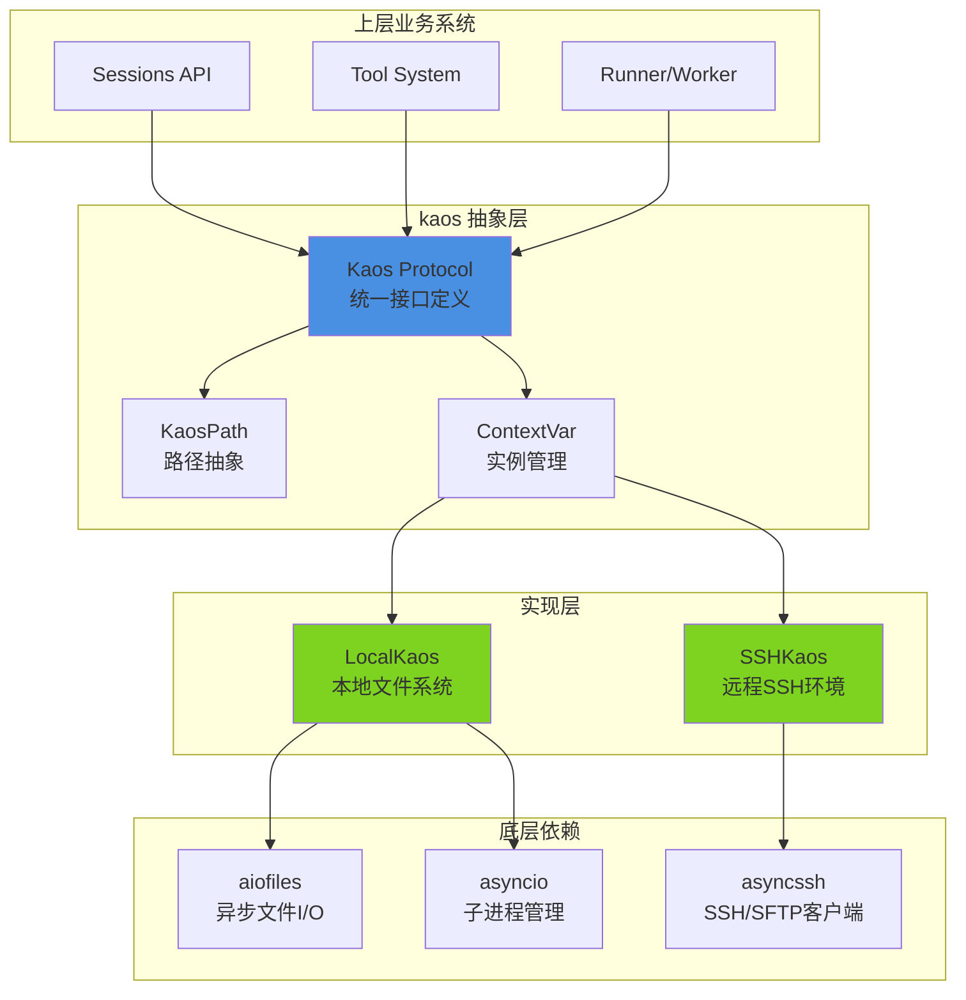
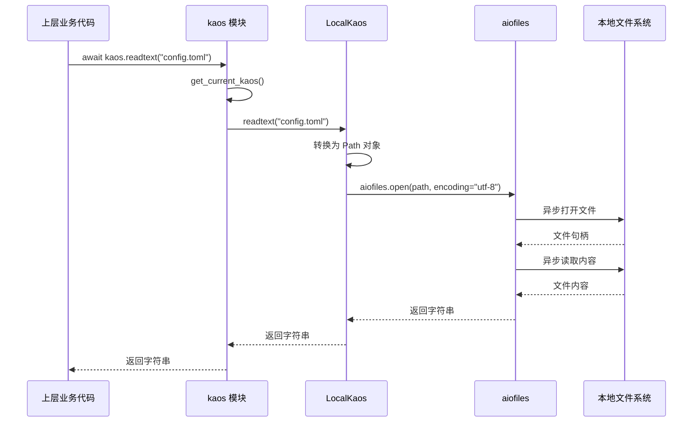
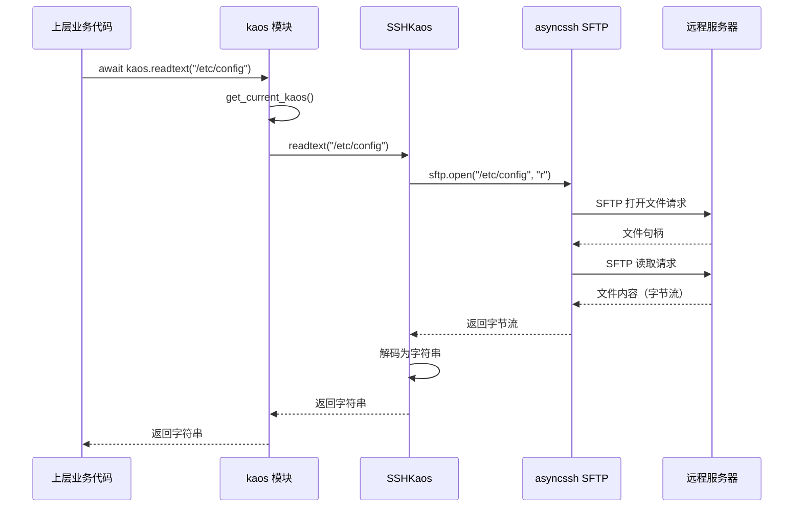
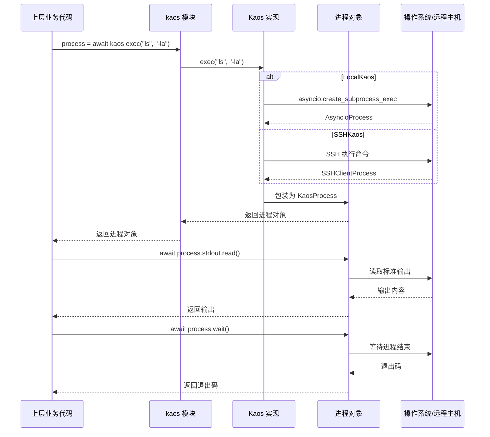
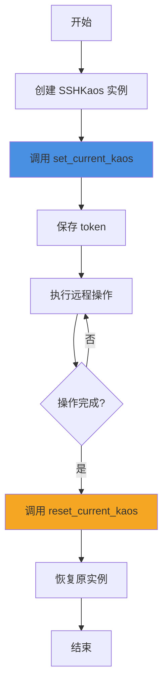

基于我对 kaos 模块的深入分析，现在为您编写完整的技术文档。

---

# 系统与异步辅助域（kaos）技术文档

## 1. 模块概述

### 1.1 定位与价值

**kaos**（Kimi Agent Operating System）是 kimi-cli 项目的基础设施层核心模块，为整个系统提供统一的操作系统抽象层。该模块的核心价值在于：

- **环境无关性**：通过统一接口屏蔽本地文件系统与远程 SSH 环境的差异，使上层业务逻辑无需关心执行环境
- **异步优先**：基于 Python asyncio 构建，所有 I/O 操作均为非阻塞异步实现，提升系统并发性能
- **类型安全**：使用 Protocol 定义接口契约，提供完整的类型提示，确保编译时类型检查
- **可测试性**：通过依赖注入模式（ContextVar），便于单元测试时替换实现

该模块被 `sessions.py`、工具系统（tools）、runner 等上层组件广泛引用，是整个 AI 代理执行环境的底层支撑。

### 1.2 技术栈

| 技术组件 | 版本要求 | 用途 |
|---------|---------|------|
| Python | ≥ 3.12 | 核心运行时，利用现代异步特性 |
| aiofiles | ≥ 24.0, < 26.0 | 异步文件系统操作 |
| asyncssh | 2.21.1 | SSH/SFTP 异步客户端 |
| asyncio | 标准库 | 异步 I/O 框架与子进程管理 |

---

## 2. 架构设计

### 2.1 整体架构



### 2.2 核心设计模式

#### 2.2.1 策略模式（Strategy Pattern）

通过 `Kaos` Protocol 定义统一接口，`LocalKaos` 和 `SSHKaos` 作为不同策略实现：

```python
# 协议定义
class Kaos(Protocol):
    name: str
    async def readtext(self, path: StrOrKaosPath, ...) -> str: ...
    async def exec(self, *args: str, ...) -> KaosProcess: ...

# 本地实现
class LocalKaos:
    name = "local"
    async def readtext(self, path, ...):
        # 使用 aiofiles 读取本地文件

# SSH 实现  
class SSHKaos:
    name = "ssh"
    async def readtext(self, path, ...):
        # 使用 asyncssh SFTP 读取远程文件
```

#### 2.2.2 依赖注入模式（Dependency Injection）

使用 `contextvars.ContextVar` 实现上下文相关的实例管理：

```python
# _current.py
current_kaos = ContextVar[Kaos]("current_kaos", default=local_kaos)

# 上层代码透明调用
async def some_business_logic():
    content = await kaos.readtext("config.toml")  # 自动使用当前上下文的实例
```

#### 2.2.3 外观模式（Facade Pattern）

`KaosPath` 类封装路径操作，提供类似 `pathlib.Path` 的友好接口：

```python
path = KaosPath("~/project/src")
expanded = path.expanduser()  # 展开 ~
canonical = expanded.canonical()  # 规范化路径
content = await canonical.read_text()  # 读取文件
```

---

## 3. 核心组件详解

### 3.1 Kaos Protocol（核心接口协议）

#### 3.1.1 接口定义

`Kaos` Protocol 定义了操作系统抽象层的完整契约，包含以下能力域：

| 能力域 | 方法 | 说明 |
|-------|------|------|
| **路径管理** | `pathclass()`, `normpath()`, `gethome()`, `getcwd()`, `chdir()` | 路径类型、规范化、工作目录管理 |
| **文件元信息** | `stat()`, `iterdir()`, `glob()` | 文件状态查询、目录遍历、模式匹配 |
| **文件读取** | `readbytes()`, `readtext()`, `readlines()` | 二进制/文本读取、行迭代 |
| **文件写入** | `writebytes()`, `writetext()`, `mkdir()` | 二进制/文本写入、目录创建 |
| **进程执行** | `exec()` | 命令执行与进程管理 |

#### 3.1.2 关键接口示例

```python
@runtime_checkable
class Kaos(Protocol):
    name: str  # 实现标识：'local' 或 'ssh'
    
    async def stat(
        self, 
        path: StrOrKaosPath, 
        *, 
        follow_symlinks: bool = True
    ) -> StatResult:
        """获取文件状态信息，返回标准化的 StatResult"""
        ...
    
    async def exec(
        self, 
        *args: str, 
        env: Mapping[str, str] | None = None
    ) -> KaosProcess:
        """执行命令并返回进程对象，支持环境变量注入"""
        ...
    
    def glob(
        self, 
        path: StrOrKaosPath, 
        pattern: str, 
        *, 
        case_sensitive: bool = True
    ) -> AsyncGenerator[KaosPath]:
        """异步生成器，返回匹配模式的所有路径"""
        ...
```

### 3.2 LocalKaos（本地文件系统实现）

#### 3.2.1 实现特点

- **零网络开销**：直接操作本地文件系统，性能最优
- **跨平台支持**：自动适配 Windows（PureWindowsPath）与 POSIX（PurePosixPath）
- **异步封装**：基于 `aiofiles` 和 `asyncio.subprocess` 实现非阻塞 I/O

#### 3.2.2 关键实现

```python
class LocalKaos:
    name: str = "local"
    
    async def readtext(
        self,
        path: str | KaosPath,
        *,
        encoding: str = "utf-8",
        errors: Literal["strict", "ignore", "replace"] = "strict",
    ) -> str:
        local_path = (
            path.unsafe_to_local_path() 
            if isinstance(path, KaosPath) 
            else Path(path)
        )
        async with aiofiles.open(local_path, encoding=encoding, errors=errors) as f:
            return await f.read()
    
    async def exec(
        self, 
        *args: str, 
        env: Mapping[str, str] | None = None
    ) -> KaosProcess:
        process = await asyncio.create_subprocess_exec(
            *args,
            stdin=asyncio.subprocess.PIPE,
            stdout=asyncio.subprocess.PIPE,
            stderr=asyncio.subprocess.PIPE,
            env=env,
        )
        return self.Process(process)
```

#### 3.2.3 进程封装

```python
class LocalKaos.Process:
    """本地进程包装器，实现 KaosProcess 协议"""
    
    def __init__(self, process: AsyncioProcess):
        self._process = process
        self.stdin: AsyncWritable = process.stdin
        self.stdout: AsyncReadable = process.stdout
        self.stderr: AsyncReadable = process.stderr
    
    @property
    def pid(self) -> int:
        return self._process.pid
    
    async def wait(self) -> int:
        return await self._process.wait()
    
    async def kill(self) -> None:
        self._process.kill()
```

### 3.3 SSHKaos（远程 SSH 实现）

#### 3.3.1 实现特点

- **透明远程访问**：通过 SSH/SFTP 协议访问远程文件系统，接口与本地一致
- **连接复用**：单个 `SSHKaos` 实例维护一个 SSH 连接和 SFTP 会话
- **安全性配置**：支持密码、密钥文件、密钥内容多种认证方式

#### 3.3.2 连接建立

```python
class SSHKaos:
    name: str = "ssh"
    
    @classmethod
    async def create(
        cls,
        host: str,
        *,
        port: int = 22,
        username: str | None = None,
        password: str | None = None,
        key_paths: list[str] | None = None,
        key_contents: list[str] | None = None,
        cwd: str | None = None,
        **extra_options: object,
    ):
        options = {"host": host, "port": port, **extra_options}
        
        # 认证配置
        if username:
            options["username"] = username
        if password:
            options["password"] = password
        
        # 密钥配置
        client_keys: list[str | asyncssh.SSHKey] = []
        if key_contents:
            client_keys.extend([
                asyncssh.import_private_key(key) 
                for key in key_contents
            ])
        if key_paths:
            client_keys.extend(key_paths)
        if client_keys:
            options["client_keys"] = client_keys
        
        # 安全配置
        options["encoding"] = None  # 二进制模式
        options["known_hosts"] = None  # 跳过主机密钥验证
        
        # 建立连接
        connection = await asyncssh.connect(**options)
        sftp = await connection.start_sftp_client()
        
        # 初始化工作目录
        home_dir = await sftp.realpath(".")
        if cwd is not None:
            await sftp.chdir(cwd)
            cwd = await sftp.realpath(".")
        else:
            cwd = home_dir
        
        return cls(
            connection=connection, 
            sftp=sftp, 
            home=home_dir, 
            cwd=cwd, 
            host=host
        )
```

#### 3.3.3 SFTP 文件操作

```python
async def stat(
    self,
    path: StrOrKaosPath,
    *,
    follow_symlinks: bool = True,
) -> StatResult:
    try:
        st = await self._sftp.stat(str(path), follow_symlinks=follow_symlinks)
    except asyncssh.SFTPError as e:
        raise OSError from e
    
    return StatResult(
        st_mode=_build_st_mode(st),  # 合并权限与文件类型
        st_uid=st.uid or 0,
        st_gid=st.gid or 0,
        st_size=st.size or 0,
        st_atime=_sec_with_nanos(st.atime or 0, st.atime_ns),
        st_mtime=_sec_with_nanos(st.mtime or 0, st.mtime_ns),
        st_ctime=_sec_with_nanos(st.ctime or 0, st.ctime_ns),
        st_ino=0,  # SFTP 不支持 inode
        st_dev=0,  # SFTP 不支持 device
        st_nlink=st.nlink or 0,
    )
```

#### 3.3.4 SSH 命令执行

```python
async def exec(
    self, 
    *args: str, 
    env: Mapping[str, str] | None = None
) -> KaosProcess:
    # 构建 shell 命令
    command = " ".join(shlex.quote(arg) for arg in args)
    
    # 注入环境变量
    if env:
        env_prefix = " ".join(
            f"{shlex.quote(k)}={shlex.quote(v)}" 
            for k, v in env.items()
        )
        command = f"{env_prefix} {command}"
    
    # 执行远程命令
    process = await self._connection.create_process(command)
    return self.Process(process)
```

### 3.4 KaosPath（路径抽象）

#### 3.4.1 设计理念

`KaosPath` 提供类似 `pathlib.Path` 的面向对象路径操作接口，但底层委托给当前 `Kaos` 实例执行：

```python
class KaosPath:
    def __init__(self, *args: str):
        self._path: PurePath = kaos.pathclass()(*args)
    
    @property
    def name(self) -> str:
        """返回路径的最后一个组件"""
        return self._path.name
    
    @property
    def parent(self) -> KaosPath:
        """返回父目录"""
        return KaosPath(str(self._path.parent))
    
    def __truediv__(self, other: str | KaosPath) -> KaosPath:
        """支持 / 运算符拼接路径"""
        p = other._path if isinstance(other, KaosPath) else other
        ret = KaosPath()
        ret._path = self._path.__truediv__(p)
        return ret
```

#### 3.4.2 关键方法

| 方法 | 功能 | 示例 |
|-----|------|------|
| `expanduser()` | 展开 `~` 为 home 目录 | `KaosPath("~/config").expanduser()` |
| `canonical()` | 规范化路径（解析 `.` 和 `..`） | `KaosPath("./a/../b").canonical()` |
| `relative_to()` | 计算相对路径 | `path.relative_to(base)` |
| `exists()` | 异步检查路径是否存在 | `await path.exists()` |
| `is_file()` / `is_dir()` | 异步检查文件类型 | `await path.is_file()` |
| `read_text()` / `write_text()` | 异步读写文本 | `await path.read_text()` |
| `iterdir()` | 异步迭代目录 | `async for p in path.iterdir()` |
| `glob()` | 异步模式匹配 | `async for p in path.glob("*.py")` |

#### 3.4.3 本地路径转换（仅限 LocalKaos）

```python
@classmethod
def unsafe_from_local_path(cls, path: Path) -> KaosPath:
    """从本地 Path 创建 KaosPath（仅在确定使用 LocalKaos 时调用）"""
    return cls(str(path))

def unsafe_to_local_path(self) -> Path:
    """转换为本地 Path（仅在确定使用 LocalKaos 时调用）"""
    return Path(str(self._path))
```

### 3.5 上下文管理（ContextVar）

#### 3.5.1 实例切换机制

```python
# _current.py
from contextvars import ContextVar
from kaos.local import local_kaos

current_kaos = ContextVar[Kaos]("current_kaos", default=local_kaos)

# __init__.py
def get_current_kaos() -> Kaos:
    """获取当前上下文的 Kaos 实例"""
    from kaos._current import current_kaos
    return current_kaos.get()

def set_current_kaos(kaos: Kaos) -> contextvars.Token[Kaos]:
    """设置当前上下文的 Kaos 实例，返回 token 用于恢复"""
    from kaos._current import current_kaos
    return current_kaos.set(kaos)

def reset_current_kaos(token: contextvars.Token[Kaos]) -> None:
    """恢复之前的 Kaos 实例"""
    from kaos._current import current_kaos
    current_kaos.reset(token)
```

#### 3.5.2 使用场景

```python
# 场景1：默认使用本地文件系统
content = await kaos.readtext("config.toml")

# 场景2：切换到 SSH 环境
ssh_kaos = await SSHKaos.create(
    host="remote.example.com",
    username="user",
    key_paths=["/home/user/.ssh/id_rsa"]
)
token = kaos.set_current_kaos(ssh_kaos)
try:
    # 此时所有 kaos 调用都会访问远程文件系统
    remote_content = await kaos.readtext("/etc/config.toml")
finally:
    kaos.reset_current_kaos(token)

# 场景3：在测试中注入 Mock 实现
class MockKaos:
    async def readtext(self, path, **kwargs):
        return "mocked content"

token = kaos.set_current_kaos(MockKaos())
# 测试代码...
kaos.reset_current_kaos(token)
```

---

## 4. 核心工作流程

### 4.1 本地文件读取流程



### 4.2 SSH 文件读取流程



### 4.3 命令执行流程



### 4.4 环境切换流程



---

## 5. 协议与数据结构

### 5.1 AsyncReadable Protocol

定义异步可读字节流的标准接口：

```python
@runtime_checkable
class AsyncReadable(Protocol):
    def __aiter__(self) -> AsyncIterator[bytes]:
        """异步迭代器，逐块（通常是行）返回数据"""
        ...
    
    def at_eof(self) -> bool:
        """检查是否到达 EOF 且缓冲区为空"""
        ...
    
    async def read(self, n: int = -1) -> bytes:
        """读取最多 n 字节，-1 表示读取到 EOF"""
        ...
    
    async def readline(self) -> bytes:
        """读取一行（包含换行符）或到 EOF"""
        ...
    
    async def readexactly(self, n: int) -> bytes:
        """精确读取 n 字节，否则抛出 IncompleteReadError"""
        ...
    
    async def readuntil(self, separator: bytes) -> bytes:
        """读取直到遇到分隔符（包含分隔符）"""
        ...
```

**兼容实现**：
- `asyncio.StreamReader`
- `asyncssh.SSHReader[bytes]`

### 5.2 AsyncWritable Protocol

定义异步可写字节流的标准接口：

```python
@runtime_checkable
class AsyncWritable(Protocol):
    def write(self, data: bytes) -> None:
        """写入原始字节到流"""
        ...
    
    def writelines(self, data: Iterable[bytes], /) -> None:
        """写入字节块序列"""
        ...
    
    async def drain(self) -> None:
        """阻塞直到内部写缓冲区刷新完成"""
        ...
    
    def close(self) -> None:
        """调度关闭底层传输"""
        ...
    
    async def wait_closed(self) -> None:
        """等待关闭握手完成"""
        ...
    
    def is_closing(self) -> bool:
        """检查流是否已关闭或正在关闭"""
        ...
```

**兼容实现**：
- `asyncio.StreamWriter`
- `asyncssh.SSHWriter[bytes]`

### 5.3 KaosProcess Protocol

定义进程对象的标准接口：

```python
@runtime_checkable
class KaosProcess(Protocol):
    stdin: AsyncWritable
    stdout: AsyncReadable
    stderr: AsyncReadable
    
    @property
    def pid(self) -> int:
        """获取进程 ID"""
        ...
    
    @property
    def returncode(self) -> int | None:
        """获取进程退出码，None 表示仍在运行"""
        ...
    
    async def wait(self) -> int:
        """等待进程完成并返回退出码"""
        ...
    
    async def kill(self) -> None:
        """终止进程"""
        ...
```

### 5.4 StatResult 数据类

标准化的文件状态信息：

```python
@dataclass
class StatResult:
    st_mode: int      # 文件模式（权限 + 类型）
    st_ino: int       # inode 编号（SSH 为 0）
    st_dev: int       # 设备编号（SSH 为 0）
    st_nlink: int     # 硬链接数
    st_uid: int       # 所有者用户 ID
    st_gid: int       # 所有者组 ID
    st_size: int      # 文件大小（字节）
    st_atime: float   # 最后访问时间（秒 + 纳秒）
    st_mtime: float   # 最后修改时间（秒 + 纳秒）
    st_ctime: float   # 创建时间（POSIX）或状态变更时间（Windows）
```

---

## 6. 实际应用场景

### 6.1 在 Sessions API 中的使用

```python
# src/kimi_cli/web/api/sessions.py
import kaos

async def read_session_metadata(session_id: str):
    """读取会话元数据"""
    metadata_path = kaos.KaosPath(f"~/.kimi-cli/sessions/{session_id}/metadata.json")
    content = await metadata_path.read_text()
    return json.loads(content)

async def list_workdir_files(workdir: str):
    """列出工作目录文件"""
    workdir_path = kaos.KaosPath(workdir)
    files = []
    async for entry in workdir_path.iterdir():
        if await entry.is_file():
            files.append(entry.name)
    return files
```

### 6.2 在工具系统中的使用

```python
# src/kimi_cli/tools/file_operations.py
import kaos

async def read_file_tool(path: str, encoding: str = "utf-8"):
    """工具：读取文件内容"""
    file_path = kaos.KaosPath(path).canonical()
    
    # 安全检查
    if not await file_path.exists():
        raise FileNotFoundError(f"File not found: {path}")
    
    # 读取内容
    content = await file_path.read_text(encoding=encoding)
    return {"content": content, "size": len(content)}

async def execute_command_tool(command: list[str]):
    """工具：执行 Shell 命令"""
    process = await kaos.exec(*command)
    
    # 读取输出
    stdout = await process.stdout.read()
    stderr = await process.stderr.read()
    
    # 等待完成
    returncode = await process.wait()
    
    return {
        "stdout": stdout.decode("utf-8", errors="replace"),
        "stderr": stderr.decode("utf-8", errors="replace"),
        "returncode": returncode
    }
```

### 6.3 在测试中的使用

```python
# tests/test_session_manager.py
import kaos
from kaos import Kaos

class MockKaos:
    """测试用 Mock 实现"""
    name = "mock"
    
    def __init__(self):
        self._files = {}
    
    async def readtext(self, path, **kwargs):
        return self._files.get(str(path), "")
    
    async def writetext(self, path, data, **kwargs):
        self._files[str(path)] = data
        return len(data)

async def test_session_creation():
    # 注入 Mock 实现
    mock = MockKaos()
    mock._files["/sessions/test/metadata.json"] = '{"id": "test"}'
    
    token = kaos.set_current_kaos(mock)
    try:
        # 测试代码使用 kaos 接口
        metadata = await read_session_metadata("test")
        assert metadata["id"] == "test"
    finally:
        kaos.reset_current_kaos(token)
```

### 6.4 远程执行场景

```python
# 示例：在远程服务器上执行代理任务
async def run_agent_on_remote_server():
    # 建立 SSH 连接
    ssh_kaos = await kaos.SSHKaos.create(
        